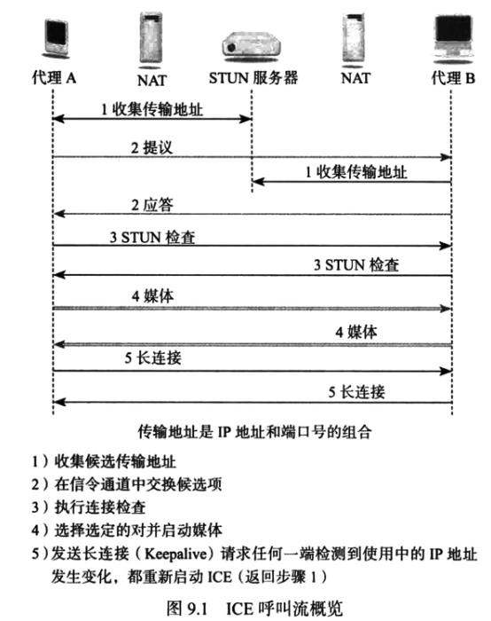
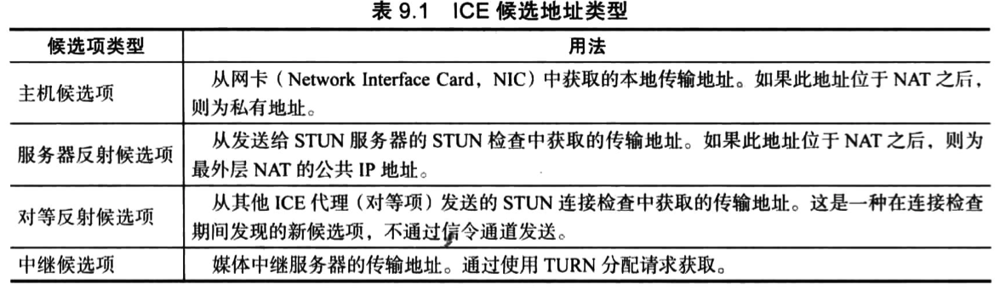

# WebRTC权威指南学习笔记（8）

## 第9章 NAT和防火墙穿透

WebRTC 采用独特的端到端媒体流，但由于存在网络地址转换（Network Address Translation，NAT）和防火墙增加了这一技术的实施难度，需要采用特殊的协议和过程才能实现。

### 9.1 穿透简介

通过利用一种名为“穿透”（BRYAN）的技术，可以大概率建立到端对端的对话，平均成功率大概高达 85%。采用穿透技术需要满足多项前提条件，这些条件包括：

1. 尝试建立直接连接的两个浏览器必须同时发送“穿透”数据包。因此二者必须都知道将要建立的会话，以及将要将数据包发送到哪个地址。请注意穿透数据包没有任何特殊之处，发送这些数据包的目的是确定是否可以通过 NAT 访问特定的目标地址。
2. 两个浏览器需要尽可能多地获知可用于访问对方的潜在 IP 地址。
3. 需要一个具有公共 IP 地址（即不位于 NAT 之后）并因此可由两个浏览器访问的媒体中继，用作万不得已时的访问途径
4. 必须采用端对端流，换言之，即便是 UDP 通信展现出来的行为必须类似于 TCP 连接

其中的要求 2 可以通过使用 NAT 会话遍历实用工具（Session Traversal Utilities for NAT，STUN）服务器来满足。当然也可以使用其他 NAT 遍历协议，例如 UPnP 协议，不过并不常见。

要求 3 可通过使用中继型 NAT 遍历服务器（TURN）来满足。媒体中继地址是一个公共 IP 地址，用于转发从设置中继地址的浏览器收到的数据包。此地址随后会被添加到候选项列表中。

通过让浏览器使用其用来侦听传入媒体的同一 UDP 端口发送媒体，可以满足要求 4，使 NAT 将 UDP 上的两个 RTP 会话识别为一个双向 RTP 会话。

#### 通过 TURN 服务器提供中继的媒体

某些无法建立直接路径的情况下，只有通过 TURN 服务器的地址才能成功。在实际情况下，TURN 服务器是增加了中继功能的 STUN 服务器，在许多情况下，二者是一体的。所有 TURN 服务器都同时具备 STUN 功能，但并非每台 STUN 服务器都具有 TURN 功能。

### 9.2 交互式连接建立

交互式连接建立（Interactive Connectivity Establishment，ICE）是一种标准穿透协议，利用 STUN 和 TURN 服务器来帮助端点建立连接。

下面将分别介绍建立穿透连接时的各个步骤。

#### 9.2.1 收集候选传输地址

首先第一步是收集候选地址，候选地址是或许可用于接收媒体以建立对等连接的 IP 地址和端口。在许多情况下，这些地址必须在呼叫时收集，而不能提前收集（个人理解这是因为 NAT 映射会随时改变）.

一旦 A 处的用户发起与 B 建立对等连接的请求，ICE 代理 A 就会开始收集候选地址，而一旦接受到从信令通道中传来的对等连接请求，ICE 代理 B 也会开始收集候选地址。

候选地址分为四种地址，如下表所示：

其中，服务器反射候选项 和 对等反射候选项 又被称为“反射地址”，因为它们表示**由 STUN 检查反射回 ICE 代理的地址，就如同客户端在通过 STUN 服务器照镜子，以此来识别自身的实际 IP 地址**。

对于在这一步骤中使用的 STUN 和 TURN 服务器，需要在浏览器中进行相应的配置，具体来说，就是通过 RTCConfiguration 对象的 iceServers 属性中的 STUN URI 和 TURN URI 进行实现。

需要指出的是，仅仅使用 STUN 识别公共 IP 地址候选项本身并不足以遍历 NAT，NAT 非常复杂，而且不同的网络和服务提供商存在很大的差异。因此，需要完整的 ICE 功能才能确保实现 NAT 遍历。

#### 9.2.2 交换候选项

> 本地阅读至 P154 9.2.2 交换候选项 173