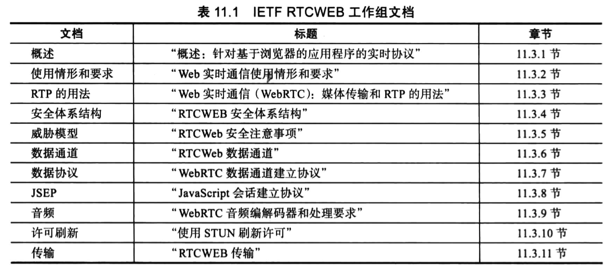
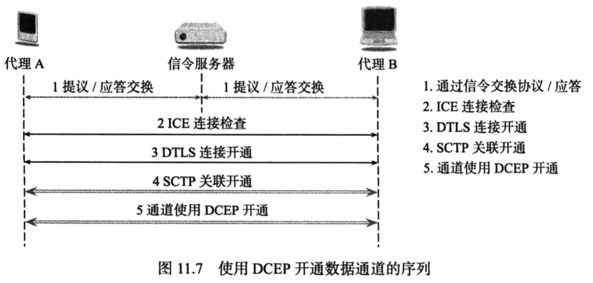
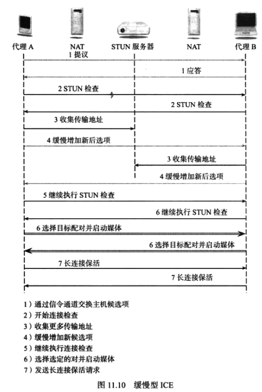
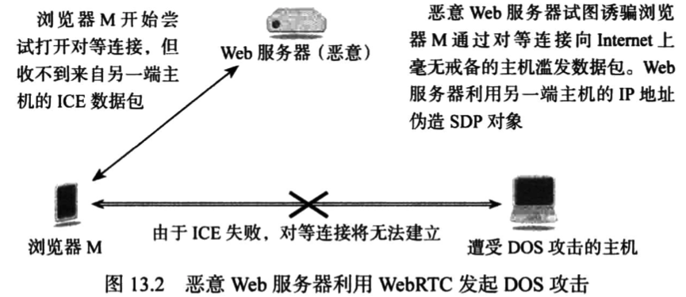

# WebRTC权威指南学习笔记（9）

## 第 11 章 IETF 文档

目前，有些 Internet 草案的 IETF 工作文档尚未最终发布，仍在不断调整和制定之中，还有一些已经以意见征求书（Request for Comments，RFC）的形式发布，成为 IETF 的标准文档。

### 11.2 Internet 草案

IETF Internet 草案是 IETF 正在制定的文档，在最终发布为 RFC 之前，这些文档会经常变更。

Internet 草案又分为工作组文档或个人提交的文档，后者发生调整的幅度可能最大，甚至就连文档名称也很有可能修改。

### 11.3 RTCWEB 工作组 Internet 草案

#### 11.3.7 "WebRTC 数据通道建立协议"[draft-ietfrtcweb-data-protocol]

下图显示了建立数据通道的整个步骤序列，请注意如果同时开通媒体会话，则 DTLS-SRTP 将使用 DTLS 连接为并行建立的 SRTP 媒体会话生成密钥。

### 11.5 其他工作组的 RTCWEB 文档

#### 11.5.1 “缓慢性 ICE：逐步为交互式连接建立协议增加候选项的配置”

缓慢型 ICE 是对 ICE 的优化，旨在缩短完成 ICE 所需的时间。

缓慢型 ICE 不需要等到所有候选项都收集完毕后才开始 ICE，而是只要有一个至少一个候选项可用，便开始进行 ICE 处理。这样能确保能够以最快的速度收集主机候选项，因为不需要发送任何 STUN 或 TURN 消息，而是随后可并行添加或“缓慢加入”来自 STUN 服务器的服务器反射地址。如果主机或反射候选项都不能正常工作，则还可以获取中继候选项并缓慢加入处理过程。

## 第 12 章 与 IETF 相关的 RFC 文档

WebRTC 采用了纳入 RFC 的多项 IETF 标准和协议。而这些 RFC 并非专为 WebRTC 开发或使用。

该文档定义了如下 RFC：

- 实时传输协议
- 会话描述协议
- NAT 遍历 RFC
- 编解码器
- 信令

## 第 13 章 安全和隐私

本章将介绍和探讨 WebRTC 安全的诸多方面，其中包括：

- 恶意网站可能针对浏览器发起的新攻击和破坏行为
- WebRTC 建立的会话是否安全，以及可能遭到哪些类型的攻击
- WebRTC 是否会在用户浏览时侵犯用户隐私
- 允许 WebRTC 会话跨越企业边界是否安全

### 13.1 浏览器安全模型

对 WebRTC 安全的任何讨论都必须从 Web 浏览器安全模型开始。在此模型中，用户必须信任其 Web 浏览器。然而，网站并不一定值得信任，所以浏览器必须拥有能让用户浏览恶意网站而不受到任何伤害的能力。

#### 13.1.1 WebRTC 权限

在提供用户麦克风或摄像头的访问权限之前，WebRTC 会要求浏览器确认已得到用户的同意。此授权对话框由浏览器自行处理，而不受 JavaScript 控制。

而只有浏览器访问可以安全地确定申请权限时，强制授权才会生效。

#### 13.1.2 网站身份

为了确定网站的身份并对网站会话进行加密和身份认证，SSL 协议应运而生，现已发展成为了 TLS 协议。使用安全浏览（利用 TLS 传输的 安全 HTTP）可确定提供 WebRTC 服务或应用程序的网站的身份，而如果身份无法得到证实，浏览器会显示警告并建议用户断开连接。

此外，对于使用 HTTPS 进行访问的网站，可以存储使用摄像头或麦克风的长期权限，而对于非 HTTPS 的 WebRTC 网站则不行，需要每次都请求用户的同意与否。

#### 13.1.3 浏览器用户身份

除了 HTTPS 意外，Web 一般还会使用 Cookie 或其他第三方身份识别服务来进行浏览器用户身份的验证。

### 13.2 新型 WebRTC 浏览器攻击

WebRTC 采用全新的 API、协议和信令通道，无疑会引入许多针对浏览器的新型潜在攻击，其中攻击类型大致分为如下几类：

- API 攻击：利用 WebRTC 的新型 JavaScript API 对用户进行攻击，比如说有些用户为某些房展赋予了较长期的权限来访问摄像头和麦克风，网站就有可能通过这些 API 在用户不方便的时间使用设备

- 协议攻击：针对 WebRTC 使用的新协议进行攻击，比如说 SDP 对象，或基于 RTP 进行攻击。此外，在建立的会话期间，浏览器将利用编解码器对收到的音频或视频样本进行解码，而攻击者可能会使用不正常的媒体样本来试图破坏浏览器。

  此外，网站还可能会利用 WebRTC 对其他主机发动 DDOS 攻击，如下图：

  

- 信令通道攻击：通过攻击 WebRTC 用于建立媒体和数据通道的信令通道，也可以达到攻击者的目的。

### 13.3 通信安全

通信安全表示使用 WebRTC 建立的实时通信会话的安全，即隐私保护和身份验证这两个重要的方面需要得到保证。

### 13.4 WebRTC 中的身份

WebRTC 使用两种身份，一种是网站提供给用户的身份，而另一种身份是位于对等连接另一端的最终用户身份。该身份是 WebRTC 特有的，对于浏览器来说是一种新生事物。

## 第 14 章 实现和应用

> 本次阅读至 P229 第 14 章 实现和应用 247