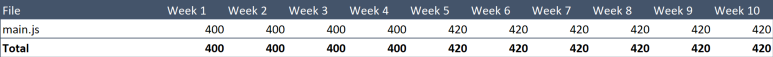
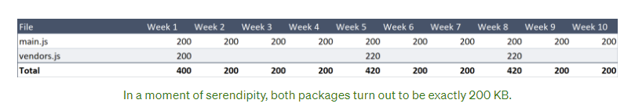
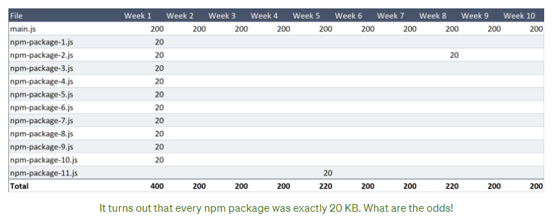
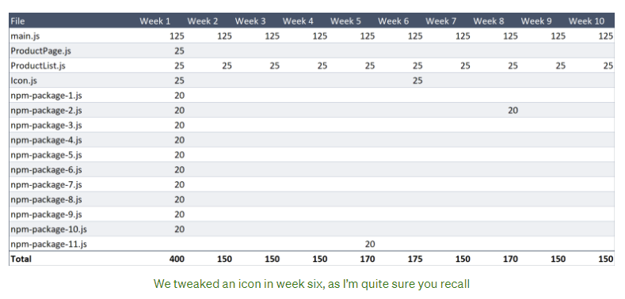
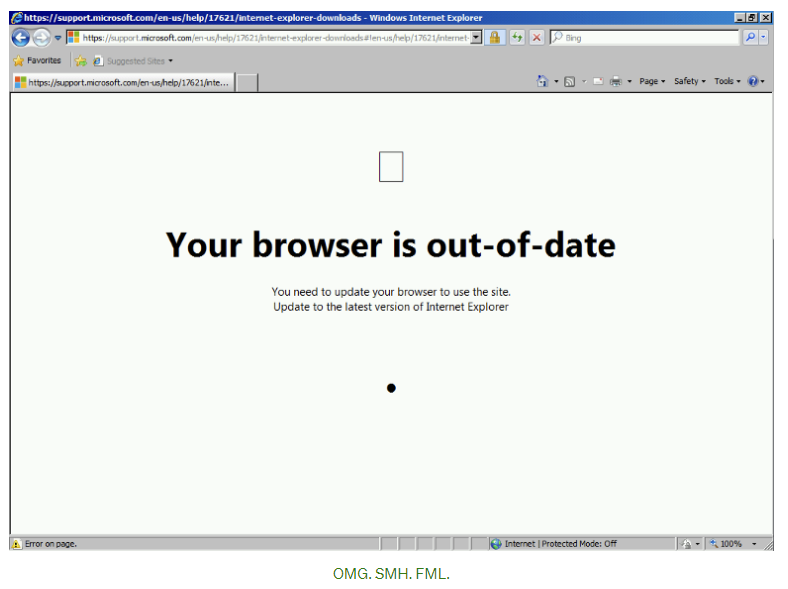

# HTTP2 下 Webpack 的 splitChunks 配置

> 原文链接：[使用 Webpack 分割代码的百分百正确姿势](https://medium.com/hackernoon/the-100-correct-way-to-split-your-chunks-with-webpack-f8a9df5b7758)
>
> 参考的其他翻译版本：https://juejin.cn/post/6962413106823692318
>
> PS：为什么要用绿色的 background-color 伤害我的眼睛......
>
> 又 PS：对 webpack 使用不熟悉可参考译者之前的[一篇博客](https://blog.liubasara.site/#/blog/post/webpack%E5%AD%A6%E4%B9%A0%E4%B9%8B%E6%97%85)

要找出一种最合适的方法来将文件发送到用户手上是一件很需要技巧的任务，因为在实际中，有着太多的不同的场景，不同的技术手段和不同的术语。

在这篇文章中，我希望我能提供一切你所需要的东西，让你可以做到以下事情：

- 了解到哪种文件拆分策略（file-splitting）最适合你的网站和用户
- 了解如何具体配置

根据[WebPack 的词汇术语表](https://webpack.js.org/glossary/)，我们可以了解到存在着两种类型的文件拆分策略。虽然看起来这两种策略之间可以相互替换，但很明显其实不行：

1. Bundle splitting（捆绑拆分）：创建更多，更小的文件，已达到更好的缓存效果。（但无论如何都需要通过网络来请求它们）
2. Code splitting（代码拆分）：动态加载代码，以便用户只会下载他们访问的所需要的代码。

乍听起来，第二个说法更加吸引人，是吗？实际上，确实有很多文章都认为这是打包更小的 JS 文件唯一有价值的方式。

但我在这里会告诉你，对于很多网站来说，第一种方式是一种更有价值的打包方式。而且应该成为所有网站首先要做的事情。

让我们继续深入了解。

## 捆绑拆分 Bundle splitting

bundle splitting 背后的思想非常简单。如果你有一个非常巨大的文件，并且修改了其中一行代码，则用户必须重新整个下载文件。但如果你将它分成了两个文件，用户就只需要下载那一个被更改的文件，而其他文件浏览器直接从缓存获取就可以了。

值得留意的是，因为 bundle splitting 是完全针对缓存的，所以对于第一次访问的用户来说， 拆分与否是没有区别的。

（我认为目前有太多的性能相关的讨论都是关于第一次网站访问的了。也许部分的原因是：“第一印象是很重要的”，还有一部分原因可能是由于这部分的性能非常容易进行量化）

当涉及到频繁访问的用户时，对于性能优化的影响的量化就非常需要技巧了，但这部分的量化是我们必须的！

我们可能会需要一个电子表格，来锁定一些十分具体的场景，以便让我们测试每个缓存策略。

下面是一些我在前一段中提到的场景：

- Alice 在十周里保持每周访问我们的网站
- 我们会每周更新一次网站
- 我们会每周更新“产品列表页”
- 同时我们也有“产品详情页”页面，但目前我们还没有处理它
- 第五周我们会添加一个新的 npm 包到网站里。
- 第八周我们会更新一个已有的 npm 包

有相当一部分类型的人（比如我）会希望去尝试让这个场景贴近真实。但最好别这么做。事实上真实的场景如何其实无关紧要，我们会在稍后找出这么说的原因（留个悬念！）。

## 基准值

比如我们 JavaScript 总包大小有将近 400KB，并且我们此时会通过一个单一的 main.js 文件来加载它。

我们有一个像下面这样的 Webpack 配置（省略了无关的配置内容）：

```javascript
const path = require('path')

module.exports = {
  entry: path.resolve(__dirname, 'src/index.js'),
  output: {
    path: path.resolve(__dirname, 'dist'),
    filename: '[name].[contenthash].js'
  }
}
```

（写给那些刚开始学习缓存策略的人：每当我说 main.js 的时候，实际上的意思是像`main.xdf123sf.js`这样的文件，该文件名中包含了一坨疯狂的字符，作为文件内容的 hash 值（contenthash）。这意味着只要你应用中的代码发生了变化，就会生成一个不同的文件名，从而让浏览器去重新下载这个新的文件）

每周，我们会推送一些新的变化到网站，文件的 contenthash 也随之改变，所以每一个星期，当 Alice 对网站进行访问时，都需要去下载一个新的 400KB 的 javascript 文件。

如果我们对此做一个表格，那它看起来会像是这样：



<p style="text-align:center;">(世界上最没用的 total 统计)</p>

十周下来，下载的总流量为 4.12MB。我们可以做得更好。

### 分割共有包（Splitting out vendor packages）

让我们将包拆分为 main.js 和 vendor.js 文件。

非常简单，就像这样：

```javascript
const path = require('path')

module.exports = {
  entry: path.resolve(__dirname, 'src/index.js'),
  output: {
    path: path.resolve(__dirname, 'dist'),
    filename: '[name].[contenthash].js',
  },
  optimization: {
    splitChunks: {
      chunks: 'all',
    },
  },
}
```

webpack4 会尽力帮你做到最好，而无需让你来告诉它怎么样拆分你的包。

而这种做法也导致了不同的评价，一些评价是“真牛逼，干得好，Webpack！”

还有很多的评价是：“TMD 你到底对我的包做了什么！？”

哈哈。

添加`optimization.splitChunks.chunks = 'all'`是一种特别的说法，即“将所有 node_modules 中的东西打包到一个名为`vendors~main.js`的文件中。”

随着这个分割配置被添加，随着 Alice 的每次访问，依旧会下载一个新的 200KB 的 main.js 文件。但对于 vendors.js 文件，却只会在第一周、第八周和第五周下载一次。



正巧，这两个包的大小都是 200KB。

下载的总量为 2.64MB。

相比之前有了 36% 的减少。对于只添加了五行的配置来说，这是个不赖的优化。在读接下来的内容之前，建议你先把这个优化加上，而如果你要从 Webpack3 升级到 4，不要怕，这个优化真的无痛（而且依旧免费！）

我觉得这样的性能提升看起来会比较抽象，因为它花费了我们超过十周的时间，但是却实实在在的为我们的用户节省了 36% 的带宽，我们应该为此感到骄傲。

但我们能做得更好。

### 分割每一个 npm 包（splitting out each npm package）

我们的 vendors.js 文件如今面临着跟之前原始的 main.js 一样的困境，即随便一部分的修改，就意味着需要重新下载整个文件。

所以为什么不将每个 npm 包分割出来呢？这是很容易做到的。

让我们来将`react`、`lodash`、`redux`、`moment`等等这些包分割到不同的文件里面：

```javascript
const path = require('path');
const webpack = require('webpack');

module.exports = {
  entry: path.resolve(__dirname, 'src/index.js'),
  plugins: [
    new webpack.HashedModuleIdsPlugin(), // so that file hashes don't change unexpectedly
  ],
  output: {
    path: path.resolve(__dirname, 'dist'),
    filename: '[name].[contenthash].js',
  },
  optimization: {
    runtimeChunk: 'single',
    splitChunks: {
      chunks: 'all',
      maxInitialRequests: Infinity,
      minSize: 0,
      cacheGroups: {
        vendor: {
          test: /[\\/]node_modules[\\/]/,
          name(module) {
            // get the name. E.g. node_modules/packageName/not/this/part.js
            // or node_modules/packageName
            const packageName = module.context.match(/[\\/]node_modules[\\/](.*?)([\\/]|$)/)[1];

            // npm package names are URL-safe, but some servers don't like @ symbols
            return `npm.${packageName.replace('@', '')}`;
          },
        },
      },
    },
  },
};
```

[这篇文档](https://webpack.js.org/guides/caching/)会很好的解释上面大部分的配置，但我会着重于解释一些新奇的设定部分，因为它们让我花了巨长的时间才弄对。

- Webpack 有一些看起来很聪明但其实并没有那么聪明的默认选项，像是：

  - 分割输出文件时，最多可以分割出三个文件
  - 最小文件为 30KB（这意味着所有的小文件都会被打包在一起）

  所以我覆盖了这些选项

- `cacheGroups`选项用于定义规则，从而规定 Webpack 应该如何将 chunks 输出到 bundle。在这里我配置了一个名为 vendor 的配置，来给任何从`node_modules`中加载的模块使用。通常来说，你只需要为输出的文件定义一个`name`字符串属性。但我将`name`字段定义为了一个方法（会在每个文件的解析中进行调用），并对那些指定模块路径的包返回一个名字。而结果是，我们得到了这些包的单个 bundle。比如：npm.react-dom.899fadfaf.js。

- [NPM 包的名称必须是路由安全的](https://docs.npmjs.com/files/package.json#name)，用于进行发布，所以我们不需要对 packagename 进行 encodeURI 的转义操作。但是，我在使用 .NET 服务器来返回文件的时候遇到了麻烦，.NET 服务器不识别文件名中的`@`字符（意为来自限定 scoped 范围的包），所以我在名称中替换了这个字符。

- 这个配置非常棒，因为它是一劳永逸的。不需要任何维护——也就是说我无需使用名字来指定任何的包。

这样配置以后，Alice 每周仍然需要下载我们 200KB 的 main.js 文件，也依旧需要在第一次访问的时候下载 200KB 的 npm 包。不过她将永远不需要下载同一个包两次了。



（结果是每个包都恰好是 20KB！真稀罕，峨眉贼！）

一共是 2.24MB。

相比于基准值，一共有了 44% 的减少。而付出的代价只有从这篇博客中复制粘贴了一些代码，实在是非常酷。

但有没有可能让它超过 50% 呢？

那不是非常让人兴奋吗？

### 根据区域来拆分应用的代码（Splitting out areas of the application code）

让我们回到 main.js 文件中，这个文件一直被可怜的 Alice 下载了一遍又一遍。

我很早之前就提到，我们的网站上有两个不同的区域：一个产品列表页面，和一个产品详情页面。这两个页面只有 25KB 的代码量是单独的（而剩余 150 KB 的代码是共享的）

我们的产品详情页并不是每天都更新，因为我们已经把它写得这么完美，所以如果我们能将它打包成一个独立的文件，就能让其在更多时候从缓存读取。

此外，你知道我们有一个巨大的 SVG 内联文件，用于渲染 icon 吗？它的大小高达 25KB 而且很少更改。

我们应该对此做些什么。

于是我们人为地添加一些入口节点，告诉 Webpack 为每项单独创建一个文件：

```javascript
module.exports = {
  entry: {
    main: path.resolve(__dirname, 'src/index.js'),
    ProductList: path.resolve(__dirname, 'src/ProductList/ProductList.js'),
    ProductPage: path.resolve(__dirname, 'src/ProductPage/ProductPage.js'),
    Icon: path.resolve(__dirname, 'src/Icon/Icon.js'),
  },
  output: {
    path: path.resolve(__dirname, 'dist'),
    filename: '[name].[contenthash:8].js',
  },
  plugins: [
    new webpack.HashedModuleIdsPlugin(), // so that file hashes don't change unexpectedly
  ],
  optimization: {
    runtimeChunk: 'single',
    splitChunks: {
      chunks: 'all',
      maxInitialRequests: Infinity,
      minSize: 0,
      cacheGroups: {
        vendor: {
          test: /[\\/]node_modules[\\/]/,
          name(module) {
            // get the name. E.g. node_modules/packageName/not/this/part.js
            // or node_modules/packageName
            const packageName = module.context.match(/[\\/]node_modules[\\/](.*?)([\\/]|$)/)[1];

            // npm package names are URL-safe, but some servers don't like @ symbols
            return `npm.${packageName.replace('@', '')}`;
          },
        },
      },
    },
  },
};
```

靠谱的 webpack 还会为在 ProductList 和 ProductPage 之间共享的内容创建文件，也就是说，我们不会得到重复的代码。

大多数情况下，这会为我们亲爱的 Alice 节省下额外的 50KB。



（我们会在第六周调整 icon，我相信你一定记得）

只有 1.815MB 了！

我们惊人地节省了 Alice 56% 的下载量，而在我们的场景下，这种节省将会一直持续到时间的尽头。

而做出所有的这些改变，仅仅只需要更改 Webpack 的配置，我们甚至还没有对应用的代码做出任何改变。

我在很早之前说到，实际场景下的测试其实并不止重要。而这是因为，无论你面对的场景如何变化，结论最终都是一样的：通过合理地分割你的应用代码到一些小文件中，让你的用户下载更少的代码。

---

很快我们就会讨论另一种类型的分割形式：代码拆分（Code splitting）。但首先我想要解决你现在在想的三个问题。

### 1: 如此多的网络请求不会导致更慢吗？

答案是非常明显的 NO。

在 HTTP/1.1 的场景下，这也许会成为一个问题，但在 HTTP2 中已然不是。

尽管，根据 [这篇2016年的文章](https://medium.com/@asyncmax/the-right-way-to-bundle-your-assets-for-faster-sites-over-http-2-437c37efe3ff)和[Khan Academy 2015年的帖子](https://link.juejin.cn/?target=http%3A%2F%2Fengineering.khanacademy.org%2Fposts%2Fjs-packaging-http2.htm)所说，即使处于 HTTP/2 下，下载太多的文件依旧是更慢的。但对于这些文章来说，“太多”意味着成百个。所以只要记住，只有当你的文件超过了几百个的时候，才有可能达到并发的上限值。

或者你想知道追溯到 Windows 10上的 IE11 对 HTTP/2 的支持。我对使用比这更早版本的环境的人进行了详尽的调查，他们一致向我保证，他们不在乎网站加载的速度如何。

### 2: 会不会导致每个 webpack 的 bundle 里面都含有模板代码（个人理解即 webpack 编译加上的运行时代码）

会的

### 3: 我会因为拥有更多的小文件而导致失去代码压缩的优势吗？

好吧，确实会。

糟糕的是：

- 更多的文件 = 更多的 Webpack 模板代码
- 更多的文件 = 更少的压缩率

让我们来对这个程度进行一个量化，来确认我们需要对此有多担心：

好的我刚刚做了一个测试，将一个 190KB 的网站分割成 19 个文件，将会在发送到浏览器时添加大概 2% 的总大小。

所以...2% 的首次加载增大以及 60% 的缩小，直至宇宙尽头。

对于这个担心的结论是：完全无需担心。

在测试 1 vs 19 个文件的时候，我想我可以在一些不同的网络状况下测试一些，包括 HTTP/1.1。

下面是我的表格，广泛而有力地支持了关于“多文件更好”的观点：


(从 Firebase 静态节点上访问两个相同 190KB 版本的网站)

在 3G 和 4G 状态下，单文件比多文件的加载时间减少了 30%。

真的是这样吗？

这是一个噪点非常多的数据，比如，在第二轮的 4G 网络测试中，网站加载了 646毫秒，而第二次加载就用了 1116ms —— 在什么都没做的情况下就延迟了 73% 的时间。因此，声称 HTTP/2 的速度提高了30％似乎有点狡猾。

（即将推出：一种自定义图表类型，旨在可视化页面加载时间的差异。）

我建了这张表，尝试量化 HTTP/2 的区别，但事实上我能唯一能说的是“可能没有多大区别”。

真正奇怪是最后两排。 那是旧的 Windows 和 HTTP/1.1，我打赌速度会慢很多，但并非如此。我想我需更慢的网络。

---

讲故事时间！我从[微软官网下载了Windows 7虚拟机](https://link.juejin.cn/?target=https%3A%2F%2Fdeveloper.microsoft.com%2Fen-us%2Fmicrosoft-edge%2Ftools%2Fvms%2F)来测试这些内容。

它附带了IE8，但我升级到IE9。

所以我转到了微软的IE9下载页面，然后……



（无 Fuck 可说）

最后关于 HTTP/2 的最后一句话。你知道它现在已经集成到 Node 中了吗？ 如果你想玩一下，我编写了一个带有 gzip，brotli 和响应缓存的[100行HTTP/2 服务器](https://link.juejin.cn/?target=https%3A%2F%2Fgist.github.com%2Fdavidgilbertson%2Fe5690c04e06c4882cf5761f8acff36ec)，带来全新的测试乐趣。

---

关于 bundle splitting 的一切就说完了。我觉得这种方法的唯一缺点就是必须不断说服人们相信加载许多小文件是OK的。

---

## Code splitting（别加载你不需要的代码）

这种方法只对一些特别的网站有意义，比如说我的。

我想应用一个我刚刚想出来的，名为 20/20 的规则：如果你的网站有一部分的代码只有 20% 的用户会抵达，而这部分的 JS 大小占比在 20% 以上，那你就应该只有在需要的时候才加载这些代码。

你可以尝试调整这个数字比例，显然会有比这更复杂的情况。但问题的关键是得有一个阈值，来判断 code split 是否适用于你的网站。

### 如何决定？

假设你有一个购物网站，且你希望直到你是否应该将`支付`模块的代码拆分开，因为只有 30% 的用户会来到这里。

你需要做的第一件事是卖质量更好的东西。（译者注：冷笑话）

第二件事是计算出有多少代码是完全只属于支付模块的。因为在 code splitting 之前，你总是应该先做 bundle splitting，所以你应该已经知道这部分的代码有多大才是。

（这也许会比你想的要小得多，所以在你跃跃欲试之前先把代码量累加一下。比如你有一个 React 站点，那么你的 store，reduce，路由，actions 等都将在整个站点上共享。 完全唯一的部分主要是一些组件和他们的工具。）

于是，你留意到你的支付页面中，完全独立的代码大小是 7KB，而剩余的大小则是 300KB。看着这个数据我会说，嗯...我并不打算使用 code splitting 对其进行分割，基于以下几个原因：

- 预先加载它不会减慢速度。 记住你正在并行加载所有这些文件。 可以试试看记录 300 KB 和 307 KB之间的加载时间差异
- 如果你想之后加载这块的代码，那用户在点击「把我的钱拿走」的时候必须等待这块的文件——这个时候正是你想要它最平滑的时候。
- Code splitting 要求你改你的项目中的代码。 它引入了异步逻辑，而以前只有同步逻辑。 这不是什么造火箭的学问，但是也具有复杂性，因此我认为应该以可感觉到的用户体验改善为由（去做这件事）。

好了，以上就是所有关于“这项令人兴奋的技术可能并不适合你”的劝退部分了。

让我们来看看两个关于 code splitting 的例子。

### Polyfills

我从这里开始是因为它适用于多数的网站，而且是一个很好的简单介绍。

我在网站上使用了许多花哨的功能，因此我有一个文件，用于加载所有的我需要的 polyfills。 它包括以下八行：

```javascript
// polyfills.js
require('whatwg-fetch');
require('intl');
require('url-polyfill');
require('core-js/web/dom-collections');
require('core-js/es6/map');
require('core-js/es6/string');
require('core-js/es6/array');
require('core-js/es6/object');
```

我会在入口的 index.js 文件的最顶部引入这个文件。

```javascript
// index.js
import './polyfills';
import React from 'react';
import ReactDOM from 'react-dom';
import App from './App/App';
import './index.css';

const render = () => {
  ReactDOM.render(<App />, document.getElementById('root'));
}

render(); // yes I am pointless, for now
```

我们使用 bundle splitting 章节中的配置，由于这里有 4 个 npm 包，我的 polyfills 会被自动分割成四个不同的文件。它们总共有大约 25KB 的大小，且 90% 的浏览器都不需要它们，所以这是很值得被动态加载的一部分。

使用 Webpack4 和`import()`语法（不要和没有括号的`import`语法搞混了），有条件的加载 polyfill 是很简单的。

```javascript
import React from 'react';
import ReactDOM from 'react-dom';
import App from './App/App';
import './index.css';

const render = () => {
  ReactDOM.render(<App />, document.getElementById('root'));
}

if (
  'fetch' in window &&
  'Intl' in window &&
  'URL' in window &&
  'Map' in window &&
  'forEach' in NodeList.prototype &&
  'startsWith' in String.prototype &&
  'endsWith' in String.prototype &&
  'includes' in String.prototype &&
  'includes' in Array.prototype &&
  'assign' in Object &&
  'entries' in Object &&
  'keys' in Object
) {
  render();
} else {
  import('./polyfills').then(render);
}
```

很合理吧？如果这些东西都被支持，那就渲染页面，否则的话，就先加载 polyfill 再进行页面渲染。当代码运行在浏览器的时候，Webpack 的运行时会处理这些 npm 包的加载，而只要这些包被下载并解析完毕，就会调用 render() 方法，让页面继续运行。

（顺带一提，要使用`import()`语法，你将需要[Babel的dynamic-import plugin](https://link.juejin.cn/?target=https%3A%2F%2Fbabeljs.io%2Fdocs%2Fen%2Fbabel-plugin-syntax-dynamic-import%2F)。此外，正如Webpack文档所说，`import()`[用了promises](https://link.juejin.cn/?target=https%3A%2F%2Fwebpack.js.org%2Fguides%2Fcode-splitting%2F%23dynamic-imports)，你需要将这个polyfill与其他polyfill分开去polyfill）

很简单对吧？

下面的内容则显得有一点复杂了。

### 基于路由的动态加载（React 独占）

回到 Alice 的例子，假如现在网站拥有一个“管理”部分，这是让产品的销售人员可以登录且管理它们所销售的商品的页面。

这部分拥有非常多的漂亮的特性，很多的图表，和一个从 npm 中加载的臃肿的图标库。由于我已经做了 bundle splitting，所以我可以看到这部分内容有超过 100KB 的内容。

现在，我有一个启动的路由，当用户访问`/admin`URL 的时候，该部分路由会渲染`<AdminPage>`组件。当 Webpack 打包所有内容的时候，它会识别到`import AdminPage from './AdminPage.js'`语句，然后说：“嘿，我希望在初始化的时候加载这个模块”。

但我们并不希望这样，我们需要将这些管理页面进行动态加载，就像`import('./AdminPage.js')`一样，让 Webpack 了解到我们希望动态加载它。

这非常的酷，不需要任何的配置。

所以取代于直接引用 AdminPage，我们可以创建一个新的组件，在用户进入 /admin URL 的时候进行渲染，它看起来像是这样：

```jsx
import React from 'react';

class AdminPageLoader extends React.PureComponent {
  constructor(props) {
    super(props);

    this.state = {
      AdminPage: null,
    }
  }

  componentDidMount() {
    import('./AdminPage').then(module => {
      this.setState({ AdminPage: module.default });
    });
  }

  render() {
    const { AdminPage } = this.state;

    return AdminPage
      ? <AdminPage {...this.props} />
      : <div>Loading...</div>;
  }
}

export default AdminPageLoader;
```

这个概念很简单对吧？在组建 mount 以后（意味着用户位于 /admin URL），我们将动态加载`./AdminPage.js`，然后保存该组件的引用。

而在 render 方法中，我们只需要在等待 AdminPage 加载的期间简单的渲染`<div>Loading</div>`就好了。一旦 AdminPage 加载完毕，就会将其存储到 state 中。

我只是出于好玩写了这个例子，实际上你只需要使用`react-loadable`来实现它，正如 [React Code-Splitting](https://link.juejin.cn/?target=https%3A%2F%2Freactjs.org%2Fdocs%2Fcode-splitting.html) 文档说的那样。

---

好啦，我想这就是全部了。有没有可以总结我上面说过的东西的句子，但用更少的文字？

- 如果人们多次访问你的网站，就把你的的代码分成许多小文件。
- 如果你的网站上有大部分用户不访问的大块内容，动态加载这块代码。

感谢阅读。祝你今天愉快~

靠，我忘了提 CSS 了。


