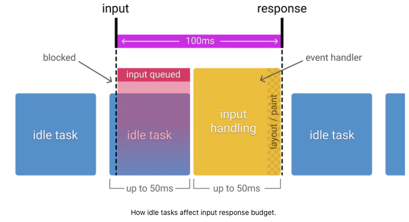

# 使用 RAIL 模型来测试性能

该系列为谷歌开发者文档的一些翻译，对应章节目录链接可以[访问这里](https://developers.google.com/web/fundamentals?hl=zh-cn)

> 原文链接：https://web.dev/rail/

RAIL 是一个以用户为中心的性能模型，可以提供一个模板结构用于考量性能。该模型会将用户体验分解成一些关键的操作（比如说，点击，滑动，加载），并且帮助你定义这些关键操作的性能指标。

RAIL 代表了在 web app 的生命周期中，四个不同的方面：响应（Response）、动画（Animation），空闲（Idle）和加载（Load）。因为不同的用户对这些方面都会有不同的期望值，所以 RAIL 的性能目标会基于[对于用户感知延迟的 UX 研究](https://www.nngroup.com/articles/response-times-3-important-limits/)来定义。

### 聚焦于用户

为了让你的性能优化成为用户眼中的焦点，下面这张表展示了一些关于用户如何感知到性能延迟的关键指标：

- 0 ~ 16ms：一般来说用户都喜欢跟踪页面的动作，也就是说他们不会喜欢页面的动画卡顿。一般来说，用户在画面渲染每秒至少达到 60 帧的时候会认为页面的动画是流畅的。而这样换算下来就是 16 毫秒一帧，这 16 毫秒还包括了浏览器去将画面渲染到屏幕的时间，也就是说留给 app 生成一帧画面的时间只有大约 10 毫秒。
- 0 ~ 100ms：对于用户的动作响应只要在 0~100 ms 以内，用户就会觉得动作的响应的及时的。而一旦超过这个时间，用户在动作和响应之间就会感到卡顿。
- 100 ~ 1000ms：在这个区间内，事物给人的感觉是一个自然而连续的任务。对于大多数的网页用户而言，加载页面和切换视图都是这一类任务。
- 1000ms 以上：对于超过 1s 的任务，用户就会失去他们对于当前进行中的任务的关注。
- 10000ms 以上：对于超过 10s 的任务，用户会感到崩溃而且会倾向于关掉任务并且再也不会回来了。

> 根据网络和硬件状况的不同，每位用户对于性能延迟的感知都是不同的。好比如，通过快速的 WIFI 和一台性能强劲的桌面 PC 来加载网站，网站的连接通常发生在 1s 以内且用户会对此习以为常。而如果通过缓慢的 3G 连接，在一台移动设备上加载网站就会花费更多时间，移动设备的用户一般来说也会更有耐心。所以把网站在移动设备上的加载时间定在 5s 是个更为实际的目标。

### 目标和指点方针

在 RAIL 模型的内容里，目标（Goals）和指导方针（Guidelines）有明确的定义：

- 目标（Goals）：关乎用户体验的关键性能指标。举例来说，点击的渲染在 100 毫秒以内这样的。因为人类的注意力是相对恒定的，这些性能指标不太可能会在短时间内改变。
- 指导方针（Guidelines）：建议网站达到的性能指标。这些可能是一些针对于特定硬件条件和网络状态而提出的一些具体方案，所以也会随着时间的推移而逐渐改变。

### 响应：在 50 毫秒以内处理事件

目标（Goal）：在 100 ms 内完成用户的输入和响应之间的启动和转换，让用户感知到交互的响应是实时的。

指导方针（Guidelines）：

- 为了确保可视化的响应在 100ms 以内，对于用户输入的事件处理请保持在 50ms 以内。这适用于大多数的输入事件，其他的还有像按钮的点击，切换表单控件或者开始一个动画这类。但不适用于点击拖拽或者滚动的这类事件。
- 尽管听起来有点反直觉，但对于用户输入而言，并不是所有的立即响应都是正确的。你可以使用这 100ms 的区间去做别的重要任务，但要当心不要阻塞用户。如果可以的话，尽可能让你的任务在后台进行。
- 对于需要超过 50ms 来完成的动作，一定要提供一个反馈（译者注：中间态）

#### 50ms 还是 100ms？

既然响应的目标是 100ms 以内，那为什么可供逻辑使用的预算只有 50ms 呢？这是因为除了输入的响应处理以外，通常还有其他的工作需要做，而这些工作也会占据一部分可接受的输入响应时间。如果一个应用可以在空闲的时间里，在推荐的 50 ms 时间块以内完成它的工作，那就意味着当输入发生在这 50ms 的时间块内时，用户会在队列中排队等待至多 50ms。考虑到这一点，只有余下的 50ms 是可以被安全的认为能够真正用于执行输入响应的。下图可视化地展现了在空闲期间，收到的输入是如何进行排队从而减少了响应的处理时间的。

### 动画：在 10ms 以内生成一帧

目标（Goals）：

- 在一段动画内，以 10ms 或更少的时间来生成一帧。举例来说，每帧预计最多的生成时间是 16ms（1000ms / 60frames per second = 16ms），不过浏览器会需要大约 6ms 的时间来渲染每一帧，因此有了 10ms 一帧的准则
- 以视觉平滑为目标。用户会注意到屏幕帧率的变化。

指导方针（Guidelines）：

- 在像动画这样的高压点里，关键的一点是尽可能的不要做任何事情，当不得不做时，要尽可能的最小化你的逻辑。当可能的时候，要尽可能的利用 100ms 的响应时间去提前计算一些负担重的工作，以便最大限度地提高达到 60fps 的机会。
- 请参阅[渲染性能](https://developers.google.com/web/fundamentals/performance/rendering)以了解各种动画优化策略。

> 要识别所有的动画类型，动画并不只是单纯的酷炫的 UI 效果。下面这些交互也会被看作是动画：
>
> - 可视化动画，像进入和退出，变化的中间帧（tweens），以及加载指示器
> - 滚动。也包括甩动，即用户滚动后，放手，页面继续滚动
> - 拖拽。拖拽动画一般都会跟随用户的交互，比如平移地图或者捏合缩放。

### Idle：最大化空闲时间

目标：最大化空闲时间，以增大页面在 50ms 以内响应用户输入的可能性。

指导方针：

- 使用空闲时间来完成可以延后（deferred）的工作。比如说，对于初始化加载的页面来说，尽可能地加载少的数据，然后使用[空闲的时间](https://developer.mozilla.org/zh-CN/docs/Web/API/Window/requestIdleCallback)来加载剩余的部分。
- 在空闲时间内执行的任务应该在 50ms 以内火更少，但凡超过这个时间，就有干扰页面在 50ms 以内响应用户输入能力的风险。
- 如果用户在页面空闲时间与页面进行交互，则用户的响应应该总是处于处理的最高优先级，并且会中断空闲时间的任务。

### Load：在 5s 以内让传输的内容变成交互响应

当页面加载缓慢时，用户的注意力会游离，并且感知任务像崩溃了一样。而加载快速的网站有着平均更长的会话时间，更低的跳出率以及更长的广告可见率。

目标：

- 页面加载的优化结果取决于你的用户设备和网络的性能。在当下，对于一个 3G 网络，中端的移动设备来说，能在 5s 或更短的时间内完成页面的第一次加载和让页面变得可交互，就已经是一个很优秀的目标了。
- 而对于接下来的页面加载，就必须达到 2s 以内才算一个好的目标。

> 要注意这些目标是会随着时间进行变化的

指导方针：

- 在常见的用户设备和网络状况下测试你的网站加载性能。你可以使用[chrome 用户体验报告](https://web.dev/chrome-ux-report-api/)来找出你的用户的网络状况分布。如果这些数据对你的网站来说不可用，[2019年移动经济报告](https://www.gsma.com/mobileeconomy/)推荐了一个很好的目标基准，这些基准基于中端的安卓手机——像是 MotoG4在一个缓慢的 3G 网络下进行。这些基准组合在网页测试下也可以使用。
- 要注意尽管一些特定的手机用户声称他们的连接处于 2G、3G 或者 4G 连接下，但在实际中，有效连接的速度一般来说会更慢，这是因为会出现丢包和网络波动的情况。
- [去除阻塞渲染的资源](https://web.dev/render-blocking-resources/)
- 你并不需要在 5s 内完成所有资源的加载，但也可以让用户产生已经加载完成的感觉。可以考虑的方案有[图片懒加载](https://web.dev/browser-level-image-lazy-loading/), [javascript 代码切割](https://web.dev/reduce-javascript-payloads-with-code-splitting/), 以及[一些在web.dev上的建议](https://web.dev/fast/).

> 记住所有会影响到页面加载性能的因素：
>
> - 网络速度和延迟
> - 硬件（像是缓慢的 CPU）
> - 去除缓存
> - L2/L3 缓存的差异
> - JavaScript 的编译

### 衡量 RAIL 模型的工具

> 下一段：There are a few tools to help you automate your RAIL measurements. Which one you use depends on what type of information you need, and what type of workflow you prefer.

