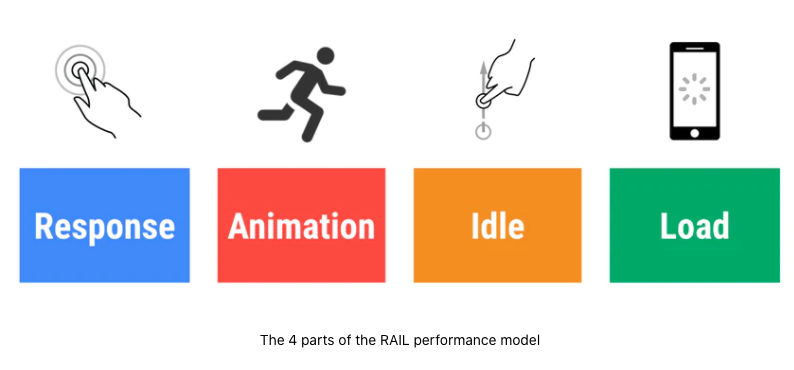

# 使用 RAIL 模型来测试性能

该系列为谷歌开发者文档的一些翻译，对应章节目录链接可以[访问这里](https://developers.google.com/web/fundamentals?hl=zh-cn)

> 原文链接：https://web.dev/rail/

RAIL 是一个以用户为中心的性能模型，可以提供一个模板结构用于考量性能。该模型会将用户体验分解成一些关键的操作（比如说，点击，滑动，加载），并且帮助你定义这些关键操作的性能指标。

RAIL 代表了在 web app 的生命周期中，四个不同的方面：响应（Response）、动画（Animation），空闲（Idle）和加载（Load）。因为不同的用户对这些方面都会有不同的期望值，所以 RAIL 的性能目标会基于[对于用户感知延迟的 UX 研究](https://www.nngroup.com/articles/response-times-3-important-limits/)来定义。

### 聚焦于用户

为了让你的性能优化成为用户眼中的焦点，下面这张表展示了一些关于用户如何感知到性能延迟的关键指标：

- 0 ~ 16ms：一般来说用户都喜欢跟踪页面的动作，也就是说他们不会喜欢页面的动画卡顿。一般来说，用户在画面渲染每秒至少达到 60 帧的时候会认为页面的动画是流畅的。而这样换算下来就是 16 毫秒一帧，这 16 毫秒还包括了浏览器去将画面渲染到屏幕的时间，也就是说留给 app 生成一帧画面的时间只有大约 10 毫秒。
- 0 ~ 100ms：对于用户的动作响应只要在 0~100 ms 以内，用户就会觉得动作的响应的及时的。而一旦超过这个时间，用户在动作和响应之间就会感到卡顿。
- 100 ~ 1000ms：在这个区间内，事物给人的感觉是一个自然而连续的任务。对于大多数的网页用户而言，加载页面和切换视图都是这一类任务。
- 1000ms 以上：对于超过 1s 的任务，用户就会失去他们对于当前进行中的任务的关注。
- 10000ms 以上：对于超过 10s 的任务，用户会感到崩溃而且会倾向于关掉任务并且再也不会回来了。

> 根据网络和硬件状况的不同，每位用户对于性能延迟的感知都是不同的。好比如，通过快速的 WIFI 和一台性能强劲的桌面 PC 来加载网站，网站的连接通常发生在 1s 以内且用户会对此习以为常。而如果通过缓慢的 3G 连接，在一台移动设备上加载网站就会花费更多时间，移动设备的用户一般来说也会更有耐心。所以把网站在移动设备上的加载时间定在 5s 是个更为实际的目标。

### 目标和指点方针

在 RAIL 模型的内容里，目标（Goals）和指导方针（Guidelines）有明确的定义：

- 目标（Goals）：关乎用户体验的关键性能指标。举例来说，点击的渲染在 100 毫秒以内这样的。因为人类的注意力是相对恒定的，这些性能指标不太可能会在短时间内改变。
- 指导方针（Guidelines）：建议网站达到的性能指标。这些可能是一些针对于特定硬件条件和网络状态而提出的一些具体方案，所以也会随着时间的推移而逐渐改变。

### 响应：在 50 毫秒以内处理事件

目标（Goal）：在 100 ms 内完成用户的输入和响应之间的启动和转换，让用户感知到交互的响应是实时的。

指导方针（Guidelines）：

- 为了确保可视化的响应在 100ms 以内，对于用户输入的事件处理请保持在 50ms 以内。这适用于大多数的输入事件，其他的还有像按钮的点击，切换表单控件或者开始一个动画这类。但不适用于点击拖拽或者滚动的这类事件。
- 尽管听起来有点反直觉，但对于用户输入而言，并不是所有的立即响应都是正确的。你可以使用这 100ms 的区间去做别的重要任务，但要当心不要阻塞用户。如果可以的话，尽可能让你的任务在后台进行。
- 对于需要超过 50ms 来完成的动作，一定要提供一个反馈（译者注：中间态）

#### 50ms 还是 100ms？

> 下一段：The goal is to respond to input in under 100 ms, so why is our budget only 50 ms? This is because there is generally other work being done in addition to input handling, and that work takes up part of the time available for acceptable input response. If an application is performing work in the recommended 50 ms chunks during idle time, that means input can be queued for up to 50 ms if it occurs during one of those chunks of work. Accounting for this, it's safe to assume only the remaining 50 ms is available for actual input handling. This effect is visualized in the diagram below which shows how input received during an idle task is queued, reducing the available processing time

