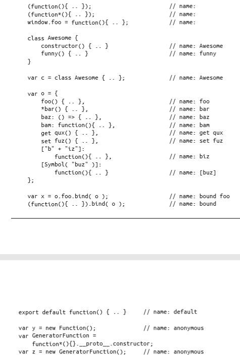

# 《你不知道的JavaScript》学习笔记（十三）

## 第7章 元编程

元编程是指操作目标是程序本身的行为特性的编程。换句话说，它是对程序的编程的编程（...你这跟没换句话说有区别吗？！）

元编程关注以下几点：

- 代码查看自身
- 代码修改自身
- 代码修改默认语言特性

ES6 在 JavaScript 现有的基础上位元编程新增了一些形式 / 特性。

### 7.1 函数名称

程序中有多种方式可以表达一个函数，函数的名称应该是什么并非总是清晰无疑的。如下面的代码，当不同的调用情况出现时，你能完全说清楚它们的名字吗？

```javascript
function daz () {}
var obj = {
    foo: function () {
        // ..
    },
    bar: function baz () {
        // ..
    },
    bam: daz,
    zim() {
        // ..
    }
}
```

更重要的时，我们需要确定函数的"名称"是否就是它的`name`属性，或者它是否指向其词法绑定名称，比如`function bar () {..}`中的`bar`。

`function`的`name`属性的主要用途是元编程。它的值有以下几种情况：

- 如果给了函数一个词法名称，比如`abc = function def () {..}`，那么`name`属性就为该词法名称("def")，如没有词法名称，比如`abc = function () {..}`，则`name`属性为"abc"。

- 如果没有词法名称，则遵循以下规律

  

默认情况下，`name`属性不可写，但可以配置，也就是说如果需要的话，可使用`Object.defineProperty(..)`来手动修改。

### 7.2 元属性

元属性以属性访问的形式提供特殊的其他方法无法获取的元信息。比如`new.target`就是这样一种属性。

### 7.3 公开符号

符号 Symbol 是 ES6 新的原生类型，除了在自己的程序中定义符号外，JavaScript还预先定义了一些内置符号，成为**公开符号**。用于获取对 JavaScript 行为更多的控制。

#### 7.3.1 Symbol.iterator

该方法属性用于定义一个迭代器，控制任意一个对象在迭代过程中的行为(如`for..of..`)

#### 7.3.2 Symbol.toStringTag 与 Symbol.hasInstance

最常见的元编程任务，可以用于在测量定义这个值是何种类的时候被触发。如

```javascript
function Foo () {}
Foo.prototype[Symbol.toStringTag] = 'custom'
var a = new Foo()
a.toString() // "[object custom]"

function Foo (greeting) {
    this.greeting = greeting
}
Object.defineProperty(Foo, Symbol.hasInstance, {
    value: function (inst) {
        return inst.greeting === 'cool'
    }
})
var a = new Foo('hello')
var b = new Foo('cool')
a instanceof Foo // false
b instanceof Foo // true
```

#### 7.3.3 Symbol.species

用于自定义由哪个构造器来生产实例。

#### 7.3.4 Symbol.toPrimitive

用于控制隐式转换时的方法。

#### 7.3.5 正则表达式符号

emmm...

> **如果你不够艺高人胆大的话，就不要覆盖内置正则表达式算法了。**

有道理，本小节跳过。

### 7.4 代理

代理是一种由你创建的特殊的对象，它"封装"另一个普通对象。你可以在代理对象上注册特殊的处理函数，代理上执行各种操作的时候回调用这个程序。这些处理函数除了把操作转发给原始目标之外，还可以执行额外的逻辑。

详细用法见MDN。

### 7.5 Reflect API

Reflect 对象是一个平凡对象，不像其他内置原生值一样是函数 / 构造器。

该对象主要用于抽象出一些函数，让他们的使用方法不再那么的复杂和具有迷惑性(**个人理解**)

### 7.6 特性测试

测试程序的运行环境，然后确定程序行为程序，这是一种元编程技术，但由于 JavaScript 是需要编译的，当程序报错时，整个程序就会停止运行，所以无法达到使用错误来进行测试环境的目的。

当然你也可以使用`eval`函数或者`new Function`这种形式，这样程序就不会在执行之前进行编译，但这样子所带来的副作用明显要高于其好处。

为了解决这个问题，出现了一种名为**分批发布**的技术。

**FeatureTests.io**

> 本次阅读至P244 FeatureTests.io 266