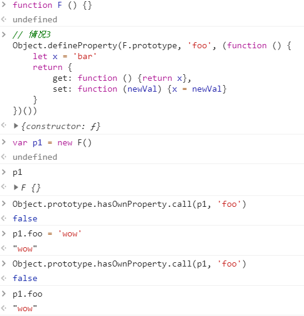

# 《你不知道的JavaScript》学习笔记（四）

## 第4章 混合对象"类"

本章讲述"面向对象"编程的概念以及在JavaScript中的应用。

### 4.1 类理论

类/继承是一种代码的组织结构形式——一种在软件中对真实世界问题领域的建模方法。

#### 4.1.2 JavaScript中的"类"

JavaScript中其实并没有类的概念，尽管ES6新增了`class`关键词，但其本质依然是构造函数，一种对`prototype`的语法糖，与其他语言的`class`有着较大的差别。

### 4.2 类的机制

#### 4.2.2 构造函数

类实例是由一个特殊的类方法构造的，这个方法通常和类名相同，被称为构造函数。

类构造函数属于类，而且通常与类同名。此外，构造函数大多需要用`new`调用，这样语言引擎才知道你想要构造一个新的类实例。

### 4.3 类的继承

在面向类的语言中，你可以先定义一个类，然后定义一个继承前者的类。

#### 4.3.1 多态

多态并不表示子类和父类有关联，子类得到的只是父类的一份副本。类的继承其实就是复制。

#### 4.3.2 多重继承

虽然也有一些语言支持多重继承（C++、Python），但很多面向对象的语言其实并不会官方支持多重继承，比如Java和JavaScript，因为这会涉及到很多类似优先度的问题，实现多重继承代价太高。

当然，使用一些奇怪的方法，也是能够在不支持的语言中实现多重继承的。

#### 4.4 混入

JavaScript的开发者想出了一个方法来模拟类的复制行为，该方法就是混入，混入也分两种：显式和隐式。

#### 4.4.1 显式混入

最常用的就是"寄生继承"。通过在子类构造函数中返回一个父类的实例并绑定它的方法，从而达到混入的效果。

#### 4.4.2 隐式混入

使用`call`、`bind`等函数利用`this`的重新绑定方法直接混入某个特定的方法。

**总结**：在JavaScript中模拟类是得不偿失的，所以没事儿别瞎用。

## 第5章 原型

本章介绍JavaScript中进行继承和类调用时的**正统夫人**：原型链。

此外，本章还着重diss了那帮在JavaScript里面使用类的开发者们……

### 5.1 [[prototype]]

该属性（`__proto__`）是对其它对象的引用，几乎所有对象在创建时`__proto__`属性都会被赋予一个非空的值。

在JavaScript中，一切对当前对象属性的查询，最终都会沿着原型链走一趟，直至找到第一个符合的值。

使用`for...in`遍历对象时原理和查找`__proto__`链类似，任何可以通过原型链访问到并且属性为可枚举的属性都会被枚举。使用`in`操作符来检查属性在对象中是否存在时，同样也会查找对象的整条原型链(无论属性是否可枚举)。

#### 5.1.1 Object.prototype

世界的尽头，Object.prototype。

所有普通的`__proto__`链最终都会指向内置的`Object.prototype`。

#### 5.1.2 属性设置和屏蔽

来看以下代码

```javascript
function F () {}
// 情况1
F.prototype.foo = 'bar'
var p1 = new F()
p1.foo = 'wow'
console.log(p1) // output: wow
// 情况2
Object.defineProperty(F.prototype, 'foo', {
    value: 'bar',
    writable: false
})
var p1 = new F()
p1.foo = 'wow'
console.log(p1) // output: {}
// 情况3
Object.defineProperty(F.prototype, 'foo', (function () {
    let x = 'bar'
    return {
        get: function () {return x},
        set: function (newVal) {x = newVal}
    }
})())
var p1 = new F()
p1.foo = 'wow'
console.log(p1)

```



执行结果如上所示。

以上的三种情况分别代表了属性设置和屏蔽的三种情况：

1. 如果在`__proto__`链上层存在名为foo的普通数据访问属性并且没有被标记为只读，那么此时针对实例属性的赋值会直接在实例中生成或替换一个新的属性，也就是`屏蔽属性`。
2. 如果在`__proto__`链上存在`foo`普通属性，但被标记为了已读(`writable: false`)，那么将无法修改已有的属性，也无法在实例中创建屏蔽属性。若运行在严格模式下，代码甚至会抛出一个错误。
3. 如果在`__proto__`链上存在foo且它是一个`setter`，那就一定会调用这个`setter`，且foo不会被添加到实例上，也就是既不产生屏蔽属性，也不会重新定义foo的`setter`。

大多数情况下我们遇到的都是第一种情况，但这并不意味着所有情况。

**需要注意的是，以上情况只适用于使用`=`操作符来进行赋值的情况，如果你要使用`Object.defineProperty()`来赋值，那随便你怎么玩**。

**隐形屏蔽**

要注意的是，在JavaScript代码中，一个不小心的误操作就有可能为你的对象添加了屏蔽属性，因此，良好的编码习惯十分重要。

```javascript
var superObj = {a: 2}
var subObj = Object.create(superObj)
superObj.a // 2
subObj.a // 2

Object.prototype.hasOwnProperty.call(superObj, 'a') // true
Object.prototype.hasOwnProperty.call(subObj, 'a') // false

subObj.a++ // 这一步添加了屏蔽属性！
Object.prototype.hasOwnProperty.call(subObj, 'a') // true

subObj.a // 3
superObj.a // 2
```

由此可见，修改委托属性时一定要非常小心，上述代码中，如果想让`superObj.a`和`subObj.a`的值同时增加，唯一的办法就是使用`superObj.a++`

### 5.2  "类"

JavaScript和面向类的语言不同，它并没有类作为对象的抽象模式。JavaScript中只有对象。

#### 5.2.1 "类"函数

在JavaScript中，我们不应该使用模仿类，因为JavaScript压根就没有也不需要这种概念。

实际上，在JavaScript中没有类似其它语言的类属性复制机制，你不能创建一个类的多个实例，只能创建多个对象，而这些对象的`__proto__`关联的是同一个对象，因此这些对象之间并不会完全失去联系，它们是互相关联的。该机制我们称为**原型继承**。

#### 5.2.2 "构造函数"

每个函数在声明之后都会有个`prototype`指针，指向其原型对象，而该原型对象又有一个`constructor`指针，指向它的构造函数。同时，由于原型链的关系，该`constructor`也能被该构造函数所生成的实例访问到，**但这并不意味着该函数是这些实例的构造函数**。

此外，构造函数开头要大写本身毫无意义，只是Java开发者们在早期定下的"共识"而已。（怨念好深啊23333）

**构造函数还是调用**

在JavaScript中对于"构造函数"最准确的解释是，所有带`new`的函数调用。

函数不是构造函数，但是当且仅当使用`new`时，函数调用会变成"构造函数调用"。

#### 5.2.3 技术

由于`constructor`是不可枚举，但确实可以被修改的一个属性，所以它在JavaScript里面是不安全的，可以的话，要尽量避开通过`constructor`来识别构造函数的行为以及减少对它的引用。

### 5.3 （原型）继承

关于将一个对象继承到另一个对象上，ES5和ES6提供了两种新的方法。

```javascript
function Foo () {}
function Bar () {}
// ES5 写法
Bar.prototype = Object.create(Foo.prototype)
// ES6 写法
Object.setPrototypeOf(Bar.prototype, Foo.prototype)
```

上面两段写法达到的效果是一样的，但实际上，这是两段完全不同的写法。ES6的写法相当于设置了`__proto__`指针的指向，而ES5的写法则是创建了一个`Foo.prototype`的构造函数，然后返回了它的实例，最后将`Bar.prototype`指向它，达到太子换狸猫（无笔误）的目的。

```javascript
// 我所理解的Object.create
Object.myCreate = function (obj) {
    var f = function () {}
    f.prototype = obj
    return new f()
}
```

**检查"类"关系**

在传统面向"类"环境的语言中，检查一个实例的继承祖先通常被称为内省。

在JavaScript中，使用`instanceof`操作符可以检查一个对象是否是该"类"的实例。

但其实，`instanceof`操作符只是通过`__proto__`链查找链上是否存在该对象罢了。

### 5.4 对象关联

在开发时要谨记一点的是，即便一个对象可以沿着原型链找到其原本不在该对象上的参数，但是大多数时候，我们依然不应该把**关键、易变**的属性放在原型链上。（特别是**数据**，永远不要把数据放在原型链属性上）

因为这会让你的代码变得很"神奇"，明明无法直观的找到这个方法/属性却依然能够运行，当别人接手你的程序时，这种"神奇"往往就容易导致出错。

但如果你非要这么干，那建议使用下面的内部委托方法。

```javascript
var anthorObject = {cool: function () {console.log('cool !')}}
var myObj = Object.create(anthorObject)
myObj.doCool = function () {
    this.cool() // 内部委托 ！
}
```

内部委托比起直接委托，可以让API接口设计显得更加清晰。