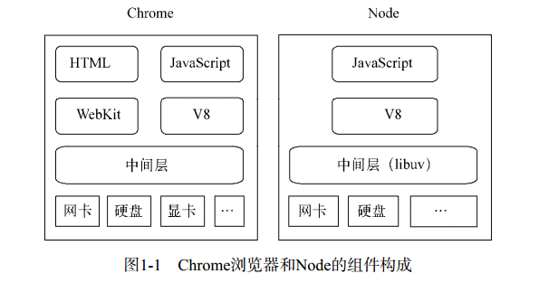
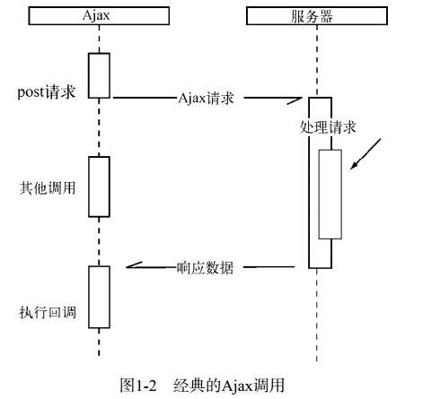
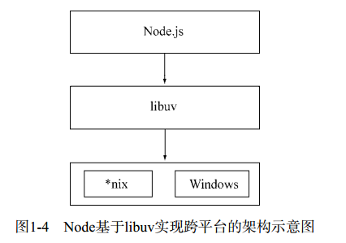

# 《深入浅出NodeJs》学习笔记（一）

> 资料下载地址(pdf压缩文件):
>
> [百度网盘](https://pan.baidu.com/s/1x1MF7mnh3eZD4Ovmk5D3TA)
>
> 提取码: i2wf
>
> **本资料仅用于学习交流，如有能力请到各大销售渠道支持正版 !**

## 第1章 Node简介

本章介绍 Node 的历史以及它和 JavaScript 的渊源。

### 1.2 Node的命名和起源

#### 1.2.1 为什么是JavaScript

node 的作者 Ryan Dahl 最初的目标是写一个基于事件驱动、非阻塞I/O的 Web 服务器，以达到更高的性能。

JavaScript 比 C 的开发门槛要低，比 Lua 的历史包袱要少，且在后端部分一直没有市场，因此为其导入非阻塞 I/O 库没有额外的阻力。此外，Chrome浏览器的 JavaScript 引擎 V8 由于其出色的性能也受到了 Ryan 的欢迎，因此，**高性能、符合事件驱动、没有历史包袱**这三个主要原因使得 JavaScript 成为了 Node 的实现语言。

### 1.3 Node 给 JavaScript 带来的意义

Node 和 Chrome 的组件构成如下图所示。



除了 HTML、WebKit和显卡这些UI相关的技术没有支持外，Node 的结构与 Chrome 十分相似。它们都是基于事件驱动的异步架构，浏览器通过事件驱动来进行服务界面上的交互，Node 通过事件驱动来服务IO（第三章详解）。如果 HTTP 协议栈是水平面，Node 就是浏览器在协议栈另一边的倒影。NODE不处理UI，但却用与浏览器相同的机制和原理运行。

Node 打破了过去 JavaScript 只能在浏览器中运行的局面，前后端编程环境统一，带来的好处不言而喻。

### 1.4 Node 的特点

#### 1.4.1 异步IO

异步调用中对于结果值的捕获是符合 "Don't call me, I will call you" 的原则的，例如下图就是一个经典的 Ajax 异步调用。



在 node 中也一样，下面是一个典型的读取文件的例子，仔细观察就不难发现，它跟 ajax 用到的异步原则是一样的。

```javascript
var fs = require('fs')
fs.readFile('/path', function (err, file) {
    console.log('读取文件完成')
})
console.log('发起读取文件')
```

在 Node 中，我们可以从语言层面很自然的进行并行 IO 操作。每个调用无需等待之前的IO调用结束。在编程模型上可以极大的提升效率。

对于同步IO而言，它们的好事是两个任务的耗时之和。这里异步带来的优势是显而易见的。

关于异步IO如何提升效率和其机制的实现，将在第3章详述。

#### 1.4.2 事件与回调函数

事件的编程方式具有轻量级、轻耦合、只关注事务等优势，**但是在多个异步任务的场景下，事件与事件之间相互独立，如何协作是一个问题**。

关于流程控制和事件协作的方法和技巧，将在第4章详述。

#### 1.4.3 单线程

Node 保持了 JavaScript 在浏览器中单线程的特点，采用了与 Web Worker 相同的思路来解决单线程中大计算量的问题：child_process。

关于如何通过子进程来充分利用硬件资源和提升应用的健壮性，将在第9章得到结束。

#### 1.4.4 跨平台

起初 Node 只能运行在 Linux 平台上，但在微软的帮助下，在v0.6.0版本后，Node就已经能直接在 Windows 平台上运行了。

能够兼容 Windows 和 linux 平台主要得益于 Node 在架构层面的改动，在 Node.js 上层模块和系统之间构建了一层平台层架构，即 libuv。关于 libuv将在第3章中介绍。



### 1.5 Node的应用场景

#### 1.5.1 IO密集型

IO 密集的优势主要在于 Node 利用事件循环的处理能力，Node面向网络并且擅长并行IO，能够有效地组织起更多的硬件资源，从而提供更多好的服务。

#### 1.5.2 是否不擅长CPU密集型业务

Node 能否胜任 CPU 密集的应用场景呢？实际上，V8 的执行效率是十分高的。Node 虽然没有提供多线程用于计算支持，但还是有以下两个方式来充分利用CPU：

- Node可以通过编写C/C++扩展的方式更高效地利用CPU，将一些V8不能做到性能极致的地方通过 C/C++ 来实现，用这种方法实现的一些计算速度比Java还快
- 如果单线程的 Node 不能满足需求，甚至用了 C/C++ 扩展后还觉得不够，那么可以通过子进程的方式将一部分 Node 进程当做常住服务，利用进程间的消息来传递结果，将计算与IO分离，从而充分利用多CPU。

### 1.6 Node 的使用者

目前 Node 在应用层面主要使用途径有以下几类：

- 前后端编程语言环境统一，使得使用者能够摆脱一边写 JavaScript 一边写 PHP 所带来的负担。
- 用于实时应用，将 Node 应用在长连接中，提供实时功能，使用 socket.io 实现实时通知功能。
- 并行IO使得使用者可以更高效地利用分布式环境
- 并行IO有效利用稳定借口提升 Web 渲染能力
- 云计算平台提供 Node 支持
- 游戏开发领域
- 工具类应用，过去依赖Java或其他语言构建的前端工具类应用，纷纷被一些前端工程师用 Node 重写，用前端熟悉的语言为前端构建熟悉的工具。 