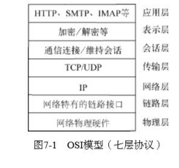
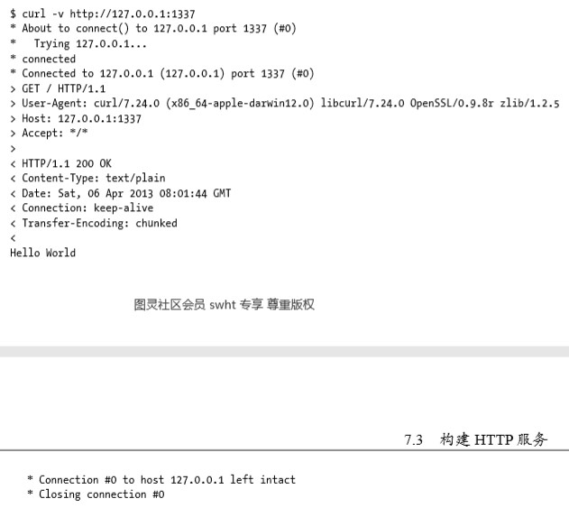
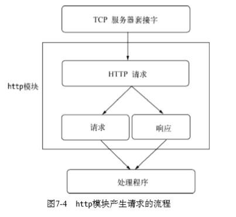
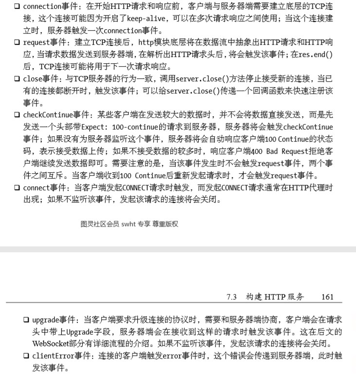
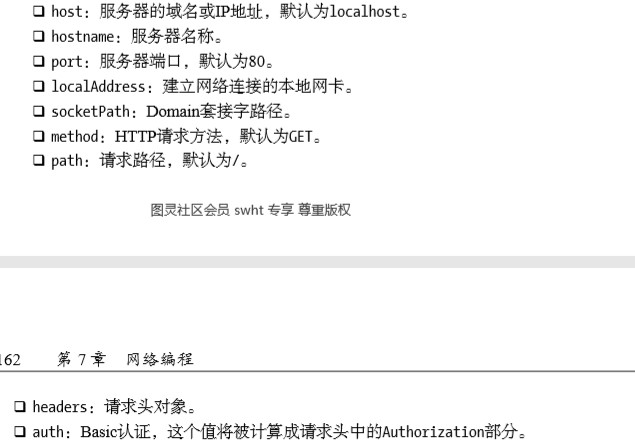
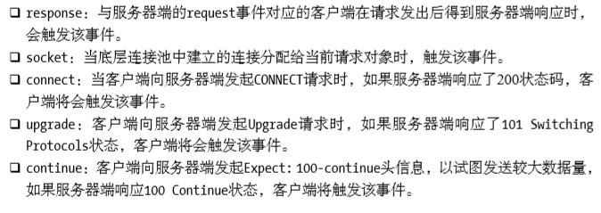

# 《深入浅出NodeJs》学习笔记（七）

## 第7章 网络编程

本章介绍 Node 在网络服务器方面的具体能力。

对于 Node 而言，只需要几行代码即可构建服务器，无需额外的，像 Apache 或 Nginx 这样的容器。

Node 提供了 net、dgram、http、https 这4个模块，分别用于处理 TCP、UDP、HTTP、HTTPS，适用于服务器端和客户端。

### 7.1 构建 TCP 服务

目前多数应用都是基于 TCP 搭建而成的。

#### 7.1.1 TCP

TCP 全名为传输控制协议，在 OSI 模型中属于传输层协议。



TCP 是面向连接的协议，其显著特征是在传输之前需要进行3次握手，正常断开需要进行4次挥手。

#### 7.1.2 创建 TCP 服务器端

使用 Node 来创建一个 TCP 服务器端的代码如下：

```javascript
var net = require('net')
var server = net.createServer(function (socket) {
    // 新连接
    socket.on('data', function (data) {
        socket.write('你好')
    })
    socket.on('end', function () {
        console.log('连接断开')
    })
    socket.write('hi')
})
server.listen(8124, function () {
    console.log('server bound')
})
```

通过`net.createServer(listener)`的方式就可以创建一个 TCP 服务器，listener 是连接事件 connection 的侦听器，也可以采用如下的方式进行侦听：

```javascript
var server = net.createServer()
server.on('connection', function (socket) {
    // 新的连接
})
server.listen(8124)
```

除了服务器外，你还可以自行使用 net 模块构建客户端来测试上面的服务端代码：

```javascript
var net = require('net')
var client = net.connect({port: 8124}, function () {
    console.log('client connected')
    client.write('world\r\n')
})
client.on('data', function (data) {
    console.log(data.toString())
    client.end()
})
client.on('end', function () {
    console.log('client disconnected')
})
```

#### 7.1.3 TCP 服务的事件

上述的示例中，代码分为服务器事件和连接事件。

其中通过 net.createServer() 创建的服务器是一个 EventEmitter 的实例，其自定义事件有以下几种：

- listening：在调用 serer.listen() 绑定端口或者 Domain Socket 后触发。也可以通过`server.listen(port, listeningListener)`中的第二个参数来定义
- connection：每个客户端连接到服务器端时触发，也可以通过`net.createServer()`中的最后一个参数来定义
- close：当服务器关闭时触发，在调用`server.close()`后，服务器停止接受套接字，等待所有连接都断开后，会触发此事件
- error：服务器发生异常时触发该事件，如果不侦听 error 事件，服务器将会抛出异常

还有一类事件是**连接事件**，该事件在数据传输时触发，既可以通过 data 事件来读取另一端传过来的数据，也可以通过 write 方法从一端向另一端发送数据。

- data：当一端调用 write() 发送数据，另一端会触发 data 事件，事件传递的数据就是 write 发送的数据。
- end：连接中的任意一端发送了 FIN 数据触发该事件
- drain：当任意一端调用 write 发送数据，当前端会触发该事件
- error：异常发生时触发
- close：套接字完全关闭时触发
- timeout：当一定时间后连接不再活跃时，事件将会被触发，用于通知用户。

此外，由于 TCP 套接字是可写可读的 Stream 对象，所以可以使用 pipe() 方法巧妙的实现管道操作。

> 值得注意的是，TCP针对网络中的小数据包有一定的优化策略：Nagle算法。如果每次只送一个字节的内容而不优化，网络中将充满只有极少数有效数据的数据包，将十分浪费网络资源。 Nagle算法针对这种情况，要求缓冲区的数据达到一定数量或者一定时间后才将其发出，所以小数据包将会被Nagle算法合并，以此来优化网络。这种优化虽然使网络带宽被有效地使用，但是数据有可能被延迟发送。
>
> 在Node中，由于TCP默认启用了Nagle算法，可以调用socket.setNoDelay(true)去掉Nagle算法，使得write()可以立即发送数据到网络中。 
>
> 另一个需要注意的是，尽管在网络的一端调用write()会触发另一端的data事件，但是并不意味着每次write()都会触发一次data事件，在关闭掉Nagle算法后，另一端可能会将接收到的多个小数据包合并，然后只触发一次data事件。

### 7.2 构建 UDP 服务

UDP(用户数据包协议)不是面向连接的，它具有无需连接、资源消耗低、处理快速灵活的优点，在音视频的领域应用十分广泛。DNS服务也是基于它实现的。

在 Node 中，使用`dgram`模块即可以创建 UDP 套接字，既可以作为客户端发送数据，也可以作为服务端接收数据。

```javascript
var dgram = require('dgram')
var socket = dgram.createSocket('udp4')
```

#### 7.2.2 创建 UDP 服务器端

使用`dgram.bind(port, [address])`方法可以对网卡和端口进行绑定，进而让UDP套接字接收网络消息。

```javascript
// 完整的 UDP 服务器端示例
var dgram = require('dgram')
var socket = dgram.createSocket('udp4')
server.on("message", function (msg, rinfo) {
    console.log(msg, rinfo.address)
})
server.on("listening", function () {
    var address = server.address()
    console.log(address.address, address.port)
})
server.bind(41234)
```

上述代码执行完`bind`命令后，会触发`listening`事件，从而接收所有网卡上 41234 端口上的消息

#### 7.2.3 创建 UDP 客户端

使用`dgram`模块同样可以创建一个客户端与服务器端对话

```javascript
var dgram = require('dgram')
var message = new Buffer('你好啊')
var client = dgram.createSocket("udp4")
client.send(message, 0, message.length, 41234, "localhost", function (err, bytes) {
    client.close()
})
```

send 方法的参数分别为要发送的 Buffer、Buffer 的偏移，Buffer 的长度，目标端口、目标地址、发送完成后的回调。

#### 7.2.4 UDP 套接字事件

UDP 套接字只是一个 EventEmitter 的实例，具有如下自定义事件：

- message：当 UDP 套接字侦听网卡端口后，接收到消息时触发该事件。触发携带的数据为消息 Buffer 对象和一个远程地址信息
- listening：当 UDP 套接字开始侦听时触发该事件
- close：调用 close 方法时触发该事件，并且不再触发 message 事件
- error：当异常发生时触发，如果不侦听，异常会抛出导致进程退出

### 7.3 构建 HTTP 服务

Node 提供了基本的 http 和 https 模块用于 HTTP 和 HTTPS 的封装。用寥寥数行代码就可以实现一个 HTTP 服务器：

```javascript
var http = require('http')
http.createServer(function (req, res) {
    res.writeHead(200, {'Content-Type': 'text/plain'})
    res.end('Hello World\n')
}).listen(1337, '127.0.0.1')
console.log('server running at http://127.0.0.1:1337')
```

#### 7.3.1 HTTP

一次成功的 HTTP 请求应该包括以下的信息：



- TCP 3次握手
- 完成握手之后，客户端向服务器端发送请求报文
- 服务器完成处理后，向客户端发送相应内容，包括响应头和响应体
- 最后部分是结束回话的信息

而不论是 HTTP 请求报文还是 HTTP 响应报文，报文内容都包含两个部分：报文头和报文体。

#### 7.3.2 http 模块

在 Node 中，HTTP 服务继承自 TCP 服务器(net 模块)。

> 由于其采用事件驱动的形式，并不为每一个连接创建额外的线程或进程，保持很低的内存占用，所以能实现高并发。
>
> HTTP服务与TCP服务模型有区别的 地方在于，在开启keepalive后，一个TCP会话可以用于多次请求和响应。TCP服务以connection 为单位进行服务，HTTP服务以request为单位进行服务

http 模块在请求产生的过程中，调用二进制模块 http_parser 进行解析，触发 request 事件，调用用户的业务逻辑，流程如下所示：



处理程序即上面输出 hello world 的代码：

```javascript
function (req, res) {
    res.writeHead(200, {'Content-Type': 'text/plain'})
    res.end('Hello World\n')
}
```

1. req HTTP请求

   HTTP 的报文头部经过解析，会被分解为如下属性：

   - req.method 属性
   - req.url 属性
   - req.httpVersion 属性

   而其余报头则会以 key:Value 的方式被解析在 req.headers 属性上传递给业务逻辑。

   **而报文的主体部分则会抽象为一个流对象，若业务逻辑需要读取主体部分中的数据，则需要在数据流结束后，通过监听 end事件的触发进行调用**。

   ```javascript
   function (req, res) {
       var buffers = []
       req.on('data', function (trunk) {
           beffers.push(trunk)
       }).on('end', function () {
           var buffer = Buffer.concat(buffers)
           // TODO
           res.end('hello world')
       })
   }
   ```

   > HTTP请求对象和HTTP响应对象是相对较底层的封装，现行的Web框架如Connect和Express 都是在这两个对象的基础上进行高层封装完成的。 

2. HTTP 响应

   HTTP 响应是一个可写的流对象，可以通过 res.setHeader() 和 res.writeHead() 这两个 API 来影响报文头部信息。但要注意的是，**报头是在报文体发送前发送的，一旦开始了数据的发送，这两个函数将不再生效**。

   > 另外，无论服务器端在处理业务逻辑时是否发生异常，务必在结束时调用res.end()结束请 求，否则客户端将一直处于等待的状态。当然，也可以通过延迟res.end()的方式实现客户端与 服务器端之间的长连接，但结束时务必关闭连接

3. HTTP 服务的事件

   与 TCP 服务一样，HTTP 服务器也抽象了一些事件，具体如下：

   

#### 7.3.3 HTTP 客户端

http 模块提供了一个底层 API：`http.request(options, connect)`，用于构造 HTTP 客户端。

```javascript
var options = {
    hostname: '127.0.0.1',
    port: 1334,
    path: '/',
    method: 'GET'
}
var req = http.request(options, function (res) {
    console.log('STATUS:' + res.stausCode)
    console.log('HEADERS' + JSON.stringify(res.headers))
    res.setEncoding('utf8')
    res.on('data', function (chunk) {
        console.log(chunk)
    })
})
req.enda()
```

其中 options 中的参数有这些：



**HTTP客户端事件**

HTTP客户端的相应事件如下：



**HTTP代理**

http模块包含一个默认的客户端代理对象 http.globalAgent ，对每个服务器端创建的链接进行了管理，默认情况下，通过该对象对同一个服务器端发起的 HTTP 最多可以创建5个(即连接池)。

> 如果你在服务器端通过ClientRequest调用网络中的其他HTTP服务，记得关注代理对象对网 络请求的限制。一旦请求量过大，连接限制将会限制服务性能。如需要改变，可以在options中 传递agent选项。默认情况下，请求会采用全局的代理对象，默认连接数限制的为5

```javascript
var agent = new http.Agent({
    maxSockets: 10
})
var options = {
    hostname: '127.0.0.1',
    port: 1334,
    path: '/',
    method: 'GET',
    agent: agent
}
```

### 7.4 构建 WebSocket 服务


> 本次阅读至 P163 7.4 构建 WebSocket 服务 181