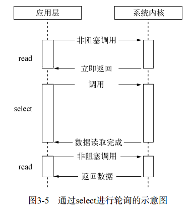
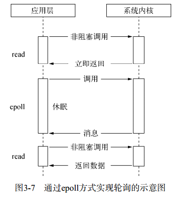
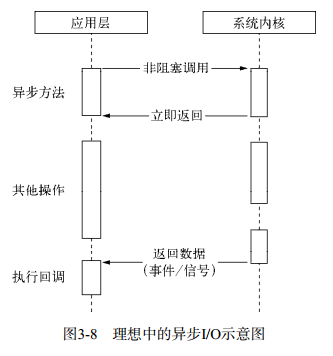
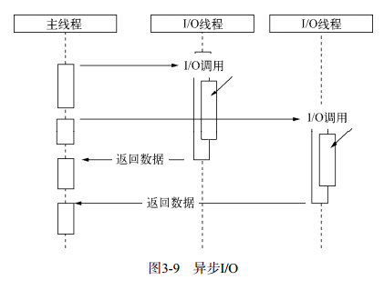
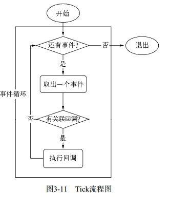
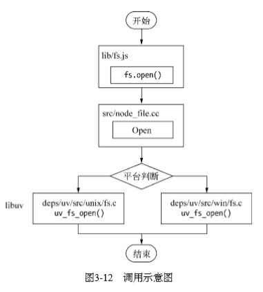
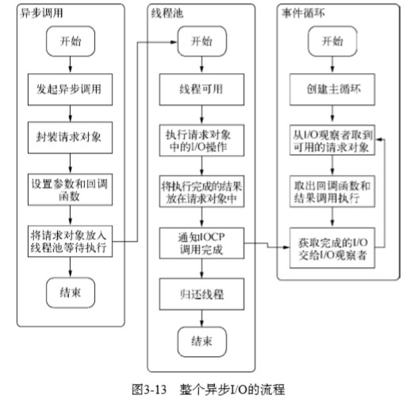
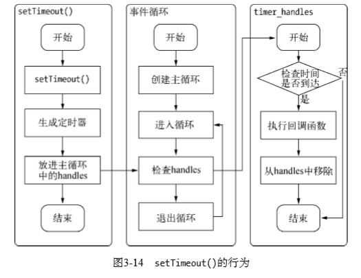
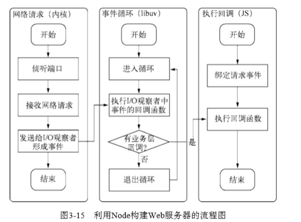

# 《深入浅出NodeJs》学习笔记（三）

## 第3章 异步I/O

> “异步”这个名词其实很早就诞生了，但它的大规
> 模流行却是在Web 2.0浪潮中，它伴随着AJAX的第一个A（Asynchronous）席卷了Web。 Node在出现之前，最习惯异步编程的程序员莫过于前端工程师了。前端编程算GUI编程的一种，其中充斥了各种Ajax和事件，这些都是典型的异步应用场景。 
>
> 但事实上，异步早就存在于操作系统的底层。在底层系统中，异步通过信号量、消息等方式有了广泛的应用。意外的是，在绝大多数高级编程语言中，异步并不多见，疑似被屏蔽了一般。
> 造成这个现象的主要原因也许令人惊讶：程序员不太适合通过异步来进行程序设计。
> PHP这门语言的设计最能体现这个观点。它对调用层不仅屏蔽了异步，甚至连多线程都不提供。 PHP语言从头到脚都是以同步阻塞的方式来执行的。它的优点十分明显，利于程序员顺序编写业务逻辑；它的缺点在小规模站点中基本不存在，但是在复杂的网络应用中，阻塞导致它无法更好地并发。 (PS: **这就是PHP天下第一的原因!**)
>
> 伴随着异步I/O的还有事件驱动和单线程，它们构成Node的基调， Ryan Dahl正是基于这几个因素设计了Node。 Ryan Dahl最初期望设计出一个高性能的Web服务器，后来则演变为一个可以基于它构建各种高速、可伸缩网络应用的平台，因为一个Web服务器已经无法完全涵盖和代表它的能力了。尽管它不再是一个服务器，但是可以基于它搭建更多更丰富、更强大的网络应用。
> 与Node的事件驱动、异步I/O设计理念比较相近的一个知名产品为Nginx。Nginx采用纯C编写，性能表现非常优异。它们的区别在于， Nginx具备面向客户端管理连接的强大能力，但是它的背后依然受限于各种同步方式的编程语言。但Node却是全方位的，既可以作为服务器端去处理客户端带来的大量并发请求，也能作为客户端向网络中的各个应用进行并发请求。 

### 3.1 为什么要异步IO

在跨网络的结构下，并发已经是现代编程中的标准配备了。具体到实处，可以从用户体验和资源分配这两个方面说起。

#### 3.1.1 用户体验

> 《高性能JavaScript》一书中曾经总结过，如果脚本的执行时间超过100毫秒，用户就会感到页面卡顿，以为网页停止响应。而在B/S模型中，网络速度的限制给网页的实时体验造成很大的麻烦。

前段通过异步可以消除掉 UI 阻塞的现象，但是前端获取资源的速度也取决于后端的响应速度。采用异步方式可以让我们享受到并发的优势，这就是异步 IO 在 Node 中如此盛行，甚至将其作为主要理念进行设计的原因。IO 是昂贵的，分布式 IO 是更昂贵的。

只有后端能够快速响应资源，才能让前端的体验变好。

#### 3.1.2 资源分配

> 排除用户体验的因素，我们从资源分配的层面来分析一下异步I/O的必要性。我们知道计算机在发展过程中将组件进行了抽象，分为I/O设备和计算设备。
> 假设业务场景中有一组互不相关的任务需要完成，现行的主流方法有以下两种：
>
> - 单线程串行依次执行
> - 多线程并行完成
>
> 如果创建多线程的开销小于并行执行，那么多线程的方式是首选的。多线程的代价在于创建线程和执行期线程上下文切换的开销较大。另外，在复杂的业务中，多线程编程经常面临锁、状态同步等问题，这是多线程被诟病的主要原因。但是多线程在多核CPU上能够有效提升CPU的利用率，这个优势是毋庸置疑的。

**单线程同步编程模型会因阻塞I/O导致硬件资源得不到更优的使用。多线程编程模型也因为编程中的死锁、状态同步等问题让开发人员头疼**。

 Node 对此给出的方案是：利用单线程、远离多线程死锁、状态同步等问题；利用异步 IO ，让单线程远离阻塞，以更好地使用 CPU。

Node 是首个大规模将异步 IO 应用在应用层上的平台，力求在单线程将资源分配地更高效。同时为了弥补单线程无法利用多核 CPU 的缺点，Node 提供了类似前端浏览器中 Web Workers 的子进程，该子进程可以通过工作进程高效地利用 CPU 和 IO。

### 3.2 异步 IO 实现现状

异步 IO 在 Node 中应用最为广泛，但它并非 Node 的原创。

#### 3.2.1 异步 IO 与非阻塞 IO

> 在听到Node的介绍时，我们时常会听到异步、非阻塞、回调、事件这些词语混合在一起推介出来，其中异步与非阻塞听起来似乎是同一回事。从实际效果而言，异步和非阻塞都达到了我们并行I/O的目的。但是从计算机内核I/O而言，异步/同步和阻塞/非阻塞实际上是两回事。 

操作系统内核对于 IO 只有两种方式：阻塞与非阻塞。在调用阻塞 IO 时，程序需要等待 IO 完成才返回结果。

为了充分利用 CPU 的处理能力以及提高性能，内核提供了非阻塞 IO。非阻塞 IO 跟阻塞 IO 的差别为调动之后会立即返回。返回之后 CPU 的时间片可以用来处理其他事务，从而提升性能。

但由于完整的 IO 并没有完成，其返回的并不是业务层期望的数据，而仅仅只是当前调用的状态。为了获取完整的数据，应用程序需要重复调用 IO 操作来确认是否完成。这种重复调用判断操作是否完成的技术叫作**轮询**。

现存的轮询技术主要有以下这些：

- read 通过重复调用来检查 IO 的状态来完成完整数据的读取，在得到最终数据之前，CPU一直耗用在等待上。

- select 通过对文件描述符上的事件状态来进行判断。但由于其采用一个1024长度的数组来存储状态，所以它最多可以同时检查1024个文件描述符。

  

- poll，与 select 方案类似，但采用了链表的方式避免数组长度的限制，其次它能避免不需要的检查

- epoll 该方案是 Linux 下效率最高的 IO 事件通知机制，在进入轮询的时候如果没有检查到 IO 事件，将会进行休眠，直到事件发生将它唤醒。它是真实利用了事件通知、执行回调机制来取代遍历查询的。执行效率较高。

  

- kquene 该实现方式与 epoll 类似，只不过仅在 FreeBSD 系统下存在。

轮询技术满足了非阻塞 IO 确保获取完整数据的需求，但对于应用程序而言，它仍然只能算是一种同步，因为应用程序仍然需要等待 IO 完全返回才能进行下一步，在此期间CPU要么用于便利文件描述符的状态，要么用于休眠等待事件发生。很明显，这种方式还不够好。

#### 3.2.2 理想的非阻塞异步 IO

尽管 epoll 已经利用了事件来降低了 CPU 的耗用，但是在休眠期间 CPU 几乎是闲置的，对于当前线程的利用率明显不够，那么怎么样才是一种完美的异步 IO 模型呢？

> 我们期望的完美的异步I/O应该是应用程序发起非阻塞调用，无须通过遍历或者事件唤醒等方式轮询，可以直接处理下一个任务，只需在I/O完成后通过信号或回调将数据传递给应用程序即可。 



在 Linux 下存在这样的一种方式：AIO，就是通过信号或回调来传递数据的。但不幸的是，只有Linux 下有这种方式，而且它还有着仅支持内核 IO 中的 O_DIRECT 方式读取，导致无法利用系统缓存的缺陷。

#### 3.2.3 现实中的异步 IO

在实际中要达成异步 IO 的目标其实并非难事，只要不将应用场景局限于单线程，就可以让部分线程进行阻塞 IO 或者进行非阻塞 IO + 轮询技术来完成数据获取。让一个线程进行计算处理，通过线程之间的通信将 IO 得到的数据进行传递，就能够实现模拟化的数据 IO 了。



> 另一种我迟迟没有透露的异步I/O方案则是Windows下的IOCP，它在某种程度上提供了理想的异步I/O：调用异步方法，等待I/O完成之后的通知，执行回调，用户无须考虑轮询。但是它的内部其实仍然是线程池原理，不同之处在于这些线程池由系统内核接手管理。


> 另一个需要强调的地方在于我们时常提到Node是单线程的，这里的单线程仅仅只是
> JavaScript执行在单线程中罢了。在Node中，无论是linux还是Windows平台，内部完成I/O任务的另有线程池。 

### 3.3 Node 的异步 IO

本小节介绍 Node 是如何实现异步 IO 的。

#### 3.3.1 事件循环

Node 的执行模型被称为事件循环，它的存在使得 Node 中回调函数十分普遍。

在进程启动时，Node 会创建一个类似于`while(true)`的循环，每执行一次循环体的过程我们称之为 Tick。每个 Tick 的过程就是查看是否有事件待处理，如果有，就取出事件及其相关的回调函数。如果存在关联的回调函数，就执行它们。然后进入下个循环，如果不再有事件处理，就退出进程。整个流程如下图所示。



#### 3.3.2 观察者

在每个 Tick 的过程中，如何判断是否有事件需要处理呢？

答案是每个事件循环中都有一个或者多个观察者，而判断是否有事件要处理的过程就是向这些观察者询问是否有要处理的事件。

浏览器的事件可能来自于用户的点击或者加载某些文件时产生，而这些产生的事件都有对应的观察者。而在 Node 中，事件主要来源于网络请求，文件 IO 等，这些事件对应的观察者有 IO 观察者、网络 IO 观察者等。观察者将事件进行了分类。

事件循环是一个典型的 生产者/消费者 模型。异步IO、网络请求则是事件生产者，源源不断为 Node 提供不同类型的事件，这些事件被传递到对应的观察者那里，事件循环则从观察者那里取出事件并处理。

#### 3.3.3 请求对象

本节中，我们将通过解释 Windows 下异步 IO 的简单例子来探寻从 JavaScript 代码到系统内核之间都发生了什么。

对于一般的(非异步)回调函数，函数由我们自行调用，如下：

```javascript
var forEach = function (list, callback) {
    for (var i = 0; i < list.length; i++) {
        callback(list[i], i, list)
    }
}
```

对于 Node 中的异步 IO 调用而言，回调函数却并不由开发者调用。那么从我们发出调用之后到回调函数被执行，中间发生了什么呢？

事实上，从 JavaScript 发起调用到内核执行完 IO 操作的过渡过程中，存在一种中间产物，叫做**请求对象**。

比如`fs.open()`的作用，该函数会根据指定的路径和参数去打开一个文件，从而得到一个文件描述符，这是后续所有 IO 操作的初始操作，JavaScript 层面的代码会通过 C++ 核心模块进行下层的操作：

```javascript
fs.open = function (path, flags, mode, callback) {
    binding.open(pathModule._makeLong(path),
                stringToFlags(flags),
                mode,
                callback)
}
```

开发者调用 Node 的核心模块，而核心模块会调用 C++ 内建模块，内建模块会通过 libuv 进行系统调用。其实质上是调用了`uv_fs_open()`方法。



在`us_fs_open()`的调用过程中，我们创建了一个 FSReqWrap 请求对象，从 JavaScript 层传入的参数和当前方法都被封装在这个请求对象中，其中我们最为关注的回调函数则被设置在这个对象的 oncomplete_sym 属性上：

```c++
req_wrap -> object_ -> Set(oncomplete_sym, callback);
```

对象包装完毕后，在 Windows 下，则调用 QueueUserWorkItem() 方法将这个 FSReqWrap 对象推入线程池中等待执行。

```javascript
QueueUserWorkItem(&uv_fs_thread_proc,
                 req,
                 WT_EXECUTEDEFAULT)
```

该方法接受3个参数：第一个参数是将要执行的方法的引用，第二个参数是第一个参数方法运行时所需要的参数，第三个参数是执行的标志。

当线程池中有可用线程时，我们会调用 uv_fs_thread_proc 方法。uv_fs_thread_proc 方法会根据传入参数的类型调用相应的底层函数。以 uv_fs_open 为例，实际上调用 fs__open() 方法。

至此，JavaScript 调用立即返回，由 JavaScript 层面发起的异步调用的第一阶段就此结束。JavaScript 线程可以继续执行当前任务的后续操作，当前的 IO 操作在线程池中等待执行，不管它是否阻塞 IO，都不会影响到 JavaScript 线程的后续执行。

#### 3.3.4 执行回调

组装好请求对象、送入 IO 线程池等待执行，实际上完成了异步 IO 的第一部分，回调通知是第二部分。

线程池中的 IO 操作调用完毕之后，会将结果存储在 req -> result 属性上，然后调用 PostQueuedCompletionStatus() 告知对象操作已经完成。PostQueuedCompletionStatus() 方法的作用是向 IOCP 提交执行状态，并将线程归还线程池。通过 PostQueuedCompletionStatus 方法提交的状态，可以通过 GetQueuedCompletionStatus() 提取。



**总结**

虽然 JavaScript 本身是单线程的，但 Node 自身其实是多线程的，只是 IO 线程使用的 CPU 较少。另一个需要重视的观点则是，除了用户代码无法并行执行外，所有的 IO 都是可以并行起来的。

### 3.4 非 IO 的异步 API

在 Node 中还存在一些与 IO 无关的异步 API。它们分别是 setTimeout()、setInterval()、setImmediate()和process.nextTick()。

#### 3.4.1 定时器

setTimeout() 和 setInterval() 与浏览器中的 API 是一致的，分别用于单词和多次定时执行任务。它们实现原理与异步 IO 比较类似，只是不需要 IO 线程池的参与。

> 调用setTimeout()或者 setInterval()创建的定时器会被插入到定时器观察者内部的一个红黑树中。每次Tick执行时，会 从该红黑树中迭代取出定时器对象，检查是否超过定时时间，如果超过，就形成一个事件，它的回调函数将立即执行。

定时器的问题在于它并非是精确的，尽管事件循环十分快，但是如果某一次循环占用的时间较多，那么下次循环时，它也许已经超时一段时间了。



#### 3.4.2 process.nextTick()

`process.nextTick`在 node 中可以代表为立即异步执行的任务，用于替代 `setTimeout(function () {}, 0)`，且相对来说更加轻量，更高效(nextTick 的时间复杂度为 O(1) ，定时器操作时间复杂度为 O(lg(n)) )。

#### 3.4.3 setImmediate()

该方法与 process.nextTick 十分类似，但是 process.nextTick 的优先级要高于 setImmediate 。其原因在于事件循环对观察者的检查是有先后顺序的，process.nextTick() 属于 idle 观察者，setImmediate() 属于 check 观察者。在每一个轮循环检查中，idle 观察者先于 IO 观察者，IO 观察者先于 check 观察者。

而在具体表现上，process.nextTick 会在一轮循环中调用所有的回调函数，而 setImmediate 却只会在每轮循环中执行链表中的一个回调函数，与 setTimeout 表现类似。

```javascript
// 两个 nextTick 回调函数
process.nextTick(function () {
    console.log('nextTick1')
})
process.nextTick(function () {
    console.log('nextTick2')
})
// 两个 setImmediate() 的回调函数
setImmediate(function () {
    console.log('setImmediate1')
    // 进入下次循环
    process.nextTick(function () {
        console.log('插入')
    })
})
setImmediate(function () {
    console.log('setImmediate2')
})
console.log('正常执行')
```

以上代码在 node11 版本以前和 node 11版本以后执行会出现不同的两种结果，在 node11 以下的版本返回的结果是

```javascript
//正常执行
//nextTick1
//nextTick2
//setImmediate1
//setImmediate2
//插入
```

在 node11 后的版本返回结果是

```javascript
//正常执行
//nextTick1
//nextTick2
//setImmediate1
//插入
//setImmediate2
```

具体原因(process.nextTick 是微任务，setImmediate 还是宏任务)可以看[这篇文章](https://blog.liubasara.info/#/post/%E5%88%86%E4%BA%ABnode%E4%B8%8E%E6%B5%8F%E8%A7%88%E5%99%A8%E5%85%B3%E4%BA%8EeventLoop%E7%9A%84%E5%BC%82%E5%90%8C%E7%9A%84%E4%B8%80%E4%B8%AA%E5%B0%8F%E4%BE%8B%E5%AD%90)。

### 3.5 事件驱动与高性能服务器

利用 Node 构建的 Web 服务器正是基于**事件循环处理网络 IO 事件**这一基础来实现的，其流程图如下：



> 下面为几种经典的服务器模型，这里对比下它们的优缺点：
>
> - 同步式。对于同步式的服务，一次只能处理一个请求，并且其余请求都处于等待状态。
> - 每进程/每请求。为每个请求启动一个进程，这样可以处理多个请求，但是它不具备扩展性，因为系统资源只有那么多。
> - 每线程/每请求。为每个请求启动一个线程来处理。尽管线程比进程要轻量，但是由于每 个线程都占用一定内存，当大并发请求到来时，内存将会很快用光，导致服务器缓慢。 

与 Node 服务器一样基于事件驱动的高效服务器还有 nginx，它也是同样基于事件驱动，在如今大有取代 Apache 的趋势。nginx 采用纯C写成，性能较高，但也仅适合于做 Web 服务器，用于反向代理或负载均衡等服务。而 Node 则是一套高性能的服务器平台，场景更大，自身性能也不错，完全可以作为一个合格的后端服务器。