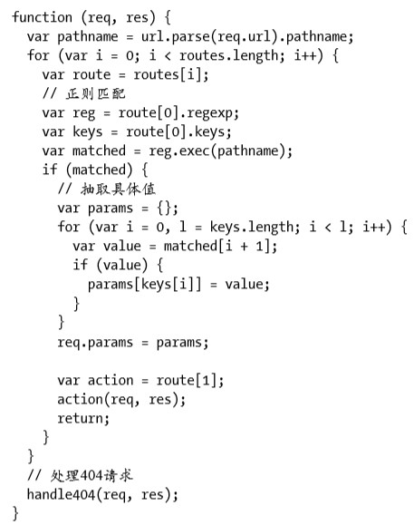

# 《深入浅出NodeJs》学习笔记（九）

## 第8章 构建Web应用(下)

### 8.3 路由解析

对于路由选择问题，一般有文件路径、MVC、RESTful等路由方式。

#### 8.3.1 文件路径型

1. 静态文件

   这种路由的处理方式十分简单，将请求路径对应的文件发送给客户端即可。

2. 动态文件

   在 MVC 模式流行起来之前，根据文件路径执行动态脚本是比较基本的方式，其处理原理是 Web 服务器根据 URL 路径找到对应的文件，如 /index.asp 或 /index.php。

> 解析器执行脚本，并输出响应报文，达到完成服务的目的。现今大多数的服务器都能很智能 地根据后缀同时服务动态和静态文件。这种方式在Node中不太常见，主要原因是文件的后缀都是.js，分不清是后端脚本，还是前端脚本，这可不是什么好的设计。而且Node中Web服务器与应 用业务脚本是一体的，无须按这种方式实现

####  8.3.2 MVC

MVC 模型的主要思想是将业务逻辑按职责分离，因为事实上，**URL路径完全没必要和具体脚本所在的路径完全一致**。

MVC 最为经典的分层模式工作模式如下：

- 路由解析，根据 URL 查询到对应的控制器和行为
- 行为调用相关的模型，进行数据操作
- 调用视图和相关数据进行页面渲染，输出到客户端

控制器调用模型和如何渲染页面，日后会进行展开。如何根据 URL 做路由映射有两个分支可以实现：

- 通过手工关联映射，用一个对应的路由文件来将 URL 映射到对应的控制器
- 自然关联映射


1. 手工映射

   > 手工映射除了需要手工配置路由外较为原始外，它对URL的要求十分灵活，几乎没有格式上 的限制。如下的URL格式都能自由映射：
   >
   > - /user/setting
   > - /setting/user
   >

   我们需要一个处理设置用户信息的控制器，假如该控制器方法如下：

   ```javascript
   exports.setting = function (req, res) {
       //TODO
   }
   ```

   再添加一个映射的方法，如下：

   ```javascript
   var routes = []
   var use = function (path, action) {
       routes.push([path, action])
   }
   ```

   我们在入口程序判断 UTL， 然后执行对应的逻辑，就可以完成基本的路由映射过程，如下所示：

   ```javascript
   function (req, res) {
       var pathname = url.parse(req.url).pathname
       for (var i = 0; i < routes.length; i++) {
           var route = routes[i]
           if (pathname === route[0]) {
               var action = route[1]
               action(req, res)
               return
           }
       }
       // 404
       handle404(req, res)
   }
   ```

   我们可以将这两个路径映射到相同的业务上去

   ```javascript
   use('/user/setting', exports.setting)
   use('/setting/user', exports.setting)
   ```

   对于简单的路径，可以采用上述的硬匹配方式，但是如下的路径请求就无法满足需求了：

   ```shell
   /profile/jacksontian
   /profile/hoover
   ```

   对于这样的路径，我们期望通过以下的方式来匹配到：

   ```javascript
   use('profile/:username', function (req, res) {
       // TODO
   })
   ```

   于是改进我们需要改进匹配的方式，在通过 use 注册路由时需要将路径转换为一个正则表达式，然后通过它来匹配。

   

   上述的正则表达式能实现如下匹配：

   ```shell
   /profile/:username
   /user.:ext
   ```

   use 函数和匹配函数也要重新改进：

   ```javascript
   var use = function (path, action) {
       routes.push([pathRegexp(path), action])
   }
   ```

   匹配函数：

   ```javascript
   function (req, res) {
       var pathname = url.parse(req.url).pathname
       for (var i = 0; i < routes.length; i++) {
           var route = routes[i]
           // 正则对象执行exec方法进行正则匹配
           if (route[0].exec(pathname)) {
               var action = route[1]
               action(req, res)
               return
           }
       }
       // 404
       handle404(req, res)
   }
   ```

   **参数解析**

   尽管我们完成了正则匹配，但我们还需要进一步将匹配到的内容抽取出来，用于在业务中像下面这样调用：

   ```javascript
   use('/profile/:username', function(req, res) {
       var username = req.params.username
       // TODO
   })
   ```

   首要目标是将键值设置到 req.params 中，首先我们要将键值抽取出来，如下所示：

   

   我们将根据抽取的键值和实际的 URL 得到键值匹配到的实际值，并设置到 req.params 处，如下：

   

   至此，除了从查询字符串或提交数据中取到值外，还可以从路径的映射中取到值。

2. 自然映射

   如果项目较大，路由映射的数量比较多，也可以通过映射的方式，将某个路径映射到特定的文件路径下，其余部分采用自然映射的方式。如下面的路径：

   ```shell
   # 文件夹路径规定
   /controller/action/param1/param2/param3
   # url路径
   /user/setting/12/1987
   ```

   使用自然映射的方式，它会按照约定去找 controllers 目录下的 user 文件，将其 require 出来后，调用这个文件模块的 setting 方法，将其余的值作为参数直接传递：

   ```javascript
   function (req, res) {
       var pathname = url.parse(req.url).pathname
       var paths = pathname.split('/')
       var controller = paths[1] || 'index'
       var args = paths.slice(3)
       var module
       try {
           // require 的缓存机制使得只有第一次是阻塞的
           module = require('./controllers/' + controller)
       } catch (e) {
           handle500(req, res)
           return
       }
       var method = module[action]
       if (method) {
           method.apply(null, [req, res].concat(args))
       } else {
           handle500(req, res)
       }
   }
   ```

   这种自然映射的方式没有指明参数名称，无法采用 req.params 的方式提取，但是可以直接通过参数，使得获取更简洁，如下：

   ```javascript
   exports.setting = function (req, res, month, year) {
       // TODO
   }
   ```

#### 8.3.3 RESTful

RESTful 的流行使得大家意识到 URL 也可以设计得十分规范。请求方法也能作为逻辑分发的单元。

为了让 Node 能够支持 RESTful 需求，我们可以如下设计，进行请求方法的区分：

```javascript
var routes = {'all': []}
var app = {}
app.use = function (path, action) {
    routes.all.push([pathRegexp(path), action])
}
['get', 'put', 'delete', 'post'].forEach(function (method) {
    route[method] = []
    app[method] = function (path, action) {
        routes[method].push([pathRegexp(path), action])
    }
})
```

使用上面的代码，我们希望可以使用这样的方式完成路由映射：

```shell
// add user
app.post('/user/:username', addUser)
// delete user
app.delete('/user/:username', removeUser)
// modify user
app.put('/user/:username', updateUser)
// query user
app.get('/user/:username', getUser)
```

这样的路由能识别请求方法，并将业务进行分发。其中匹配部分可以抽象为如下方法：

```javascript
var match = function (pathname, routes) {
    for (var i = 0; i < routes.length; i++) {
        var route = routes[i]
        // 正则
        var reg = route[0].regexp
        var keys = route[0].keys
        var matched = reg.exec(pathname)
        if (matched) {
            // 抽取具体值
            var params = {}
            for (var i = 0, l = keys.length; i < 1; i++) {
                var value = matched[i + 1]
                if (value) {
                    params[keys[i]] = value
                }
            }
            req.params = params
            var action = route[1]
            action(req, res)
            return true
        }
    }
    return false
}
```

分发部分更新如下：

```javascript
function (req, res) {
    var pathname = url.parse(req.url).pathname
    // 将请求方法变为小写
    var method = req.method.toLowerCase()
    if (routes.hasOwnPerperty(method)) {
        // 根据请求方法分发
        if (match(pathname, routes[method])) {
            return
        } else {
            // 如果路径不匹配，使用 all() 来处理
            if (match(pathname, routes.all)) {
                return
            }
        }
    } else {
        // 使用 all() 处理
        if (match(pathname, routes.all)) {
            return
        }
    }
    // 处理 404
    handle404(req, res)
}
```

> 目前RESTful应用已经开始广泛起来，随着业务逻辑前端化、客户端的多样化，RESTful模式 以其轻量的设计，得到广大开发者的青睐。对于多数的应用而言，只需要构建一套RESTful服务 接口，就能适应移动端、PC端的各种客户端应用

### 8.4 中间件

> 片段式地接触完Web应用的基础功能和路由功能后，我们发现从响应Hello World的示例代码 到实际的项目，其实有太多琐碎的细节工作要完成，上述内容只是介绍了主要的部分。对于Web 应用而言，我们希望不用接触到这么多细节性的处理，为此我们引入中间件（middleware）来简 化和隔离这些基础设施与业务逻辑之间的细节，让开发者能够关注在业务的开发上，以达到提升 开发效率的目的

简单来说，中间件就是在进入具体的业务处理之前，先让数据经过一层过滤器的处理，其工作模型如下：


一个基本的中间件形式如下：

```javascript
var middleware = function (req, res, next) {
    // TODO
    next()
}
```

中间件具体的实现方法可见本书的P213 ~ P214

通过中间件和路由的协作，我们可以将复杂的事情简化下来使得开发时只需要关注业务就能胜任整个开发工作。

#### 8.4.1 异常处理

当某个中间件出现错误时，我们需要为自己构建的 Web 应用的稳定性和健壮性负责，为此我们需要为 next 方法添加 err 参数，用于捕获中间件直接抛出的同步异常。

具体实现方法可见 P214 ~ P215

#### 8.4.2 中间件与性能

一个高效的中间件要体现两点：

- 提升单个处理单元的处理速度，尽早调用 next() 执行后续逻辑。缓存需要重复计算的结果，必要时可以通过 jsperf.com 测试基准性能。
- 合理使用路由，提高匹配成功率，尽量不要浪费磁盘 IO，使得 QPS 直线下降

### 8.5 页面渲染

> 对于过去流行的ASP、PHP、JSP等动态网页技术，页面渲染是一种内置的功能。但对于Node 来说，它并没有这样的内置功能，在本节的介绍中，你会看到正是因为标准功能的缺失，我们可 以更贴近底层，发展出更多更好的渲染技术，社区的创造力使得Node在HTTP响应上呈现出更加 丰富多彩的状态

#### 8.5.1 内容响应

通过响应报头中的 Content-* 字段，客户端可以判断应该以什么方式来处理报文，进而编译渲染文档。

```shell
Content-Encoding: gzip
Content-Length: 21170
Content-Type: text/javascript; charset=utf-8
```

客户端在接收到这个报文后，正确的处理过程是通过gzip来解码报文体中的内容，用长度校 验报文体内容是否正确，然后再以字符集UTF-8将解码后的脚本插入到文档节点中。 

1. MIME

   ```javascript
   // 伪代码1
   res.writeHead(200, {'Content-Type': 'text/plain'})
   res.end('<html><body>Hello World</body></html>\n')
   // 伪代码2
   res.writeHead(200, {'Content-Type': 'text/html'})
   res.end('<html><body>Hello World</body></html>\n')
   ```

   上面两段伪代码，在网页中前者显示的是`<html><body>Hello World</body></html>`，而后者只能看到 Hello World，原因就是 Content-Type 字段不一样，前者为纯文本，后者为 HTML，并渲染了 DOM 树。通过不同的 Content-Type 值来决定采用不同的渲染方式，这个值我们简称为 MIME 值（Multipurpose Internet Mail Extensions）。

   不同的文件有不同的 MIME 值，node 的社区提供了专有的 mime 模块可以用于判断文件类型，调用方式如下：

   ```javascript
   var mime = require('mime')
   mime.lookup('/path/to/file.txt') // => 'text/plain'
   mime.lookup('file.txt') // => 'text/plain'
   mime.lookup('.TXT') // => 'text/plain'
   mime.lookup('htm') // => 'text/html'
   ```

   除了 MIME 值外，Content-Type中还可以包含一些参数，如 charset 字符编码等等。

2. 附件下载

   > 在一些场景下，无论响应的内容是什么样的MIME值，需求中并不要求客户端去打开它，只 需弹出并下载它即可

   

   为了满足这种需求，我们可以使用 Content-Disposition 字段。该字段影响的行为是客户端将返回的数据当作是浏览器的内容，还是可以下载的附件，当内容需要即时查看时，它的值为 inline ，当数据可存为附件时，它的值为 attachment。此外，该字段还能通过参数指定其保存时使用的文件名。

   ```shell
   Content-Disposition: attachment; filename="filename.ext"
   ```

   响应附件下载的 API 大致如下：

   ```javascript
   res.sendfile = function (filepath) {
       fs.stat(filepath, function (err, stat) {
           var stream = fs.createReadStream(filepath)
           // 设置内容
           res.setHeader('Content-Type', mime.lookup(filepath))
           // 设置长度
           res.setHeader('Content-Length', stat.size)
           // 设置为附件
           res.setHeader('Content-Disposition' 'attachment; filename="' + path.basename(filepath) + '"')
           res.writeHead(200)
           stream.pipe(res)
       })
   }
   ```

3. 响应 JSON

   为了响应 JSON 数据，可以如下进行封装：

   ```javascript
   res.json = function (json) {
       res.setHeader('Content-Type', 'application/json')
       res.writeHead(200)
       res.end(JSON.stringify(json))
   }
   ```

4. 响应跳转

   当 URL 因为一些情况不能处理当前请求需要跳转到别的 URL 时，也可以用一个封装来实现跳转：

   ```javascript
   res.redirect = function (url) {
       res.setHeader('Location', url)
       res.writeHead(302)
       res.end('Redirect to' + url)
   }
   ```

#### 8.5.2 视图渲染

Web 的响应形式十分丰富，可以使静态文件内容，也可以是其他附件文件，也可以是跳转。

Web 应用最终呈现在页面上的内容，都是通过一系列视图渲染呈现出来的。在动态页面技术中，最终的视图是由模板和数据共同生成出来的。

模板是带有特殊标签的 HTML 片段，在渲染时会将这些特殊标签渲染成数据，我们将渲染方法设计为 render() ，参数就是模板路径和数据。

```javascript
res.render = function (view, data) {
    res.setHeader('Content-Type', 'text/html')
    res.writeHead(200)
    // 实际渲染
    var html = render(view, data)
    res.end(html)
}
```

在 Node 中，数据自然是以 JSON 为首选，但是模板有很多可以使用，上面的代码中的 render 可以看成是一个约定接口，接受相同参数，最后返回 HTML 片段。

#### 8.5.3 模板

> 尽管模板技术看起来在MVC时期才广泛使用，但不可否认的是如ASP、PHP、JSP，它们其实就是最早的模板技术。
>
> 本节介绍了模板技术的实现细节，读者可以按照本节的思路实现自己的模板引擎，也可以使 用EJS、Jade等成熟的模板引擎。

模板渲染引擎内容涉及大量正则，可以留待以后阅读。

// TOREAD

#### 8.5.4 Bigpipe

BigPipe 是产生于 Facebook 公司的前端加载技术，它的提出主要是为了解决重数据页面的加载速度问题。

在传统 MVC 模式组织的服务架构中，最终的 HTML 要在所有的数据获取完成后才输出到浏览器端。而有些数据是异步获取的，在数据响应之前，用户看到的是空白页面，这是很不友好的用户体验。

Bigpipe 解决思路是将页面分割成多个部分，先向用户输出没有数据的布局，将每个部分逐步输出到前端，再最终渲染填充框架。

Bigpipe 渲染流程如下图：


该技术有几个重要的点：

- 页面布局框架（无数据的）
- 后端持续的数据输出
- 前端渲染

对于需要渲染到页面的数据，可以返回这样一个标签，获取剩余的数据：

```javascript
res.write(`<script>bigpipe.set("article", ${JSON.stringify(data)})</script>`)
```

> Bigpipe将网页布局和数据渲染分离，使得用户在视觉上觉得网页提前渲染好了，其随着数据 输出的过程逐步渲染页面，使得用户能够感知到页面是活的。这远比一开始给出空白页面，然后 在某个时候突然渲染好带给用户的体验更好。Node在这个过程中，其异步特性使得数据的输出能够并行，数据的输出与数据调用的顺序无关，越早调用完的数据可以越早渲染到页面中，这个特性使得Bigpipe更趋完美。
>
> 要完成Bigpipe这样逐步渲染页面的过程，其实通过Ajax也能完成，但是Ajax的背后是HTTP 调用，要耗费更多的网络连接，Bigpipe获取数据则与当前页面共用相同的网络连接，开销十分小。
>
> 完成Bigpipe所要涉及的细节较多，比MVC中的直接渲染要复杂许多，建议在网站重要的且数据请求时间较长的页面中使用。