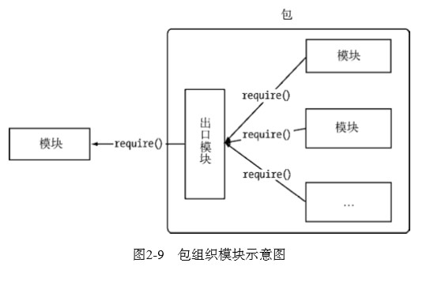

# 《深入浅出NodeJs》学习笔记（二）

## 第2章 模块机制

首先我们从模块来介绍 Node。

JavaScript 从出生到应用，再到真正流行，大概经历了下图的几个阶段变迁：


但在这个过程中，始终有一项是 JavaScript 是欠缺的，那就是模块功能。（该功能在 ES6 中终于被原生支持了）

如同 Java 有类文件，Python 有 import 机制，Ruby 有 require ，PHP 有 include 和 require。JavaScript 却只能通过 `<script>`标签来引入，代码显得杂乱无章且没有组织性和约束能力。开发者只能用命名空间等方式来人为约束。

有鉴于此，社区也为 JavaScript 制定了相应的规范用于模块化，其中 CommandJS 规范的提出算是最为重要的里程碑。

### 2.1 CommonJS 规范

>CommonJS规范为JavaScript制定了一个美好的愿景——希望JavaScript能够在任何地方运行。

#### 2.1.1 CommonJS 的出发点

对于 JavaScript 自身而言，它的规范有以下缺陷：

- 没有模块系统
- 标准库较少
- 没有标准接口
- 缺乏包管理系统

CommonJS 规范的提出，主要是为了弥补当前 JavaScript 没有标准的缺陷，以达到像 Python、Ruby 和 Java 一样具备开发大型应用的基础能力，而非停留在小脚本程序阶段。最后使得使用 CommonJS API 开发出来的应用可以具备跨宿主环境的执行能力，这样就可以利用 JavaScript 来开发丰富的客户端应用了。其中包括但不限于：

- 服务器端 JavaScript 应用程序
- 命令行工具
- 桌面图形界面应用程序
- 混合应用

> Node借鉴CommonJS的Modules规范实现了一套非常易用的模块系统，NPM对Packages规范的完好支持使得Node应用在开发过程中事半功倍。在本章中，我们主要就Node的模块和包的实现进行展开说明。 

#### 2.1.2 CommonJS 的模块规范

CommonJS对模块的定义主要分为3个部分：

- 模块引用
- 模块定义
- 模块标识

下面是分开讲解。

1. 模块引用

   模块引用的示例代码如下：

   ```javascript
   var math = require('math')
   ```

   在 CommonJS 规范中存在一个 require 方法，这个方法接受模块标识，并以此引入一个模块的 API 到当前上下文中。

2. 模块定义

   对应引入的功能，上下文提供了 exports 对象用于导出当前模块的方法或者变量，并且它是**唯一**导出的出口。在模块中，还存在一个 module 对象代表模块自身，而 exports 是 module 的属性。在 Node 中，一个文件就是一个模块，将方法挂载在 exports 对象上作为属性即可定义导出的方式。

   ```javascript
   // math.js
   exports.add = function () {
       var sum = 0
       var i = 0
       var args = arguments
       var l = args.length
       while (i < l) {
           sum += args[i++]
       }
       return sum
   }
   ```

   在另一个文件中，通过 require 方法引入模块后，就能调用定义的属性或者方法了。

   ```javascript
   // program.js
   var math = require('math')
   exports.increment = function (val) {
       return math.add(val, 1)
   }
   ```

3. 模块标识

   模块标识其实就是传递给 require 方法的参数，**它必须是符合小驼峰命名的字符串，或者以相对路径或者绝对路径开头，可以没有文件名后缀.js**。

   > 模块的定义十分简单，接口也十分简洁。它的意义在于将类聚的方法和变量等限定在私有的作用域中，同时支持引入和导出功能以顺畅地连接上下游依赖。每个模块具有独立的空间，它们互不干扰，在引用时也显得干净利落。 
   >


### 2.2 Node的模块实现

Node 在实现中并非完全按照规范实行，而是对模块规范进行了一定的取舍，同时也增加了一些自身需要的特性。

在 Node 中引入模块，需要经历以下三个步骤：

- 路径分析
- 文件定位
- 编译执行

在 Node 中，模块分为两类：

- Node提供的核心模块，在 Node 进程启动时就加载进了内存中，所以并没有路径分析和文件定位这两部，记载速度最快。
- 用户编写的文件模块，需进行完整的三个步骤，速度稍慢

#### 2.2.1 优先从缓存加载

> 展开介绍路径分析和文件定位之前，我们需要知晓的一点是，与前端浏览器会缓存静态脚本 文件以提高性能一样，Node对引入过的模块都会进行缓存，以减少二次引入时的开销。不同的地 方在于，浏览器仅仅缓存文件，而Node缓存的是编译和执行之后的对象。 不论是核心模块还是文件模块，require()方法对相同模块的二次加载都一律采用缓存优先的 方式，这是第一优先级的。不同之处在于核心模块的缓存检查先于文件模块的缓存检查。 

#### 2.2.2 路径分析和文件定位

1. 模块标识符分析

   模块标识符在 Node 中主要分为以下几类：

   - 核心模块，如 http、fs、path 等
   - .或者..开始的相对路径模块
   - 以/开始的绝对路径文件模块
   - 非路径形式的文件模块，如自定义的connect模块

   其中，加载速度从快到慢分别为 核心模块 > 路径形式的文件模块 > 自定义模块。

   自定义模块的路径生成会从当前的文件目录下的 node_modules 目录一直递归便利到根目录下的 node_modules，知道找到目标文件为止，因此当前文件的路径越深，模块查找的耗时也会越多。

2. 文件定位

   require() 方法在分析标识符的过程中允许不包含文件扩展名，在这种情况下，Node 会按 .js、.json、.node 的次序来补足扩展名，依次尝试。

   > 小诀窍是：如果是.node和.json文件，在传递给require() 的标识符中带上扩展名，会加快一点速度。

   当 require 通过分析文件扩展名后没有找到对应的文件，但却得到了一个目录时，Node 会将 index 当作默认文件名，然后依次查找 index.js、index.json、index.node。

#### 2.2.3 模块编译

在 Node 中，每个文件模块都是一个对象，其定义如下：

```javascript
function Module (id, parent) {
    this.id = id
    this.exports = {}
    this.parent = parent
    if (parent && parent.children) {
        parent.children.push(this)
    }
    this.filenanme = null
    this.loaded = false
    this.children = []
}
```

定义到具体的文件后，Node会新建一个模块对象，然后根据路径加载并编译。对于不同的文件，其载入方法也有所不同：

- .js文件。通过 fs 模块同步读取文件后编译执行
- .node 文件。这是用 C/C++ 编写的扩展文件，通过 dlopen() 方法加载最后编译生成的文件
- .json 文件。通过 fs 模块同步读取文件后，用 JSON.parse() 解析返回的结果
- 其余扩展文件名。它们都将被当做 .js 文件载入

> 每一个编译成功的模块都会将其文件路径作为索引缓存在Module._cache对象上，以提高二 次引入的性能。 

```javascript
// 对.json文件的读取
Module._extension['.json'] = function (module, filename) {
    var content = NativeModule.require('fs').readFileSync(filename, 'utf8')
    try {
        module.exports = JSON.parse(stripBOM(content))
    } catch (err) {
        err.message = filename + ':' + err.message
        throw err
    }
}
```

> 其中，Module._extensions会被赋值给require()的extensions属性，所以通过在代码中访问 require.extensions可以知道系统中已有的扩展加载方式

1. JavaScript 模块的编译

   回到 CommonJS 模块规范，我们知道每个模块文件中存在着 require、exports、module 这3个变量，但是它们在模块文件中并没有定义，那么它们是从何而来的呢？在 Node 的 API 文档中，我们知道每个模块中还有 `__filename`、`__dirname`这两个变量的存在，它们又是从何而来的呢？如果我们把直接定义模块的过程放在浏览器端，会出现污染全局变量的情况。

   事实上，在编译过程中，Node 对获取的 JavaScript 文件进行了头尾包装，在其头部和尾部添加了`(function (exports, require, module, __filename, __dirname) {\n，在尾部添加了\n})`。一个正常的 JavaScript 文件会被包装成如下样子。

   ```javascript
   (function (expoorts, require, module, __filename, __dirname) {
       var math = require('math')
       exports.area = function (radius) {
           return Math.PI * radius * radius
       }
   })
   ```

   如此，每个模块文件之间都进行了作用域隔离。包装后的代码会通过 vm 原生模块的 runInThisContext 方法执行，(类似 eval ，只是具有明确上下文，不污染全局)，返回一个具体 function 对象。最后，将当前模块对象的 exports 属性、require() 方法、module 以及在文件定位中得到的完整文件路径和文件目录作为参数传递给这个 function 执行。

   此外还有很多初学者纠结为何已经存在了 exports 的情况下，还存在 module.exports ，**这是为了能让 require 引入一个类而存在的**，来看下面的两种代码：

   ```javascript
   function change (exports) {
       exports = { test: 2 } // 改变了 exports 指针形参的引用
       console.log(exports) // {test: 2}
   }
   var exports = { test: 1 }
   change(exports)
   console.log(exports) // {test: 1} 由于传入的是一个指针形参，在函数外，a 指针依旧指向旧的地址，即 {test: 1}
   
   function change2 (module) {
       module.a = { test: 2 } // 未改变 module 指针形参的引用
       console.log(module.a) // { test:2 }
   }
   var module = { exports: { test: 1 }}
   change2(module)
   console.log(module.exports) // { test: 2 } 修改成功
   ```

   如上所示，直接赋值形参会改变形参的引用，但并不能改变作用域外的值，所以退而求其次，我们选择在外面包一层对象来达到曲线救国的方法。这也就是为什么要使用 module.exports 对象的原因。

2. C/C++ 模块的编译

   Node 调用 process.dlopen() 方法进行加载和执行。.node 文件并不需要编译，因为它是编译之后生成的，所以只有加载和执行的过程。在执行的过程中，模块的 exports 对象与 .node 模块产生联系，然后返回给调用者。

3. JSON 文件的编译

   JSON 文件的编译如上文所言，Node 会通过 fs 模块读取后调用 JSON 的方法得到对象，并将其赋值给模块对象的 exports，供外部调用。此外，你还可以享受到模块缓存的便利，在二次引入时也没有性能影响。

### 2.3 核心模块

JavaScript核心模块的定义如下面的代码所示，源文件通过process.binding('natives')取出， 编译成功的模块缓存到`NativeModule._cache`对象上，文件模块则缓存到`Module._cache`对象上： 

```javascript
function NativeModule(id) {
    this.filename = id + '.js'
    this.id = id
    this.exports = {}
    this.loaded = false
}
NativeModule._source = process.binding('natives')
NativeModule._cache = {}
```

PS：本小节内容有点过于硬核...还是等以后对 node 了解比较深了以后再回来看它的编译原理吧.. // TOREAD

### 2.4 C/C++ 扩展模块

// 硬核 +1... // TOREAD

### 2.6 包与 NPM

在模块之外，包和 NPM 是将模块联系起来的一种机制。

Node 对模块规范的实现，一定程度上解决了变量依赖、依赖关系等代码组织性问题。而包的出现，则是在模块的基础上进一步组织 JavaScript 代码。下图是包组织模块示意图：



#### 2.6.2 包描述文件与NPM

包描述文件用于表达非代码的相关的信息，它是一个JSON格式的文件——package.json，位于包的根目录下。

CommonJS 为 package.json 文件定义了如下一些必需的字段：

- name 包名
- description 包简介
- version 版本号
- keywords 关键词数组
- maintainers 包维护者列表

而在 NPM 的包文件规范中，多了以下4个字段：

- author 包作者
- bin 一些包作者希望包可以作为命令行工具使用，通过 `npm install package_name -g` 命令可以将脚本添加到执行路径中，之后可以在命令行中直接执行。
- main。模块引入方法 require 在引入包时，会优先检查该字段，并将其作为包中其余模块的入口。如果不存在该字段，那么 require 就会寻找包目录下的 index 文件作为默认入口
- devDependencies 一些开发时需要的依赖模块。

#### 2.6.3 NPM常用功能

1. 查看 NPM 的版本

   ```shell
   npm -v
   ```

2. 安装依赖包

   通过`npm install <package_name> -g`命令进行全局模式安装。需要注意的是，全剧模式并不意味着将一个可以从任何地方通过 require() 来引用它。

   全局模式这个称谓其实并不精确，存在着许多舞蹈。实际上， -g 是将一个包安装为全局可用的可执行命令，它根据包描述文件中的 bin 字段配置，将实际脚本链接到与 Node 可执行文件相同的路径下：

   ```json
   {
       "bin": {
           "express": "./bin/express"
       }
   }
   ```

   事实上，通过全局模式安装的所有模块包都被安装进了一个统一的目录下，该目录可以通过如下方式看到。

   ```javascript
   path.resolve(processs.execPath, '..', '..', 'lib', 'node_modules')
   ```

   如上，如果 Node 可执行文件(即 node 命令，或者 node.exe )的位置是 /usr/local/bin/node，那么模块目录就是 /usr/local/lib/node_modules。最后，通过软链接的方式将 bin 字段配置的可执行文件链接到 Node 的可执行目录下。

3. NPM 钩子命令

   package.json 中 scripts 字段的提出让包在安装或者卸载过程中可以触发钩子机制，示例如下：

   ```json
   {
       "scripts": {
           "preinstall": "preinstall.js",
           "install": "install.js",
           "uninstall": "uninstall.js",
           "test": "test.js"
       }
   }
   ```

   如上，在执行`npm install <package>`时，preinstall 指向的脚本会被加载执行，然后 install 指向的脚本会被执行。在执行 `npm uninstall <package>`时，uninstall 脚本也可以做一些清理工作。

   你也同样可以通过该字段来自定义命令，如上面的 test 字段就可以用于执行你自定义的脚本。

4. 发布包

   下面将会简略介绍发布一个包所需要的几个基本步骤：

   - 使用`npm init`来生成必要的 package.json 文件
   - 通过`npm adduser`来注册仓库账号，用于发布包到仓库
   - 通过`npm publish <folder>`即可以上传包
   - 通过`npm install <package_name>`来安装你上传的包
   - 通过`npm owner ls/add/rm <package_name>`来查看、添加、删除一个包的拥有者

5. 分析包

   通过执行`npm ls`命令可以执行分析包

#### 2.6.4 局域NPM

企业或个人可以通过构建自己的NPM仓库来兼顾模块开发带来的优势和保密性问题。

#### 2.6.5 NPM潜在问题

NPM 的潜在问题在于，在 NPM 平台上，每个人都可以分享包到平台，导致上面的包的质量也都良莠不齐。而另一个问题则是，Node 代码可以运行在服务器端，需要考虑安全问题。

对于包的使用者而言，包质量和安全问题需要作为是否采纳模块的一个判断标准。

PS：当然，还有臭名昭著的**node_module**黑洞问题。

### 2.7 前后端共用模块

JavaScript 在 Node 出现以后，比别的编程语言多了一项优势，那就是一些模块可以在前后端实现共用。这是因为很多 API 在各个宿主环境下都提供。但在实际情况中，前后端环境是略有差别的。

#### 2.7.1 模块的侧重点

纵观 Node 的模块引入过程，几乎全程都是同步的。尽管与 Node 强调异步的行为有些相反，但在服务器端这是合理的，因为后端侧重以及瓶颈在于CPU和内存等资源，而前端的瓶颈则在于网络带宽。所以显然，前端模块无法采用 CommonJS 的同步规范来引入模块。

所以在前端应用场景下，一套异步模块定义规范出现了，即 AMD 规范。

#### 2.7.2 AMD 规范

AMD 规范是 CommonJS 模块规范的眼神，其模块定义如下：

```javascript
define(id?, dependencies?, factory);
```

上面的模块id和依赖是可选的，与 Node 模块相似的地方在于 factory 的内容就是实际代码的内容。下面的代码定义了一个简单的模块：

```javascript
define(function () {
    var exports = {}
    exports.sayHello = function () {alert('hello from module:' + module.id)}
    return exports
})
```

不同之处在于 AMD 模块需要用 define 来明确定义一个模块，而这在 Node 实现中是隐式的，它们的目的都是为了进行作用域隔离。而另一个区别则是 AMD 中内容需要通过返回的方式实现导出。

#### 2.7.3 CMD 规范

CMD 规范由国人玉伯提出，与 AMD 主要的区别在于定义模块和依赖引入的部分，AMD 需要在声明模块的时候指定所有的依赖，通过形参传入到模块内容中，如下：

```javascript
define(['dep1', 'dep2'], function () {
    return function () {}
})
```

而 CMD 则支持动态引入，如下：

```javascript
define(function (require, exports, module) {
  // CMD 规范下  
})
```

require、exports、module通过形参传给模块，在需要依赖模块时通过 require 引入即可，由此可看出 CMD 更加接近于 Node 对 CommonJS 规范的定义。

#### 2.7.4 兼容多种模块规范

为了保持前后端的一致性，类库开发者需要将库代码包装在一个闭包内，以下的这段代码可以将一个 hello 方法定义到不同的运行环境中，并兼容 Node、AMD、CMD 以及常见浏览器环境。

```javascript
;(function (name, definition) {
    // 检测上下文是否为AMD或CMD
    var hasDefine = typeof define === 'function'
    // 检查上下文环境是否为Node
    var hasExports = typeof module !== 'undefined' && module.exports
    if (hasDefine) {
        // AMD 或 CMD 环境
        define(definition)
    } else if (hasExorts) {
        // 定义为普通Node模块
        module.exports = definition()
    } else {
        // 将模块的执行结果挂载到window变量中，浏览器中的this默认指向window
        this[name] = definition()
    }
})('hello', function () {
    var hello = function () {};return hello;
})
```