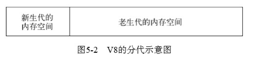
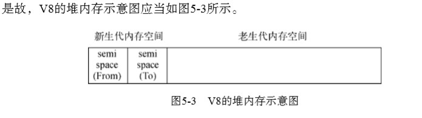
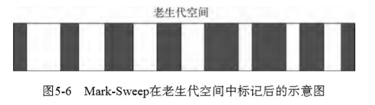
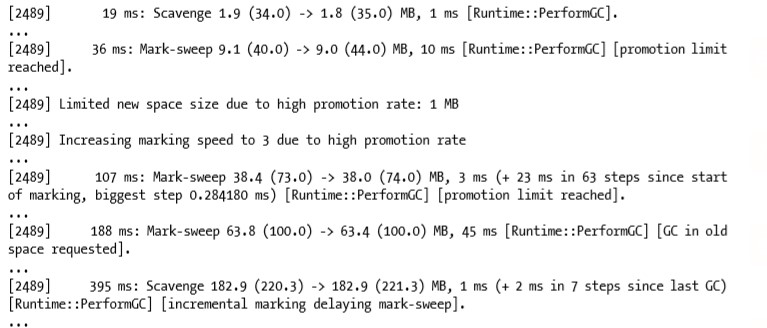

# 《深入浅出NodeJs》学习笔记（五）

## 第5章 内存控制

> 在过去很长一段时间内，JavaScript 开发者很少在开发过程中遇到需要对内存精确控制的场景，也缺乏控制的手段。基于无阻塞、事件驱动建立的Node服务，具有内存消耗低的优点，非常适合处理海量的网络请求。在海量请求的前提下，开发者就需要考虑一些平常不会形成影响的问题。
>
> 内存控制正是在海量请求和长时间运行的前提下进行探讨的。在服务器端，资源向来就寸土寸金，要为海量用户服务，就得使一切资源都要高效循环利用。 在第3章中，差不多已介绍完Node是如何利用CPU和I/O这两个服务器资源，而本章将介绍在Node 中如何合理高效地使用内存

### 5.1 V8 的垃圾回收机制与内存限制

JavaScript 有一套自己的垃圾回收机制用于自动内存管理，让开发者可以在编写代码的过程中无需时刻关注内存的分配和释放问题。所以在前端开发中，很少有人能遇到垃圾回收对应用程序构成性能影响的情况。

而Node 拓宽了 JavaScript 的应用场景，内存管理对其的影响也变得重要了起来，而这一切的关键点，都与 Node 的 JavaScript 执行引擎 V8 息息相关。

#### 5.1.1 Node 与 V8

> Node在JavaScript的执行上直接受益于V8，可以随着V8的升级就能享受到更好的性能或新的 语言特性（如ES5和ES6）等，同时也受到V8的一些限制，尤其是本章要重点讨论的内存限制。 

#### 5.1.2 V8 的内存限制

在一般的后端开发语言中，在内存的使用上一般没有什么限制，然而在 Node 中通过 JavaScript 使用内存则会发现只能使用部分内存（64位系统下约为1.4 GB，32位系统下约为0.7 GB）。在这样的限制下，决定了 Node 无法直接操作大内存对象，计算机内存资源也无法得到充足的使用。

> V8引擎的设计之初只是运行在浏览器中，而在浏览器的一般应用场景下使用起来绰绰有余，足以胜任前端页面中的所有需求。
>
> 深层原因是V8的垃圾回收机制的限制。 按官方的说法，以1.5 GB的垃圾回收堆内存为例，V8做一次小的垃圾回收需要50毫秒以上，做一 次非增量式的垃圾回收甚至要1秒以上。这是垃圾回收中引起 JavaScript 线程暂停执行的时间，在这样的时间花销下，应用的性能和响应能力都会直线下降。这样的情况不仅仅后端服务无法接受， 前端浏览器也无法接受。因此，在当时的考虑下直接限制堆内存是一个好的选择。 
>
> 虽然服务端操作大内存也不是常见的需求，但是万一有这样的需求，还是可以解除限制的。
> 在启动node程序的时候，可以传递两个参数来调整内存限制的大小。
>
> ```shell
> node --max-nex-space-size=1024 app.js // 单位为KB
> node --max-old-space-size=2000 app.js // 单位为MB
> ```
>
> 上述参数在V8初始化时生效，一旦生效就不能再动态改变。如果遇到Node无法分配足够内 存给JavaScript对象的情况，可以用这个办法来放宽V8默认的内存限制，避免在执行过程中稍微 多用了一些内存就轻易崩溃。
>
> 这两条命令分别对应Node内存堆中的「新生代」和「老生代」
>
> **不受内存限制的特例**
>
> 在Node中，使用Buffer可以读取超过V8内存限制的大文件。原因是Buffer对象不同于其他对象，它不经过V8的内存分配机制。这在于Node并不同于浏览器的应用场景。在浏览器中，JavaScript直接处理字符串即可满足绝大多数的业务需求，而Node则需要处理网络流和文件I/O流，操作字符串远远不能满足传输的性能需求

#### 5.1.3 V8 的对象分配

在 V8 中，所有的 JavaScript 对象都是通过*堆*来进行分配的。当我们在代码中声明变量并赋值时，所使用的内存就分配在堆中。如果已申请的内存不够分配新的对象，将继续申请堆内存，直到堆的大小超过 V8 的限制为止。

#### 5.1.4 V8 的垃圾回收机制

V8主要使用以下几种垃圾回收算法：

1. 分代式垃圾回收机制

   > 在自动垃圾回收的演变过程中，人们发 现没有一种垃圾回收算法能够胜任所有的场景。因为在实际的应用中，对象的生存周期长短不一。为此，统计学在垃圾回收算法的发展中产生了较 大的作用，现代的垃圾回收算法中按对象的存活时间将内存的垃圾回收进行不同的分代，然后分别对不同分代的内存施以更高效的算法。

   

   **分代**

   在 V8 中，主要讲内存分为**新生代**和**老生代**两代。**新生代**中的对象为存活时间较短的对象，老生代中的对象为存活时间较长或常驻内存的对象。

   

   V8 堆的整体大小就是新生代所用的内存空间加上老生代的内存空间。

   在默认设置下，老生代的设置在64位系统下为 1400MB （总空间为1.4G），在32位系统下为 700MB（总空间700MB）

   新生代由两个`reserved_semispace_size`组成，其的设置在64位系统下为 16MB，32位系统下为 8MB。所以新生代在64位和32位下的最大值分别文32MB和16MB。

   而V8堆内存的最大保留空间的公式也由此得来：`4 * reserved_semispace_ size_ + max_old_generation_size_`

   在分代的基础上，新生代中的对象又可以通过 Scavenge 算法进行垃圾回收。

   **Scavenge 算法**

   > 它将堆内存一分为二，每一部分空 间称为semispace。在这两个semispace空间中，只有一个处于使用中，另一个处于闲置状态。处 于使用状态的semispace空间称为From空间，处于闲置状态的空间称为To空间。当我们分配对象 时，先是在From空间中进行分配。当开始进行垃圾回收时，会检查From空间中的存活对象，这 些存活对象将被复制到To空间中，而非存活对象占用的空间将会被释放。完成复制后，From空 间和To空间的角色发生对换。简而言之，在垃圾回收的过程中，就是通过将存活对象在两个 semispace空间之间进行复制。
   >
   > Scavenge的缺点是只能使用堆内存中的一半，这是由划分空间和复制机制所决定的。但 Scavenge由于只复制存活的对象，并且对于生命周期短的场景存活对象只占少部分，所以它在时间效率上有优异的表现。
   >
   > 

   

2. Mark-Sweep & Mark-Compact 

   对于老生代中的对象采用 Scavenge 算法的效率会很低，并且会浪费一半的空间。为此，Node 选用了标记清除的方式来进行空间回收，也就是我们所熟悉的浏览器主流算法。

   > Mark-Sweep是标记清除的意思，它分为标记和清除两个阶段。与Scavenge相比，Mark-Sweep 并不将内存空间划分为两半，所以不存在浪费一半空间的行为。与Scavenge复制活着的对象不同， Mark-Sweep在标记阶段遍历堆中的所有对象，并标记活着的对象，在随后的清除阶段中，只清除 没有被标记的对象。可以看出，Scavenge中只复制活着的对象，而Mark-Sweep只清理死亡对象。 活对象在新生代中只占较小部分，死对象在老生代中只占较小部分，这是两种回收方式能高效处 理的原因。图5-6为Mark-Sweep在老生代空间中标记后的示意图，黑色部分标记为死亡的对象。
   >
   > 
   >
   > Mark-Sweep大的问题是在进行一次标记清除回收后，内存空间会出现不连续的状态。这种 内存碎片会对后续的内存分配造成问题，因为很可能出现需要分配一个大对象的情况，这时所有 的碎片空间都无法完成此次分配，就会提前触发垃圾回收，而这次回收是不必要的。 
   >
   > 为了解决Mark-Sweep的内存碎片问题，Mark-Compact被提出来。Mark-Compact是标记整理 的意思，是在Mark-Sweep的基础上演变而来的。它们的差别在于对象在标记为死亡后，在整理的 过程中，将活着的对象往一端移动，移动完成后，直接清理掉边界外的内存。

   V8 主要使用 Mark-Sweep，在空间不足对从新生代晋升过来的对象进行分配时才使用 Mark-Compact。

3. Incremental Marking

   上面介绍的两种方法都可以被分类为“全停顿法”，在垃圾回收时都需要将应用逻辑暂停下来，以防止出现 JavaScript 应用逻辑与垃圾回收器看到的不一致的情况。

   为了降低全堆垃圾回收带来的停顿时间，V8 采用了增量标记的标记方法，每次标记完后都让 JavaScript 应用逻辑执行一小会儿，垃圾回收与应用逻辑交替执行直到标记阶段完成。从而降低其最大停顿时间。

   > V8后续还引入了延迟清理（lazy sweeping）与增量式整理（incremental compaction），让清 理与整理动作也变成增量式的。同时还计划引入并行标记与并行清理，进一步利用多核性能降低 每次停顿的时间。

#### 5.1.5 查看垃圾回收日志

在启动时添加`--trace_gc`参数，在进行垃圾回收时，就可以从标准输出中打印垃圾回收的日志信息。



通过分析垃圾回收日志，可以找出垃圾回收的哪些阶段比较耗时，触发的原因是什么。

在 Node 启动时使用`--prof`参数，可以得到 V8 执行时的性能分析数据，其中包含了垃圾回收执行时占用的时间。

在 Node 源码的 deps/v8/tools 目录下有一个名为 tick-processor 的工具( linux 下叫 linux-tick-processor ，windows 下叫 windows-tick-processor.bat )，使用该工具来调用 --prof 参数所生产的 log 文件，就可以得到可视化的统计结果。

### 5.2 高效使用内存

本节介绍如何在 V8 下高效利用垃圾回收机制。

#### 5.2.1 作用域

在 JavaScript 中能形成作用域的有函数调用、with以及全局作用域。

函数在每次被调用时会创建对应的作用域，函数执行结束后，该作用域会销毁。同时作用域中声明的局部变量分配在该作用域上，随作用域的销毁而销毁。只被局部变量的引用的对象存活周期较短，其中较小的对象将会被分配在新生代的 From 空间中，在作用域释放后，局部变量失效，其引用的对象将会在下次垃圾回收时被释放。

1. 标识符查找

   与作用域相关的就是标识符查找。标识符可以理解为变量名。JavaScript 在执行时会去查找变量定义在哪里，其最先查找的是当前作用域，如果当前作用域无法找到该变量的声明，就会向上级的作用域查找，直到查到为止。

2. 作用域链

   作用域链即由标识符为查找方向，向上查找直到全局作用域的一条链，**由于查找方向是向上的，所以变量只能向外访问，而不能向内访问**。

   了解作用域有助于我们了解变量的分配和释放

3. 变量的主动释放

   如果变量是全局变量(不通过 var 声明或者定义在 global 变量上)，将会导致引用的对象常驻与老生代中。这种对象若需要释放，只能通过 delete 操作来删除引用关系，或者将变量重新赋值，让旧的对象脱离引用关系，从而让老生代内存清除时回收释放。（**但在 V8 中通过 delete 删除对象的属性有可能干扰 V8 的优化，所以通过赋值方式解除引用更好**）

#### 5.2.2 闭包

在 JavaScript 中，实现外部作用域访问内部作用域中的变量的方法叫作闭包。

```javascript
// 正常的作用域链中，外部作用域无法访问内部作用域
var foo = function () {
  var bar = function () {
    var local = "局部变量"
  }
  console.log(local) // 报错，无法访问内部bar内部作用域中的local局部变量
}

// 但是通过闭包的方式，就可以通过一个中间函数来进行中转，从而访问内部作用域中的变量
var foo = function () {
  var bar = function () {
    var local = "局部变量"
    return function () {return local}
  }
  console.log(bar()) // 成功返回局部变量
}
```

闭包是 JavaScript 的高级特性，但其问题在于一旦有变量引用这个中间函数，这个中间函数将不会释放，同时也会使得原始的作用域不会得到释放，作用域中产生的内存占用也不会得到释放。除非不再有占用，才会逐步释放。

**小结**

在 JavaScript 的执行中，我发立即回收的内存有闭包和全局变量这两种情况，由于 V8 的内存限制，所以要小心此类变量的无限制增加。

### 5.3 内存指标

当内存占用无限增长，达到 V8 内存限制的时候，将会导致进程退出。

#### 5.3.1 查看内存的使用情况

使用如下三种方法可以查看内存使用情况：

- process.memoryUsage()
- os 模块中的 totalmem()
- os 模块中的 freemem()

1. 查看进程的内存占用

   调用 process.memoryUsage() 可以看到 Node 进程的内存占用情况。返回格式如下：

   ```javascript
   process.memoryUsage()
   // {rss: 13852672, heapToal: 6131200, heapUsed: 2757120}
   ```

   rss 是 resident set size 的缩写，即进程的常驻内存部分。进程的内存一部分是 rss，其余部分在交换区(swap)或者文件系统(filesystem)中。

   除了 rss 外，heapTotal 是堆中总共申请的内存量，heapUsed 表示目前堆中使用中的内存量。

   这三个值的单位都是字节(B)。

2. 查看系统的内存占用

   os 模块中的 totalmem() 和 freemem() 这两个方法用于查看操作系统的内存使用情况，它们分别返回系统的总内存和闲置内存，以字节为单位。

#### 5.3.2 堆外内存

通过 process.memoryUsage() 的结果可以看到，堆中的内存用量总是小于进程的常驻内存用量。

这意味着 Node 中的内存使用并非都是通过 V8 进行分配的。我们将那些不是通过 V8 分配的内存称为堆外内存。

而在 Node 中，Buffer 对象由于并非通过 V8 来进行内存分配，所以可以利用堆外内存来突破内存限制的问题。

**小结**

Node 的内存构成主要部分有通过 V8 进行分配的部分和 Node 自行分配的部分。受 V8 的垃圾回收限制的主要是 V8 的堆内存。

### 5.4 内存泄漏

在 V8 中，造成内存泄漏的原因有如下几个：

- 缓存
- 队列消费不及时
- 作用域未释放

#### 5.4.1 慎将内存当作缓存

在 Node 中，缓存的使用并非“物美价廉”，一旦一个对象被当做缓存来使用，那就意味着它将会常驻在老生代中，缓存中存储的键值对越多，长期存活的对象也就越多，这将导致垃圾回收在进行扫描和整理时，对这些对象做无用功。

> 所以在Node中，任何试图拿内存当缓存的行为都应当被限制。当然，这种限制并不是不允许 使用的意思，而是要小心为之    

#### 5.4.2 关注队列状态

另一个不经意产生产生的内存泄漏是队列。在 JavaScript 中经常通过队列（数组对象）来充当 消费者-生产者 模型中的中间产物，当消费速度大于生产速度时，内存泄漏不易产生，但是一旦消费速度低于生产速度，就会形成内存堆积。

对于这类问题，解决方案应该是监控队列的长度，一旦堆积，应当通过监控系统产生报警并通知相关人员。另外也可以用超时机制，一旦限定时间内未完成相应，则通过回调函数传递超时异常，使得任意异步调用都具备可控的响应时间，给消费速度一个下限值。

### 5.5 内存泄漏排查

本节介绍内存泄漏排查工具的使用方法，TOREAD

### 5.6 大内存应用

由于 Node 的内存限制，操作大文件需要格外小心。好在 Node 提供了 stream 模块用于处理大文件。

stream 模块是 Node 的原生模块，继承自 EventEmitter，具备自定义事件功能。同时抽象出了标准的事件和方法，分为可读和可写两种。

比如`fs.createReadStream()`和`fs.createWriteStream()`方法可以用于创建文件的可读流和可写流，process 中的 stdin 和 stdout 则分别是可读流和可写流的示例。

如果不需要进行字符串层面的操作和不需要借助 V8 来处理，也可以尝试进行纯粹的 V8 操作，从而避开 V8 堆内存的限制。