# 《深入浅出NodeJs》学习笔记（十）

## 第9章 玩转进程

> Node在选型时决定在V8引擎之上构建，也就意味着它的模型与浏览器类似。

但是 Node 进程只能利用一个核，这就引出了两个重要问题：

- 如何充分利用多核 CPU 服务器？
- 一旦单线程上抛出的异常没有被捕获，将会引起整个进程的崩溃，那么 Node 应该如何保证进程的健壮性和稳定性？

在这两个问题中，前者只是利用率不足的问题，后者对于实际产品化带来一定的顾虑。

要知道的是，Node 在严格意义上并非真正的单线程架构，一些 IO 线程和底层 C++ 代码由 libuv 处理，这些开发者接触不到的部分是有可能多线程运行的。但对于开发者所关注到的 JavaScript 开发部分，则永远是运行在 V8 上，是单线程的。

### 9.1 服务模型的变迁

> 从“古”到今，Web服务器的架构已经历了几次变迁。服务器处理客户端请求的并发量，就是每个里程碑的见证。

- 青铜时代：复制进程，**是通过进程的复制同时服务更多的请求和用户，设通过进行复制和预复制的方式搭建的服务器有资源的限制，且进程数上限为M，那这类服务的QPS为M/N**
- 白银时代：多线程，**操作系统只能通过将CPU切分为时间片的方法，让线程可以较为均匀地 使用CPU资源，但是操作系统内核在切换线程的同时也要切换线程的上下文，当线程数量过多时， 时间将会被耗用在上下文切换中**
- 黄金时代：事件驱动，**采用单线程避免了不必要的内存开销和上下文切换开销**

### 9.2 多进程架构

理想状态下，每个进程应各自利用一个 CPU ，以此实现多核 CPU 的利用。而 Node 提供了 child_process 模块并且也提供了一个 child_process.fork() 函数供我们实现进程的复制。

```javascript
// worker.js
var http = require('http')
http.createServer(function (req, res) {
    res.writeHead(200, {'Content-Type': 'text/plain'})
    res.end('Hello World\n')
}).listen((Math.round(1 + Math.random()) * 1000), '127.0.0.1')
```

通过 node 命令来启动，上面的命令将会侦听 1000 到 2000 之间的一个随机端口。

```javascript
var fork = require('child_process').fork
var cpus = require('os').cpus()
for (var i = 0;i < cpus.length;i++) {
    fork('./worker.js')
}
```

运行上面这段代码将会根据当前机器上的CPU数量复制出对应Node进程数。linux 系统下，可以通过`ps aux | grep worker.js`查看到进程的数量。

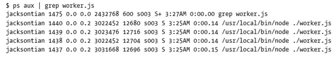

这就是著名的 Master-Worker 主从模式。

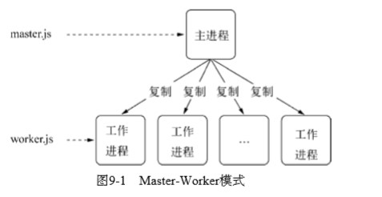

通过 fork 复制的进程都是一个独立的进程，它需要至少 30ms 的启动时间和至少 10MB 的内存。

> 尽管 Node 提供了 fork() 供我们复制进程使每个CPU 内核都使用上，但是依然要切记 fork() 进程是昂贵的。好在Node 通过事件驱动的方式在单线程上 解决了大并发的问题，这里启动多个进程只是为了充分将CPU资源利用起来，而不是为了解决并发问题

#### 9.2.1 创建子进程

child_process 模块给予 Node 可以随意创建子进程(child_process)的能力。创建子进程的方法有 4 个：

- spawn(): 启动一个子进程来执行命令
- exec(): 启动一个子进程来执行命令，与 spawn() 不同的是，它有一个回调函数获知子进程的状况
- execFile(): 启动一个子进程来执行可执行文件
- fork(): 与 spawn() 类似，不同点在于它创建 Node 的子进程只需要指定要执行的 JavaScript 文件模块即可

spawn() 与 exec()、execFile() 不同的是，后两者创建时可以指定 timeout 属性设置超时时间，一旦创建的进程运行超过设定的时间将会被杀死。

 exec() 与 execFile() 不同的是，exec() 适合执行已有的命令，execFile() 适合执行文件。四个命令创建子进程的例子如下所示：

```javascript
var cp = require('child_process')
cp.spawn('node', ['worker.js'])
cp.exec('node worker.js', function (err, stdout, stderr) {
    // TODO
})
cp.execFile('worker.js', function (err, stdout, stderr) {
    // TODO
})
cp.fork('./worker.js')
```

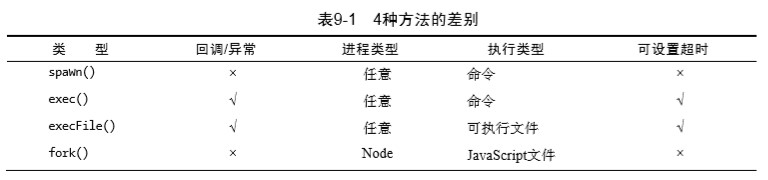

可执行文件是指可以直接执行的文件，如果是 JavaScript 文件通过 execFile() 运行，需要在首行添加下面的代码：

```javascript
#!/usr/bin/env node
```

> 尽管4种创建子进程的方式有些差别，但事实上后面3种方法都是spawn()的延伸应用。 

#### 9.2.2 进程间通信

> 对于 child_process 模块，创建好了子进程，然后与父子进程间通信是十分容易的。

浏览器中，JavaScript 主线程与 UI 渲染共用同一个线程，两者互相阻塞。长时间执行 JavaScript 将会造成 UI 停顿不想赢。HTML5 为了解决这个问题，提出了 WebWorker API，允许一些阻塞较为严重的计算不影响主线程上的 UI 渲染。

Node中，主线程与工作线程之间通过 onmessage() 和 postMessage() 进行通信，子进程对象则由 send() 方法实现主进程向子进程发送数据，message 事件实现收听子进程发来的数据，与 WebWorker API 在一定程度上相似。Node 对应示例如下：

```javascript
// parent.js
var cp = require('child_process')
var n = cp.fork(__dirname + '/sub.js')

n.on('message', function (m) {
    console.log('PARENT got message:', m)
})

n.send({hello: 'world'})

// sub.js
process.on('message', function (m) {
    console.log('CHILD got message:', m)
})
process.send({foo: 'bar'})
```

通过 fork() 或者其他 API创建子进程之后，为了实现父子进程之间的通信，父进程与子进程之间将会创建 IPC 通道。通过 IPC 通道，父子进程之间才能通过 message 和 send() 传递消息。

**进程间通信原理**

> IPC的全称是Inter-Process Communication，即进程间通信。进程间通信的目的是为了让不同 的进程能够互相访问资源并进行协调工作。

IPC 创建和实现原理如下图所示：

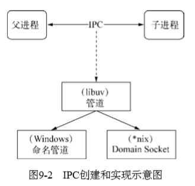

> 父进程在实际创建子进程之前，会创建IPC通道并监听它，然后才真正创建出子进程，并通 过环境变量（NODE_CHANNEL_FD）告诉子进程这个IPC通道的文件描述符。子进程在启动的过程中， 根据文件描述符去连接这个已存在的IPC通道，从而完成父子进程之间的连接

下图为创建 IPC 管道的步骤示意图：

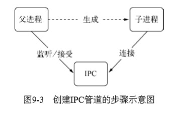

**PS:只有启动的子进程是Node进程时，子进程才会根据环境变量去连接IPC通道，对于其他类型的子进程则无法实现进程间通信，除非其他进程也按约定去连接这个已经创建好的IPC通道 **

#### 9.2.3 句柄传递

建立好进程之间的 IPC 以后，如果仅仅只用来发送一些简单的数据是不够的，我们需要将多个进程监听同一个端口，要解决这个问题，通常的做法是让每个进程监听不同的端口，其中主进程监听主端口，接收所有的网络请求，然后将这些请求代理到不同的端口进程上：

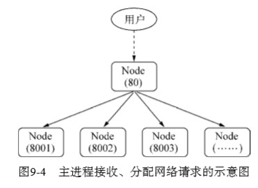

通过代理，可以避免端口不能重复监听的问题，甚至可以做到在代理进程上做适当的负载均衡。使得每个子进程可以较为均衡地执行任务。

但是由于进程连接到工作进程的过程需要用掉两个文件描述符。操作系统的文件描述符是有限的，这种代理的方案会影响系统的扩展能力。

Node 在版本 v0.5.9 引入了进程间发送句柄的功能。send() 方法除了能通过 IPC 发送数据以外，还能发送句柄。

> 句柄是一种可以用来标识资源的引用，它的内部包含了指向对象的文件描述 符。比如句柄可以用来标识一个服务器端socket对象、一个客户端socket对象、一个UDP套接字、 一个管道等。
>
> 发送句柄意味着什么？在前一个问题中，我们可以去掉代理这种方案，使主进程接收到socket 请求后，将这个socket直接发送给工作进程，而不是重新与工作进程之间建立新的socket连接来转 发数据。文件描述符浪费的问题可以通过这样的方式轻松解决

```javascript
// 主程序 parent.js
var child = require('child_process').fork('child.js')
var server = require('net').createServer()
server.on('connection', function (socket) {
    socket.end('handle by parent\n')
})
server.listen(1337, function () {
    child.send('server', server)
})
// 子程序 child.js
process.on('message', function (m, server) {
    if (m === 'server') {
        server.on('connection', function (socket) {
            socket.end('handled by child\n')
        })
    }
})
```

该示例中直接将一个 TCP 服务器发给了子进程，使得子进程和父进程都有可能处理我们客户端发起的请求。

对于主进程而言，我们甚至可以让它在将服务器句柄发送给子进程之后，就关掉服务器的监听，让子进程来处理请求。

```javascript
// parent.js
var cp = require('child_process')
var child1 = cp.fork('child.js')
var child2 = cp.fork('child.js')

var server = require('net').createServer()
server.listen(1337, function () {
    child1.send('server', server)
    child2.send('server', server)
    // 关掉
    server.close()
})
// child.js
var http = require('http')
var server = http.createServer(function (req, res) {
    res.writeHead(200, {'Content-Type': 'text/plain'})
    res.end('handled by child, pid is ' + process.id + '\n')
})
process.on('message', function (m, tcp) {
    if (m === 'server') {
        tcp.on('connection', function (socket) {
            server.emit('connection', socket)
        })
    }
})
```

这样一来，所有的请求都是由子进程处理了。主进程在发送完句柄后就关闭了监听，所以程序的结构如图所示：

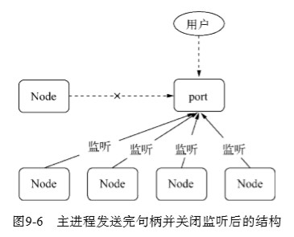

如此一来，就达到了多个子进程同时监听相同端口，且不会出现异常的目的。

1. 句柄发送与还原

   目前子进程对象 send() 方法可以发送的句柄包括如下几种：

   - net.Socket TCP套接字
   - net.Server TCP服务器
   - net.Native C++ 层面的 TCP 套接字或 IPC 管道
   - dgram.Socket UDP 套接字
   - dgram.Native C++ 层面的UDP套接字

   并非任意类型的句柄都能在进程之间传递，除非它有 完整的发送和还原的过程，send()方法在将消息发送到IPC管道前，将消息组装成两个对象，父进程与子进程之间并非是原生对象的传递，而是信息的传递。

2. 端口共同监听

   当我们一个个地启动独立地进程时，CP服务器端 socket套接字的文件描述符并不相同，导致监听到相同的端口时会抛出异常。

   但对于 send() 发送的句柄而还原出来的服务来说，他们的文件描述符是相同的，所以监听相同的端口不会引起异常。

   > 多个应用监听相同端口时，文件描述符同一时间只能被某个进程所用。换言之就是网络请求 向服务器端发送时，只有一个幸运的进程能够抢到连接，也就是说只有它能为这个请求进行服务。 这些进程服务是抢占式的。

### 9.3 集群稳定之路

> 虽然我们创建了很多工作进程，但每个工作进程依然是在单线程上执行的，它的稳定 性还不能得到完全的保障。我们需要建立起一个健全的机制来保障Node应用的健壮性。 

对于一个稳定的集群而言，除了要充分利用多核 CPU 的资源，还需要关注以下这些细节：

- 性能问题
- 多个工作进程的存活状态管理
- 工作进程的平滑重启
- 配置或者静态数据的动态重新载入
- 其余细节

#### 9.3.1 进程事件

除了 send() 方法和 message 事件外，Node 的子进程还有如下事件：

- error：当子进程无法被复制创建、无法被杀死、无法发送消息时会触发该事件
- exit：子进程退出时触发该事件。若是正常退出，该事件的第一个参数为退出码，否则为 null。如果进程是通过 kill() 方法被杀死的，会得到第二个参数，表示杀死进程时的信号
- close：在子进程的标准输入输出流中止时触发该事件，参数与 exit 相同
- disconnect: 在父进程或者子进程中调用 disconnect) 方法时触发，调用该方法时将关闭监听 IPC 通道。

除了 send() 以外，还可以通过 kill() 方法给子进程发送一个系统信号，让子进程关闭。默认情况下，父进程将通过 kill() 方法给子进程发送一个 SIGTERM 信号。

```javascript
// SIGTERM 是软件终止信号，进程收到该信号时应当退出
process.on('SIGTERM', function () {
    console.log('Got a SIGTERM, exiting...')
    process.exit(1)
})
console.log('server running with PID:', process.pid)
process.kill(process.pid, 'SIGTERM')
```

以下是 Node 中的信号列表:

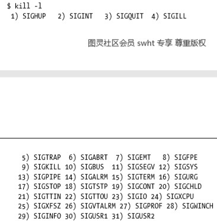

#### 9.3.2 自动重启

我们需要在主进程上加入一些子进程管理的机制，比如重新启动一个工作进程来继续服务。

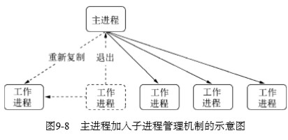

```javascript
// master.js
var fork = require('child_process').fork
var cpus = require('os').cpus()

var server = require('net').createServer()
server.listen(1337)

var workers = {}
var createWorker = function () {
    var worker = fork(__dirname + '/worker.js')
    // 退出时重新启动新的进程
    worker.on('exit', function () {
        console.log('Worker' + worker.pid + 'exited.')
        delete workers[worker.pid]
        createWorker()
    })
    // 句柄转发
    worker.send('server', server)
    workers[worker.pid] = worker
    console.log('Create Worker .pid' + worker.pid)
}
for (var i = 0; i < cpus.length; i++) {
    createWorker()
}
// 进程自己退出时让所有工作进程退出
process.on('exit', function () {
    for (var pid in workers) {
        workers[pid].kill()
    }
})
```

1. 自杀信号

   上述代码虽然可以做到自动重启，但问题是要等到所有连接断开后进程才退出，最极端情况下，所有工作进程都会停止新的连接，全处在等待退出的状态。等到进程完全退出才重启的过程中，可能会丢掉大部分的请求。

   于是我们需要在退出的流程中增加一个自杀(suicide)信号，在工作进程得知要退出时，向主进程发送一个自杀信号，然后才停止接收新的连接。

   最终我们需要获得的效果是：一旦有异常出现，主进程会创建新的工作进程来为用户服务，旧的进程一旦处理完已有连接就自动断开，整个过程使得我们的应用的稳定性和健壮性大大提高。

   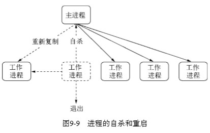

   进程中如果出现未能捕获的异常，那就意味着有一段代码在健壮性上是不合格的，因此我们需要在退出进程前通过日志记录下问题的所在，帮助我们定位和追踪异常出现的位置。

2. 通过自杀信号告知主进程可以使得新连接总是有进程服务，但是依然还是有极端的情况。工作进程不能无限制地被重启，如果启动的过程中就发生了错误，或者启动后接到连接就收到错误， 会导致工作进程被频繁重启，进程不断增加最终会导致服务卡死。

   为了完成限量重启的统计，我们引入一个队列来做标记，在每次重启工作进程之间进行打点 并判断重启是否太过频繁。

#### 9.3.3 负载均衡

> 在多进程之间监听相同的端口，使得用户请求能够分散到多个进程上进行处理，这带来的好 处是可以将CPU资源都调用起来。这犹如饭店将客人的点单分发给多个厨师进行餐点制作。既然 涉及多个厨师共同处理所有菜单，那么保证每个厨师的工作量是一门学问，既不能让一些厨师忙不过来，也不能让一些厨师闲着，这种保证多个处理单元工作量公平的策略叫负载均衡。

Node 默认采用的是操作系统的抢占式策略，一般而言这种策略对各个进程来说是公平的，但对于 Node 来说，影响抢占的是 CPU 的繁忙度。对不同的业务，可能出现 IO 繁忙而 CPU 较为空闲的情况，这可能造成某个进程抢到较多请求，形成负载不均衡的情况。

Node 提供了一种名为 Round-Robin 的方式用于避免 CPU 和 IO 繁忙差异导致的负载不均衡。

```javascript
// 启用 Round-Robin
cluster.schedulingPolicy = cluster.SCHED_RR
// 不启用 Round-Robin
cluster.schedulingPolicy = cluster.SCHED_NONE
```

#### 9.3.4 状态共享

使用一种方案和机制从而实现数据在多个进程之间的共享。

实现状态同步的机制大概有两种：

- 定时轮询

  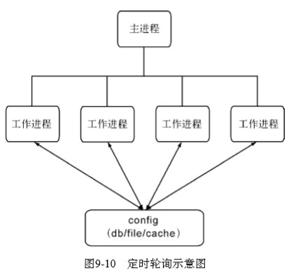

- 主动通知

  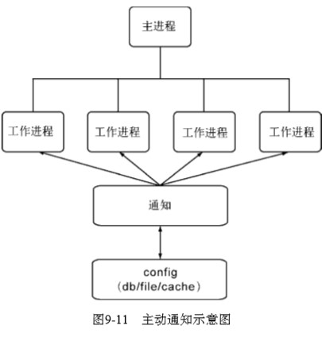

### 9.4 Cluster 模块

**上述提及的问题，通过 cluster 模块( v0.8 后引入)可以解决**。


> 本次阅读至P258 9.4 Cluster 模块 276页