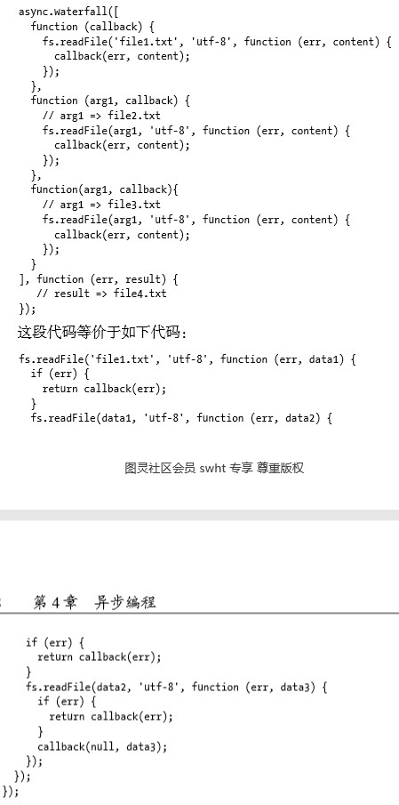

# 《深入浅出NodeJs》学习笔记（四）

## 第4章 异步编程

> 有异步I/O，必有异步编程。 

### 4.1 函数式编程

> 在开始异步编程之前，先得知晓JavaScript现今的回调函数和深层嵌套的来龙去脉。

本小节对 JavaScript 异步编程的基础：函数式编程作一些补充和详解。

#### 4.1.1 高阶函数

高阶函数式可以把函数作为参考，或是将函数作为返回值的函数。

对于传统搞得语言如 c/c++ 而言，通过指针也可以达到相同的效果。但对于程序编写而言，高阶函数要比普通的函数灵活许多。除了通常意义的函数调用返回外，还形成了一种后续传递风格的结果接收方式，而非单一的返回值形式。

```javascript
function foo(x, bar) {
    return bar(x)
}
```

以上面的代码为例，对于相同的`foo`函数，传入的 bar 参数不同，则可以得到不同的结果。

结合 Node 提供的最基本的事件模型可以看到，事件的处理方式正是基于高阶函数的特性来完成的。

#### 4.1.2 偏函数用法

偏函数用法是指创建一个调用另外一个部分——参数或变量已经预置的函数——的函数的用法，下面是一则实例：

```javascript
var toString = Object.prototype.toString
var isString = function (obj) {
    return toString.call(obj) == '[object String]'
}
var isFunction = function (obj) {
    return toString.call(obj) == '[object Function]'
}
// 上面的代码可以通过指定部分参数来产生一个新的定制函数的形式就是偏函数
var isType = function (type) {
    return function (obj) {
        return toString.call(obj) == `[object ${type}]`
    }
}
var isString = isType('String')
var isFunction = isType('Function')
```

以上这种通过指定部分参数来产生一个新的定制函数的形式就是偏函数。

### 4.2 异步编程的优势与难点

> Node利用JavaScript及其内部异步库，将异步直接提升到业务层面，这是一种创新

#### 4.2.1 优势

> Node带来的大特性莫过于基于事件驱动的非阻塞I/O模型，这是它的灵魂所在。非阻塞I/O可以使CPU与I/O并不相互依赖等待，让资源得到更好的利用。对于网络应用而言，并行带来的想象空间更大，延展而开的是分布式和云。并行使得各个单点之间能够更有效地组织起来，这也是Node在云计算厂商中广受青睐的原因
>
> Node 为了解决编程模型中阻塞I/O的性能问题，采用了单线程模型，这导致Node更像一个处理I/O密集问题的能手，而CPU密集型则取决于管家的能耐如何。 
>
> 在第1章中，从斐波那契数列计算的测试结果中可以看到，这个管家具体的能力如何。如果形象地去评判的话，C语言是性能至尊，得益于V8性能的Node则是一流武林高手，在具备武功秘笈的情况下（调用C/C++扩展模块），Node的能力可以逼近顶尖之列。 

#### 4.2.2 难点

1. 异常处理

   由于异步 IO 的实现主要包含两个阶段：提交请求和处理结果。这两个阶段中间有事件循环的调度，两者之间彼此不关联。异步方法则通常在第一个阶段提交请求后立即返回，但异常并不一定发生在这个阶段，try/catch 的效果在这里并不会发挥任何作用。

   ```javascript
   var async = function (callback) {
       process.nextTick(callback)
   }
   try {
       async(callback)
   } catch (e) {
       // TODO
   }
   ```

   调用`async()`方法后，callback 被存放起来，直到下一个事件循环才会取出来执行。而在这里对异步方法采用try/catch 只能捕获当次事件循环，对 callback 执行时抛出的错误无能为力。

   所以 Node 在处理异常上形成了一种约定，**将异常作为回调函数的第一个实参传回，如果为空值，则表明异步调用没有抛出异常**。

   ```javascript
   newAsync(function (err, result) {
       // TODO
   })
   ```

   所以新版的 async 异步方法如下：

   ```javascript
   var newAsync = function (callback) {
       process.nextTick(function () {
           var results = 'something'
           if (error) {
               return callback(error)
           }
           callback(null, results)
       })
   }
   ```

   还有一点要注意的是，在异步方法的编写中，不要对用户传递的回调函数进行异常捕获，只要将异常正确地传递给用户的回调方法即可。

2. 函数嵌套过深

   传说中的回调地狱。

   但可以通过 Promise、async 等高级方法来解决

3. 阻塞代码

   没有 sleep 这样的线程沉睡功能，唯一能达成沉睡类似效果的是下面这样的代码：

   ```javascript
   var start = new Date()
   while (new Date() - start < 1000) {
       //TODO
   }
   ```

   但以上代码只是在表现形式上类似而已，实际上上面这段代码中的 CPU 还是一直在工作，与真正的线程沉睡的效果相去甚远。

4. 多线程编程

   由于前端浏览器存在对标准的滞后性，Web Workers 并没有广泛应用起来，另外虽然 Web Workers 能解决利用 CPU 和减少阻塞UI渲染，但并不能解决 UI 渲染的效率问题。

   Node 借鉴了这个模式，child_process 是基础 API，cluster 模块是更深层次的应用。

5. 异步转同步

   不管异步有多少优点，但是同步需求还是会存在的，Node 提供了绝大部分的异步 API 和少量的同步 API，偶尔出现的同步需求将会因为没有同步 API 让开发者无所适从。

### 4.3 异步编程解决方案

本节将展开各个典型的解决方案：

- 事件发布/订阅模式
- Promise/Deferred 模式
- 流程控制库

#### 4.3.1 事件发布/订阅模式

事件监听器模式是一种广泛用于异步编程的模式，是回调函数的事件化，又称发布/订阅模式。

Node自身提供了一个 events 模块，是发布/订阅模式的一个简单实现。Node 中部分模块都继承自它，该模块拥有以下方法：

- addListener
- on
- once
- removeListener
- removeAllListeners
- emit

事件发布/订阅模式的操作极其简单，示例代码如下：

```javascript
// 订阅
emitter.on('event1', function (message) {
    console.log(message)
})
// 发布
emitter.emit('event1', 'i am message')
```

所以说，订阅事件就是一个高阶函数的应用。事件发布/订阅模式可以实现一个事件与多个回调函数的关联，这些回调函数称为事件监听器。通过 emit() 发布事件后，消息会传递给当前事件的所有侦听器执行。侦听器可以很灵活地添加和删除。

事件发布/订阅模式本身并没有同步和异步调用的问题，但在 Node 中，emit 的调用多半是伴随着事件循环异步触发的。

从另一个角度看，事件侦听器模式也是一种钩子(hook)机制，利用钩子导出内部数据或状态给外部的调用者。通过钩子机制，开发者可以不用关注组件是如何启动和执行的，只需要关注在需要的事件上即可。

此外，**Node对事件发布/订阅机制还做了一些额外的处理**：

- 如果对一个事件添加了超过10个侦听器，将会得到一条警告。调用`emitter.setMaxListeners(0)`可以将这个限制去掉，但设计者认为过多的侦听器可能会导致内存泄漏和过多占用CPU的情况。
- **如果运行期间的错误触发了 error 事件，EventEmitter 会检查是否对 error 事件添加过侦听器。如果添加了，这个错误将会交由侦听器处理，否则这个错误将会作为异常抛出**。如果外部没有捕获这个异常，将会引起线程退出。一个设计良好的程序应该对 error 事件做处理。

1. 继承 events 模块

   以下是 Node 中继承 EventEmitter 类的方式：

   ```javascript
   var evenets = require('events')
   function Stream() {
       events.EventEmitter.call(this)
   }
   util.inherits(Stream, events.EventEmitter)
   ```

   Node 在 util 模块中封装了继承方法，所以此处可以方便的调用。

   > 在Node提供的核心模块中，有近半数都继承自EventEmitter

   

2. 利用事件队列解决雪崩问题

   在事件订阅/发布模式中，通常有一个 once() 方法，通过它添加的侦听器只能执行一次，在执行之后就会将它与事件的关联移除。

   该特性可以帮助我们过滤一些重复性的事件响应。

   以下是一个 SQL 的查询例子，利用 once 方法，我们可以保证在同一个查询从开始到结束的过程中永远只有一次。

   ```javascript
   var proxy = new events.EventEmitter()
   var status = "ready"
   var select = function (callback) {
       proxy.once("selected", callback)
       if (status === "ready") {
           status = "pending"
           db.select("SQL", function (results) {
               proxy.emit("selected", results)
               status = "ready"
           })
       }
   }
   ```

   在 SQL 查询期间，新到来的相同调用只需要在队列中等待数据就绪即可，一旦查询结束，得到的结果就可以被这些调用共同使用。

   > 此处可能因为存在侦听器过多引发的警告，需要调用setMaxListeners(0)移除掉警告，或者设更大的警告阈值。

   

3. 多异步之间的协作方案

   在异步编程中，可能会出现事件与监听器是多对一的情况，也就是一个业务逻辑可能依赖两个回调或事件传递的结果。前面提及的回调嵌套过深的原因就是如此。

   实际开发中，我们的目标是既要享受异步 IO 带来的性能提升，也要保持良好的编码风格。由于多个异步场景中的回调函数的执行并不能保证顺序，且回调函数之间互相没有交集，所以我们需要借助一个第三方函数和第三方变量来处理异步协作的结果。通常我们把这个用于检测次数的变量叫做`哨兵变量`。

   **PS: 效果相当于`Promise.all`的回调版本**

   ```javascript
   // 哨兵变量及函数
   var after = function (times, callback) {
       var count = 0
       var results = {}
       return function (key, value) {
           results[key] = value
           count++
           if (count === times) {
               callback(results)
           }
       }
   }
   // 调用, 一共需调用 10 次，才能触发下一步回调
   var done = after(10, function () {console.log("事件10次触发后调用")})
   ```

#### 4.3.2 Promise / Deferred 模式

本小节介绍Promise,async等ES6中已经实现的方式，在之前的阅读中已详细介绍过，详情可见[这篇博客](https://blog.liubasara.info/#/post/%E4%BD%A0%E4%B8%8D%E7%9F%A5%E9%81%93%E7%9A%84JavaScript%E5%AD%A6%E4%B9%A0%E7%AC%94%E8%AE%B0%EF%BC%88%E4%B8%83%EF%BC%89#%25E7%25AC%25AC3%25E7%25AB%25A0-promise)。

#### 4.3.3 流程控制库

这一节将介绍一些非模式化的应用，虽非规范，但更灵活。

1. 尾触发与Next

   > 在Connect中，尾触发十分适合处理网络请求的场景。将复杂的处理逻辑拆解为简洁、单一 的处理单元，逐层次地处理请求对象和响应对象。  

   

   看不懂，TOREAD

2. async 是 NPM 中最知名的流程控制模块（现同名指令已加入 ES6 豪华午餐，但在功能上却完全不一样）。它的存在可以让异步操作串步执行。

   以下简单介绍 async 库中几个经典 API，其实现原理有待日后阅读：

   - **async.series 用于实现一组任务的串行执行**

     

   - **async.parallel 用于实现一些操作的并行执行**

     

   - **async.waterfall 用于实现后一个函数对前一个函数执行结果有依赖的异步串行需求**

     

3. wind

   另一种完全不同的异步库，大量利用了 eval 函数

   TOREAD

### 4.4 异步并发控制


> 本次阅读至P105 异步并发控制 123