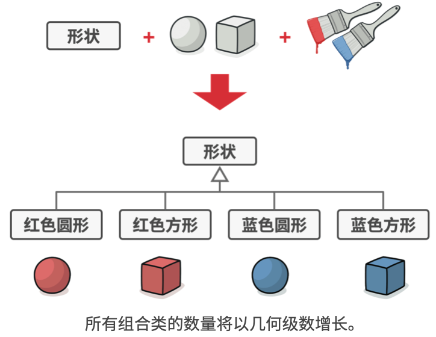
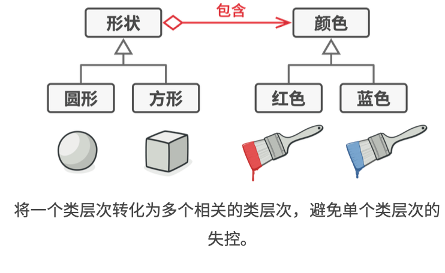
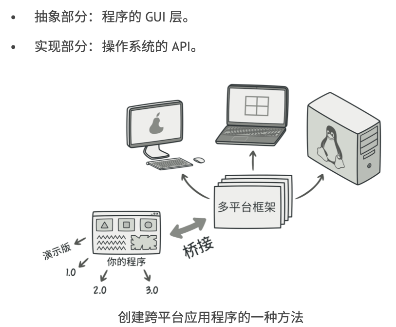
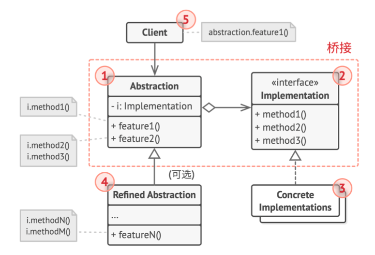
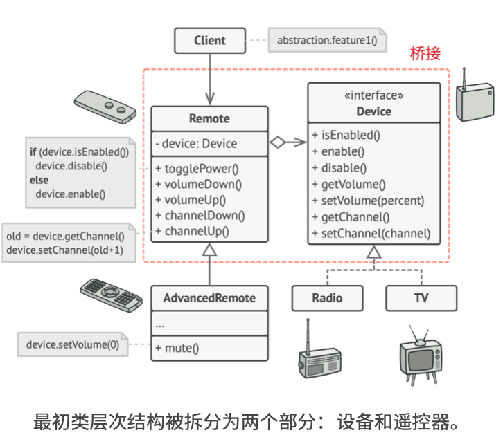

# 《深入设计模式》学习笔记（10）

## 第8章 结构型模式

### 8.2 桥接

桥接模式可将一个大类或一系列紧密相关的类拆分为抽象和实现两个独立的层次结构，从而能在开发的时候分别使用。

#### 问题



在一般的类设计过程中，随着类型的新增，代码的复杂程度会呈现出指数级别的增长。

#### 解决方案

上面问题的根本原因是我们试图在两个独立的维度上面去扩展形状类，而这在处理类继承时是很常见的问题。

桥接模式通过将继承改为组合的方式来解决这个问题，具体来说，就是抽取其中一个维度并使之称为独立的类层次，这样就可以在初始类中引用这个新层次的对象，从而使一个类不必拥有所有状态和行为。



在实际的程序问题中，**抽象部分是图形用户界面**（GUI），而**实现部分则是底层的操作系统代码**（API），GUI 层调用 API 层来对用户的各种操作做出响应。



最后的结果是：无需改动与 API 相关的类就可以修改 GUI 类。如果想支持一个新的操作系统，只需要在实现部分层次中创建一个子类即可。

#### 结构



1. **抽象部分**：提供高层的逻辑控制，依赖于完成底层实际工作的实现对象
2. **实现部分**：为所有具体实现声明通用接口。抽象部分仅能通过在这里声明的方法与实现对象进行交互
3. **具体实现**：其中包括用于特定平台的代码
4. **精确抽象**：提供控制逻辑的变体。与其父类一样，通过通用的实现接口与不同的实现进行交互
5. 通常情况下，客户端仅需要关心抽象部分如何工作，以及将抽象对象和一个实现对象连接起来即可

#### 伪代码



上面的例子中，所有遥控器都通过通用的设备接口与设备进行交互，使得同一个遥控器可以支持不同类型的设备。可以开发独立于设备类的遥控器类，并在其基础上扩展新的功能。客户端代码会通过遥控器的构造函数，将特定种类的遥控器与设备对象连接起来。

> [示例代码](https://refactoringguru.cn/design-patterns/bridge/typescript/example#lang-features)

```typescript
/**
 * The Abstraction defines the interface for the "control" part of the two class
 * hierarchies. It maintains a reference to an object of the Implementation
 * hierarchy and delegates all of the real work to this object.
 */
class Abstraction {
    protected implementation: Implementation;

    constructor(implementation: Implementation) {
        this.implementation = implementation;
    }

    public operation(): string {
        const result = this.implementation.operationImplementation();
        return `Abstraction: Base operation with:\n${result}`;
    }
}

/**
 * You can extend the Abstraction without changing the Implementation classes.
 */
class ExtendedAbstraction extends Abstraction {
    public operation(): string {
        const result = this.implementation.operationImplementation();
        return `ExtendedAbstraction: Extended operation with:\n${result}`;
    }
}

/**
 * The Implementation defines the interface for all implementation classes. It
 * doesn't have to match the Abstraction's interface. In fact, the two
 * interfaces can be entirely different. Typically the Implementation interface
 * provides only primitive operations, while the Abstraction defines higher-
 * level operations based on those primitives.
 */
interface Implementation {
    operationImplementation(): string;
}

/**
 * Each Concrete Implementation corresponds to a specific platform and
 * implements the Implementation interface using that platform's API.
 */
class ConcreteImplementationA implements Implementation {
    public operationImplementation(): string {
        return 'ConcreteImplementationA: Here\'s the result on the platform A.';
    }
}

class ConcreteImplementationB implements Implementation {
    public operationImplementation(): string {
        return 'ConcreteImplementationB: Here\'s the result on the platform B.';
    }
}

/**
 * Except for the initialization phase, where an Abstraction object gets linked
 * with a specific Implementation object, the client code should only depend on
 * the Abstraction class. This way the client code can support any abstraction-
 * implementation combination.
 */
function clientCode(abstraction: Abstraction) {
    // ..

    console.log(abstraction.operation());

    // ..
}

/**
 * The client code should be able to work with any pre-configured abstraction-
 * implementation combination.
 */
let implementation = new ConcreteImplementationA();
let abstraction = new Abstraction(implementation);
clientCode(abstraction);

console.log('');

implementation = new ConcreteImplementationB();
abstraction = new ExtendedAbstraction(implementation);
clientCode(abstraction);
```

#### 适合应用场景

- 想要拆分或重组一个具有多重功能的庞杂类，可以使用桥接模式。

  桥接模式可以将庞杂的类拆分为几个类层次结构，简化代码的维护工作，并将修改已有代码的风险降到最低。

- 如果希望在几个独立的维度上扩展一个类，可使用该模式

- 如果你需要在运行时切换不同的实现方法，可使用桥接模式

  （当然并不是一定要实现这一点，而这一点也是很多人混淆桥接模式和策略模式的主要原因）

#### 实现方式

1. 明确类中维护的维度。独立的概念可能是：
   - 抽象：平台，域，基础设施
   - 实现：前端，后端或接口
2. 了解客户端的业务需求，并在抽象的基类中定义它们
3. 确定所有平台上都可以执行的业务。并在通用实现接口中声明抽象部分所需的业务
4. 为你的域内所有的平台创建实现类，但需要确保它们遵循**实现部分**的接口
5. 在抽象类中添加指向实现类型的引用成员变量。抽象部分会将大部分的工作委派给该成员变量
6. 如果你的高层逻辑有多个变体，则可以通过扩展抽象基类，为每个变体创建一个精确的抽象
7. 客户端代码必须将实现对象传递给抽象部分的构造函数，使其能够互相关联。此后，客户端只需与抽象对象进行交互，而不需和实现对象交互。

#### 优缺点

优点：

- 创建与平台无关的类和程序
- 客户端代码仅仅与高层抽象部分进行互动，不会接触到平台的详细信息
- 开闭原则
- 单一职责原则

缺点：

- 对高内聚的类使用该模式可能会让代码更加复杂

#### 与其他模式的关系

- 桥接通常用于开发前期进行设计，使你能够将程序的各个部分独立开来方便开发，而适配器模式则通常在已有的程序中使用，用于解决不同类的兼容问题。
- 桥接、状态和策略模式的接口非常相似，实际上，它们都基于组合模式——即，将工作委派给其他对象。
- 可以将抽象工厂和桥接搭配使用。如果由桥接定义的抽象只能与特定实现合作，这一模式搭配就非常有用，而抽象工厂可以对这些关系进行封装，并对客户端隐藏其复杂性。
- 可以结合使用生成器和桥接模式：让主管类负责抽象工作，各种不同的生成器负责实现工作。

