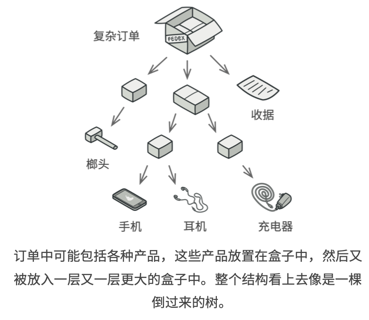
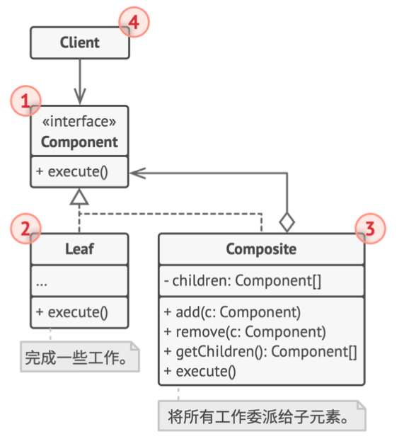
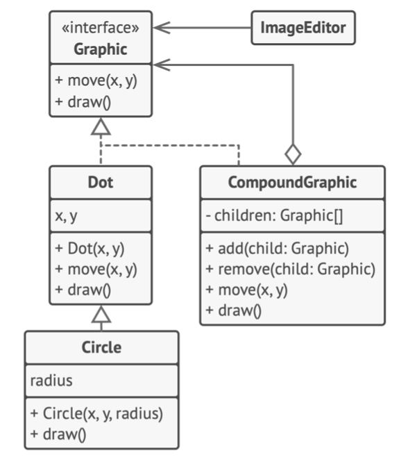

# 《深入设计模式》学习笔记（11）

## 第8章 结构型模式

### 8.3 组合

组合模式可以将对象组合成树状结构，并且能像使用独立对象一样使用它们。

#### 问题

一个应用的核心模型能用树状结构表示，使用组合模式才有价值。



#### 解决方案

组合模式建议使用一个通用接口来与`产品类型`和`盒子类型`进行交互，并且在该接口中声明一个计算总价的方法。

组合模式会以递归方式处理对象树中的所有项目。该方式的最大优点在于你无需了解构成树状结构的对象的具体类，也无需了解对象时简单的产品还是复杂的盒子，只需要调用通用接口以相同的方式对其进行处理即可，当调用该方法后，对象会将请求沿着树结构传递下去。

#### 结构



1. **组件**：接口中描述了树中简单项目和复杂项目所共有的操作

2. **叶节点**：这是树的基本结构，不包含实际的子项目。

   一般情况下，叶节点会最终完成大部分的实际工作，因为它们无法将工作指派给其他部分。

3. **容器**：又名为**组合**（个人理解，其实就是嵌套的父节点），这是包含叶子节点或其他容器等子项目的单位。容器不知道其子项目所属的具体类，它只会通过通用的组件接口与其子项目交互。容器在接收到请求后，会将工作分配给自己的子项目，处理中间结果，然后将最终结果返回给客户端。

4. **客户端**：通过组件接口与所有项目交互。因此，客户端就能以相同方式与树状结构中的简单或者复杂项目进行交互。

> [示例代码](https://refactoringguru.cn/design-patterns/composite/typescript/example#lang-features)

#### 伪代码

下图中，将使用组合模式在图形编辑器中实现一系列的几何图形。



组合图形（CompoundGraphic）是一个容器，它可以由多个包括容器在内的子图形构成。组合图形与简单图形拥有相同的方法，但是组合图形自身并不完成具体的工作，而是将请求递归地传给自己的子项目，然后“汇总”结果。

通过这些图形类所共有的接口，客户端代码就可以与所有的图形互动，而无需与组成该结构的实体类紧密耦合。

```typescript
/**
 * The base Component class declares common operations for both simple and
 * complex objects of a composition.
 */
abstract class Component {
    protected parent: Component;

    /**
     * Optionally, the base Component can declare an interface for setting and
     * accessing a parent of the component in a tree structure. It can also
     * provide some default implementation for these methods.
     */
    public setParent(parent: Component) {
        this.parent = parent;
    }

    public getParent(): Component {
        return this.parent;
    }

    /**
     * In some cases, it would be beneficial to define the child-management
     * operations right in the base Component class. This way, you won't need to
     * expose any concrete component classes to the client code, even during the
     * object tree assembly. The downside is that these methods will be empty
     * for the leaf-level components.
     */
    public add(component: Component): void { }

    public remove(component: Component): void { }

    /**
     * You can provide a method that lets the client code figure out whether a
     * component can bear children.
     */
    public isComposite(): boolean {
        return false;
    }

    /**
     * The base Component may implement some default behavior or leave it to
     * concrete classes (by declaring the method containing the behavior as
     * "abstract").
     */
    public abstract operation(): string;
}

/**
 * The Leaf class represents the end objects of a composition. A leaf can't have
 * any children.
 *
 * Usually, it's the Leaf objects that do the actual work, whereas Composite
 * objects only delegate to their sub-components.
 */
class Leaf extends Component {
    public operation(): string {
        return 'Leaf';
    }
}

/**
 * The Composite class represents the complex components that may have children.
 * Usually, the Composite objects delegate the actual work to their children and
 * then "sum-up" the result.
 */
class Composite extends Component {
    protected children: Component[] = [];

    /**
     * A composite object can add or remove other components (both simple or
     * complex) to or from its child list.
     */
    public add(component: Component): void {
        this.children.push(component);
        component.setParent(this);
    }

    public remove(component: Component): void {
        const componentIndex = this.children.indexOf(component);
        this.children.splice(componentIndex, 1);

        component.setParent(null);
    }

    public isComposite(): boolean {
        return true;
    }

    /**
     * The Composite executes its primary logic in a particular way. It
     * traverses recursively through all its children, collecting and summing
     * their results. Since the composite's children pass these calls to their
     * children and so forth, the whole object tree is traversed as a result.
     */
    public operation(): string {
        const results = [];
        for (const child of this.children) {
            results.push(child.operation());
        }

        return `Branch(${results.join('+')})`;
    }
}

/**
 * The client code works with all of the components via the base interface.
 */
function clientCode(component: Component) {
    // ...

    console.log(`RESULT: ${component.operation()}`);

    // ...
}

/**
 * This way the client code can support the simple leaf components...
 */
const simple = new Leaf();
console.log('Client: I\'ve got a simple component:');
clientCode(simple);
console.log('');

/**
 * ...as well as the complex composites.
 */
const tree = new Composite();
const branch1 = new Composite();
branch1.add(new Leaf());
branch1.add(new Leaf());
const branch2 = new Composite();
branch2.add(new Leaf());
tree.add(branch1);
tree.add(branch2);
console.log('Client: Now I\'ve got a composite tree:');
clientCode(tree);
console.log('');

/**
 * Thanks to the fact that the child-management operations are declared in the
 * base Component class, the client code can work with any component, simple or
 * complex, without depending on their concrete classes.
 */
function clientCode2(component1: Component, component2: Component) {
    // ...

    if (component1.isComposite()) {
        component1.add(component2);
    }
    console.log(`RESULT: ${component1.operation()}`);

    // ...
}

console.log('Client: I don\'t need to check the components classes even when managing the tree:');
clientCode2(tree, simple);
```

#### 适合应用场景

- 如果你需要实现树状对象结构，可以使用组合模式，组合模式提供了两种共享接口的基本元素类型：简单叶节点和复杂容器。容器中可以包含叶子节点和其他容器，这使得你可以构建树状嵌套递归对象结构
- 如果希望客户端代码以相同方式处理简单和复杂元素，可以使用组合模式

#### 实现方式

1. 确保应用的核心模型能够以树状结构表示，并且可以被分解为简单元素和容器。**重要的是，容器必须能够同时包含简单元素和其他容器**。

2. 声明组件接口及其一系列方法，这些方法需要对简单和复杂元素都有意义。

3. 创建一个叶子节点类表示简单元素，程序中可以有多个不同的叶子节点类

4. 创建一个容器类表示复杂元素。在该类中，创建一个**数组成员变量**来存储其对于子元素的引用，该数组必须能够同时保存叶子节点和容器，因此请确保将其声明为组合接口类型。

   实现组件的接口方法时，要记住容器应该将大部分的工作交给其子元素来完成。

5. 最后，在容器中定义添加和删除子元素的方法

   要注意的是，在组件接口中声明这些添加和删除的操作将会违反**接口隔离原则**，因为在这些方法在叶子节点中其实是没有被实现的。但是，这可以让客户端无差别地访问所有元素，因此这是必要的。

#### 优缺点

优点：

- 可以利用多态和递归机制更方便地使用复杂树结构
- 开闭原则，无需修改现有代码，可以在应用中添加新的元素，使其成为对象树的一部分。

缺点：

- 对于功能差异较大的类，提供公共接口或许会有困难，在特定的情况下，需要对于业务组件的接口进行通用化，通常会使其变得令人难以理解。

#### 与其他模式的关系

- 桥接、状态、策略模式的接口都基于组合模式——即将工作委派给其他对象，而他们也解决了各自不同的问题。

- 可以在创建复杂组合树的时候使用生成器，使其构造步骤以递归方式运行。

- 责任链通常和组合模式使用。这种情况下，叶组合接收到请求后，可以将请求沿包含父组件的链一直传递到对象树的底部。

- 你可以使用迭代器来遍历组合树。

- 可以使用访问者对整个组合树执行操作。

- 可以使用享元模式实现组合树的共享叶节点，以节省内存。

- 组合模式和装饰模式的结构图很相似，两者都依赖递归组合来组织无限数量的对象。

  装饰类只有一个子组件，用于为被封装对象添加额外的职责，而组合模式仅对其子节点的结果进行“求和”

  这两种模式也可以互相合作：你可以使用装饰模式来扩展组合树中特定对象的行为

- 大量使用组合模式和装饰模式的设计通常可以从原型模式的使用中受益。可以通过该模式来复制复杂的结构而非从零开始构造。

