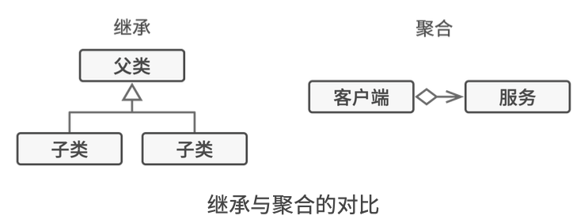
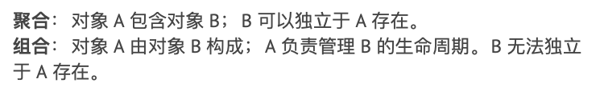
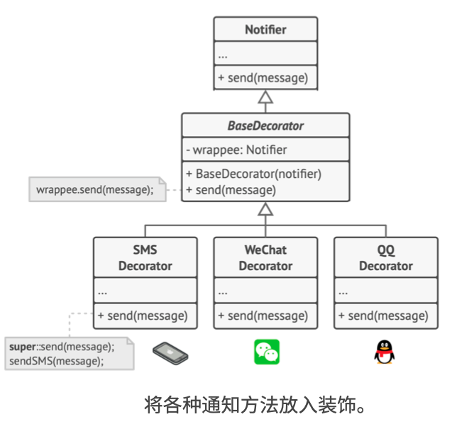
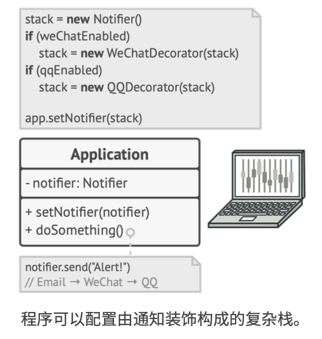
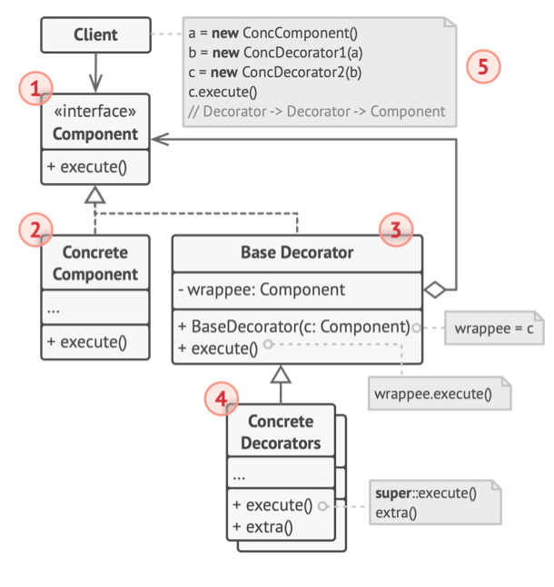

# 《深入设计模式》学习笔记（12）

## 第8章 结构型模式

### 8.4 装饰

装饰模式允许通过将对象放入包含行为的特殊封装对象中来为原对象绑定新的行为。

#### 问题

当你需要更改一个对象的行为时，第一个跳入脑海的想法就是扩展它所属的类，但是继承会引发几个严重的问题：

- 继承是静态的，无法在运行时更改已有对象的行为，只能使用由不同子类创建的对象来替代当前的整个对象。
- 子类只能有一个父类，大部分编程语言不允许一个类同时继承多个类的行为。

#### 解决方案

继承中的对象继承了父类的行为，并由自己完成工作。而为了解决上面继承的问题，其中一种方法是使用**聚合**关系或是**组合**关系来代替继承。两者的工作方式都是用一个对象指向给另一个对象的引用，并将部分工作委派给引用对象。

聚合（或组合）是许多设计模式背后的关键原则（包括装饰器模式在内）。

封装器是装饰模式的别称，这个称为明确地表达了该模式的主要思想。“封装器”是一个能与其他目标对象连接的对象。封装器包含了与目标对象相同的一系列方法，它会将所有接收到的请求委派给目标对象，但是封装器可以在将请求委派给目标前后，对其进行处理，所以可能会改变最终结果。

什么时候一个封装器可以被称为真正的装饰器呢？装饰器实现了与其封装对象相同的接口，从客户端的角度来看，这些对象是完全一样的。

装饰器中的引用成员变量可以是遵循相同接口的任意对象。这使得你可以将一个对象放入多个封装器中，并在对象中添加所有这些封装器的组合行为。

比如下面消息通知的例子，可以将简单邮件通知行为放在基类`Notifier`中，但将所有其他通知方法放入装饰中。

客户端代码将基础的 Notifier 实例放入一系列装饰当中，最后的对象将形成一个栈结构。实际与客户端进行交互的对象将会是最后一个进入栈中的装饰对象，**由于所有的装饰都实现了与 Notifier 类相同的接口**，因此客户端也并不会在意自己是与纯粹的 Notifier 对象交互，还是在于装饰后的对象进行交互。

#### 结构

> 本次阅读至 P189 190   下次阅读应至 203