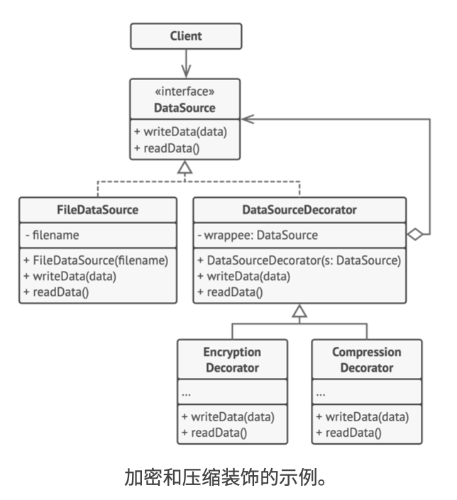

# 《深入设计模式》学习笔记（12）

## 第8章 结构型模式

### 8.4 装饰

装饰模式允许通过将对象放入包含行为的特殊封装对象中来为原对象绑定新的行为。

#### 问题

当你需要更改一个对象的行为时，第一个跳入脑海的想法就是扩展它所属的类，但是继承会引发几个严重的问题：

- 继承是静态的，无法在运行时更改已有对象的行为，只能使用由不同子类创建的对象来替代当前的整个对象。
- 子类只能有一个父类，大部分编程语言不允许一个类同时继承多个类的行为。

#### 解决方案

继承中的对象继承了父类的行为，并由自己完成工作。而为了解决上面继承的问题，其中一种方法是使用**聚合**关系或是**组合**关系来代替继承。两者的工作方式都是用一个对象指向给另一个对象的引用，并将部分工作委派给引用对象。

聚合（或组合）是许多设计模式背后的关键原则（包括装饰器模式在内）。


封装器是装饰模式的别称，这个称为明确地表达了该模式的主要思想。“封装器”是一个能与其他目标对象连接的对象。封装器包含了与目标对象相同的一系列方法，它会将所有接收到的请求委派给目标对象，但是封装器可以在将请求委派给目标前后，对其进行处理，所以可能会改变最终结果。

什么时候一个封装器可以被称为真正的装饰器呢？装饰器实现了与其封装对象相同的接口，从客户端的角度来看，这些对象是完全一样的。

装饰器中的引用成员变量可以是遵循相同接口的任意对象。这使得你可以将一个对象放入多个封装器中，并在对象中添加所有这些封装器的组合行为。

比如下面消息通知的例子，可以将简单邮件通知行为放在基类`Notifier`中，但将所有其他通知方法放入装饰中。


客户端代码将基础的 Notifier 实例放入一系列装饰当中，最后的对象将形成一个栈结构。实际与客户端进行交互的对象将会是最后一个进入栈中的装饰对象，**由于所有的装饰都实现了与 Notifier 类相同的接口**，因此客户端也并不会在意自己是与纯粹的 Notifier 对象交互，还是在于装饰后的对象进行交互。


#### 结构


1. **部件**：声明封装器和封装对象的公用接口
2. **具体部件**：被封装对象所属的类。它定义了基础行为，但装饰类可以改变这些行为
3. **基础装饰**：拥有一个指向被封装对象的引用成员变量。该变量的类型应当被声明为通用部件的接口，这样它就可以引用具体的部件和装饰。装饰基类会将所有的操作委派给被封装的对象。
4. **具体装饰类**：定义了可动态添加到部件的额外行为。具体的装饰类将会重写装饰类方法，并在调用父类方法之前或之后进行额外的行为。
5. **客户端**：可以使用多层装饰来封装部件，只要它能使用通用接口与所有对象互动即可。

#### 伪代码

> [示例代码](https://refactoringguru.cn/design-patterns/decorator/typescript/example#lang-features)

```typescript
/**
 * The base Component interface defines operations that can be altered by
 * decorators.
 */
interface Component {
    operation(): string;
}

/**
 * Concrete Components provide default implementations of the operations. There
 * might be several variations of these classes.
 */
class ConcreteComponent implements Component {
    public operation(): string {
        return 'ConcreteComponent';
    }
}

/**
 * The base Decorator class follows the same interface as the other components.
 * The primary purpose of this class is to define the wrapping interface for all
 * concrete decorators. The default implementation of the wrapping code might
 * include a field for storing a wrapped component and the means to initialize
 * it.
 */
class Decorator implements Component {
    protected component: Component;

    constructor(component: Component) {
        this.component = component;
    }

    /**
     * The Decorator delegates all work to the wrapped component.
     */
    public operation(): string {
        return this.component.operation();
    }
}

/**
 * Concrete Decorators call the wrapped object and alter its result in some way.
 */
class ConcreteDecoratorA extends Decorator {
    /**
     * Decorators may call parent implementation of the operation, instead of
     * calling the wrapped object directly. This approach simplifies extension
     * of decorator classes.
     */
    public operation(): string {
        return `ConcreteDecoratorA(${super.operation()})`;
    }
}

/**
 * Decorators can execute their behavior either before or after the call to a
 * wrapped object.
 */
class ConcreteDecoratorB extends Decorator {
    public operation(): string {
        return `ConcreteDecoratorB(${super.operation()})`;
    }
}

/**
 * The client code works with all objects using the Component interface. This
 * way it can stay independent of the concrete classes of components it works
 * with.
 */
function clientCode(component: Component) {
    // ...

    console.log(`RESULT: ${component.operation()}`);

    // ...
}

/**
 * This way the client code can support both simple components...
 */
const simple = new ConcreteComponent();
console.log('Client: I\'ve got a simple component:');
clientCode(simple);
console.log('');

/**
 * ...as well as decorated ones.
 *
 * Note how decorators can wrap not only simple components but the other
 * decorators as well.
 */
const decorator1 = new ConcreteDecoratorA(simple);
const decorator2 = new ConcreteDecoratorB(decorator1);
console.log('Client: Now I\'ve got a decorated component:');
clientCode(decorator2);
```



本例中，装饰模式能够对敏感数据进行压缩和加密，从而将数据从使用数据的代码中独立出来。

#### 适合应用场景

- 如果你希望在无需修改代码的情况下即可使用对象，且希望在运行时为对象新增额外的行为，则可以使用装饰模式。

- 如果用继承来扩展对象行为的方案难以实现或根本不可行，则可以使用该模式。

  有许多语言会使用`final`关键字来限制对某个类进行进一步的扩展。复用最终类已有行为的唯一方法时使用装饰器模式。

#### 实现方式

1. 确保业务逻辑可以用一个基本组件以及多个额外的可选层次来表示。
2. 找出基本组件和可选层次的通用方法。创建一个组件接口并在其中声明这些方法。
3. 创建一个具体组件类，并定义其基础行为。
4. 创建装饰基类，使用一个成员变量存储指向被封装对象的引用。该成员变量必须声明为组件接口类型，从而能在运行时连接具体的组件和装饰。装饰基类必须将所有工作委派给被封装的对象。
5. 确保所有的类实现组件接口。
6. 将装饰基类扩展为具体的装饰。具体的装饰必须在调用父类方法之前或之后执行自身的行为。
7. 客户端代码负责装饰并将其组合成客户端所需要的形式

#### 优缺点

优点：

- 无需创建新的子类即可扩展对象的行为
- 可以在运行时添加或删除对象的功能
- 可以用多个装饰封装对象来组合几种行为
- 单一职责原则。可以将实现了许多不同行为的一个大类拆分为多个较小的类

缺点：

- 在封装器栈中，要删除特定的封装器会比较困难
- 实现一个行为不受装饰栈顺序影响的装饰会比较困难
- 各层的初始化配置代码看上去可能会很糟糕

#### 与其他模式的关系

- 适配器可以对已有对象的接口进行修改，装饰器模式则能在不改变对象接口的前提下强化对象功能，此外装饰器模式支持递归组合，而适配器模式则做不到。

- 适配器模式为被封装对象提供不同的接口，代理模式则提供相同的接口，装饰器模式则能提供加强的接口。

- 责任链和装饰模式的类结构很像，两者都依赖递归组合将需要执行的操作传给一系列对象。但责任链的管理者可以相互独立地执行一切操作，还可以随时停止传递请求。而装饰器模式则是在遵循基本接口的情况下扩展对象的行为，也无法中断请求的传递。

- 组合模式和装饰器模式的结构也很像，二者都依赖递归组合来组织不限数量的对象。但装饰器不同的是它只有一个子组件，且，组合模式仅对其子节点的对象返回的结果进行了“求和”，但装饰器则为封装对象添加了额外的职责。

  当然两个模式之间也可以互相合作，你可以使用装饰器来扩展组合树中特定对象的行为。

- 大量使用**组合**和**装饰**的设计通常可以从**原型**模式中获益，可以通过该模式来复制复杂结构，而非从零开始构造。

- 装饰模式和代理模式都有着相似的结构，但是其意图却非常不同。两个模式的构建都基于组合原则，但两者的不同之处在于，代理模式通常**自行管理**其服务对象的生命周期，而装饰器的生成则总是由客户端进行控制。

