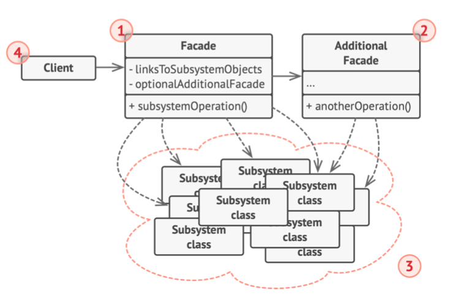

# 《深入设计模式》学习笔记（13）

## 第8章 结构型模式

### 8.5 外观

外观模式能为程序库、框架或其他复杂类提供一个简单的接口。

#### 问题

如果必须在代码中使用某个复杂的库或框架中的众多对象。正常情况下，客户端需要负责所有对象的初始化工作、管理其依赖关系并按正确的顺序执行方法等，而最终，程序中类的业务逻辑将会和第三方类的实现细节紧密耦合，使得理解和维护代码的工作很难进行。

#### 解决方案

外观类可以为复杂子系统提供一个简单啊的接口。与直接调用子系统相比，外观提供的功能比较有限，但却包含了客户端真正关心的功能。（PS：不就是把基础组件二次封装一下吗...）

如果程序需要与包含几十种功能的复杂库整合，却只需要使用其中非常少的功能，那么使用外观模式就会很方便。

#### 结构



1. **外观**：该类提供一种访问特定子系统功能的便捷方式，了解如何重定向客户端的请求，知道如何操作一切第三方库。
2. **附加外观**：该类可以避免多种不相关的功能污染单一外观，使其又变成一个复杂结构，客户端和其他外观都可以使用附加外观。
3. **复杂子系统**：由数十个不同的对象而构成，子系统类不会意识到外观的存在。
4. **客户端**：使用外观对象代替对子系统对象的直接调用。

#### 伪代码

> [示例代码](https://refactoringguru.cn/design-patterns/facade/typescript/example#lang-features)

```typescript
/**
 * The Facade class provides a simple interface to the complex logic of one or
 * several subsystems. The Facade delegates the client requests to the
 * appropriate objects within the subsystem. The Facade is also responsible for
 * managing their lifecycle. All of this shields the client from the undesired
 * complexity of the subsystem.
 */
class Facade {
    protected subsystem1: Subsystem1;

    protected subsystem2: Subsystem2;

    /**
     * Depending on your application's needs, you can provide the Facade with
     * existing subsystem objects or force the Facade to create them on its own.
     */
    constructor(subsystem1: Subsystem1 = null, subsystem2: Subsystem2 = null) {
        this.subsystem1 = subsystem1 || new Subsystem1();
        this.subsystem2 = subsystem2 || new Subsystem2();
    }

    /**
     * The Facade's methods are convenient shortcuts to the sophisticated
     * functionality of the subsystems. However, clients get only to a fraction
     * of a subsystem's capabilities.
     */
    public operation(): string {
        let result = 'Facade initializes subsystems:\n';
        result += this.subsystem1.operation1();
        result += this.subsystem2.operation1();
        result += 'Facade orders subsystems to perform the action:\n';
        result += this.subsystem1.operationN();
        result += this.subsystem2.operationZ();

        return result;
    }
}

/**
 * The Subsystem can accept requests either from the facade or client directly.
 * In any case, to the Subsystem, the Facade is yet another client, and it's not
 * a part of the Subsystem.
 */
class Subsystem1 {
    public operation1(): string {
        return 'Subsystem1: Ready!\n';
    }

    // ...

    public operationN(): string {
        return 'Subsystem1: Go!\n';
    }
}

/**
 * Some facades can work with multiple subsystems at the same time.
 */
class Subsystem2 {
    public operation1(): string {
        return 'Subsystem2: Get ready!\n';
    }

    // ...

    public operationZ(): string {
        return 'Subsystem2: Fire!';
    }
}

/**
 * The client code works with complex subsystems through a simple interface
 * provided by the Facade. When a facade manages the lifecycle of the subsystem,
 * the client might not even know about the existence of the subsystem. This
 * approach lets you keep the complexity under control.
 */
function clientCode(facade: Facade) {
    // ...

    console.log(facade.operation());

    // ...
}

/**
 * The client code may have some of the subsystem's objects already created. In
 * this case, it might be worthwhile to initialize the Facade with these objects
 * instead of letting the Facade create new instances.
 */
const subsystem1 = new Subsystem1();
const subsystem2 = new Subsystem2();
const facade = new Facade(subsystem1, subsystem2);
clientCode(facade);
```

#### 适合应用场景

- 如果需要一个指向复杂子系统的直接接口，且该接口的功能有限，可以使用外观模式。

- 如果需要将子系统组织为多层结构，可以使用外观模式。

  你可以要求子系统仅使用外观模式来进行交互，以减少子系统之间的耦合。

#### 实现方式

1. 考虑能否在现有子系统的基础上提供一个更加简单的接口。如果该接口能让客户端代码独立于众多的子系统类，那么该方向就是正确的。
2. 在一个新的外观类中声明并实现该接口。将客户端的调用重定向到子系统相应的地方。
3. 如要充分发挥这一模式的有时，必须确保所有的客户端代码仅仅通过外观来与子系统进行交互。此后，客户端代码将不会受到任何由子系统代码修改而造成的影响，开发者仅需要修改外观中的代码即可。
4. 如果外观类变得过于臃肿，可以考虑将其部分行为抽取为一个新的专用外观类。

#### 优缺点

优点：

- 可以让自己的代码独立于复杂子系统

缺点：

- 外观可能成为与程序中所有类都耦合的上帝对象

#### 与其他模式的关系

- 外观模式为现有对象定义了一个**新接口**，**适配器**模式则会试图运用已有的接口。适配器通常只封装了一个对象，而外观通常会作用于整个对象子系统上。
- 当只需要对客户端隐藏子系统创建对象的方式，可以使用**抽象工厂**来代替**外观模式**
- 享元模式展示了如何生成大量的小型对象，外观模式则展示了如何用一个对象来代表整个子系统。
- 外观模式和中介者模式的职责类似：它们都在尝试在大量紧密耦合的类中进行组织。
  - 外观模式会定义一个简单接口，但是它并不提供任何新功能，各组件可以直接进行交流
  - 中介者会将系统中的组件的沟通行为中心化，各组件只会知道中介者对象，无法直接相互交流
- 外观模式通常可以转换为单例类，因为在大部分情况下，一个外观对象就足够了。
- 外观与代理的相似之处在于它们都缓存了一个复杂实体并自行对其进行初始化。不同的是，代理模式与其服务对象遵循同一接口，使得自己和服务对象可以互换。