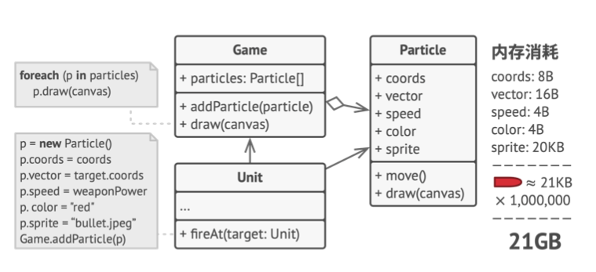
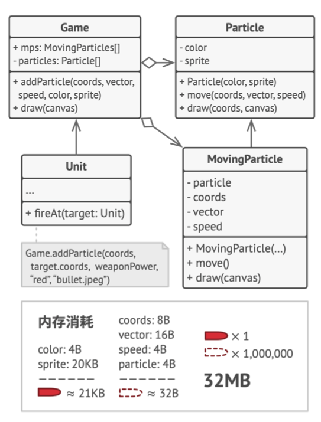
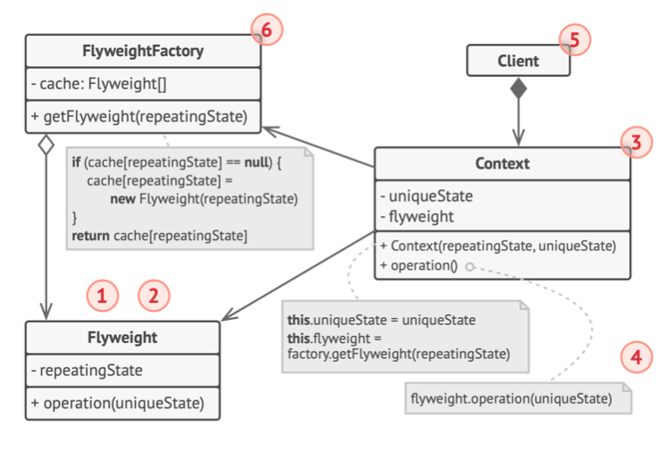

# 《深入设计模式》学习笔记（14）

## 第8章 结构型模式

### 8.6 享元

享元摒弃了在每个对象中保存所有数据的方式，通过共享多个对象所公有的相同状态，让你能够在有限的内存容量中载入更多的对象。

#### 问题

享元模式通常用于解决内存容量不足的问题，对于所存储的数据变量几乎一样的类型来说，无限制在内存中载入这些类型的对象，很容易导致程序的崩溃。

#### 解决方案

对象的常量数据通常被称为内在状态，其位于对象中，其他对象只能读取但不能修改其数值。而对象的其他状态常常能被其他对象“从外部”改变，因此被称为外在状态。

**享元模式建议不要在对象中存储外在的状态，而是将其传递给依赖于它的一个特殊方法**。程序只在对象中保存内在状态，以方便在不同情景下重用。这些对象的区别仅在于其内在状态，因此所需要生成的对象数量会大大削减。

而内在状态会被移动到享元对象中，一个享元大对象会被上千个情境小对象复用，因此无需再重复存储数千个大对象的数据。换言之，**一个仅能存储内在状态的对象就被称为享元**。

#### 享元与不可变性

享元类对象由于可以在不同的情境中使用，则必须确保其状态不能被修改。享元类的状态只能由构造函数的参数进行一次性的初始化。

#### 享元工厂

为了能更方便地访问各种享元，可以创建一个工厂方法来管理已有享元对象的缓存池。工厂方法从客户端处接收目标享元对象的**内在状态作为参数**，如果它能在缓存池中找到所需享元，则将其返回给客户端；如果没有找到，它就会创建一个享元，并将其添加到缓存池中。

#### 结构

1. 享元模式只是一种优化，在使用之前，要确定程序中存在于大量类似对象同时占用内存消耗问题，并且确保该问题无法使用其他更好的方式解决。
2. **享元**：该类包含原始对象中部分能在多个对象中共享的状态，享元中存储的状态被称为“内在状态”。传递给享元方法的状态被称为“外在状态”。
3. **情景**：该类中包含原始对象中各不相同的外在状态，情景与享元对象组合在一起，就能表示原始对象的全部状态。
4. 通常情况下，原始对象的行为会保留在享元类中。因此调用享元方法必须提供部分外在状态来作为参数，但也可以将它们移入情景类中，将享元对象作为单纯的数据对象。
5. **享元工厂**：会对已有的享元的缓存池进行管理。有了工厂以后，客户端可以无需直接创建享元，而只需要调用工厂并向其传递一些享元的内在状态即可。

#### 伪代码

> 本次阅读至 P214 215   下次阅读应至 228