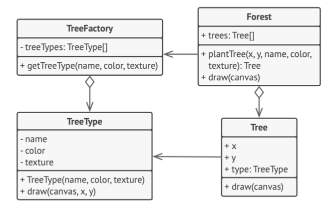

# 《深入设计模式》学习笔记（14）

## 第8章 结构型模式

### 8.6 享元

享元摒弃了在每个对象中保存所有数据的方式，通过共享多个对象所公有的相同状态，让你能够在有限的内存容量中载入更多的对象。

#### 问题

享元模式通常用于解决内存容量不足的问题，对于所存储的数据变量几乎一样的类型来说，无限制在内存中载入这些类型的对象，很容易导致程序的崩溃。


#### 解决方案

对象的常量数据通常被称为内在状态，其位于对象中，其他对象只能读取但不能修改其数值。而对象的其他状态常常能被其他对象“从外部”改变，因此被称为外在状态。

**享元模式建议不要在对象中存储外在的状态，而是将其传递给依赖于它的一个特殊方法**。程序只在对象中保存内在状态，以方便在不同情景下重用。这些对象的区别仅在于其内在状态，因此所需要生成的对象数量会大大削减。


而内在状态会被移动到享元对象中，一个享元大对象会被上千个情境小对象复用，因此无需再重复存储数千个大对象的数据。换言之，**一个仅能存储内在状态的对象就被称为享元**。

#### 享元与不可变性

享元类对象由于可以在不同的情境中使用，则必须确保其状态不能被修改。享元类的状态只能由构造函数的参数进行一次性的初始化。

#### 享元工厂

为了能更方便地访问各种享元，可以创建一个工厂方法来管理已有享元对象的缓存池。工厂方法从客户端处接收目标享元对象的**内在状态作为参数**，如果它能在缓存池中找到所需享元，则将其返回给客户端；如果没有找到，它就会创建一个享元，并将其添加到缓存池中。

#### 结构


1. 享元模式只是一种优化，在使用之前，要确定程序中存在于大量类似对象同时占用内存消耗问题，并且确保该问题无法使用其他更好的方式解决。
2. **享元**：该类包含原始对象中部分能在多个对象中共享的状态，享元中存储的状态被称为“内在状态”。传递给享元方法的状态被称为“外在状态”。
3. **情景**：该类中包含原始对象中各不相同的外在状态，情景与享元对象组合在一起，就能表示原始对象的全部状态。
4. 通常情况下，原始对象的行为会保留在享元类中。因此调用享元方法必须提供部分外在状态来作为参数，但也可以将它们移入情景类中，将享元对象作为单纯的数据对象。
5. **享元工厂**：会对已有的享元的缓存池进行管理。有了工厂以后，客户端可以无需直接创建享元，而只需要调用工厂并向其传递一些享元的内在状态即可。

#### 伪代码



本例中，使用享元模式能够有效减少在画布上渲染数百万个树状对象时所需的内存。该模式从主要的`Tree`类中抽取内在状态，并将其移动到享元类`TreeType`之中。

> [示例代码](https://refactoringguru.cn/design-patterns/flyweight/typescript/example#lang-features)

```typescript
/**
 * The Flyweight stores a common portion of the state (also called intrinsic
 * state) that belongs to multiple real business entities. The Flyweight accepts
 * the rest of the state (extrinsic state, unique for each entity) via its
 * method parameters.
 */
class Flyweight {
    private sharedState: any;

    constructor(sharedState: any) {
        this.sharedState = sharedState;
    }

    public operation(uniqueState): void {
        const s = JSON.stringify(this.sharedState);
        const u = JSON.stringify(uniqueState);
        console.log(`Flyweight: Displaying shared (${s}) and unique (${u}) state.`);
    }
}

/**
 * The Flyweight Factory creates and manages the Flyweight objects. It ensures
 * that flyweights are shared correctly. When the client requests a flyweight,
 * the factory either returns an existing instance or creates a new one, if it
 * doesn't exist yet.
 */
class FlyweightFactory {
    private flyweights: {[key: string]: Flyweight} = <any>{};

    constructor(initialFlyweights: string[][]) {
        for (const state of initialFlyweights) {
            this.flyweights[this.getKey(state)] = new Flyweight(state);
        }
    }

    /**
     * Returns a Flyweight's string hash for a given state.
     */
    private getKey(state: string[]): string {
        return state.join('_');
    }

    /**
     * Returns an existing Flyweight with a given state or creates a new one.
     */
    public getFlyweight(sharedState: string[]): Flyweight {
        const key = this.getKey(sharedState);

        if (!(key in this.flyweights)) {
            console.log('FlyweightFactory: Can\'t find a flyweight, creating new one.');
            this.flyweights[key] = new Flyweight(sharedState);
        } else {
            console.log('FlyweightFactory: Reusing existing flyweight.');
        }

        return this.flyweights[key];
    }

    public listFlyweights(): void {
        const count = Object.keys(this.flyweights).length;
        console.log(`\nFlyweightFactory: I have ${count} flyweights:`);
        for (const key in this.flyweights) {
            console.log(key);
        }
    }
}

/**
 * The client code usually creates a bunch of pre-populated flyweights in the
 * initialization stage of the application.
 */
const factory = new FlyweightFactory([
    ['Chevrolet', 'Camaro2018', 'pink'],
    ['Mercedes Benz', 'C300', 'black'],
    ['Mercedes Benz', 'C500', 'red'],
    ['BMW', 'M5', 'red'],
    ['BMW', 'X6', 'white'],
    // ...
]);
factory.listFlyweights();

// ...

function addCarToPoliceDatabase(
    ff: FlyweightFactory, plates: string, owner: string,
    brand: string, model: string, color: string,
) {
    console.log('\nClient: Adding a car to database.');
    const flyweight = ff.getFlyweight([brand, model, color]);

    // The client code either stores or calculates extrinsic state and passes it
    // to the flyweight's methods.
    flyweight.operation([plates, owner]);
}

addCarToPoliceDatabase(factory, 'CL234IR', 'James Doe', 'BMW', 'M5', 'red');

addCarToPoliceDatabase(factory, 'CL234IR', 'James Doe', 'BMW', 'X1', 'red');

factory.listFlyweights();
```

#### 适用应用场景

- 仅在程序必须支持大量对象，且没有足够的内存容量时，才会使用享元模式。

  享元模式在下列情况中最有效：

  - 程序需要生成数量巨大的相似对象
  - 容易耗尽目标设备的所有内存
  - 对象中包含可抽取且能在多个对象间共享的重复状态

#### 实现方式

1. 将需要改写为享元的类成员变量拆分为两个部分
   - 内在状态：包含不变的，可在许多对象中重复使用的数据的成员变量
   - 外在状态：包含每个对象各自不同的情景数据的成员变量
2. 保留类中表示内在状态的成员变量，并将其属性设置为不可修改。这些变量仅可以在构造函数初始化时获得初始数值。
3. 找到所有使用外在状态成员变量的方法，为在方法中所用的每个成员变量新建一个参数，并使用该参数代替成员变量。
4. 你可以有选择地创建工厂类类管理享元缓存池，它负责在新建享元时检查已有的享元。如果选择使用工厂，那么客户端就应该只通过工厂来请求享元，并将享元的内在状态作为参数传递给工厂。
5. 客户端必须存储和计算外在状态（情景）的数值，只有这样才能调用享元对象的方法，外在状态和引用享元的成员变量可以移动到单独的情景类。

#### 优缺点

优点：

- 如果程序中有很多相似对象，那么你将可以节省大量的内存。

缺点：

- 可能需要牺牲执行速度来换取内存，因为每次调用享元方法时可能都会需要重新计算部分的情景数据。
- 代码会变得更加复杂，“为什么这个地方要拆分出来一个实体状态？”这类问题会变多。

#### 与其他模式的关系

- 可以使用享元模式实现组合模式中树的共享叶节点用以节省内存
- 享元模式用于生成大量的小型对象，外观模式则展示了如何用一个对象来代表这个子系统
- 如果能将对象的所有共享状态简化为一个，那享元模式便和单例模式有些类似，但两个模式其实有根本的不同。
  1. 只会有一个单例实体，但享元类可以有多个实体，各实体的内在状态也可以不同。
  2. 单例对象是可变的。享元对象是不可变的。

