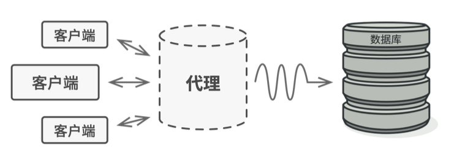
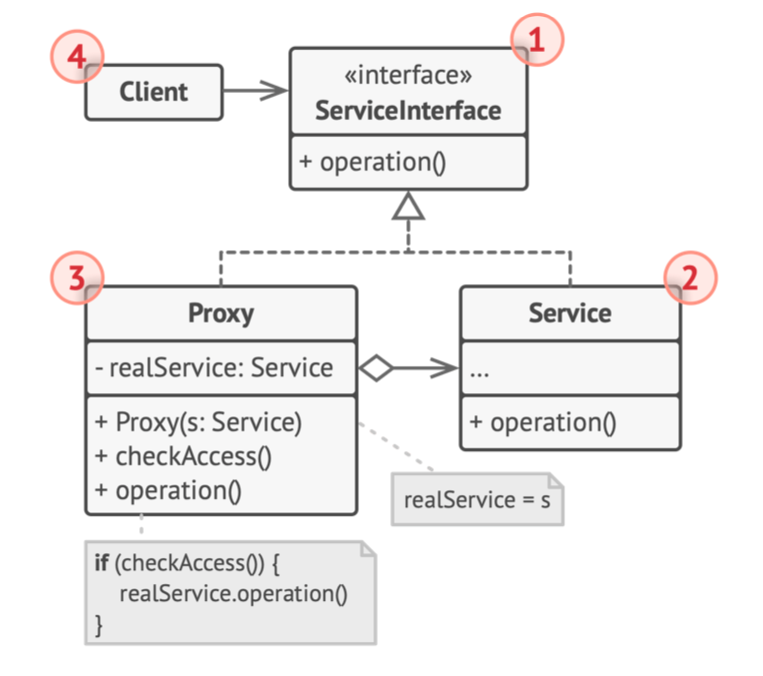
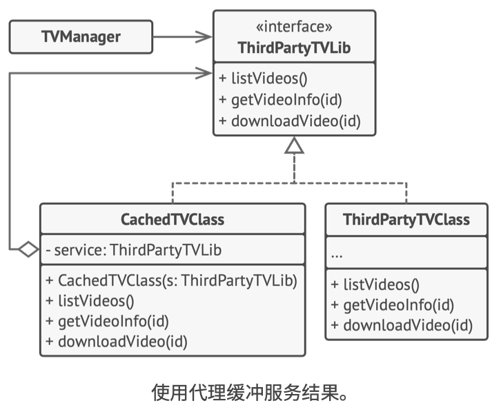

# 《深入设计模式》学习笔记（15）

## 第8章 结构型模式

### 8.7 代理

代理是一种能够提供对象的替代品或其占位符的设计模式，代理对象控制着对于原对象的访问，代理控制着对于原对象的访问，并允许在将请求提交给对象前后进行一些处理。

#### 问题

为什么要控制对于某个对象的访问呢？有一些操作，与业务代码无关，又或是无法直接将这些操作放到第三方封闭库里面，这时候就需要使用代理模式。

#### 解决方案

代理模式建议新建一个与原服务对象接口相同的代理类，然后更新应用以将代理对象传递给所有原始对象客户端，而代理类在接收到客户端的请求以后，将会创建实际的服务对象，并将所有工作委派给它。



代理可以将自己伪装成目标对象，可在客户端或被代理对象无感知的情况下处理延迟初始化、缓存查询结果等工作。

这样做的好处是，无需修改类就能在主要业务逻辑前后执行一些工作，由于代理实现的接口与原类相同，因此你可以将其传递给任何一个使用实际服务对象的客户端。

#### 结构



1. **服务接口**：该类声明了服务接口，代理必须遵循该接口才能伪装成服务对象。
2. **服务**：该类提供了一些实用的业务逻辑。
3. **代理**：该类包含一个指向服务对象的引用成员变量。代理在完成其额外的任务之后（比如延迟初始化，记录日志，访问控制，缓存等等）会将请求传递给真正的对象。通常情况下，代理会对其代理的服务对象进行整个生命周期的管理。（PS：个人觉得这里的 Proxy 和 Service 的关系应该是**组合**，因为会管理 Service 的生命周期，而不是**聚合**）
4. **客户端**：能通过同一接口与服务或代理进行交互，所以客户端可以在一切需要服务对象的代码中使用代理。

#### 伪代码



上图的结构演示了在使用第三方腾讯视频的程序库时，使用代理模式为其添加延迟初始化和缓存功能。

程序库提供了视频下载类，但是该类的效率非常低，如果客户端程序多次请求同一个视频，会造成重复下载而不会将首次下载的文件缓存下来使用。

代理模式可以实现原下载器接口的同时，保存所有文件的下载记录，如果程序多次请求同一文件，它将会返回缓存的文件，否则便将所有工作委派给原下载器。

```typescript
/**
 * The Subject interface declares common operations for both RealSubject and the
 * Proxy. As long as the client works with RealSubject using this interface,
 * you'll be able to pass it a proxy instead of a real subject.
 */
interface Subject {
    request(): void;
}

/**
 * The RealSubject contains some core business logic. Usually, RealSubjects are
 * capable of doing some useful work which may also be very slow or sensitive -
 * e.g. correcting input data. A Proxy can solve these issues without any
 * changes to the RealSubject's code.
 */
class RealSubject implements Subject {
    public request(): void {
        console.log('RealSubject: Handling request.');
    }
}

/**
 * The Proxy has an interface identical to the RealSubject.
 */
class Proxy implements Subject {
    private realSubject: RealSubject;

    /**
     * The Proxy maintains a reference to an object of the RealSubject class. It
     * can be either lazy-loaded or passed to the Proxy by the client.
     */
    constructor(realSubject: RealSubject) {
        this.realSubject = realSubject;
    }

    /**
     * The most common applications of the Proxy pattern are lazy loading,
     * caching, controlling the access, logging, etc. A Proxy can perform one of
     * these things and then, depending on the result, pass the execution to the
     * same method in a linked RealSubject object.
     */
    public request(): void {
        if (this.checkAccess()) {
            this.realSubject.request();
            this.logAccess();
        }
    }

    private checkAccess(): boolean {
        // Some real checks should go here.
        console.log('Proxy: Checking access prior to firing a real request.');

        return true;
    }

    private logAccess(): void {
        console.log('Proxy: Logging the time of request.');
    }
}

/**
 * The client code is supposed to work with all objects (both subjects and
 * proxies) via the Subject interface in order to support both real subjects and
 * proxies. In real life, however, clients mostly work with their real subjects
 * directly. In this case, to implement the pattern more easily, you can extend
 * your proxy from the real subject's class.
 */
function clientCode(subject: Subject) {
    // ...

    subject.request();

    // ...
}

console.log('Client: Executing the client code with a real subject:');
const realSubject = new RealSubject();
clientCode(realSubject);

console.log('');

console.log('Client: Executing the same client code with a proxy:');
const proxy = new Proxy(realSubject);
clientCode(proxy);
```

#### 适合应用场景

使用代理模式的方式多种多样，来看看最常见的几种。

- 延迟初始化（虚拟代理）。如果你有一个偶尔使用的重量级服务对象，一直保持该对象运行运行会消耗系统资源时，可使用代理模式，将该对象的初始化延迟到真正需要的时候。

- 访问控制（保护代理）。如果你只希望特定客户端使用服务对象，这里的对象可以是操作系统中非常重要的部分，而客户端则是各种已启动的程序（包括恶意程序），此时可使用代理模式。

- 本地执行远程服务（远程代理）。适用于服务对象位于远程服务器上的情形。这种情形下，代理模式会通过网络传递客户端请求，负责处理所有与网络相关的复杂细节。

- 记录日志请求（日志记录代理）。适用于当你需要保存对于服务对象的请求历史记录时。代理可以在向服务传递请求前进行记录。

  代理可对重复请求所需要的相同结果进行缓存，还可以使用请求参数作为索引缓存的键值。

- 智能引用。可以在没有客户端使用某个重量级对象时立即销毁该对象。代理会将所有获取了代理对象的客户端进行记录，然后时不时地遍历这些客户端，检查其服务对象是否仍在运行，如果客户端列表为空，代理就可以销毁该被代理对象，释放底层的系统资源。

  此外，代理可以记录这些客户端是否修改了被服务的对象，如果没有修改，则其他客户端可以复用同一个对象。

#### 实现方式

1. 如果没有现成的服务接口，就需要创建一个接口来实现代理和服务对象的可交换性。因为需要对服务的所有客户端进行修改，从服务类中抽取接口并非总是可行的，备选的计划是将代理作为服务类的子类，这样代理就可以继承服务的所有接口了。
2. 创建代理类，其中必须包含一个指向被代理对象的成员变量。代理类在通常情况下，必须对该被代理对象的整个生命周期进行管理，而在一些特殊情况下，客户端会通过构造函数将服务传递给代理。
3. 根据需求实现代理方法。在大部分情况下，代理类会在完成一些任务之后将工作委派给服务对象。
4. 可以考虑新建一个构建方法来判断客户端可获取的是代理还是实际服务。可以在代理类中创建一个简单的静态方法，也可以创建一个完整的工厂方法。
5. 可以考虑为被代理的服务对象实现延迟初始化。

#### 优缺点

优点：

- 可以在客户端毫无察觉的情况下控制服务对象。
- 如果客户端对服务对象的生命周期没有特殊要求，你可以对生命周期进行管理。
- 即使服务对象还未准备好或者不存在，代理也可以正常工作
- 开闭原则。可以在不对服务类和客户端进行修改的情况下创建新代理。

缺点：

- 代码可能会变得复杂，因为需要新建许多的类
- 服务响应可能会延迟

#### 与其他模式的关系

- 适配器模式为被封装对象提供不同的接口，代理模式则提供相同的接口，装饰器模式则能提供加强的接口。
- 外观与代理的相似之处在于它们都缓存了一个复杂实体并自行初始化。但代理和他的被代理服务对象遵循同一接口，使得自己可以和被代理服务对象互换，在这一点上与外观模式不同。
- 装饰和代理有着相似的结构，但意图却不同，虽然两个模式的构建都基于组合原则，但代理模式通常会自行管理其服务对象的生命周期，而装饰模式则总是由客户端自行进行控制。