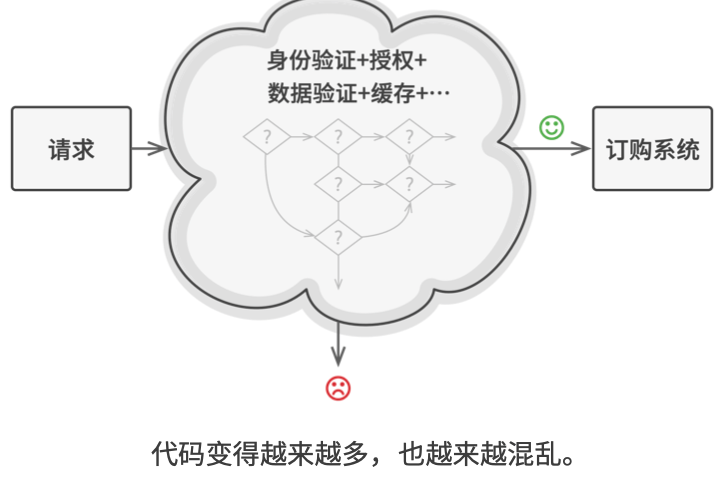
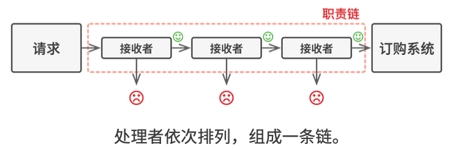
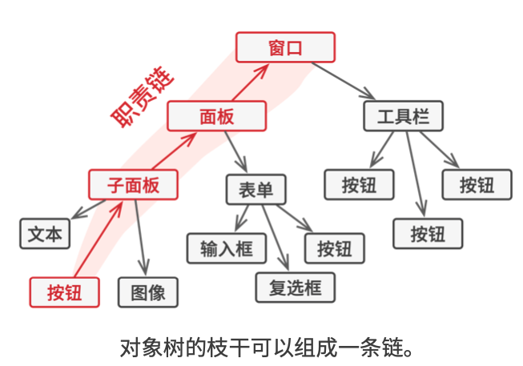
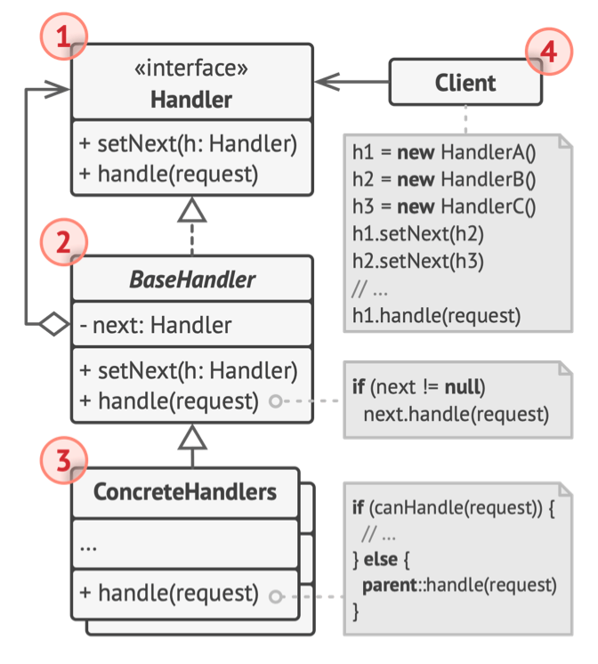
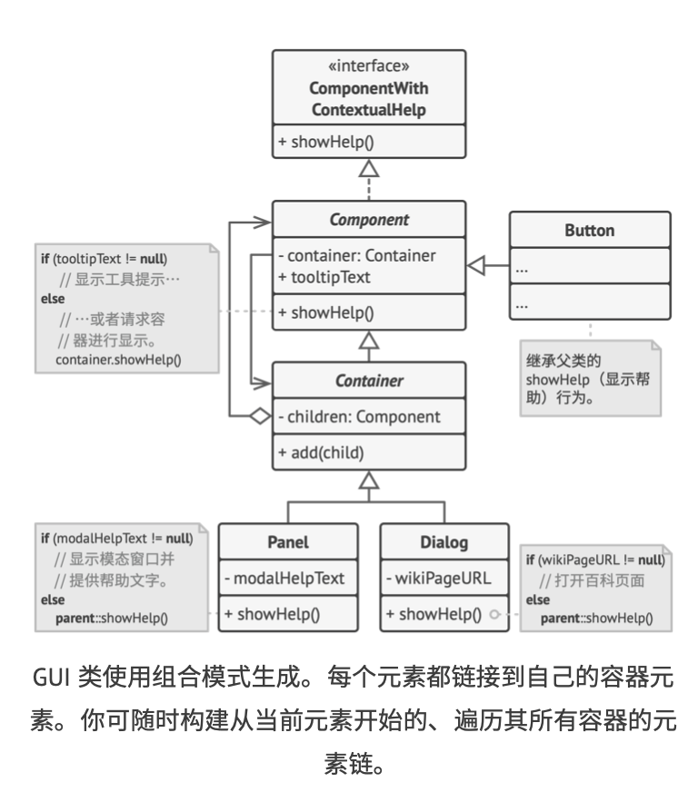

# 《深入设计模式》学习笔记（16）

## 第9章 行为模式

行为模式用于负责对象间的高效沟通，以及职责委派。本章包含如下模式：

- 责任链：允许将请求沿着处理者链进行发送。收到请求后，每个处理者均可对请求进行处理，或者将其传递给链上的下个处理者。
- 命令：允许将请求转换为一个独立对象，该对象包含与请求相关的所有信息，能够让你根据不同的请求将方法参数化，或是延迟请求，或是将它放入队列中，且能实现可撤销操作。
- 迭代器：能让你在不暴露集合底层表现形式的情况下遍历集合中所有的元素。
- 中介者：能让你减少对象之间混乱无序的依赖关系，限制对象之间的交互迫使它们通过一个中介者对象进行合作。
- 备忘录：允许在不暴露对象实现细节的情况下保存和恢复对象之前的状态
- 观察者：允许定义一种订阅机制，在对象的事件发生时通知多个“观察”该对象的其他对象。
- 状态：让你在一个对象的内部状态变化时改变其行为，使其看上去就像是改变了自身所属的类一样。
- 策略：能让你定义一系列算法，并将每种算法分别放入独立的类中，以使算法的对象能够互相替换。
- 模板方法：在超类中定义一个算法的框架，允许子类在不修改结构的情况下重写算法的特定步骤。
- 访问者：将算法与其所作用的对象隔离开来

### 9.1 责任链

责任链是一种行为设计模式，允许将请求沿着处理者链进行发送。收到请求后，每个处理者均可对请求进行处理，或将其传递给链上的下一个处理者。

#### 问题

责任链模式在很多时候会用于校验的检查系统，在传统的校验逻辑中，多重步骤的校验往往会导致逻辑变得很复杂。



#### 解决方案

与许多其他行为设计模式一样，责任链会将特定行为转换为一种名为**处理者**的独立对象。每个检查步骤都可以被抽取为仅有单个方法的类，并且执行检查操作。请求及其数据则会被作为参数传递给该方法。

这些处理者连成一条链以后，请求会在这条链上移动，让所有的处理者都有机会对其进行处理，而最重要的是，处理者可以决定不再沿着链继续传递请求，从而高效地取消所有的后续步骤。





在这种模式下，所有的处理者类均实现统一接口，每个具体的处理者仅仅关心下一个包含`excute`执行方法的处理者，这样就可以使用不同的处理者来创建链，而无需将相关的代码与处理者的具体类进行耦合了。

#### 结构



1. **处理者**：声明了所有具体处理者的通用接口。该接口通常包含单个方法`handle`用于请求处理，有时也会包含一个`setNext`方法用于设置链的下一个处理者。
2. **基础处理者**：这是一个可选的类，可以将所有的处理者共用的样本放在这里面。该类还可以实现默认的处理行为：确定下个处理者确实存在以后，再将请求传递给它。
3. **具体处理者**：包含处理请求的实际代码。每个处理者接收到请求后，都必须决定是否进行处理，以及是否沿着链传递请求。
4. **客户端**：可以根据程序逻辑一次性地或者动态地生成链，且请求可以发给链上的任何一个处理者，而无需从第一个开始。

#### 伪代码

> [示例代码](https://refactoringguru.cn/design-patterns/chain-of-responsibility/typescript/example#lang-features)

```typescript
/**
 * The Handler interface declares a method for building the chain of handlers.
 * It also declares a method for executing a request.
 */
interface Handler {
    setNext(handler: Handler): Handler;

    handle(request: string): string;
}

/**
 * The default chaining behavior can be implemented inside a base handler class.
 */
abstract class AbstractHandler implements Handler
{
    private nextHandler: Handler;

    public setNext(handler: Handler): Handler {
        this.nextHandler = handler;
        // Returning a handler from here will let us link handlers in a
        // convenient way like this:
        // monkey.setNext(squirrel).setNext(dog);
        return handler;
    }

    public handle(request: string): string {
        if (this.nextHandler) {
            return this.nextHandler.handle(request);
        }

        return null;
    }
}

/**
 * All Concrete Handlers either handle a request or pass it to the next handler
 * in the chain.
 */
class MonkeyHandler extends AbstractHandler {
    public handle(request: string): string {
        if (request === 'Banana') {
            return `Monkey: I'll eat the ${request}.`;
        }
        return super.handle(request);

    }
}

class SquirrelHandler extends AbstractHandler {
    public handle(request: string): string {
        if (request === 'Nut') {
            return `Squirrel: I'll eat the ${request}.`;
        }
        return super.handle(request);
    }
}

class DogHandler extends AbstractHandler {
    public handle(request: string): string {
        if (request === 'MeatBall') {
            return `Dog: I'll eat the ${request}.`;
        }
        return super.handle(request);
    }
}

/**
 * The client code is usually suited to work with a single handler. In most
 * cases, it is not even aware that the handler is part of a chain.
 */
function clientCode(handler: Handler) {
    const foods = ['Nut', 'Banana', 'Cup of coffee'];

    for (const food of foods) {
        console.log(`Client: Who wants a ${food}?`);

        const result = handler.handle(food);
        if (result) {
            console.log(`  ${result}`);
        } else {
            console.log(`  ${food} was left untouched.`);
        }
    }
}

/**
 * The other part of the client code constructs the actual chain.
 */
const monkey = new MonkeyHandler();
const squirrel = new SquirrelHandler();
const dog = new DogHandler();

monkey.setNext(squirrel).setNext(dog);

/**
 * The client should be able to send a request to any handler, not just the
 * first one in the chain.
 */
console.log('Chain: Monkey > Squirrel > Dog\n');
clientCode(monkey);
console.log('');

console.log('Subchain: Squirrel > Dog\n');
clientCode(squirrel);
```




#### 适合应用场景


> 本次阅读至 P248 249  下次阅读应至 262