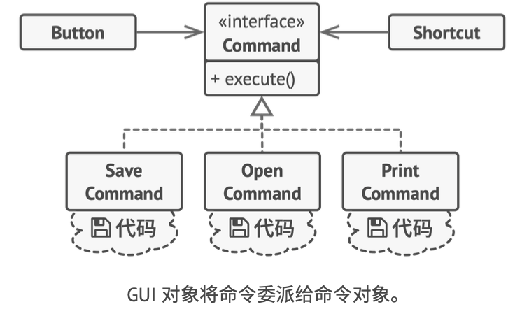

# 《深入设计模式》学习笔记（17）

## 第9章 行为模式

### 9.2 命令

命令模式可将请求转换为，一个包含与请求相关的所有信息的独立对象。这个转换让你能够根据不同的请求将方法参数化、延迟请求执行，或是将其放入队列中，并且实现可撤销操作。

#### 问题


以界面 GUI 开发为例，在开发初期，一般会将业务逻辑与 GUI 的显示逻辑耦合，而这样做会直接导致开发到后期，业务代码中的一些同样的功能会被复制成多份代码，分别放在不同的 GUI 组件中。若需要复用，甚至会让两个不相关的组件相互依赖，而这是比复制代码更糟糕的选择。

#### 解决方案

优秀的软件设计会将关注点进行分离，从而导致软件的分层。比如上面的例子，就可以分成两层：

- 一层负责用户图像界面，负责渲染图形，捕获所有输入并显示结果
- 另一层负责业务逻辑

当需要完成一些重要工作时，GUI 层会将工作委派给业务逻辑底层。

具体落实到代码中看，就是一个 GUI 对象传递一些参数，来调用一个业务逻辑对象，这个过程又称为一个对象发送**请求**给另一个对象。


而命令模式建议 GUI 对象不要直接提交这些请求，而是将请求的所有细节（例如调用的对象、方法名称和参数列表）抽取出来组成命令类，该类中仅仅包含一个用于触发请求的方法。

命令对象用于负责连接不同的 GUI 和业务逻辑对象，而 GUI 对象则无需了解业务逻辑对象是否获得了请求，也无需了解其对请求进行处理的方式，只要触发命令即可。


然后让所有命令实现相同的接口，**该接口通常只有一个没有任何参数的执行方法**，让你能够在不和具体命令类耦合的情况下，使用统一请求发送者来执行不同的命令。但是如果没有任何参数的话，要如何将请求的详情发送给接收者呢？答案是：**使用数据对命令进行预先配置，或者让其能够自行获取数据**。



#### 结构


1. **发送者**：也称为触发者，负责对请求进行初始化，必须包含一个成员变量来存储对于命令对象的引用。发送者并不负责创建命令，它通常会通过构造函数从客户端处获得预先生成的命令，然后触发。
2. **命令**：接口，通常仅声明一个执行命令的方法。
3. **具体命令**：会实现各种类型的请求，调用业务逻辑对象 Receiver，命令简单的时候也可能直接与 Receiver 进行合并。
4. **接收者**：包含部分业务逻辑，几乎任何对象都可以作为接收者，用于完成实际的业务逻辑
5. **客户端**：会创建并配置具体的命令对象。客户端需要将包括接收者实体在内的所有请求参数传递给命令的构造函数。此后，生成的命令就可以与一个或者多个发送者相关联了。

#### 伪代码


```typescript
/**
 * The Command interface declares a method for executing a command.
 */
interface Command {
    execute(): void;
}

/**
 * Some commands can implement simple operations on their own.
 */
class SimpleCommand implements Command {
    private payload: string;

    constructor(payload: string) {
        this.payload = payload;
    }

    public execute(): void {
        console.log(`SimpleCommand: See, I can do simple things like printing (${this.payload})`);
    }
}

/**
 * However, some commands can delegate more complex operations to other objects,
 * called "receivers."
 */
class ComplexCommand implements Command {
    private receiver: Receiver;

    /**
     * Context data, required for launching the receiver's methods.
     */
    private a: string;

    private b: string;

    /**
     * Complex commands can accept one or several receiver objects along with
     * any context data via the constructor.
     */
    constructor(receiver: Receiver, a: string, b: string) {
        this.receiver = receiver;
        this.a = a;
        this.b = b;
    }

    /**
     * Commands can delegate to any methods of a receiver.
     */
    public execute(): void {
        console.log('ComplexCommand: Complex stuff should be done by a receiver object.');
        this.receiver.doSomething(this.a);
        this.receiver.doSomethingElse(this.b);
    }
}

/**
 * The Receiver classes contain some important business logic. They know how to
 * perform all kinds of operations, associated with carrying out a request. In
 * fact, any class may serve as a Receiver.
 */
class Receiver {
    public doSomething(a: string): void {
        console.log(`Receiver: Working on (${a}.)`);
    }

    public doSomethingElse(b: string): void {
        console.log(`Receiver: Also working on (${b}.)`);
    }
}

/**
 * The Invoker is associated with one or several commands. It sends a request to
 * the command.
 */
class Invoker {
    private onStart: Command;

    private onFinish: Command;

    /**
     * Initialize commands.
     */
    public setOnStart(command: Command): void {
        this.onStart = command;
    }

    public setOnFinish(command: Command): void {
        this.onFinish = command;
    }

    /**
     * The Invoker does not depend on concrete command or receiver classes. The
     * Invoker passes a request to a receiver indirectly, by executing a
     * command.
     */
    public doSomethingImportant(): void {
        console.log('Invoker: Does anybody want something done before I begin?');
        if (this.isCommand(this.onStart)) {
            this.onStart.execute();
        }

        console.log('Invoker: ...doing something really important...');

        console.log('Invoker: Does anybody want something done after I finish?');
        if (this.isCommand(this.onFinish)) {
            this.onFinish.execute();
        }
    }

    private isCommand(object): object is Command {
        return object.execute !== undefined;
    }
}

/**
 * The client code can parameterize an invoker with any commands.
 */
const invoker = new Invoker();
invoker.setOnStart(new SimpleCommand('Say Hi!'));
const receiver = new Receiver();
invoker.setOnFinish(new ComplexCommand(receiver, 'Send email', 'Save report'));

invoker.doSomethingImportant();
```

#### 适合应用场景

- 如果需要通过操作来操作化参数，可以使用命令模式。

- 想要将不同的操作放入队列中、延迟操作的执行或者远程执行操作，可以使用命令模式。

- 如果想要实现操作回滚功能，可以使用命令模式。

  为了能够回滚操作，需要实现关于已执行操作的历史记录功能，而命令历史记录是一种包含所有已执行命令对象及其相关程序状态备份的栈结构。可以使用**备忘录**模式来在一定程度上解决这个问题，但备份状态可能会占用大量内存，因此，有时可能会需要借助命令模式。

  命令模式无需恢复原始状态，而是执行反向操作，但这种操作也有代价：它可能会很难甚至无法实现。

#### 实现方式

（PS：个人理解，其实这个模式就是着重于业务与通常逻辑的解耦，只要在写的时候，将业务逻辑的调用当做是后台的接口，单独剥离出来，使用异步的方式调用，其实就很大程度上实现了命令模式了）

1. 声明仅有一个执行方法的命令接口。
2. 抽取请求并使之称为实现命令接口的具体命令类。每个类都必须有一组成员变量来保存请求参数和对于实际接收者对象的引用。所有这些变量的数值都必须通过命令构造函数进行初始化。
3. 找到担任发送者的类。在这些类中添加保存命令的成员变量，发送者只能通过命令接口与其命令进行交互，发送者自身并不创建对象，而是通过客户端代码获取。
4. 修改发送者使其执行命令，而非直接将请求发送给接收者。
5. 客户端必须按照以下顺序来初始化对象：
   1. 创建接收者
   2. 创建命令，如有需要将其关联至接收者
   3. 创建发送者并将其与特定的命令相关联

#### 优缺点

优点：

- 单一职责原则。可以解耦触发和执行操作的类。
- 开闭原则。可以在不修改已有客户端代码的情况下在程序中创建新的命令
- 可以实现撤销和恢复功能
- 可以实现操作的延迟执行
- 可以将一组简单命令组合成一个复杂命令

缺点：

- 代码可能会变得更复杂，因为在发送者和接收者之间增加了一个全新的层次。

#### 与其他模式的关系

- 责任链、命令、中介者、观察者都可用于处理请求发送者和接收者之间的不同连接方式：
  - 责任链按照顺序将请求动态传递给一系列潜在接收者，直至有一名接收者对其进行处理
  - 命令模式则在发送者和请求者之间建立单向连接。
  - 中介者模式清除了发送者和请求者之间的直接连接，强制它们通过一个中介对象进行间接沟通。
  - 观察者模式允许接收者动态地订阅或取消接收请求
- 责任链的管理者可以用命令模式实现。
- 可以同时使用命令模式和备忘录模式来实现“撤销”操作。
- 命令模式和策略模式看上去很像，都是通过某些行为来参数化对象，但它们的意图有很大的不同：
  - 命令模式用于将任何操作转换为对象，操作的参数将成为对象的成员变量。
  - 策略模式则用于描述完成某件事的不同方式，让你能够在同一个上下文的类中切换算法。
- 原型模式可用于保存命令模式的历史记录
- 可以将访问者模式视为命令模式的加强版本，其对象可对不同类的多种对象执行操作。