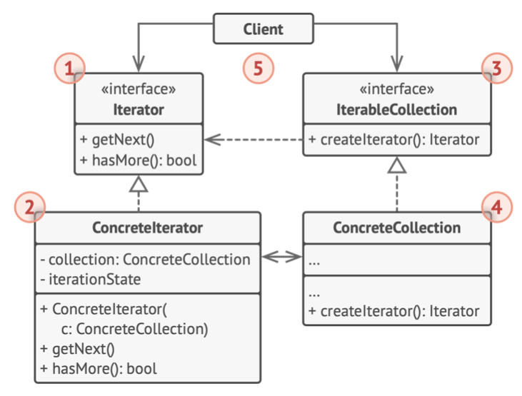

# 《深入设计模式》学习笔记（18）

## 第9章 行为模式

### 9.3 迭代器

迭代器模式让你能在不暴露集合底层表现形式的情况下（可能是列表，栈和树等等）遍历集合中的所有元素。

#### 问题

集合是编程中最常用的数据类型之一。虽然大部分的集合使用简单列表存储元素。但有些集合还会使用栈、图和其他复杂的数据结构。

无论使用什么构成方式，集合都应该某种访问元素的方式，以及提供一种能够遍历元素的方式，且保证它不会周而复始地访问同一个元素。

客户端代码并不关心存储数据的方式，不断向集合中添加不同的遍历算法，会模糊其“高效存储数据”的主要职责。

#### 解决方案

迭代器模式的主要思想是将集合的遍历行为抽取为单独的迭代器对象。


除了实现算法外，迭代器还封装了遍历操作的所有细节，例如当前位置和末尾剩余元素的数量。多个迭代器可以在相互独立的情况下同时访问集合。

所有迭代器必须实现相同的接口，这样一来只要有合适的迭代器，客户端代码就能兼容任何类型的集合或遍历算法。如果需要采用特殊方式来遍历集合，只需要创建一个新的迭代器类即可，而无需对集合或客户端进行修改。

#### 结构



1. **迭代器**：该接口声明了遍历集合所需要的操作。
2. **具体迭代器**：实现遍历集合的一种特定算法。通过跟踪自身遍历的进度，使得多个迭代器可以相互独立地遍历同一集合。
3. **集合**：接口声明一个或多个方法来获取与集合兼容的迭代器。这些返回方法所返回的类型必须被声明为迭代器接口。也就是说，具体结合可以返回各种不同种类的迭代器。
4. **具体集合**：会在客户端请求迭代器的时候返回一个特定的迭代器类实体
5. **客户端**：通过集合和迭代器的接口与二者进行交互，这样一来客户端无需与具体的类进行偶，也可以使用不同的集合和迭代器。

#### 伪代码


> [示例代码](https://refactoringguru.cn/design-patterns/iterator/typescript/example#lang-features)

```typescript
/**
 * Iterator Design Pattern
 *
 * Intent: Lets you traverse elements of a collection without exposing its
 * underlying representation (list, stack, tree, etc.).
 */

interface Iterator<T> {
    // Return the current element.
    current(): T;

    // Return the current element and move forward to next element.
    next(): T;

    // Return the key of the current element.
    key(): number;

    // Checks if current position is valid.
    valid(): boolean;

    // Rewind the Iterator to the first element.
    rewind(): void;
}

interface Aggregator {
    // Retrieve an external iterator.
    getIterator(): Iterator<string>;
}

/**
 * Concrete Iterators implement various traversal algorithms. These classes
 * store the current traversal position at all times.
 */

class AlphabeticalOrderIterator implements Iterator<string> {
    private collection: WordsCollection;

    /**
     * Stores the current traversal position. An iterator may have a lot of
     * other fields for storing iteration state, especially when it is supposed
     * to work with a particular kind of collection.
     */
    private position: number = 0;

    /**
     * This variable indicates the traversal direction.
     */
    private reverse: boolean = false;

    constructor(collection: WordsCollection, reverse: boolean = false) {
        this.collection = collection;
        this.reverse = reverse;

        if (reverse) {
            this.position = collection.getCount() - 1;
        }
    }

    public rewind() {
        this.position = this.reverse ?
            this.collection.getCount() - 1 :
            0;
    }

    public current(): string {
        return this.collection.getItems()[this.position];
    }

    public key(): number {
        return this.position;
    }

    public next(): string {
        const item = this.collection.getItems()[this.position];
        this.position += this.reverse ? -1 : 1;
        return item;
    }

    public valid(): boolean {
        if (this.reverse) {
            return this.position >= 0;
        }

        return this.position < this.collection.getCount();
    }
}

/**
 * Concrete Collections provide one or several methods for retrieving fresh
 * iterator instances, compatible with the collection class.
 */
class WordsCollection implements Aggregator {
    private items: string[] = [];

    public getItems(): string[] {
        return this.items;
    }

    public getCount(): number {
        return this.items.length;
    }

    public addItem(item: string): void {
        this.items.push(item);
    }

    public getIterator(): Iterator<string> {
        return new AlphabeticalOrderIterator(this);
    }

    public getReverseIterator(): Iterator<string> {
        return new AlphabeticalOrderIterator(this, true);
    }
}

/**
 * The client code may or may not know about the Concrete Iterator or Collection
 * classes, depending on the level of indirection you want to keep in your
 * program.
 */
const collection = new WordsCollection();
collection.addItem('First');
collection.addItem('Second');
collection.addItem('Third');

const iterator = collection.getIterator();

console.log('Straight traversal:');
while (iterator.valid()) {
    console.log(iterator.next());
}

console.log('');
console.log('Reverse traversal:');
const reverseIterator = collection.getReverseIterator();
while (reverseIterator.valid()) {
    console.log(reverseIterator.next());
}
```

#### 适合应用场景

- 集合背后为复杂的数据结构，且希望对客户端隐藏其复杂性时。
- 希望减少程序中重复的遍历代码时。
- 希望代码能够遍历不同的甚至是无法预知的数据结构，就可以使用迭代器模式。

#### 实现方式

1. 声明迭代器接口，至少提供一个方法来获取集合中的下一个元素。
2. 声明集合接口并描述一个获取迭代器的方法`createIterator`，其返回值必须是迭代器接口。
3. 为集合实现具体的迭代器类，并让迭代器对象在构造函数中与具体的集合进行连接。
4. 在集合类中实现集合接口，主要思想是针对特定集合为客户端代码提供创建特定迭代器的快捷方式。
5. 检查客户端代码，使用迭代器替代所有集合遍历代码。每当客户端需要遍历集合元素时都会获取一个新的迭代器。

#### 优缺点

优点：

- 单一职责原则。
- 开闭原则。
- 可以并行遍历同一集合，每个迭代器都是独立的
- 可以随时暂停遍历并在需要时继续

缺点：

- 如果集合很简单，使用该模式会有些矫枉过正
- 对于某些特殊集合，使用迭代器可能比直接遍历效率更低

#### 与其他模式的关系

- 可以使用迭代器来遍历组合模式的树。
- 可以同时使用工厂方法和迭代器模式来让子类返回不同类型的迭代器
- 可以同时使用备忘录和迭代器来获取当前迭代器的状态，并在需要时回滚
- 可以同时使用访问者和迭代器来遍历复杂数据结构，并对其中的元素执行所需操作。

