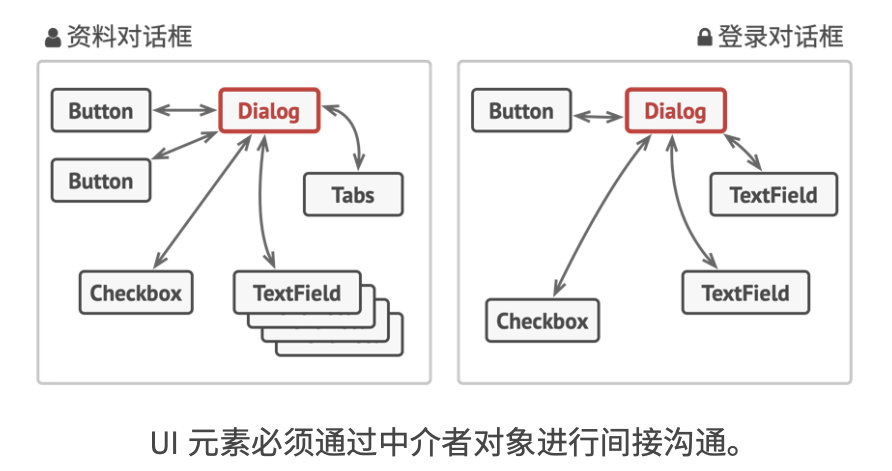
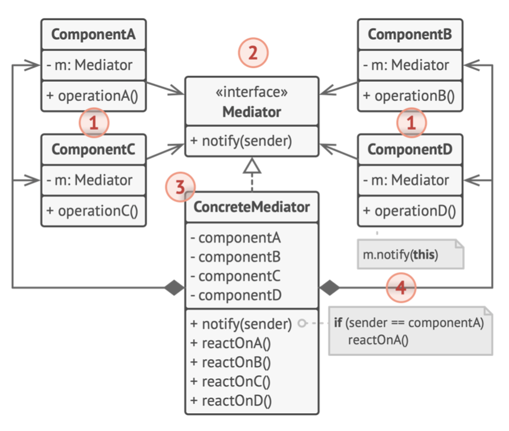
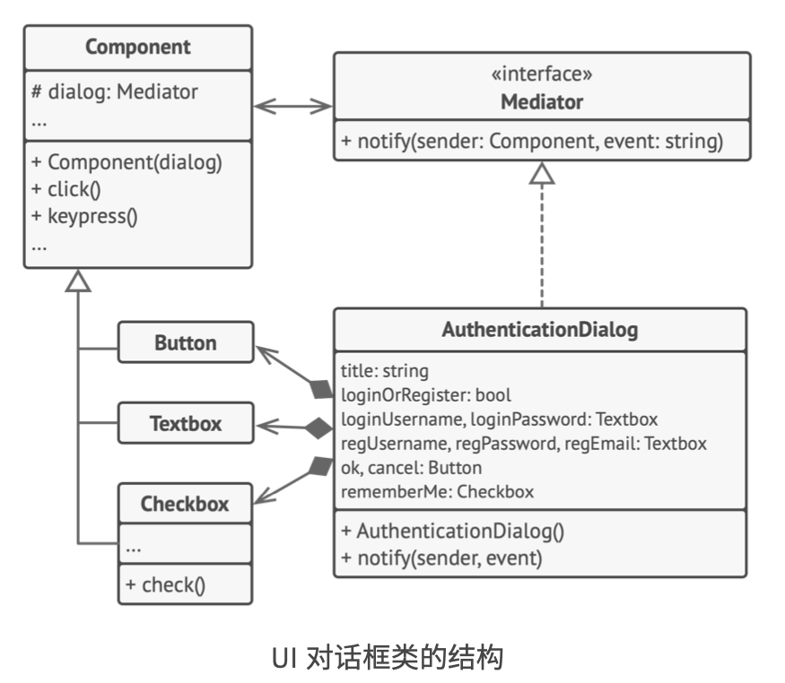

# 《深入设计模式》学习笔记（19）

## 第9章 行为模式

### 9.4 中介者

中介者模式能让你减少对象之间混乱无序的依赖关系，该模式会限制对象之间的直接交互，迫使它们通过一个中介者对象进行合作。

#### 问题

各种控件之间的互动的业务逻辑，如果直接在控件相关的代码里面实现的话，将很难在其他的组件中复用这些控件。一旦这样做了，要么只能使用整体的所有类，要么一个都不用。

#### 解决方案

中介者模式建议你停止组件之间的直接交流，并使其相互独立。这些组件必须调用特殊的中介者对象，通过中介者对象重定向来调用行为，以间接的方式进行合作。最终，组件仅仅只会依赖于一个中介者类，而无需与多个其他组件耦合。



这样一来，组件与组件之间可以不再相关联，而仅仅依赖于必须的类。

中介者模式能够在单个中介者对象中封装多个对象间的复杂关系。使得类所拥有的的依赖关系越少，就越容易修改，扩展或复用。

#### 结构



1. **组件**：这是各种包含业务逻辑的类。每个组件都有一个指向中介者的引用，该引用被声明为中介者接口类型。组件不知道中介者具体的类，因此你可以将它连接到不同的中介者中使其能在程序中复用。
2. **中介者**：接口声明了与组件交流的方法，但通常仅包括一个通知方法。
3. **具体中介者**：封装了多种组件间的关系。具体中介者通常会保存所有组件的引用并对其进行管理，甚至有时候会对其生命周期进行管理。
4. 组件并不知道其他组件的情况。如果组件内发生了重要事件，就只能通知中介者（m.notify(this)），中介者收到通知以后，确定发送者，然后就可以判断接下来需要触发的组件了。

对于组件来说，中介者就是一个黑箱，发送者不知道最终由谁处理自己的请求，接收者也不知道最初是谁发出了请求。

#### 伪代码



在上面的结构中，用户触发的元素不会直接与其他元素进行交流，相反，元素只需要让中介者知晓事件即可，并能在发出通知时同时传递任何上下文信息。

> [示例代码](https://refactoringguru.cn/design-patterns/mediator/typescript/example#lang-features)

```typescript
/**
 * The Mediator interface declares a method used by components to notify the
 * mediator about various events. The Mediator may react to these events and
 * pass the execution to other components.
 */
interface Mediator {
    notify(sender: object, event: string): void;
}

/**
 * Concrete Mediators implement cooperative behavior by coordinating several
 * components.
 */
class ConcreteMediator implements Mediator {
    private component1: Component1;

    private component2: Component2;

    constructor(c1: Component1, c2: Component2) {
        this.component1 = c1;
        this.component1.setMediator(this);
        this.component2 = c2;
        this.component2.setMediator(this);
    }

    public notify(sender: object, event: string): void {
        if (event === 'A') {
            console.log('Mediator reacts on A and triggers following operations:');
            this.component2.doC();
        }

        if (event === 'D') {
            console.log('Mediator reacts on D and triggers following operations:');
            this.component1.doB();
            this.component2.doC();
        }
    }
}

/**
 * The Base Component provides the basic functionality of storing a mediator's
 * instance inside component objects.
 */
class BaseComponent {
    protected mediator: Mediator;

    constructor(mediator: Mediator = null) {
        this.mediator = mediator;
    }

    public setMediator(mediator: Mediator): void {
        this.mediator = mediator;
    }
}

/**
 * Concrete Components implement various functionality. They don't depend on
 * other components. They also don't depend on any concrete mediator classes.
 */
class Component1 extends BaseComponent {
    public doA(): void {
        console.log('Component 1 does A.');
        this.mediator.notify(this, 'A');
    }

    public doB(): void {
        console.log('Component 1 does B.');
        this.mediator.notify(this, 'B');
    }
}

class Component2 extends BaseComponent {
    public doC(): void {
        console.log('Component 2 does C.');
        this.mediator.notify(this, 'C');
    }

    public doD(): void {
        console.log('Component 2 does D.');
        this.mediator.notify(this, 'D');
    }
}

/**
 * The client code.
 */
const c1 = new Component1();
const c2 = new Component2();
const mediator = new ConcreteMediator(c1, c2);

console.log('Client triggers operation A.');
c1.doA();

console.log('');
console.log('Client triggers operation D.');
c2.doD();
```

#### 适合应用场景

- 当一些对象和其他对象紧密耦合以致难以对其进行修改时，可以使用中介模式。

  该模式可以让你将对象间的所有关系抽取为一个单独的类，使得特定组件的修改工作独立于其他组件。

- 当组件因为过于依赖其他组件而无法在不同应用中复用时，可以使用中介者模式。

- 如果为了能在不同情境下复用一些基本行为，而导致需要创建大量的组件子类时，可以使用中介者模式。

#### 实现方式

1. 找到一组当前紧密耦合，且提供其独立性能带来更大好处的类（比如更易于维护或者更方便复用）
2. 声明中介者接口并描述中介者和各种组件之间所需要的交流接口，在绝大多数情况下，一个接收组件通知的方法就足够了。
3. 实现具体中介类。该类可从自行保存其下所有组件的引用中受益。
4. 可以更进一步，让中介者负责组件对象的创建和销毁，此后，中介者可能会与工厂或者外观类似。
5. 组件必须保存对于中介者对象的引用。该连接通常在组件的构造函数中建立，该函数会将中介者对象作为参数传递。
6. 修改组件代码，使其可以调用中介者的通知方法，而非其他组件的方法。然后将调用其他组件的代码抽取到中介类中，并在中介者接收到该组件通知时执行这些代码。

#### 优缺点

优点：

- 单一职责原则
- 开闭原则
- 可以减轻应用中多个组件间的耦合情况
- 可以更方便地复用各个组件

缺点：

- 一段时间以后，中介者可能会演化为**上帝对象**

#### 与其他模式的关系

- 责任链、命令、中介者、观察者都可用于处理请求发送者和接收者之间的不同连接方式：

  - 责任链按照顺序将请求动态传递给一系列潜在接收者，直至有一名接收者对其进行处理
  - 命令模式则在发送者和请求者之间建立单向连接。
  - 中介者模式清除了发送者和请求者之间的直接连接，强制它们通过一个中介对象进行间接沟通。
  - 观察者模式允许接收者动态地订阅或取消接收请求

- 外观模式和中介者模式的职责类似：它们都在尝试在大量紧密耦合的类中进行组织。

  - 外观模式会定义一个简单接口，但是它并不提供任何新功能，各组件可以直接进行交流
  - 中介者会将系统中的组件的沟通行为中心化，各组件只会知道中介者对象，无法直接相互交流

- **中介者和观察者之间的区别往往很难记住**，在大部分情况下，可以使用其中一种模式，而有时则可以同时使用。

  中介者模式的主要目标是消除一系列系统组件之中的相互依赖，这些组件将依赖于同一个中介者对象。

  而观察者模式的目标是在对象之间建立动态的单向连接，使得部分对象可作为其他对象的附属发挥作用。

  有一种流行的中介者模式实现方式依赖于观察者：中介者对象负责担任发布者的角色，而其他组件则作为订阅者，可以订阅中介者的事件或者取消订阅。当中介者以这种方式实现时，它可能看上去与观察者非常相似。

  记住实现中介者的方式不止一种，例如，你可以永久性地将所有组件链接道同一个中介者对象，这种实现方式和上面的与观察者模式相结合的实现方式并不相同，但这仍然是一种中介者模式。而相对的，如果有一个程序中的所有组件都变成了发布者，它们之间可以相互建立动态的连接。这样程序中就没有中心化的中介者对象，只有一些分布式的观察者。