# 《深入设计模式》学习笔记（1）

## 第 1 章 面向对象程序设计基础

**面向对象设计**（Object-Oriented Programming，缩写为 OOP）是一种范式，基本理念是将数据块以及与数据相关的行为封装成特殊的，名为**对象**的实体，同时对象实体的生成工作则是基于程序员给出的一系列“蓝图”，这些“蓝图”就是类。（PS：个人理解，就是对象可以基于类来创建，类相当于一个模板，类的实例就是对象。）

### 对象和类

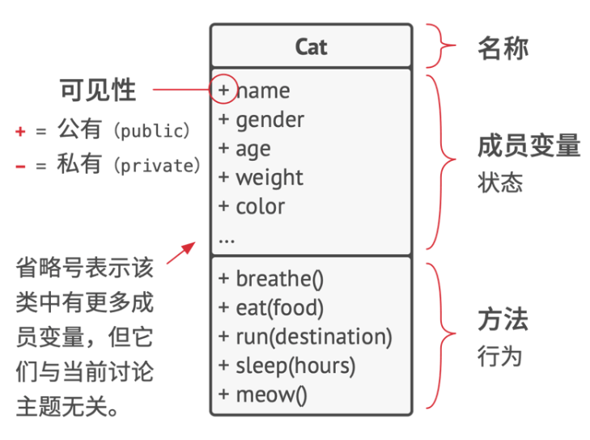

这是一个 UML 类图，用于描述类的结构。

上面的 UML 类图中，**成员变量**和**方法**可以统称为类的**成员**，存储在对象变量中的数据通常被称为**状态**，对象中的所有方法则定义了其**行为**。

#### 类层次结构

一个实际的程序显然会包含不止一个类，一些类可能会组织起来形成类层次结构。

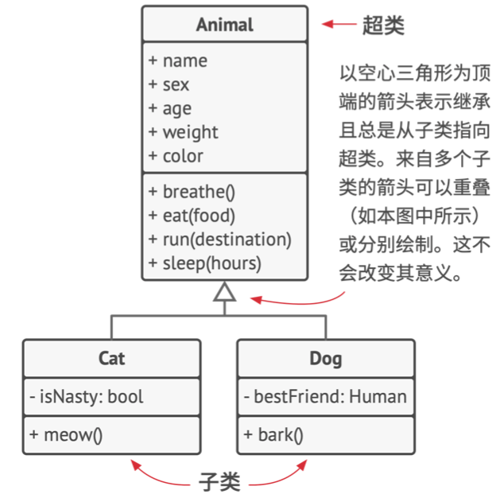

上面是一个类层次结构的 UML 图，而图中所有的类都是**超类**层次结构中的一部分。

如果展示类之间的关系比展示其内容更重要的话，可以像下面一样对 UML 图中的类进行简化：

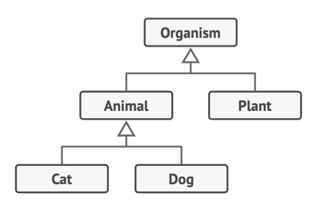

其中，子类可以对从父类继承而来的方法的行为进行重写，子类可以完全替换其默认行为，也可以仅提供额外内容来对其进行加强。

**面向对象程序设计的程序区别于其他的程序设计范式，有四个基本概念**：

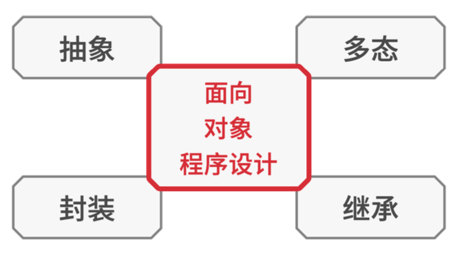

### 抽象

抽象是一种反映真实世界对象或现象中特定内容的模型，它能高精度地反映所有与特定内容相关的详细信息，同时忽略其他内容。

### 封装

封装是指一个对象对其他对象隐藏其部分状态和行为，而仅向程序其他部分暴露有限的接口能力。

封装某个内容意味着使用关键字`private 私有`来对其进行修饰，这样仅有其所在类中的方法才能访问这些内容。

还有一种限制程度较小的关键字`protected 保护`，所修饰的对象仅允许父类访问其类中的成员。

> [typescript class修饰符public、private、protected、static、abstract](https://blog.csdn.net/hbjiankely/article/details/104010513)

| 关键字    | 类本身 | 类的方法 | 类的实例 | 子类 | 子类方法 | 子类的实例 |
| --------- | ------ | -------- | -------- | ---- | -------- | ---------- |
| static    | +      | -        | -        | +    | -        | -          |
| public    | -      | +        | +        | -    | +        | +          |
| private   | -      | +        | -        | -    | -        | -          |
| protected | -      | +        | -        | -    | +        | -          |

绝大部分编程语言的接口和抽象类都基于抽象和封装的概念，接口机制允许你定义对象之间的交互协议。这也是接口仅关心对象行为，而不能在接口中声明成员变量的原因之一。

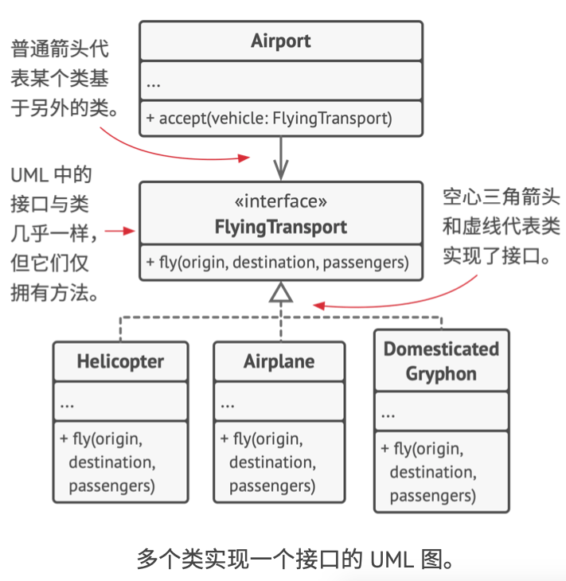

### 继承

继承是指在根据已有的类创建新的类的能力。使用继承后，子类将拥有与其父类相同的接口，如果父类中声明了某个方法，那么将无法在子类中隐藏该方法，此外，还必须要实现所有的抽象方法。

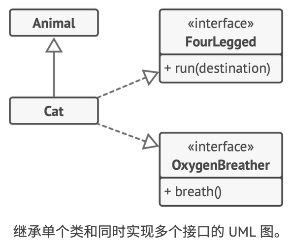

### 多态

多态是指程序能够检测对象所属的实际类，并在当前上下文不知道其真是类型的情况下调用它的实现的能力。

## 第 2 章 对象之间的联系

除了**继承**和**实现**之外，对象之间还有其他我们尚未提及的关系。

### 依赖

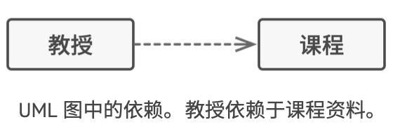

依赖是类之间最基础，也是最微弱的关系类型。

当你在代码中使用具体类的名称时，通常意味着存在依赖关系。但是通过让代码依赖接口或抽象类（而不是具体类），你可以降低其依赖程度。

通常情况下，UML 图不会展示所有依赖，为了不让依赖关系破坏 UML 图，你必须对其进行精心选择，**仅展示那些对于沟通来说重要的依赖关系**。

### 关联

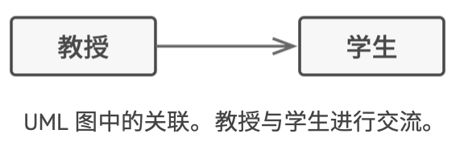

在 UML 图中，关联关系用起始于一个对象并指向其所使用的对象的简单箭头来表示，顺带一提，双向关联也是完全正常的。

关联可视为一种特殊类型的依赖，即一个对象总是拥有访问与其交互的对象的权限，而简单的依赖关系并不会在对象间建立永久性的联系。

（PS：个人理解，也就是这两个对象之间是强联系，一旦修改了其中一个，另一个的代码会崩溃）

### 聚合

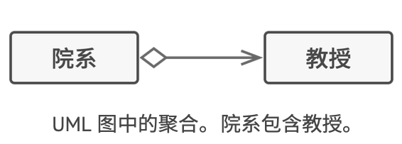

聚合是一种特殊类型的关联，用于表示多个对象之间的“一对多”、“多对多”或“整体对部分”的关系。

### 组合

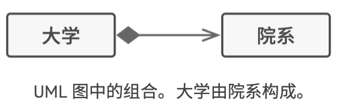

组合是一种特殊类型的聚合，组合与其他关系的区别在于，组件仅能作为容器的一部分存在。

### 总结

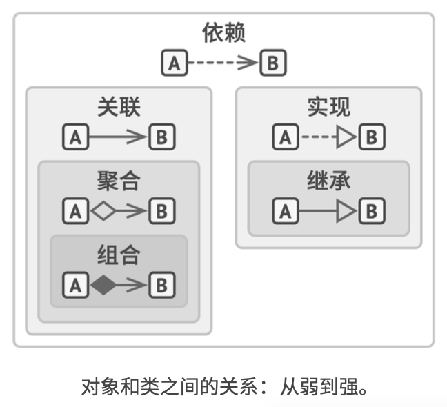

- 依赖：对类 B 进行修改会影响到类 A
- 关联：对象 A 知道对象 B。类 A 依赖于 B。
- 聚合：对象 A 知道对象 B 且由 B 构成。类 A 依赖于类 B
- 组合：对象 A 知道对象 B，由 B 构成且管理着 B 的生命周期。类 A 依赖于类 B
- 实现：类 A 定义的方法由接口 B 声明。对象 A 可悲视为对象 B，类 A 依赖于类 B
- 继承：类 A 继承类 B 的接口和实现，但是可以对其进行扩展。对象 A 可被视为对象 B，类 A 依赖于类 B。

