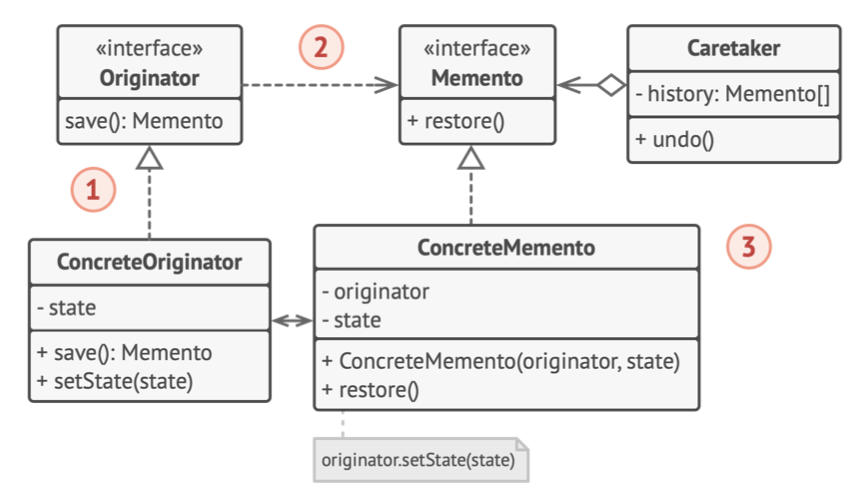

# 《深入设计模式》学习笔记（20）

## 第9章 行为模式

### 9.5 备忘录

备忘录是一种行为设计模式，允许在不暴露对象实现细节的情况下保存和恢复对象之前的状态。也称为快照模式、Snapshot 模式、Memento 模式。

#### 问题

绝大多数对象会使用私有的成员变量来存储重要数据，无法通过遍历对象的所有成员并将其数值进行复制保存，因此撤销这一步操作实现起来并不简单。

就算所有的对象都公开了其所有的状态，这种方式仍然存在一些严重问题，生成快照需要包含的数据非常冗杂，必须要收集这些数据并将其放入特定容器中，才能生成快照。这样一来，容器最终大概率会成为同一个类的对象，这个类中几乎没有任何方法，但有许多与编辑器状态一一对应的成员变量。为了让其他对象能够保存或者读取快照，就必须要将这些对象中的成员变量设置为公有，能够随意访问。


这样一来就走入了一条死胡同，要么会暴露类的所有内部细节而使其过于脆弱，要么会限制对其状态的访问权限而无法生成快照。

#### 解决方案

刚才所遇到的问题归根结底，是由于一些对象试图进行一些超出其职责范围的工作。由于在执行某些行为时需要获取数据，所以它们侵入了其他对象的私有空间，而不是让这些对象来完成实际的工作。

备忘录模式将创建快照的工作委派给实际状态的拥有者：**原发器对象**。这样对象就不需要从“外部”来复制编辑状态了，编辑器拥有其状态的完全访问权，因此可以自行生成快照。

模式建议将对象的状态副本存储在一个名为备忘录（Memento）的特殊对象中，除了创建备忘录的对象以外，任何对象都不能访问备忘录的内容。其他对象必须使用受限的接口与备忘录进行交互，它们可以获取快照的元数据（创建时间、操作名称等），但不能获取快照中原始对象的状态。


这种限制策略允许将备忘录保存在被称为负责人（Caretakers）的对象中。由于负责人仅通过受限接口与备忘录互动，所以无法修改存储在备忘录中内部的状态，同时，原发器拥有对备忘录所有成员的访问权限，从而能随时恢复其以前的状态。

#### 结构

**基于嵌套类的实现**

该模式基于支持嵌套类（在一个类中定义另外一个类）的语言（例如 C++、C# 和 Java）


1. **原发器**：可以生成自身状态的快照，也可以在需要时通过快照恢复自身状态

2. **备忘录**：是原发器状态快照的值对象。通常做法是将备忘录设为不可变，并通过构造函数一次性传递数据。

3. **负责人**：仅知道“何时”和“为何”捕捉原发器状态，以及何时恢复状态。

   负责人通过保存备忘录栈来记录原发器的历史状态。当原发器需要回溯历史状态时，负责人将从栈中获取最顶部的备忘录，并将其传递给原发器的恢复（restoration）方法

4. 在该实现方法中，**备忘录类将被嵌套在原发器中**。这样原发器就可以访问备忘录的成员方法，即使这些方法被声明为私有。另一方面，负责人对于备忘录的成员访问则非常有限：只能在栈中保存备忘录，而不能修改其状态。

**基于中间接口的实现**

另外一种实现方式则适用于不支持嵌套类的编程语言（比如 PHP）


1. 在没有嵌套类的情况下，可以规定负责人仅可通过明确声明的中间接口与备忘录互动，该接口仅声明与备忘录元数据相关的方法，从而限制其对备忘录成员变量的直接访问权限。
2. 另一方面，原发器可以直接与备忘录对象进行交互，访问备忘录类中声明的成员变量和方法。但这种方式的缺点是，**要将备忘录的所有成员变量声明为公有**。

**封装更加严格的实现**

如果你不想让其他类有任何机会通过备忘录来访问原发器状态，还有另一种可用的实现方式。



1. 这种实现方式允许存在多种不同类型的原发器和备忘录。每种原发器都和其相应的备忘录进行交互。原发器和备忘录都不会将其状态暴露给其他类。
2. 负责人此时被明确禁止修改存储在备忘录中的状态。但 CareMaker 类将独立于原发器，因为此时恢复方法被定义在了备忘录类中。
3. 每个备忘录将与创建了自身的原发器连接，原发器会将自己以及状态传递给备忘录的构造函数。由于类之间的紧密联系，只要原发器定义了合适的设置其，备忘录就能恢复其状态。

#### 伪代码


上面的关系中，Command 对象将作为负责人对象，会在执行相关的操作前，获取编辑器的备忘录，当用户试图撤销命令时，编辑器就可以使用保存在 Command 中的备忘录来讲自身回滚道之前的状态。

> [示例代码](https://refactoringguru.cn/design-patterns/memento/typescript/example#lang-features)

```typescript
/**
 * The Originator holds some important state that may change over time. It also
 * defines a method for saving the state inside a memento and another method for
 * restoring the state from it.
 */
class Originator {
    /**
     * For the sake of simplicity, the originator's state is stored inside a
     * single variable.
     */
    private state: string;

    constructor(state: string) {
        this.state = state;
        console.log(`Originator: My initial state is: ${state}`);
    }

    /**
     * The Originator's business logic may affect its internal state. Therefore,
     * the client should backup the state before launching methods of the
     * business logic via the save() method.
     */
    public doSomething(): void {
        console.log('Originator: I\'m doing something important.');
        this.state = this.generateRandomString(30);
        console.log(`Originator: and my state has changed to: ${this.state}`);
    }

    private generateRandomString(length: number = 10): string {
        const charSet = 'abcdefghijklmnopqrstuvwxyzABCDEFGHIJKLMNOPQRSTUVWXYZ';

        return Array
            .apply(null, { length })
            .map(() => charSet.charAt(Math.floor(Math.random() * charSet.length)))
            .join('');
    }

    /**
     * Saves the current state inside a memento.
     */
    public save(): Memento {
        return new ConcreteMemento(this.state);
    }

    /**
     * Restores the Originator's state from a memento object.
     */
    public restore(memento: Memento): void {
        this.state = memento.getState();
        console.log(`Originator: My state has changed to: ${this.state}`);
    }
}

/**
 * The Memento interface provides a way to retrieve the memento's metadata, such
 * as creation date or name. However, it doesn't expose the Originator's state.
 */
interface Memento {
    getState(): string;

    getName(): string;

    getDate(): string;
}

/**
 * The Concrete Memento contains the infrastructure for storing the Originator's
 * state.
 */
class ConcreteMemento implements Memento {
    private state: string;

    private date: string;

    constructor(state: string) {
        this.state = state;
        this.date = new Date().toISOString().slice(0, 19).replace('T', ' ');
    }

    /**
     * The Originator uses this method when restoring its state.
     */
    public getState(): string {
        return this.state;
    }

    /**
     * The rest of the methods are used by the Caretaker to display metadata.
     */
    public getName(): string {
        return `${this.date} / (${this.state.substr(0, 9)}...)`;
    }

    public getDate(): string {
        return this.date;
    }
}

/**
 * The Caretaker doesn't depend on the Concrete Memento class. Therefore, it
 * doesn't have access to the originator's state, stored inside the memento. It
 * works with all mementos via the base Memento interface.
 */
class Caretaker {
    private mementos: Memento[] = [];

    private originator: Originator;

    constructor(originator: Originator) {
        this.originator = originator;
    }

    public backup(): void {
        console.log('\nCaretaker: Saving Originator\'s state...');
        this.mementos.push(this.originator.save());
    }

    public undo(): void {
        if (!this.mementos.length) {
            return;
        }
        const memento = this.mementos.pop();

        console.log(`Caretaker: Restoring state to: ${memento.getName()}`);
        this.originator.restore(memento);
    }

    public showHistory(): void {
        console.log('Caretaker: Here\'s the list of mementos:');
        for (const memento of this.mementos) {
            console.log(memento.getName());
        }
    }
}

/**
 * Client code.
 */
const originator = new Originator('Super-duper-super-puper-super.');
const caretaker = new Caretaker(originator);

caretaker.backup();
originator.doSomething();

caretaker.backup();
originator.doSomething();

caretaker.backup();
originator.doSomething();

console.log('');
caretaker.showHistory();

console.log('\nClient: Now, let\'s rollback!\n');
caretaker.undo();

console.log('\nClient: Once more!\n');
caretaker.undo();
```

#### 适合应用场景

- 需要创建对象状态快照来恢复其之前的状态

  备忘录模式允许复制对象中的全部状态（包括私有成员变量），并将其独立于对象进行保存。

- 当直接访问对象的成员变量、获取器或设置其将导致封装被突破时，可以使用该模式。

  备忘录会让对象自行负责创建其状态的快照。其他任何对象都不能读取快照，有效地保障了数据的安全性。

#### 实现方式

1. 确定担任原发器角色的类。
2. 创建备忘录类。逐一声明对应每个原发器成员变量的备忘录成员变量。
3. 将备忘录类设为不可变。备忘录只能通过构造函数一次性接收数据，该类中不能包含设置器。
4. 如果所使用的编程语言支持嵌套类，可以将备忘录嵌套在原发器中；如果不支持，那就可以从备忘录类中抽取一个空接口，然后让其他所有对象通过接口来引用备忘录。你可以在该接口中添加一些元数据操作，但不能暴露原发器的状态。
5. 在原发器中添加一个创建备忘录的方法。原发器必须通过备忘录构造函数的一个或多个实际参数来将自身状态传递给备忘录。
6. 在原发器类中添加一个用于恢复自身状态的方法。
7. 无论负责人是什么对象，都必须知道合适向原发器请求新的备忘录，合适存储备忘录以及何时使用特定备忘录来对原发器进行恢复。
8. 负责人与原发器之间的连接可以移动到备忘录中。

#### 优缺点

优点：

- 在不破坏对象封装的安全性前提下创建对象的状态快照
- 可以通过让负责人维护原发器状态历史记录来简化原发器的代码

缺点：

- 如果客户端过于频繁地创建备忘录，将消耗大量内存
- 负责人必须完整跟踪原发器的生命周期，才能销毁弃用的备忘录
- 绝大部分动态编程语言（PHP、Python、JavaScript）都不能确保备忘录中的状态不被修改。

#### 与其他模式的关系

- 可以同时使用命令和备忘录来实现撤销操作。命令模式用于对目标对象执行各种不同操作，备忘录用于保存一条命令执行前该对象的状态。
- 可以同时使用备忘录和迭代器来获取当前迭代器的状态，并在需要时回滚
- 有时候原型模式也可以作为备忘录模式的一个简化版本，前提是历史记录中存储的对象状态比较简单，也不需要链接其他外部资源，亦或是链接可以方便地重建。

