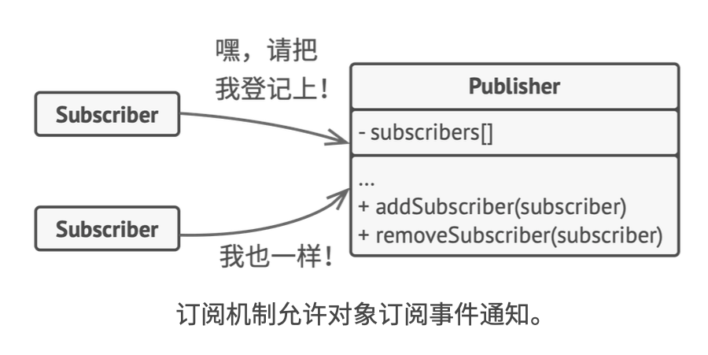
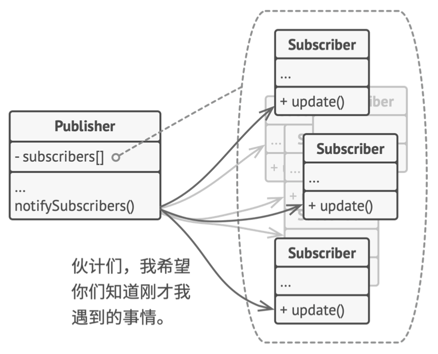
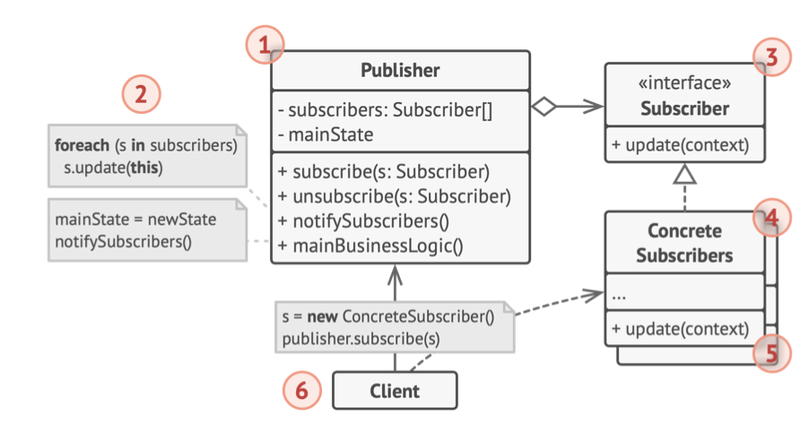

# 《深入设计模式》学习笔记（21）

## 第9章 行为模式

### 9.6 观察者

观察者是一种行为设计模式，允许你定义一种订阅机制，可在对象发生时通知多个“观察”该对象的其他对象。

#### 问题

传统的场景下，消费者会对生产者对象进行轮询，每隔一段时间查看一下是否有它关注的产品被生产，但这种方法会让多数的轮询结果都无功而返。

又或者，可以让生产者对象在每次生产之后通知所有消费者，这样消费者就无须反复轮询了，但这样的缺点是无法筛选出真正需要这些产品的消费者，从而浪费了带宽。

#### 解决方案

拥有一些值得关注的状态的对象，称之为**目标**，由于它要将自身的状态改变通知给其他对象，我们也将其称为**发布者**（publisher）。而所有希望关注发布者状态变化的其他对象被称为**订阅者**（subscribers）。

观察者模式建议为发布者添加订阅机制，让每个对象都能订阅或取消订阅发布者的事件流。这并没有听起来的那么复杂，该机制包括两点：

1. 一个用于存储订阅者对象引用的列表成员变量
2. 几个用于添加或删除该列表中订阅者的公有方法

无论何时发生了重要的发布者事件，它都要遍历订阅者并调用其对象的特定通知方法。

实际应用中，可能会有十几个不同的订阅者类跟踪着同一个发布类的事件，发布者不应该与这些类相耦合，而如果他人也会使用发布者类，那开发者可能会对这些类一无所知。

因此，所有订阅者都必须实现同样的接口，发布者仅通过该接口与订阅者交互。接口中必须声明通知方法及其参数，让发布者在发出通知时还能传递一些上下文数据。

#### 结构

1. **发布者**：会向其他对象发送值得关注的事件。事件会在发布者自身状态改变或执行特定行为后发生。发布者中包含一个允许新订阅者加入，和使得当前订阅者离开列表的订阅架构。
2. 当新事件发生时，发送者会遍历订阅列表并调用每个订阅者对象的通知方法。该方法是在订阅者接口中声明的。
3. **订阅者**：接口声明了通知接口。绝大多数情况下，该接口仅包含了一个`update`更新方法。该方法可以拥有多个参数，使得发布者能在更新时传递事件的详细信息。
4. **具体订阅者**：可以执行一些操作来回应发布者的通知。所有具体订阅类都实现了同样的接口，因此发布者不需要与具体的类耦合。
5. 发布者通常会将一些上下文数据作为通知方法的参数传递给订阅者，让订阅者正确地处理更新。而发布者也可以将自身作为参数进行传递，使得订阅者直接获取所需的数据。
6. **客户端**：会分别创建发布者和订阅者对象，然后为订阅者注册发布者更新。

> 本次阅读至 P321 322  下次阅读应至 335