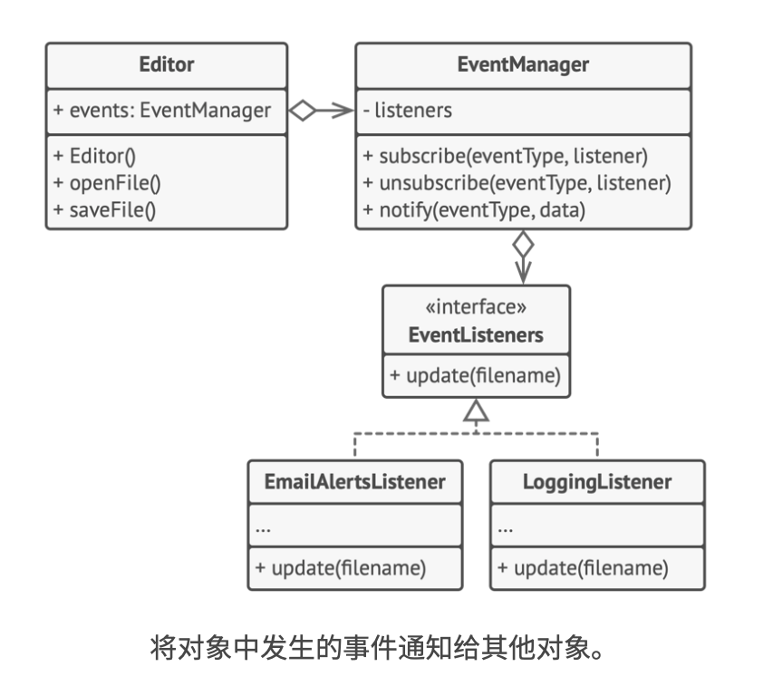

# 《深入设计模式》学习笔记（21）

## 第9章 行为模式

### 9.6 观察者

观察者是一种行为设计模式，允许你定义一种订阅机制，可在对象发生时通知多个“观察”该对象的其他对象。

#### 问题

传统的场景下，消费者会对生产者对象进行轮询，每隔一段时间查看一下是否有它关注的产品被生产，但这种方法会让多数的轮询结果都无功而返。

又或者，可以让生产者对象在每次生产之后通知所有消费者，这样消费者就无须反复轮询了，但这样的缺点是无法筛选出真正需要这些产品的消费者，从而浪费了带宽。

#### 解决方案

拥有一些值得关注的状态的对象，称之为**目标**，由于它要将自身的状态改变通知给其他对象，我们也将其称为**发布者**（publisher）。而所有希望关注发布者状态变化的其他对象被称为**订阅者**（subscribers）。

观察者模式建议为发布者添加订阅机制，让每个对象都能订阅或取消订阅发布者的事件流。这并没有听起来的那么复杂，该机制包括两点：

1. 一个用于存储订阅者对象引用的列表成员变量
2. 几个用于添加或删除该列表中订阅者的公有方法


无论何时发生了重要的发布者事件，它都要遍历订阅者并调用其对象的特定通知方法。

实际应用中，可能会有十几个不同的订阅者类跟踪着同一个发布类的事件，发布者不应该与这些类相耦合，而如果他人也会使用发布者类，那开发者可能会对这些类一无所知。

因此，所有订阅者都必须实现同样的接口，发布者仅通过该接口与订阅者交互。接口中必须声明通知方法及其参数，让发布者在发出通知时还能传递一些上下文数据。


#### 结构


1. **发布者**：会向其他对象发送值得关注的事件。事件会在发布者自身状态改变或执行特定行为后发生。发布者中包含一个允许新订阅者加入，和使得当前订阅者离开列表的订阅架构。
2. 当新事件发生时，发送者会遍历订阅列表并调用每个订阅者对象的通知方法。该方法是在订阅者接口中声明的。
3. **订阅者**：接口声明了通知接口。绝大多数情况下，该接口仅包含了一个`update`更新方法。该方法可以拥有多个参数，使得发布者能在更新时传递事件的详细信息。
4. **具体订阅者**：可以执行一些操作来回应发布者的通知。所有具体订阅类都实现了同样的接口，因此发布者不需要与具体的类耦合。
5. 发布者通常会将一些上下文数据作为通知方法的参数传递给订阅者，让订阅者正确地处理更新。而发布者也可以将自身作为参数进行传递，使得订阅者直接获取所需的数据。
6. **客户端**：会分别创建发布者和订阅者对象，然后为订阅者注册发布者更新。

#### 伪代码



> [示例代码](https://refactoringguru.cn/design-patterns/observer/typescript/example#lang-features)

```typescript
/**
 * The Subject interface declares a set of methods for managing subscribers.
 */
interface Subject {
    // Attach an observer to the subject.
    attach(observer: Observer): void;

    // Detach an observer from the subject.
    detach(observer: Observer): void;

    // Notify all observers about an event.
    notify(): void;
}

/**
 * The Subject owns some important state and notifies observers when the state
 * changes.
 */
class ConcreteSubject implements Subject {
    /**
     * @type {number} For the sake of simplicity, the Subject's state, essential
     * to all subscribers, is stored in this variable.
     */
    public state: number;

    /**
     * @type {Observer[]} List of subscribers. In real life, the list of
     * subscribers can be stored more comprehensively (categorized by event
     * type, etc.).
     */
    private observers: Observer[] = [];

    /**
     * The subscription management methods.
     */
    public attach(observer: Observer): void {
        const isExist = this.observers.includes(observer);
        if (isExist) {
            return console.log('Subject: Observer has been attached already.');
        }

        console.log('Subject: Attached an observer.');
        this.observers.push(observer);
    }

    public detach(observer: Observer): void {
        const observerIndex = this.observers.indexOf(observer);
        if (observerIndex === -1) {
            return console.log('Subject: Nonexistent observer.');
        }

        this.observers.splice(observerIndex, 1);
        console.log('Subject: Detached an observer.');
    }

    /**
     * Trigger an update in each subscriber.
     */
    public notify(): void {
        console.log('Subject: Notifying observers...');
        for (const observer of this.observers) {
            observer.update(this);
        }
    }

    /**
     * Usually, the subscription logic is only a fraction of what a Subject can
     * really do. Subjects commonly hold some important business logic, that
     * triggers a notification method whenever something important is about to
     * happen (or after it).
     */
    public someBusinessLogic(): void {
        console.log('\nSubject: I\'m doing something important.');
        this.state = Math.floor(Math.random() * (10 + 1));

        console.log(`Subject: My state has just changed to: ${this.state}`);
        this.notify();
    }
}

/**
 * The Observer interface declares the update method, used by subjects.
 */
interface Observer {
    // Receive update from subject.
    update(subject: Subject): void;
}

/**
 * Concrete Observers react to the updates issued by the Subject they had been
 * attached to.
 */
class ConcreteObserverA implements Observer {
    public update(subject: Subject): void {
        if (subject instanceof ConcreteSubject && subject.state < 3) {
            console.log('ConcreteObserverA: Reacted to the event.');
        }
    }
}

class ConcreteObserverB implements Observer {
    public update(subject: Subject): void {
        if (subject instanceof ConcreteSubject && (subject.state === 0 || subject.state >= 2)) {
            console.log('ConcreteObserverB: Reacted to the event.');
        }
    }
}

/**
 * The client code.
 */

const subject = new ConcreteSubject();

const observer1 = new ConcreteObserverA();
subject.attach(observer1);

const observer2 = new ConcreteObserverB();
subject.attach(observer2);

subject.someBusinessLogic();
subject.someBusinessLogic();

subject.detach(observer2);

subject.someBusinessLogic();
```

上面的例子中，发布者中包含四个方法：

- attach：关联订阅者
- detach：取绑订阅者
- someBusinessLogic：一些业务逻辑，会触发 notify 方法（接口未定义，由类独自实现）
- notify：依次调用所有关联了订阅者的 update 方法

#### 适合应用场景

- 当一个对象状态的改变需要改变其他对象
- 当应用中的一些对象必须观察其他对象，可使用，但仅能在有限时间内或特定情况下使用

#### 实现方式

1. 将业务代码试着拆分为两个部分：独立于其他代码的核心功能将作为发布者；其他代码将转为一组订阅类。
2. 声明订阅者接口。该接口至少应声明一个 update 方法。
3. 声明发布者接口并定义一些接口赖在列表中添加和删除订阅对象。记住发布者必须仅通过订阅者接口与它们进行交互。
4. 确定存放实际订阅列表的位置并实现订阅方法。
5. 创建具体发布者类。每次发布者发生了重要事件时都必须通知所有的订阅者。
6. 在具体的订阅者中实现通知更新的方法
7. 客户端生成全部的订阅者，并调用发布者完成注册工作。

#### 优缺点

优点：

- 开闭原则
- 可以在运行时建立对象之间的联系

缺点：

- 订阅者的通知顺序是随机的

#### 与其他模式的关系

- 责任链、命令、中介者、观察者都可用于处理请求发送者和接收者之间的不同连接方式：

  - 责任链按照顺序将请求动态传递给一系列潜在接收者，直至有一名接收者对其进行处理
  - 命令模式则在发送者和请求者之间建立单向连接。
  - 中介者模式清除了发送者和请求者之间的直接连接，强制它们通过一个中介对象进行间接沟通。
  - 观察者模式允许接收者动态地订阅或取消接收请求

- **中介者和观察者之间的区别往往很难记住**，在大部分情况下，可以使用其中一种模式，而有时则可以同时使用。

  中介者模式的主要目标是消除一系列系统组件之中的相互依赖，这些组件将依赖于同一个中介者对象。

  而观察者模式的目标是在对象之间建立动态的单向连接，使得部分对象可作为其他对象的附属发挥作用。

  有一种流行的中介者模式实现方式依赖于观察者：中介者对象负责担任发布者的角色，而其他组件则作为订阅者，可以订阅中介者的事件或者取消订阅。当中介者以这种方式实现时，它可能看上去与观察者非常相似。

  记住实现中介者的方式不止一种，例如，你可以永久性地将所有组件链接道同一个中介者对象，这种实现方式和上面的与观察者模式相结合的实现方式并不相同，但这仍然是一种中介者模式。而相对的，如果有一个程序中的所有组件都变成了发布者，它们之间可以相互建立动态的连接。这样程序中就没有中心化的中介者对象，只有一些分布式的观察者。

