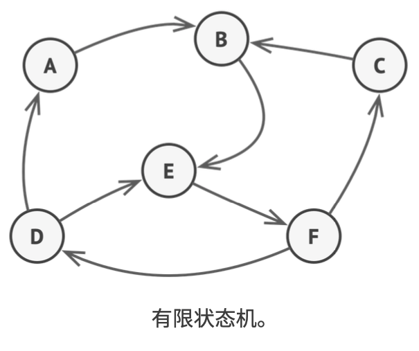
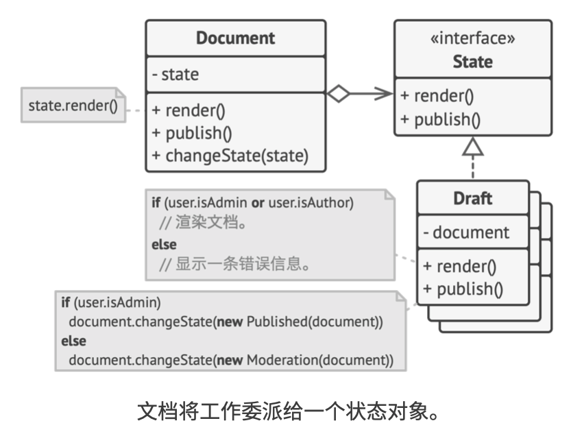
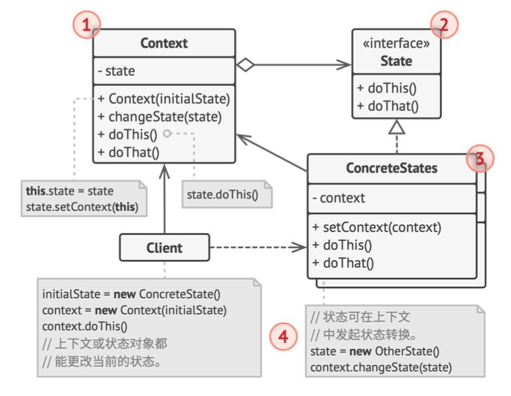
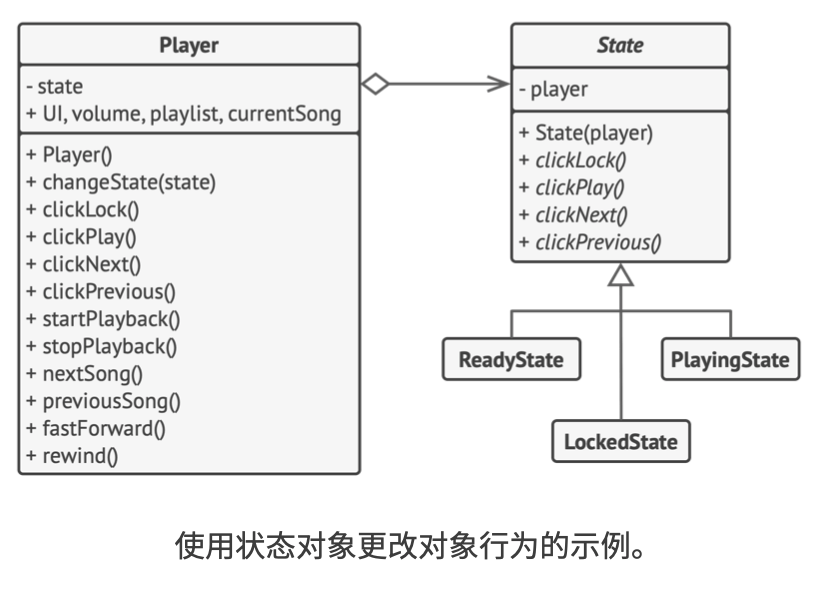

# 《深入设计模式》学习笔记（22）

## 第9章 行为模式

### 9.7 状态

状态模式能让你在一个对象的内部状态变化时，改变其行为，使其看上去就像是改变了自身所属的类一样。

#### 问题

状态模式与**有限状态机**的概念紧密相关。



其主要思想是，程序在任意时刻仅可处于几种有限状态中，而在任何一个特定状态中，程序的行为都不相同，且可以瞬间从一个状态切换到另一个状态。而这些数量有限且预先定义的状态切换规则被称为**转移**。

状态机通常由众多条件运算符实现，可根据对象的当前状态选择相应的行为，“状态”通常只是对象中的一组成员变量值。

最简单的一种状态模式如下：

```javascript
class Document is
  field state: string
  //...
  method publish() is
    switch (state)
      "draft":
        state = "moderation"
        break
      "moderation":
				if (currentUser.role == 'admin') state = "published"
        break
      "published":
        // 什么也不做。
        break
        // ...
```

上面这种基于条件语句的状态代码，会在维护过程中逐渐暴露其最大的弱点：修改其中一条状态可能会涉及到修改其余所有的状态条件语句，导致代码的维护工作非常困难。

#### 解决方案

状态模式建议，为对象的所有可能状态新建一个类，然后将所有状态对应行为抽取到这些类中。

原始对象被称为上下文（context），它并不会自行实现所有行为，而是会保存一个指向当前状态的引用，且将所有与状态相关的工作委派给该对象。



如果需要将上下文转换为另外一种状态，就需要将当前活动的状态对象替换为另外一个代表新状态的对象，而要采取这种方式，则需要所有状态类必须遵循同样的接口，而且上下文必须仅通过接口与这些对象进行交互。

这个结构可能看上去与策略模式很像，但在状态模式中，特定的状态知道其他所有状态的存在，且能从一个状态触发到另一个状态。策略则几乎完全不知道其他策略的存在。

#### 结构



1. **上下文**：上下文保存了对于一个具体状态对象的引用，并会将所有与状态相关的工作委派给它。上下文通过状态接口与状态对象进行交互，且会提供一个设置器用于传递新的状态对象。
2. **状态**：接口会声明特定于状态的方法。这些方法应该能被其他所有具体状态所理解。
3. **具体状态**：具体状态类会自行实现特定于状态的方法。为了避免多个状态中包含相似代码，你可以提供一个封装有通用行为的中间抽象类。状态对象可以存储上下文对象的引用，通过这些引用，状态对象可以获得所需信息，并且触发状态转移。
4. 上下文和具体状态都可以设置上下文的下个状态，并可以通过替换连接到上下文的状态对象来完成实际的状态转换。

#### 伪代码

> [示例代码](https://refactoringguru.cn/design-patterns/state/typescript/example#lang-features)

```typescript
/**
 * The Context defines the interface of interest to clients. It also maintains a
 * reference to an instance of a State subclass, which represents the current
 * state of the Context.
 */
class Context {
    /**
     * @type {State} A reference to the current state of the Context.
     */
    private state: State;

    constructor(state: State) {
        this.transitionTo(state);
    }

    /**
     * The Context allows changing the State object at runtime.
     */
    public transitionTo(state: State): void {
        console.log(`Context: Transition to ${(<any>state).constructor.name}.`);
        this.state = state;
        this.state.setContext(this);
    }

    /**
     * The Context delegates part of its behavior to the current State object.
     */
    public request1(): void {
        this.state.handle1();
    }

    public request2(): void {
        this.state.handle2();
    }
}

/**
 * The base State class declares methods that all Concrete State should
 * implement and also provides a backreference to the Context object, associated
 * with the State. This backreference can be used by States to transition the
 * Context to another State.
 */
abstract class State {
    protected context: Context;

    public setContext(context: Context) {
        this.context = context;
    }

    public abstract handle1(): void;

    public abstract handle2(): void;
}

/**
 * Concrete States implement various behaviors, associated with a state of the
 * Context.
 */
class ConcreteStateA extends State {
    public handle1(): void {
        console.log('ConcreteStateA handles request1.');
        console.log('ConcreteStateA wants to change the state of the context.');
        this.context.transitionTo(new ConcreteStateB());
    }

    public handle2(): void {
        console.log('ConcreteStateA handles request2.');
    }
}

class ConcreteStateB extends State {
    public handle1(): void {
        console.log('ConcreteStateB handles request1.');
    }

    public handle2(): void {
        console.log('ConcreteStateB handles request2.');
        console.log('ConcreteStateB wants to change the state of the context.');
        this.context.transitionTo(new ConcreteStateA());
    }
}

/**
 * The client code.
 */
const context = new Context(new ConcreteStateA());
context.request1();
context.request2();
```



上面的播放器对象会连接到一个状态对象中，部分操作会更换播放器当前的状态对象，以此改变播放器对于用户互动所作出的反应。

#### 适合应用场景

- 对象需要根据自身当前状态进行不同行为，同时状态的数量非常多且与状态的相关代码会频繁变更的场景。
- 如果某个类需要根据成员变量的当前值改变自身行为，从而需要使用大量的条件语句时。
- 当相似状态和基于条件的状态机转换中存在许多的重复代码时。

#### 实现方式

1. 确定哪些类是上下文。

2. 声明状态接口。

3. 为每个实际状态创建一个继承于状态接口的类。然后检查上下文中的方法并将与特定状态相关的所有代码抽取到新建的类中。

   如果在这个过程中发现这些代码依赖于上下文中的一些私有成员，可以采用以下几种变通方式：

   - 将这些成员或方法设为公有
   - 将需要抽取的上下文行为更改为上下文中的公有方法，然后在状态类中通过上下文引用进行调用
   - 将状态类嵌套在上下文类中，这种方法需要所使用的编程语言支持嵌套类
   
4. 在上下文类中添加一个状态接口类型的引用成员变量，以及一个用于修改该成员变量值得公有设置器。

5. 再次检查上下文中的方法，将空的条件语句替换为相应的状态对象方法

4. 为切换上下文状态，需要创建某个状态类实例并将其传递给上下文。你可以在上下文、各种状态或客户端中完成这项工作。

#### 优缺点

优点：

- 单一职责原则。
- 开闭原则
- 通过消除臃肿的状态机条件语句简化上下文代码

缺点：

- 如果状态机只有很少的几个状态，或者很少发生改变，那么该模式可能会显得小题大做。

#### 与其他模式的关系

- 桥接、状态和策略模式的接口非常相似，实际上，它们都基于组合模式——即，将工作委派给其他对象。
- 状态模式可被视为策略模式的扩展。两者都基于组合机制，但是策略模式使得这些对象之间完全独立，而状态模式没有限制具体状态之间的依赖，且允许它们自行改变不同情景下的状态。

