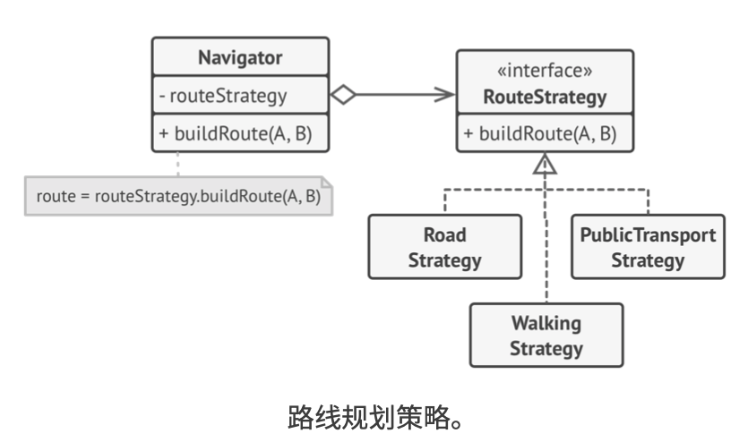
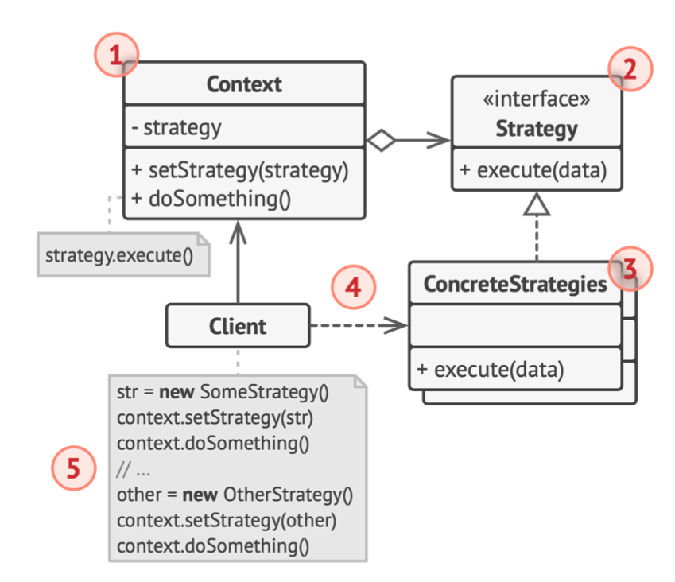

# 《深入设计模式》学习笔记（23）

## 第9章 行为模式

### 9.8 策略

策略模式能让你定义一系列算法，并将每种算法分别放入独立的类中，以使算法的对象能够互相退还。

#### 问题

在传统的代码编写中，每次添加新的算法都会对已有的算法造成影响影响整个类，增加维护成本和引入错误的风险。

#### 解决方案

策略模式建议找出负责用许多不同方式完成特定任务的类，然后将其中的算法抽取到一组称为**策略**的独立类中。



如上，每个路线规划算法都可被抽取到一个只有`buildRoute`方法的独立类中。即使传递给每个策略方法的参数一模一样，其返回的结果也可能完全不同。

#### 结构



1. **上下文**：维护指向具体策略的引用，且仅通过策略接口与对象进行交流
2. **策略**：接口是所有具体策略的通用接口，它声明了一个上下文用于执行策略的方法。
3. **具体策略**：实现了上下文所用算法的各种不同变体
4. 当上下文需要运行算法时，它会在其已连接的策略对象上调用执行方法。
5. **客户端**：会创建一个特定策略对象并将其传递给上下文，而上下文会提供一个设置器以便客户端在运行时替换相关联的策略。

#### 伪代码

> [示例代码](https://refactoringguru.cn/design-patterns/strategy/typescript/example#lang-features)

```typescript
/**
 * The Context defines the interface of interest to clients.
 */
class Context {
    /**
     * @type {Strategy} The Context maintains a reference to one of the Strategy
     * objects. The Context does not know the concrete class of a strategy. It
     * should work with all strategies via the Strategy interface.
     */
    private strategy: Strategy;

    /**
     * Usually, the Context accepts a strategy through the constructor, but also
     * provides a setter to change it at runtime.
     */
    constructor(strategy: Strategy) {
        this.strategy = strategy;
    }

    /**
     * Usually, the Context allows replacing a Strategy object at runtime.
     */
    public setStrategy(strategy: Strategy) {
        this.strategy = strategy;
    }

    /**
     * The Context delegates some work to the Strategy object instead of
     * implementing multiple versions of the algorithm on its own.
     */
    public doSomeBusinessLogic(): void {
        // ...

        console.log('Context: Sorting data using the strategy (not sure how it\'ll do it)');
        const result = this.strategy.doAlgorithm(['a', 'b', 'c', 'd', 'e']);
        console.log(result.join(','));

        // ...
    }
}

/**
 * The Strategy interface declares operations common to all supported versions
 * of some algorithm.
 *
 * The Context uses this interface to call the algorithm defined by Concrete
 * Strategies.
 */
interface Strategy {
    doAlgorithm(data: string[]): string[];
}

/**
 * Concrete Strategies implement the algorithm while following the base Strategy
 * interface. The interface makes them interchangeable in the Context.
 */
class ConcreteStrategyA implements Strategy {
    public doAlgorithm(data: string[]): string[] {
        return data.sort();
    }
}

class ConcreteStrategyB implements Strategy {
    public doAlgorithm(data: string[]): string[] {
        return data.reverse();
    }
}

/**
 * The client code picks a concrete strategy and passes it to the context. The
 * client should be aware of the differences between strategies in order to make
 * the right choice.
 */
const context = new Context(new ConcreteStrategyA());
console.log('Client: Strategy is set to normal sorting.');
context.doSomeBusinessLogic();

console.log('');

console.log('Client: Strategy is set to reverse sorting.');
context.setStrategy(new ConcreteStrategyB());
context.doSomeBusinessLogic();
```

#### 适合应用场景

- 当想使用对象中不同的算法变体，并且希望能在运行时切换算法时，可以使用策略模式。
- 当你有许多仅在执行某些行为时略有不同的相似类时，可以使用。
- 如果算法在上下文的逻辑中不是特别重要，该模式可以将业务逻辑与算法细节隔离开来。
- 当类中使用了复杂条件运算符以在同一算法的不同变体中切换时，可以使用该模式

#### 实现方式

1. 从上下文类中，找出修改频率较高的算法。
2. 声明该算法所有变体的通用策略接口。
3. 将算法逐一抽取到各自的类中，它们都必须实现策略接口。
4. 在上下文的类中添加一个成员变量用于保存策略对象的引用，并提供设置器以修改该成员变量。上下文仅可通过策略接口同策略对象进行交互。
5. 客户端必须将上下文类与相应策略进行关联，使得上下文可以预期的方式完成其主要工作

#### 优缺点

优点：

- 可以在运行时切换对象内的算法
- 可以将算法的实现和算法代码进行隔离
- 可以使用组合来代替继承
- 开闭原则。无需对上下文进行修改就能够引入新的策略

缺点：

- 如果算法极少发生改变，使用该模式只会让程序变得复杂
- 客户端必须知道不同策略间的不同以使用不同的策略
- 许多现代的编程语言支持函数类型功能，即在一组匿名函数中实现不同版本的算法，这样使用这些函数的方式和使用策略对象时完全相同，也无需接住额外的类和接口来保持代码简介。

#### 与其他模式的关系

- 桥接、状态和策略模式的接口非常相似，实际上，它们都基于组合模式——即，将工作委派给其他对象
- 命令模式和策略模式看上去很像，都是通过某些行为来参数化对象，但它们的意图有很大的不同：
  - 命令模式用于将任何操作转换为对象，操作的参数将成为对象的成员变量。
  - 策略模式则用于描述完成某件事的不同方式，让你能够在同一个上下文的类中切换算法。
- 装饰模式可以让你更改对象的外表，而策略则能让你改变其本质。
- 模板方法模式基于继承机制：允许通过扩展子类中的部分内容来改变算法。而策略模式基于组合机制：可以通过相应的行为提供不同的策略来改变对象的部分行为。模板方法在类的层面，属于静态，而策略模式在对象的层面，即允许在运行时切换行为。
- 状态模式可被视为策略模式的扩展。两者都基于组合机制，但是策略模式使得这些对象之间完全独立，而状态模式没有限制具体状态之间的依赖，且允许它们自行改变不同情景下的状态。