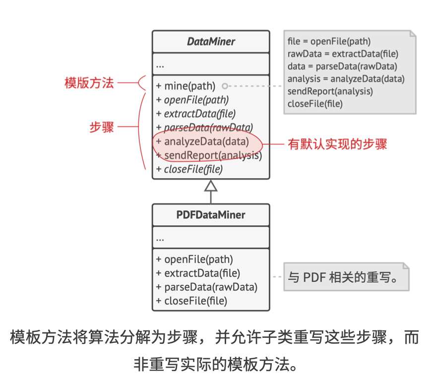
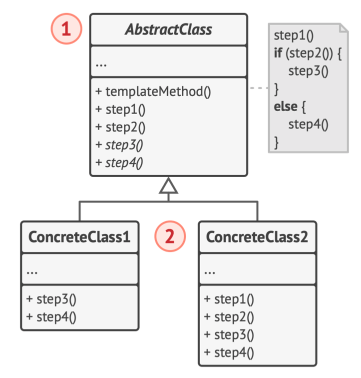
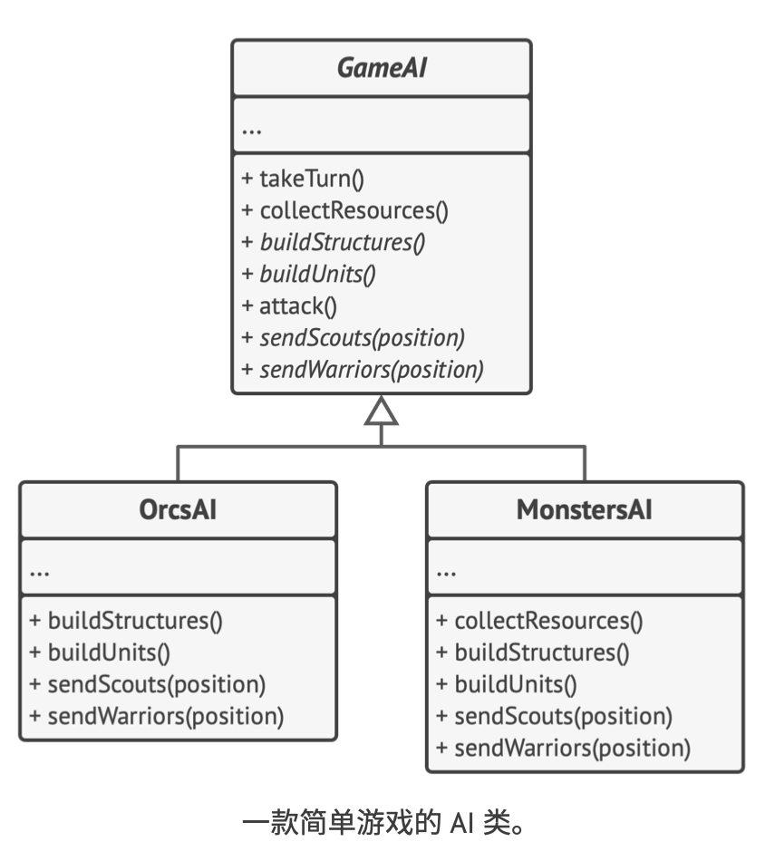

# 《深入设计模式》学习笔记（24）

## 第9章 行为模式

### 9.9 模板方法

模板方法是一种行为设计模式，定义了一个算法的框架，允许子类在不修改结构的情况下重写算法的特定步骤。

#### 问题

在传统的代码中，有很多类包含许多相似代码，尽管这些类处理不同数据格式的代码完全不同，但数据处理和分析的代码却几乎完全一样。

同时，如果所有处理数据的类都拥有相同的接口或基类都拥有相同的接口或基类，那么你就可以去除客户端代码中的条件语句，转而使用多态机制，在处理对象上调用函数。

#### 解决方案

模板方法模式建议将算法分解为一系列的步骤，然后将这些步骤改写为方法，最后在模板方法中依次调用他们，

为了能够使用算法，客户端需要自行提供子类并实现其所有的抽象步骤，如有必要还需要重写一些步骤。



首先将所有步骤声明为`abstract`抽象类型，强制要求子类自行实现这些方法。在上面的例子中，子类中已有所有必要的实现，因此只需要调整这些方法的签名，使之与超类的方法匹配即可。

去除重复代码并将其提取到基类中有两个步骤：

- 抽象步骤必须由各个子类来实现
- 可选步骤已有一些默认实现，但仍可在需要时进行重写

还有另一种名为**钩子**的步骤，钩子是内容为空的可选步骤。而即使不重写钩子，模板方法也能工作。钩子通常放置在算法的重要步骤前后，为子类提供额外的算法扩展点。

#### 结构



1. **抽象类**：会声明作为算法步骤的方法，以及依次调用它们的实际模板方法，以及依次调用它们的实际模板方法。当然若是不定义为抽象类，也可以提供一些默认实现。
2. **具体类**：可以重写所有步骤，但不能重写模板方法自身。

#### 伪代码



```typescript
/**
 * The Abstract Class defines a template method that contains a skeleton of some
 * algorithm, composed of calls to (usually) abstract primitive operations.
 *
 * Concrete subclasses should implement these operations, but leave the template
 * method itself intact.
 */
abstract class AbstractClass {
    /**
     * The template method defines the skeleton of an algorithm.
     */
    public templateMethod(): void {
        this.baseOperation1();
        this.requiredOperations1();
        this.baseOperation2();
        this.hook1();
        this.requiredOperation2();
        this.baseOperation3();
        this.hook2();
    }

    /**
     * These operations already have implementations.
     */
    protected baseOperation1(): void {
        console.log('AbstractClass says: I am doing the bulk of the work');
    }

    protected baseOperation2(): void {
        console.log('AbstractClass says: But I let subclasses override some operations');
    }

    protected baseOperation3(): void {
        console.log('AbstractClass says: But I am doing the bulk of the work anyway');
    }

    /**
     * These operations have to be implemented in subclasses.
     */
    protected abstract requiredOperations1(): void;

    protected abstract requiredOperation2(): void;

    /**
     * These are "hooks." Subclasses may override them, but it's not mandatory
     * since the hooks already have default (but empty) implementation. Hooks
     * provide additional extension points in some crucial places of the
     * algorithm.
     */
    protected hook1(): void { }

    protected hook2(): void { }
}

/**
 * Concrete classes have to implement all abstract operations of the base class.
 * They can also override some operations with a default implementation.
 */
class ConcreteClass1 extends AbstractClass {
    protected requiredOperations1(): void {
        console.log('ConcreteClass1 says: Implemented Operation1');
    }

    protected requiredOperation2(): void {
        console.log('ConcreteClass1 says: Implemented Operation2');
    }
}

/**
 * Usually, concrete classes override only a fraction of base class' operations.
 */
class ConcreteClass2 extends AbstractClass {
    protected requiredOperations1(): void {
        console.log('ConcreteClass2 says: Implemented Operation1');
    }

    protected requiredOperation2(): void {
        console.log('ConcreteClass2 says: Implemented Operation2');
    }

    protected hook1(): void {
        console.log('ConcreteClass2 says: Overridden Hook1');
    }
}

/**
 * The client code calls the template method to execute the algorithm. Client
 * code does not have to know the concrete class of an object it works with, as
 * long as it works with objects through the interface of their base class.
 */
function clientCode(abstractClass: AbstractClass) {
    // ...
    abstractClass.templateMethod();
    // ...
}

console.log('Same client code can work with different subclasses:');
clientCode(new ConcreteClass1());
console.log('');

console.log('Same client code can work with different subclasses:');
clientCode(new ConcreteClass2());
```

#### 适合应用场景

- 当你只希望客户端扩展某个特定算法步骤，而不是整个算法或其结构时，可以使用该模式
- 当多个类的算法除了一些细微的不同以外其他几乎完全一样时，也可以使用该模式。但要注意，这样做的后果是一旦算法发生变化，**就可能需要修改所有的类**。

#### 实现方式

1. 分析目标算法，确定是否将其分解为多个步骤。需要从所有的子类的角度触发，考虑哪些步骤能够通用，而哪些步骤各不相同。
2. 创建抽象基类并且声明一个模板方法和代表算法步骤的一系列抽象方法。在模板方法中根据算法结构依次调用相应步骤。如果需要防止子类重写，可以用`final`关键字来修饰该方法。
3. 默认的实现可能会给部分步骤带来好处，让子类无需实现这些方法。因此无需将所有方法都设定为抽象类型。
4. 可以考虑在算法的关键步骤之间添加钩子。
5. 为每个算法变体新建一个具体子类，它必须事先所有的抽象步骤，也可以重写部分的可选步骤。

#### 优缺点

优点：

- 可以允许客户端重写一个大型算法中的特定部分，使得算法其他部分修改对其造成的影响减小
- 可以将重复代码提取到一个超类中

缺点：

- 部分客户端可能会受到算法框架的限制
- 通过子类抑制默认步骤的实现可能会违反**里氏替换原则**
- 魔板方法中的步骤越多，其维护工作就可能会越困难

#### 与其他模式的关系

- 工厂方法是**模板方法**的一种特殊形式。同时，工厂方法也可以作为一个大型**模板方法**中的一个步骤
- 模板方法基于继承机制：它允许通过扩展子类中的部分内容来改变部分算法。而策略模式基于组合机制：你可以通过对相应行为提供不同的策略来改变对象的部分行为。模板方法在类的层次上运作，因此是静态的，而策略模式在对象层次上运作，因此允许在运行时切换行为。