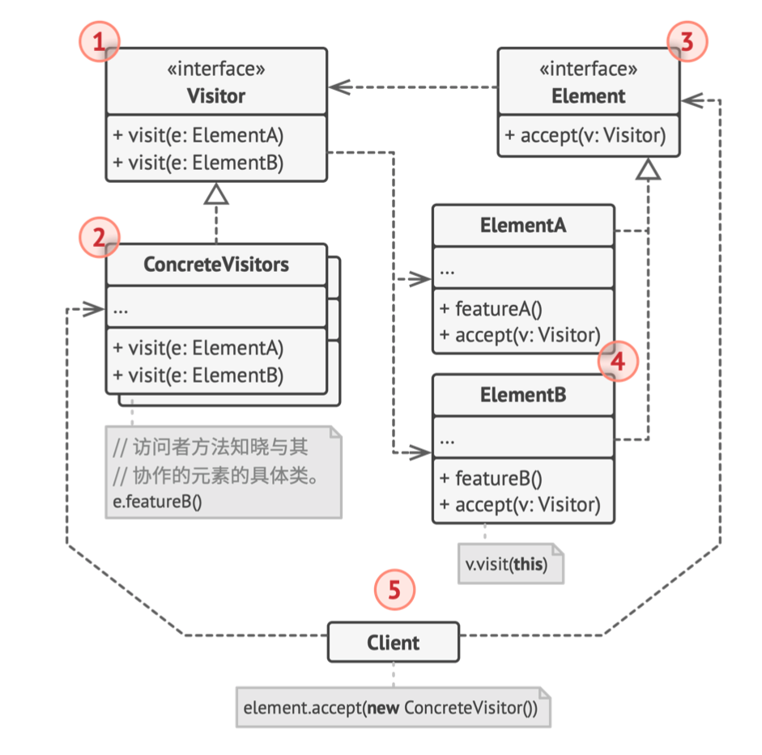
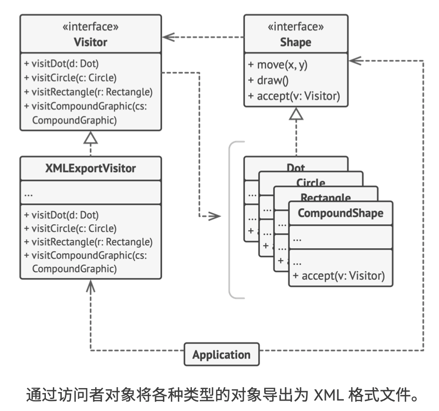

# 《深入设计模式》学习笔记（25）

## 第9章 行为模式

### 9.10 访问者

访问者模式能将算法与其所作用的对象隔离开来。

#### 问题

如果想要对一个既有的类添加方法或属性，很可能会因为新加的代码而导致已有的稳定对象引发潜在的缺陷。比如说对一个数据类添加一个导出方法，很可能会被拒绝，因为这些类的主要工作是处理数据，而不是导出。


而且一旦有了出口，这个类可能会越来越复杂，添加越来越多的方法，对这些脆弱且重要的类进行反复修改，并不是一个理想的方法。

#### 解决方案

访问者模式建议将新行为放入一个名为**访问者**的独立类中，而不是试图将其整合到已有类中。需要执行操作的原始对象将作为参数，传递给访问者中的方法，让方法能够访问对象所包含的一切必要数据。示例如下：


但是在这种方案下也会有新的问题，就是应该如何调用这些方法，如果需要对它的类来进行检查，从而调用不同的方法，像下面这样：


这种调用方案明显不理想，而即便所用的编程方法支持重载机制（使用相同的方法名称，但参数不同），但由于无法提前知晓节点对象所属的类，所以也无法在编译期通过重载机制执行正确方法。

而访问者模式解决这个问题的方法，是通过使用一种为名**分派**的技巧，让程序在不使用累赘的条件语句也可以执行正确的方法。

与其让客户端来选择调用正确版本的方法，不如将选择权委派给作为参数，传递给访问者的对象，让对象根据自己的类在访问者中选出正确的方法。它们会“接收”一个访问者并告诉其应该执行的访问者方法。


虽然最后还是修改了节点类，但毕竟改动很小，且使得在后续进一步添加行为时无需再次修改代码。

#### 结构



1. **访问者**：接口声明了一系列以对象结构的具体元素为参数的访问者方法。如果编程语言支持重载，这些方法的名称可以相同，但是其参数一定要不同。
2. **具体访问者**：为不同的具体元素类实现相同行为的几个不同版本
3. **元素**：接口声明一个方法来“接收”访问者。该方法必须有一个参数被声明为访问者接口类型。
4. **具体元素**：必须实现 accept 方法，该方法会根据当前元素的类将其调用重定向到相应访问者的方法中。
5. **客户端**：通常会作为集合或其他复杂对象的代表。客户端通常不会知道所有的具体元素类，因为它们会通过抽象接口与集合中的对象进行交互。

#### 伪代码

> [示例代码](https://refactoringguru.cn/design-patterns/visitor/typescript/example#lang-features)

```typescript
/**
 * The Component interface declares an `accept` method that should take the base
 * visitor interface as an argument.
 */
interface Component {
    accept(visitor: Visitor): void;
}

/**
 * Each Concrete Component must implement the `accept` method in such a way that
 * it calls the visitor's method corresponding to the component's class.
 */
class ConcreteComponentA implements Component {
    /**
     * Note that we're calling `visitConcreteComponentA`, which matches the
     * current class name. This way we let the visitor know the class of the
     * component it works with.
     */
    public accept(visitor: Visitor): void {
        visitor.visitConcreteComponentA(this);
    }

    /**
     * Concrete Components may have special methods that don't exist in their
     * base class or interface. The Visitor is still able to use these methods
     * since it's aware of the component's concrete class.
     */
    public exclusiveMethodOfConcreteComponentA(): string {
        return 'A';
    }
}

class ConcreteComponentB implements Component {
    /**
     * Same here: visitConcreteComponentB => ConcreteComponentB
     */
    public accept(visitor: Visitor): void {
        visitor.visitConcreteComponentB(this);
    }

    public specialMethodOfConcreteComponentB(): string {
        return 'B';
    }
}

/**
 * The Visitor Interface declares a set of visiting methods that correspond to
 * component classes. The signature of a visiting method allows the visitor to
 * identify the exact class of the component that it's dealing with.
 */
interface Visitor {
    visitConcreteComponentA(element: ConcreteComponentA): void;

    visitConcreteComponentB(element: ConcreteComponentB): void;
}

/**
 * Concrete Visitors implement several versions of the same algorithm, which can
 * work with all concrete component classes.
 *
 * You can experience the biggest benefit of the Visitor pattern when using it
 * with a complex object structure, such as a Composite tree. In this case, it
 * might be helpful to store some intermediate state of the algorithm while
 * executing visitor's methods over various objects of the structure.
 */
class ConcreteVisitor1 implements Visitor {
    public visitConcreteComponentA(element: ConcreteComponentA): void {
        console.log(`${element.exclusiveMethodOfConcreteComponentA()} + ConcreteVisitor1`);
    }

    public visitConcreteComponentB(element: ConcreteComponentB): void {
        console.log(`${element.specialMethodOfConcreteComponentB()} + ConcreteVisitor1`);
    }
}

class ConcreteVisitor2 implements Visitor {
    public visitConcreteComponentA(element: ConcreteComponentA): void {
        console.log(`${element.exclusiveMethodOfConcreteComponentA()} + ConcreteVisitor2`);
    }

    public visitConcreteComponentB(element: ConcreteComponentB): void {
        console.log(`${element.specialMethodOfConcreteComponentB()} + ConcreteVisitor2`);
    }
}

/**
 * The client code can run visitor operations over any set of elements without
 * figuring out their concrete classes. The accept operation directs a call to
 * the appropriate operation in the visitor object.
 */
function clientCode(components: Component[], visitor: Visitor) {
    // ...
    for (const component of components) {
        component.accept(visitor);
    }
    // ...
}

const components = [
    new ConcreteComponentA(),
    new ConcreteComponentB(),
];

console.log('The client code works with all visitors via the base Visitor interface:');
const visitor1 = new ConcreteVisitor1();
clientCode(components, visitor1);
console.log('');

console.log('It allows the same client code to work with different types of visitors:');
const visitor2 = new ConcreteVisitor2();
clientCode(components, visitor2);
```



#### 适合应用场景

- 如果需要对一个复杂对象结构中的所有元素执行某些操作，可以使用访问者模式。
- 可以使用访问者模式来清理辅助行为的业务逻辑。
- 当某个行为仅在类层次结构中的一些类中有意义，而在其他的类中没有意义时，可以使用该模式。在访问者模式中，你可以将行为抽取到单独的访问者类中，只需实现接收相关类的对象作为参数的访问者方法并将其他方法留空即可。

#### 实现方式

1. 在访问者接口中声明一组“访问”方法，分别对应程序中的每个具体元素类。
2. 声明元素接口。如果程序中已经有元素类层次接口，可在层次结构基类中添加抽象的“接收”方法。该方法必须接收访问者对象作为参数。
3. 在所有具体元素类中实现接收方法。这些方法必须将调用重定向到当前元素相应的，访问者对象的访问者方法上。
4. 元素类只能通过访问者接口与访问者进行交互。不过访问者必须知晓所有的具体元素类，因为这些类在访问者方法中都被作为参数类型引用。
5. 为每个没有办法在元素层次结构中实现的行为创建一个具体访问类，并实现所有的访问者方法。当然这时可能会遇到访问者无法访问元素类中的一些私有成员变量的情况，在这些情况下，要么只能将这些变量或者方法设为公有，但是会破坏元素的封装；要么将访问者类嵌入到元素类中。而后一种方法只有在支持嵌套类的编程语言中才可能实现。
6. 客户端必须创建访问者对象并通过“接收”方法将其传递给元素。

#### 优缺点

优点：

- 开闭原则
- 单一职责原则
- 访问者对象可以在与各种对象交互时，收集一些有用的信息。当你想要遍历一些复杂的对象结构（例如对象树），这些信息可能会有所帮助。

缺点：

- 每次在元素对象的层次结构中添加或移除一个类时，都要更新所有的访问者。（比如说添加了一个新的文档类型 xls，所有访问者中就要添加一个 doForXls 方法）
- 在访问者与某个特定元素进行交互时，它们可能会没有访问元素的私有成员变量和方法的必要权限

#### 与其他模式的关系

- 可以将访问者模式视为命令模式的加强版本，其对象可对不同类的多种对象执行操作。
- 可以使用访问者模式对组合模式组成的树执行操作
- 可以同时使用访问者模式和迭代器模式来遍历复杂数据结构，并对其中的元素执行所需操作，即使这些元素所属的类完全不同。