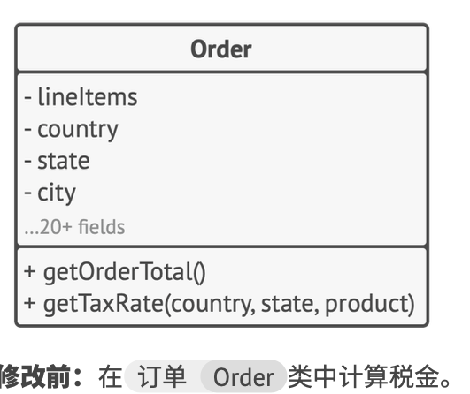
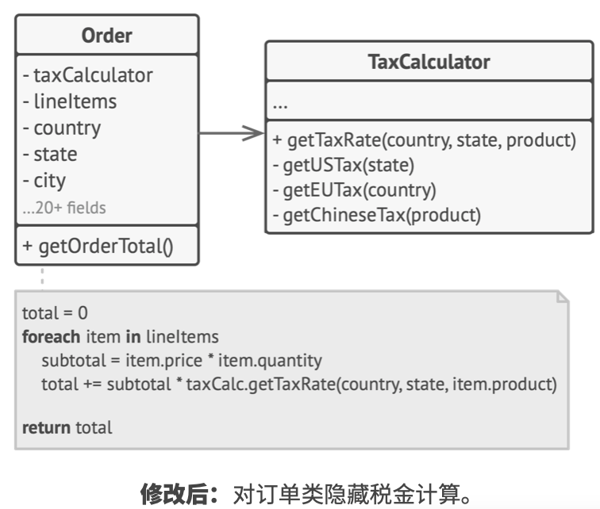

# 《深入设计模式》学习笔记（2）

## 第2章 设计模式简介

### 2.1 什么是设计模式

**设计模式**是软件设计中常见问题的典型解决方案，用于解决代码中反复出现的设计问题。

#### 模式包含哪些内容

模式的描述通常会包括以下部分：

- **意图**部分简要地描述问题和解决方案
- **动机**部分进一步解释问题并说明模式会如何提供解决方案
- **结构**部分展示模式的各个部分和它们之间的关系
- **在不同语言中的实现**提供流行编程语言的代码，让读者更好地理解模式背后的思想。

#### 模式的分类

最基础、底层的模式通常被称为惯用技巧，这类模式一般只能在一种编程语言中使用。

最通用的、高层的模式是架构模式，开发者可以在任何编程语言中使用这类模式，它们可以用于整个应用程序的架构设计。

此外，所有模式可以根据其意图或者目的来分类，本书覆盖了三种主要的模式类别：

- **创建型模式**提供创建对象的机制，增加已有代码的灵活性和可复用性。
- **结构型模式**介绍如何将对象和类组装成较大的结构，并同时保持结构的灵活和高效。
- **行为模式**负责对象间的高效沟通和指责委派。

#### 谁发明了设计模式

> - 《设计模式: 可复用面向对象软件的基础》: https://refactoringguru.cn/gof-book
> - 《建筑模式语言》: https://refactoringguru.cn/pattern-language-book

### 2.2 为什么以及如何学习设计模式

- 设计模式是针对软件设计中常见问题的工具箱，其中的工具是各种**经过实践验证的解决方案**，它能指导你如何使用面向对象的设计原则来解决各种问题
- 设计模式定义了一种让团队之间更高效沟通的通用语言，只要知晓模式以及其名称，所有人都会理解这条建议背后的想法。

## 第 3 章 软件设计原则

软件架构的设计过程中，有一些需要达成的目标，以及一些需要尽量避免的陷阱。

### 3.1 代码复用

**代码复用**是减少开发成本时最常用的方式之一，而组件间紧密的耦合，对具体类而非接口的依赖，硬编码的行为都会降低代码的灵活性，增加代码复用的难度。

使用设计模式是增加软件组件灵活性并使其易于复用的方式之一，但有时这也会让组件变得更加复杂。

> 埃里希·伽玛谈灵活性和代码复用: https://refactoringguru.cn/gamma-interview

### 3.2 扩展性

在设计程序架构时，所有有经验的开发者会尽量选择支持未来任何可能变更的方式。（PS：个人理解，即尽可能地向后兼容）

## 第 4 章 设计原则

对于不同的项目来说，最优的实践方式也不尽相同，但是有几个通用的软件设计原则可能会对解决这些问题有所帮助。

### 4.1 封装变化的内容

> 找到程序中的变化内容并将其与不变的内容区分开

该原则的主要目的是将变更造成的影响最小化。将程序的变化部分放入独立的模块中，保护其他代码不受变化的负面影响，这样可以保证在修改程序上所花的时间相对较少，并有更多的时间来实现功能。

#### 方法层面的封装

一句话总结：将需要变更的修改隔离在单个方法内，这样只要修改指定方法就能复用逻辑，也能更方便地将其移动到独立的类中。

#### 类层面的封装

如上述类，`Order`类的对象可以将所有与税金相关的工作委派给一个专门负责的特殊对象，修改后如下：

## 第 5 章 面向接口开发，而不是面向实现

### 5.1 面向接口进行开发，而不是面向实现

> 面向接口进行开发，而不是面向实现；依赖于抽象类，而不是具体类

> 本次阅读至 P42 43，下次阅读应至 55

