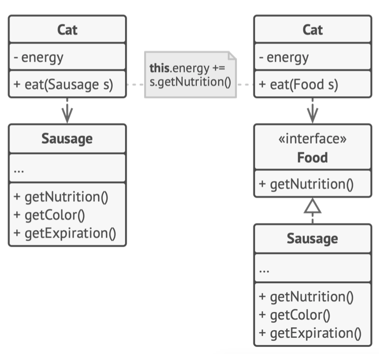
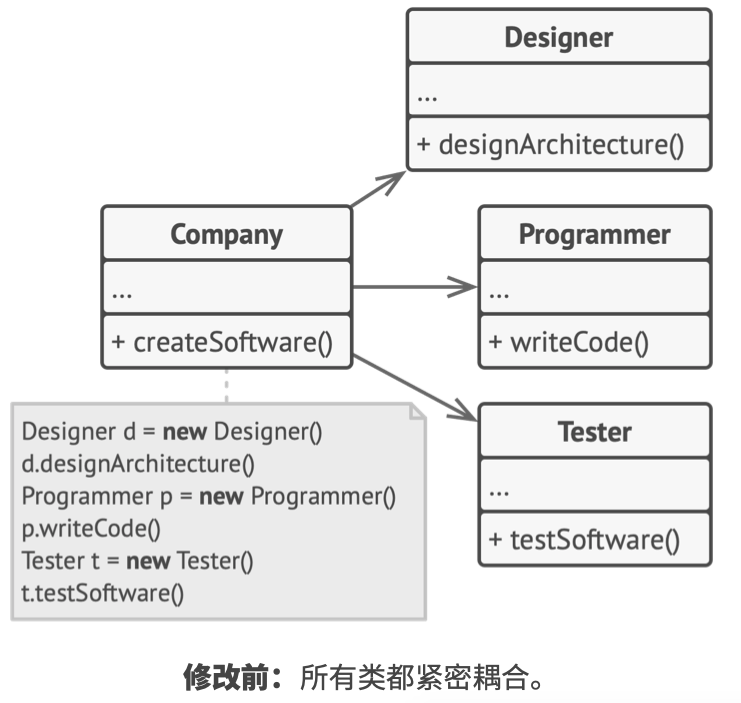
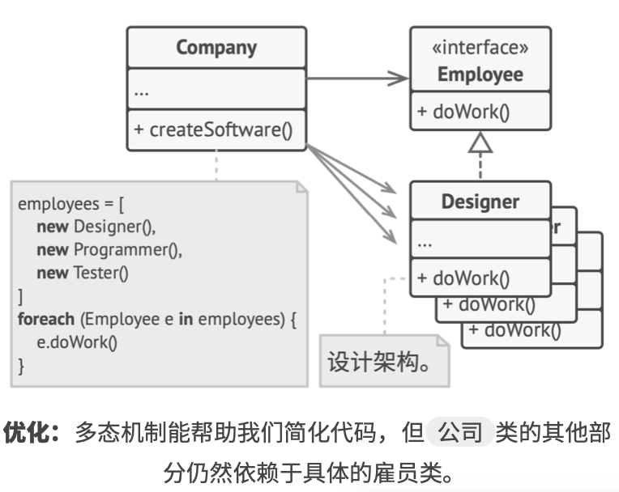
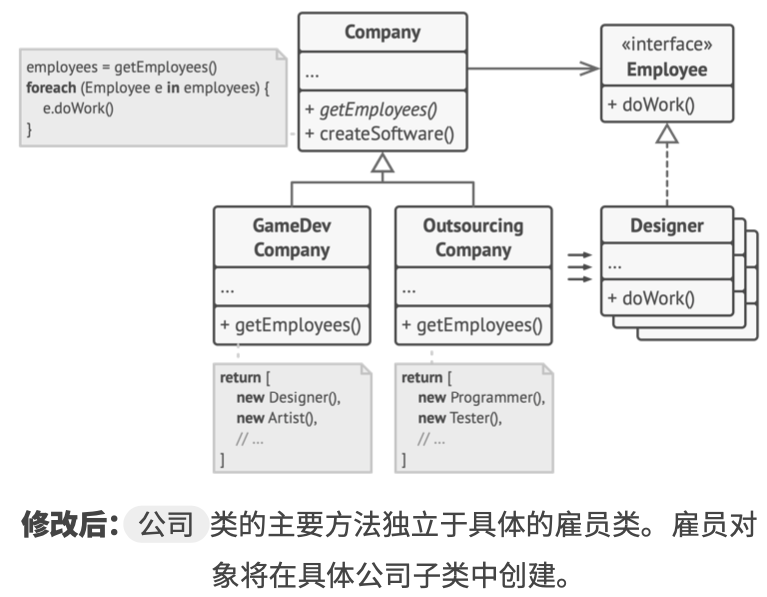
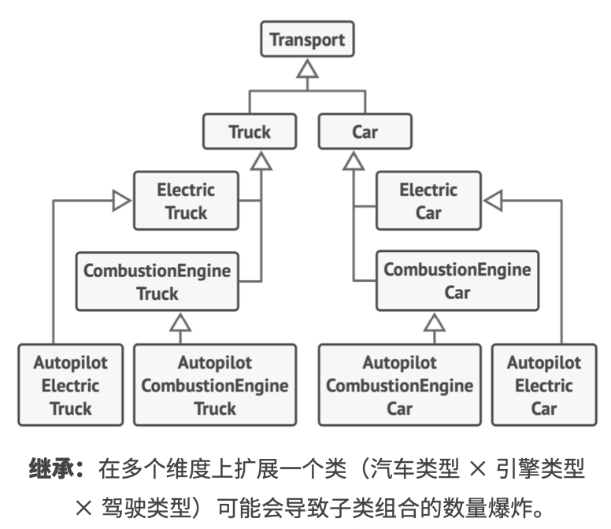
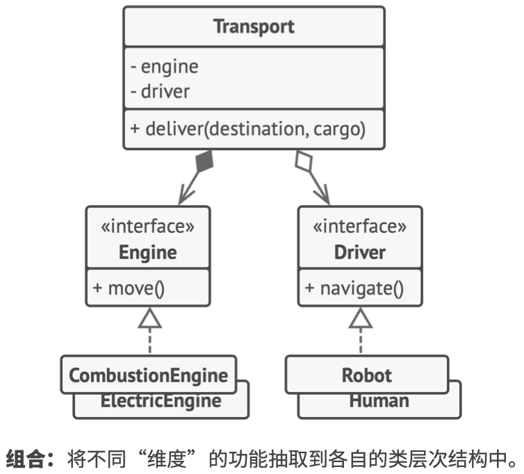

# 《深入设计模式》学习笔记（2）

## 第2章 设计模式简介

### 2.1 什么是设计模式

**设计模式**是软件设计中常见问题的典型解决方案，用于解决代码中反复出现的设计问题。

#### 模式包含哪些内容

模式的描述通常会包括以下部分：

- **意图**部分简要地描述问题和解决方案
- **动机**部分进一步解释问题并说明模式会如何提供解决方案
- **结构**部分展示模式的各个部分和它们之间的关系
- **在不同语言中的实现**提供流行编程语言的代码，让读者更好地理解模式背后的思想。

#### 模式的分类

最基础、底层的模式通常被称为惯用技巧，这类模式一般只能在一种编程语言中使用。

最通用的、高层的模式是架构模式，开发者可以在任何编程语言中使用这类模式，它们可以用于整个应用程序的架构设计。

此外，所有模式可以根据其意图或者目的来分类，本书覆盖了三种主要的模式类别：

- **创建型模式**提供创建对象的机制，增加已有代码的灵活性和可复用性。
- **结构型模式**介绍如何将对象和类组装成较大的结构，并同时保持结构的灵活和高效。
- **行为模式**负责对象间的高效沟通和指责委派。

#### 谁发明了设计模式

> - 《设计模式: 可复用面向对象软件的基础》: https://refactoringguru.cn/gof-book
> - 《建筑模式语言》: https://refactoringguru.cn/pattern-language-book

### 2.2 为什么以及如何学习设计模式

- 设计模式是针对软件设计中常见问题的工具箱，其中的工具是各种**经过实践验证的解决方案**，它能指导你如何使用面向对象的设计原则来解决各种问题
- 设计模式定义了一种让团队之间更高效沟通的通用语言，只要知晓模式以及其名称，所有人都会理解这条建议背后的想法。

## 第 3 章 软件设计原则

软件架构的设计过程中，有一些需要达成的目标，以及一些需要尽量避免的陷阱。

### 3.1 代码复用

**代码复用**是减少开发成本时最常用的方式之一，而组件间紧密的耦合，对具体类而非接口的依赖，硬编码的行为都会降低代码的灵活性，增加代码复用的难度。

使用设计模式是增加软件组件灵活性并使其易于复用的方式之一，但有时这也会让组件变得更加复杂。

> 埃里希·伽玛谈灵活性和代码复用: https://refactoringguru.cn/gamma-interview

### 3.2 扩展性

在设计程序架构时，所有有经验的开发者会尽量选择支持未来任何可能变更的方式。（PS：个人理解，即尽可能地向后兼容）

## 第 4 章 设计原则

对于不同的项目来说，最优的实践方式也不尽相同，但是有几个通用的软件设计原则可能会对解决这些问题有所帮助。

### 4.1 封装变化的内容

> 找到程序中的变化内容并将其与不变的内容区分开

该原则的主要目的是将变更造成的影响最小化。将程序的变化部分放入独立的模块中，保护其他代码不受变化的负面影响，这样可以保证在修改程序上所花的时间相对较少，并有更多的时间来实现功能。

#### 方法层面的封装

一句话总结：将需要变更的修改隔离在单个方法内，这样只要修改指定方法就能复用逻辑，也能更方便地将其移动到独立的类中。

#### 类层面的封装

如上述类，`Order`类的对象可以将所有与税金相关的工作委派给一个专门负责的特殊对象，修改后如下：

## 第 5 章 面向接口开发，而不是面向实现

### 5.1 面向接口进行开发，而不是面向实现

> 面向接口进行开发，而不是面向实现；依赖于抽象类，而不是具体类

只要无需修改也有代码就能轻松对类进行扩展，那就可以说这样的设计是灵活的，你可以用一种比依赖更灵活的方式来设置对象之间的合作关系。

1. 确定一个对象对另一个对象的确切需求：它需要执行哪些方法？
2. 在一个新的接口或者抽象类中描述这些方法
3. 让被依赖的类实现该接口
4. 现在让有需求的类依赖于这个接口，而不依赖于具体的类。

这样你仍然可以与原始类中的对象进行互动，但现在其连接将会灵活得多。

如下图，右侧的代码要比左侧更加灵活，但也会更加复杂。

上面的代码可能没办法体现出这样做的好处，下面来看另一个示例。

#### 示例

加入你正在开发一款软件开发公司模拟器，且使用了不同的类来代表这种类型的雇员。

尽管各个雇员类紧密耦合，尽管各个雇员的实现不尽相同，但还是可以归纳出几个与工作相关的方法，并将其抽取为所有雇员的通用接口。

经过上述优化，虽然能部分简化代码，但`公司类`依然与`雇员类`相耦合，这意味着如果引入包含其他类型雇员的公司类型的话，我们就需要重写绝大部分的`公司`类而不能复用代码了。

为了解决这个问题，可以声明一个**抽象**方法来获取雇员。每个具体公司都将以不同方式实现该方法从而创建自己所需要的雇员。

这样修改后的`公司类`将独立于各种`雇员类`。现在你可以对该公司类进行扩展，并在复用公司基类的情况下引入新的公司和雇员类型。而对公司基类进行扩展时也无需修改任何依赖于基类的已有代码。

上面的设计就是工厂方法模式的一个示例，在后面的章节我们会对其进行详细讨论。

### 5.2 组合优于继承

继承是类之间最明显、最简便的代码复用方式，不过，继承这件事通常只有在程序中已经包含了大量类，且修改任何东西都非常困难时才会引起关注。下面是继承会带来的一些麻烦清单：

- **子类不能减少超类的接口**。你必须要实现父类中所有的抽象方法，即使它没什么用
- **重写方法时，你需要确保新的行为与基类中的版本兼容**。因为子类的所有对象都可能被传递给超类，而超类中的行为有可能会导致代码崩溃。
- **继承打破了超类的封装**，子类拥有访问父类内部详细内容的权限，此外还有可能会有相反的情况出现（为了扩展方便而让超类知晓子类中的内容）
- **子类与超类紧密耦合**，超类中的任何修改都可能会破坏子类的功能
- **通过继承复用的代码可能导致平行继承体系的产生**，一般来说继承仅发生在一个维度中，但一旦出现了两个以上的维度，那就必须创建数量巨大的类组合，从而使类层次结构膨胀到不可思议的程度。

与之相对，**组合**是代替继承的一种方法。继承代表类之间的“是”关系（汽车**是**交通工具），而组合则代表“有”关系（汽车**有**一个引擎）。

除了**组合**以外，这个原则也能应用于**聚合**（一种更松弛的组合变体，一个对象可以引用另一个对象，但并不管理其生命周期），例如：一辆汽车上有司机，但是司机也能使用另一辆汽车，或者选择步行而不使用汽车。

下面是具体示例。

#### 示例

加入需要为汽车制造商制造一个目录程序，使用继承的话类的结构是这样的：

如上图，因为子类不能同时继承两个类，所以每个额外参数都将使子类数量倍增，子类中将会有大量的重复代码。

上述的类结构有点像我们在之后章节中讨论的**策略模式**，这样做的好处是可以在运行时对行为进行替换，例如，可以通过为汽车对象分配一个不同的引擎对象来替换已经连接至汽车的引擎。

> 本次阅读至 P42 43，下次阅读应至 55

