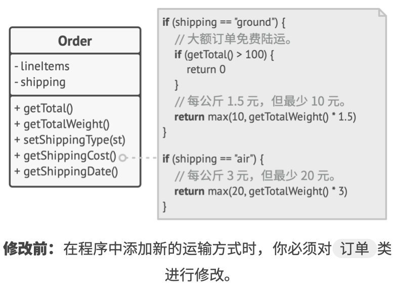
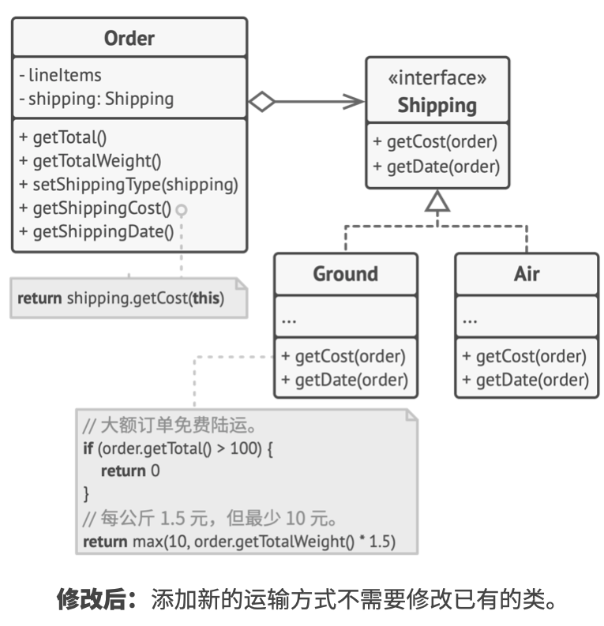
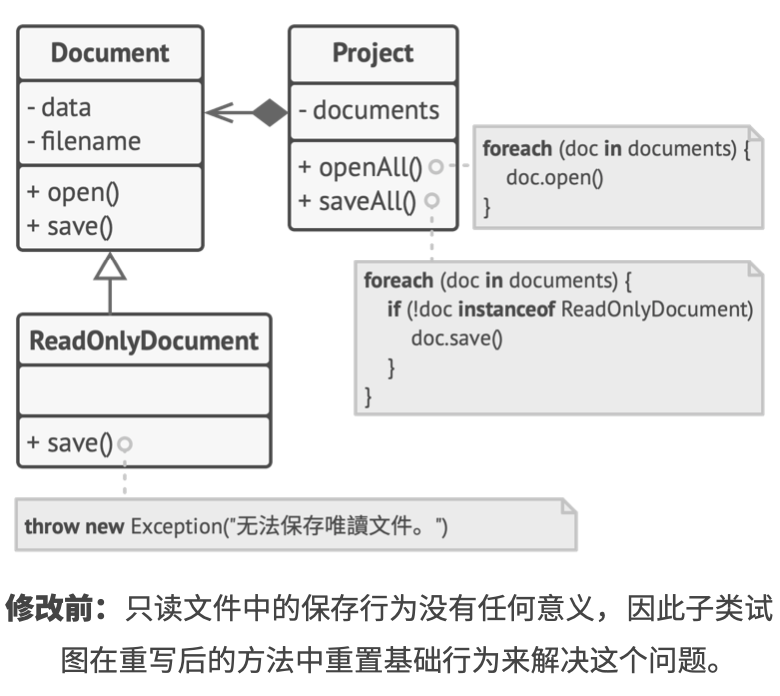
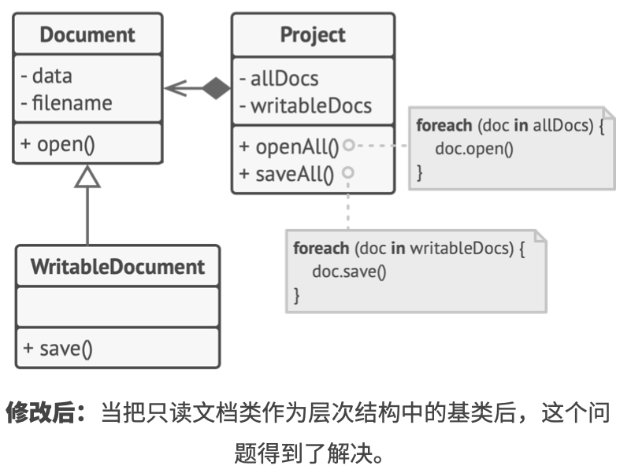
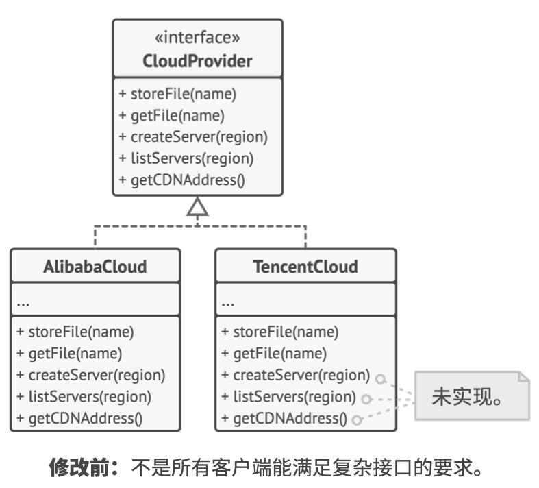
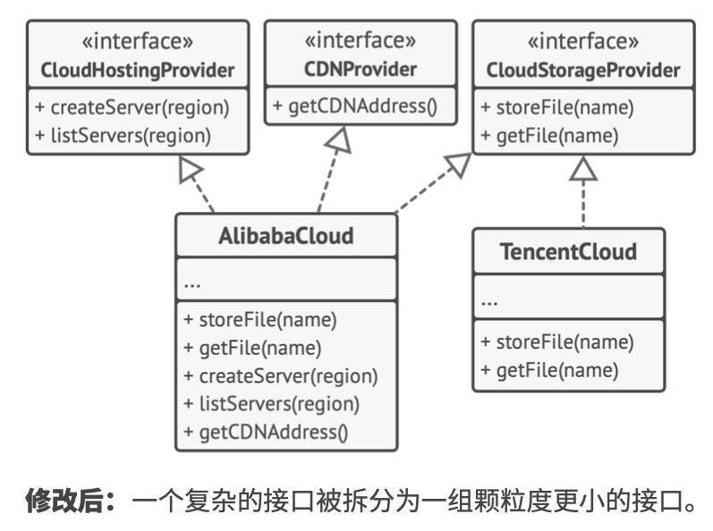
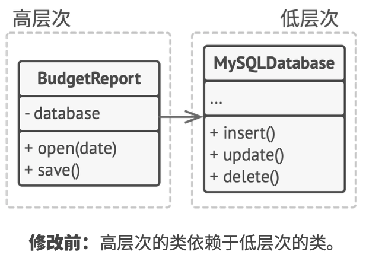
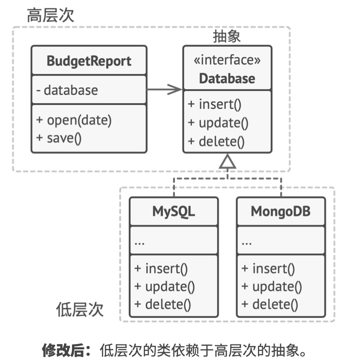

# 《深入设计模式》学习笔记（3）

## 第6章 SOLID 原则

> 《敏捷软件开发: 原则、 模式与实践》: https://refactoringguru.cn/principles-book

### S 单一职责原则（Single Responsibility Principle）

> 修改一个类的原因只能有一个

尽量让每个类只负责软件中的一个功能，并将该功能完全封装在该类中。

### O 开闭原则（Open/Closed Principle）

> 对于扩展，类应该是“开放”的；对于修改，类应该是“封闭”的

本原则的主要理念是在实现新功能时保持已有代码不变。

如果你对一个类进行扩展，可以创建它的子类并对其做任何事情（如新增方法或成员变量、重写基类行为等），那么它就是开放的。

如果某个类已经做好了充分的准备并供其他类使用的话（及其接口已经明确定义以后不会修改），那么该类就是封闭（也可以称之为完整）的。

但这条原则并不能应用于对类进行的修改中，如果你发现一个类中存在缺陷，不应该用子类对他修复，因为子类不应该对父类的问题负责。

#### 示例

以下展示一个电子商务程序，包含一个计算运输费用的 Order 类。

你可以通过应用**策略模式**来解决这个问题。首先将运输方法抽取到拥有同样接口的不同类中，然后就可以通过扩展运输方式类（`shipping`）来新建一个类，而无需修改任何订单类的代码。

此外，根据单一职责原则，这个解决方案能够让你将运输时间的计算代码移动到与其相关度更高的类中。

### L 里氏替换原则（Liskov Substitution Principle）

> 当你扩展一个类时，记住应该要在不修改客户端代码的情况下将子类的对象作为父类对象进行传递。

这意味着子类必须保持与父类行为的兼容。在重写一个方法时，你要对基类的行为进行扩展，而不是将其完全替换。

替换原则是用于预测子类是否与代码兼容，以及是否能与其超类对象协作的一组检查。替换原则包含一些对子类（特别是其方法）的形式要求。

- 子类方法的参数类型必须与其超类的参数类型相匹配或更加抽象

  比如父类方法`(arg1: Cat) => void`的参数类型为`Cat`，其子类方法的参数 arg1 应该为`Cat`的父类`Animal`，如`(arg1: Animal) => void`

- 子类方法的返回值类型必须与超类方法的返回值类型或是其子类别相匹配

  比如父类方法的返回值为 Cat，如`(arg1: any) => Cat`，子类方法的返回值应该为`Cat`的子类，如`BengalCat`，如`(arg1: any) => BengalCat`。

  > 关于上面两点，涉及到经常提到的 **协变** 和 **逆变** 的概念，具体可以看[这篇文章](https://juejin.cn/post/6994102811218673700#heading-2)的类型兼容性小节，解释得更为清楚。

- 子类中的方法不应该抛出基础方法预期之外的异常类型，换句话说，异常类型必须与基础方法能抛出的异常或是其子类别相匹配。

  > 在 Java 和 C# 等静态类型的编程语言中，这些规则已内置于其中，如果违反了该规则，将无法对程序进行编译。

- 子类不应该加强其前置条件。例如基类的方法有一个参数为`int`类型，而如果子类将该类型限制为正数，那之前的代码就会出错。

- 子类不能削弱其后置条件。

- 超类的不变量必须保留。

- 子类不能修改超类中私有变量的值。有些编程语言允许通过访问机制来访问类的私有成员，而还有一些语言没有对私有成员进行任何保护。

#### 示例

下面是一个违反替换原则的文档类层次结构例子。

上面的`ReadOnlyDocuments`只读文件类中的 save 方法会在被调用时抛出一个异常，如果我们没有在保存前检查文档类型，客户端代码将会出错。

你可以通过重新设计类层次结构来解决这个问题。

  ### I 接口隔离原则（Interface Segregation Principle）

> 客户端不应该被强迫依赖于其不使用的方法

尽量缩小接口的范围，使得客户端的类不必实现其不需要的行为。 

#### 示例

当你着手为其他供应商提供支持时，程序库中绝大部分的接口会显得过于宽泛。更好的方法是将接口拆分为多个部分。

### D 依赖倒置原则（Denpendency Inversion Principle）

> 高层次的类不应该依赖于低层次的类。两者都应该依赖于抽象接口。抽象接口不应该依赖于具体实现，具体实现应该依赖于抽象接口。

- 低层次的类实现基础操作（例如磁盘操作、传输网络数据和连接数据库）
- 高层次类包含复杂业务逻辑以指导低层次类执行特定操作

依赖倒置原则通常和开闭原则共同发挥作用：你无需修改已有类就能用不同的业务逻辑类扩展低层次的类。

#### 示例

