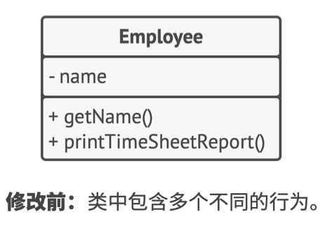
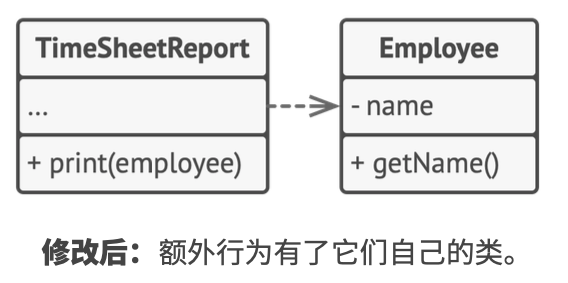

# 《深入设计模式》学习笔记（3）

## 第6章 SOLID 原则

> 《敏捷软件开发: 原则、 模式与实践》: https://refactoringguru.cn/principles-book

### S 单一职责原则（Single Responsibility Principle）

> 修改一个类的原因只能有一个

尽量让每个类只负责软件中的一个功能，并将该功能完全封装在该类中。

### O 开闭原则（Open/Closed Principle）

> 对于扩展，类应该是“开放”的；对于修改，类应该是“封闭”的

> 本次阅读至 P54 55，下次阅读应至 68