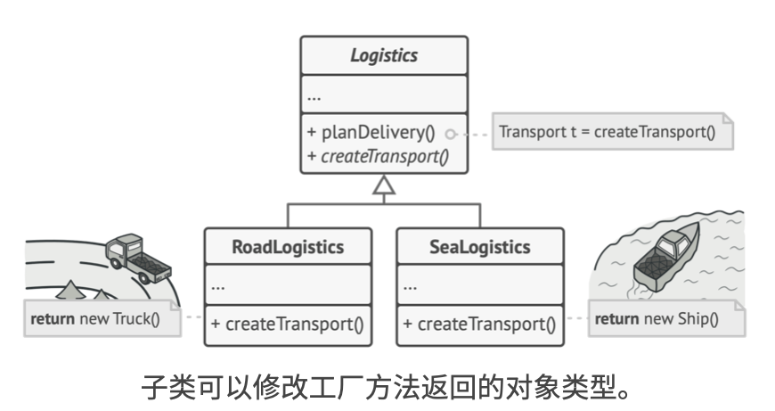
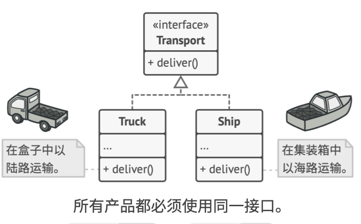
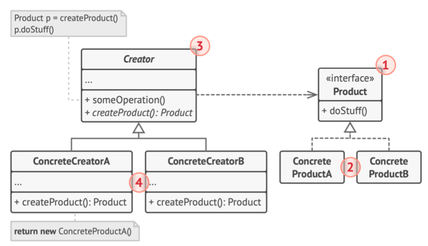
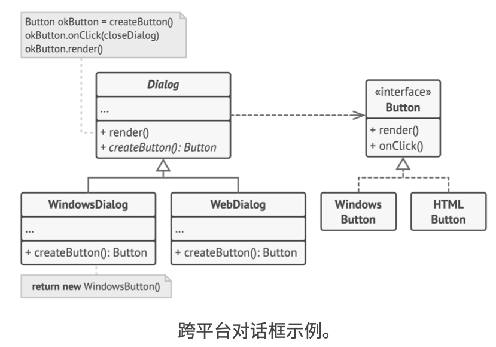

# 《深入设计模式》学习笔记（4）

**设计模式目录**

## 第7章 创建型模式

创建型模式提供了创建对象的机制，能够提升已有代码的灵活性和可复用性。

本节介绍以下设计模式：

- 工厂方法：在父类中提供一个创建对象的接口，以允许由子类决定实例化对象的类型
- 抽象工厂：让你能创建一系列相关的对象，而无需指定其具体类
- 生成器：使你能够分步骤创建复杂对象。该模式允许你使用相同的创建代码来生成不同类型和形式的对象
- 原型：让你能够复制已有对象，而又无需使代码依赖它们所属的类
- 单例：让你能够保证一个类只有一个实例，并提供一个访问该实例的全局节点

### 7.1 工厂方法

工厂方法亦称虚拟构造函数、Virtual Constructor、Factory Method。

该模式建议使用特殊的工厂方法代替对于对象构造函数的直接调用，对象依然会通过`new` 运算符创建，只是该运算符会改在工厂方法中调用，工厂方法返回的对象通常被称为“产品”。



乍看之下这种更改可能毫无意义（这只是改变了程序中调用构造函数的位置而已），但是仔细想一下，现在你可以在子类中重写工厂方法，从而改变其创建产品的类型。

但有一点要注意的是，使用这种方法产出的“产品”应该具有共同的基类或者接口时，子类才能返回不同类型的产品，同时基类中的工厂方法还应该将其返回类型声明为这一共同接口。



#### 结构



上图解释了工厂方法模式的具体使用步骤：

1. **产品**：将会对接口进行声明，对于所有由创建者及其子类构建的对象，这些接口都是通用的。
2. **具体产品**：是产品接口的不同实现。
3. **创建者**：返回产品对象的工厂方法。该方法的返回对象类型必须与产品接口相匹配。你可以将工厂方法声明为抽象方法，强制要求每个子类以不同方式实现该方法。或者你也可以在基础工厂方法中返回默认的产品类型。
4. **具体创建者**：将会重写基础的工厂方法，使其返回不同类型的产品。

注意并不是每次调用工厂方法都会创建新的实例。工厂方法也可以返回缓存、对象池或其他来源的已有对象。

#### 代码实例

> [TypeScript **工厂**模式讲解和代码示例](https://refactoringguru.cn/design-patterns/factory-method/typescript/example#lang-features)



```typescript
/**
 * The Creator class declares the factory method that is supposed to return an
 * object of a Product class. The Creator's subclasses usually provide the
 * implementation of this method.
 */
abstract class Creator {
    /**
     * Note that the Creator may also provide some default implementation of the
     * factory method.
     */
    public abstract factoryMethod(): Product;

    /**
     * Also note that, despite its name, the Creator's primary responsibility is
     * not creating products. Usually, it contains some core business logic that
     * relies on Product objects, returned by the factory method. Subclasses can
     * indirectly change that business logic by overriding the factory method
     * and returning a different type of product from it.
     */
    public someOperation(): string {
        // Call the factory method to create a Product object.
        const product = this.factoryMethod();
        // Now, use the product.
        return `Creator: The same creator's code has just worked with ${product.operation()}`;
    }
}

/**
 * Concrete Creators override the factory method in order to change the
 * resulting product's type.
 */
class ConcreteCreator1 extends Creator {
    /**
     * Note that the signature of the method still uses the abstract product
     * type, even though the concrete product is actually returned from the
     * method. This way the Creator can stay independent of concrete product
     * classes.
     */
    public factoryMethod(): Product {
        return new ConcreteProduct1();
    }
}

class ConcreteCreator2 extends Creator {
    public factoryMethod(): Product {
        return new ConcreteProduct2();
    }
}

/**
 * The Product interface declares the operations that all concrete products must
 * implement.
 */
interface Product {
    operation(): string;
}

/**
 * Concrete Products provide various implementations of the Product interface.
 */
class ConcreteProduct1 implements Product {
    public operation(): string {
        return '{Result of the ConcreteProduct1}';
    }
}

class ConcreteProduct2 implements Product {
    public operation(): string {
        return '{Result of the ConcreteProduct2}';
    }
}

/**
 * The client code works with an instance of a concrete creator, albeit through
 * its base interface. As long as the client keeps working with the creator via
 * the base interface, you can pass it any creator's subclass.
 */
function clientCode(creator: Creator) {
    // ...
    console.log('Client: I\'m not aware of the creator\'s class, but it still works.');
    console.log(creator.someOperation());
    // ...
}

/**
 * The Application picks a creator's type depending on the configuration or
 * environment.
 */
console.log('App: Launched with the ConcreteCreator1.');
clientCode(new ConcreteCreator1());
console.log('');

console.log('App: Launched with the ConcreteCreator2.');
clientCode(new ConcreteCreator2());
```

每添加一个新的工厂方法，你就离**抽象工厂**模式更近一步。

#### 适用应用场景

- 当编写代码过程中，如果无法预知对象确切类别及其依赖关系，可使用工厂方法。

  工厂方法可以将创建产品的代码与实际适用产品的代码分离，从而能在不影响其他代码的情况下扩展产品创建部分代码

- 如果你希望用户能扩展你软件或框架的内部组件，可使用工厂方法。

- 如果你希望复用现有对象来节省系统资源，而不是每次都重新创建对象。

#### 优缺点

优点：

- 可以避免创建者和具体产品之间的紧密耦合
- 单一职责原则，可以将产品创建代码放在程序的单一位置，从而使代码更容易维护
- 开闭原则，无需更改现有的客户端代码就可以在程序中引入新的产品类型

缺点：

- 应用工厂方法模式需要引入许多新的子类，代码可能会因此变得更复杂。更好的情况是将该模式引入创建者类的现有层次结构中

#### 与其他模式的关系

- 该模式较为简单，可以设计工作的初期进行，随后再演化为使用**抽象工厂**、**原型**或**生成器**（更灵活但更复杂）
- **抽象工厂**模式通常基于一组**工厂方法**，但也可以使用**原型**模式来生成这些类的方法
- 可以同时使用**工厂方法**和**迭代器**来让子类集合返回不同类型的迭代器，并使得迭代器与集合相匹配。
- **原型**并不基于继承，因此没有继承的缺点。另一方面，原型需要对被复制对象进行复杂的初始化。**工厂方法**基于继承，但是它不需要初始化步骤
- 工厂方法是**模板方法**的一种特殊形式。同时，工厂方法也可以作为一个大型**模板方法**中的一个步骤

