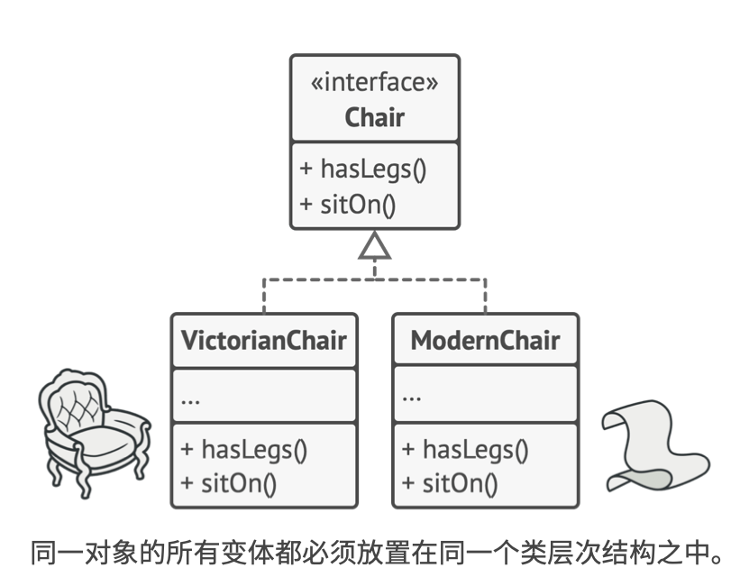
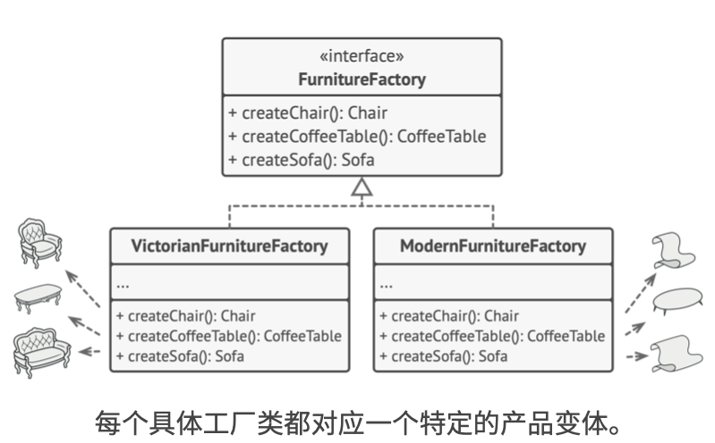
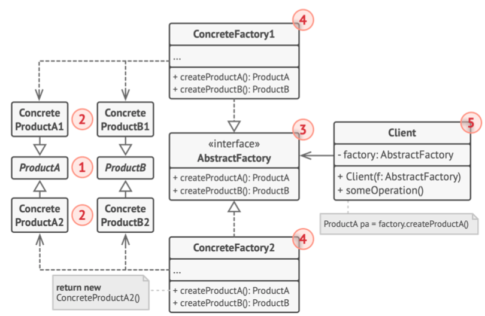

# 《深入设计模式》学习笔记（5）

## 第7章 创建型模式

### 7.2 抽象工厂

抽象工厂能创建一系列相关的对象，而无需指定其具体类。

抽象工厂模式建议为系列中的每件产品都明确声明接口（例如椅子，沙发或咖啡桌）。然后，确保素有产品变体都继承这些接口。例如，所有“风格”的椅子都实现`椅子`接口；所有风格的咖啡桌都实现咖啡桌接口，以此类推。



接下来，我们需要声明**抽象工厂**——这包含了系列中所有产品构造方法的接口。例如`createChair`创建椅子、`createSofa`创建沙发，等等。这些方法必须返回**抽象**的产品类型，即之前声明的接口，如`椅子`，`沙发`等等。



对于系列产品的每个变体，都将基于抽象工厂接口创建不同的工厂类。每个工厂类都只能返回特定类别的产品。例如`现代家具工厂`类只能创建`现代椅子`、`现代沙发`等对象。

假设客户端想要工厂创建一个椅子，客户端安无需了解工厂类，也不用管工厂类创建出的椅子类型，它只需要知道抽象类`椅子`的接口，知道椅子以某种方式实现了`坐下`方法就足够了。

最后要说明的是，如果客户端仅仅接触`椅子`的抽象接口，那谁来决定具体工厂要创建的对象的类型呢？一般情况下，应用程序会在初始化阶段创建具体的工厂对象，而在此之前，应用程序必须根据配置文件或环境设定选择工厂类别。

#### 结构



1. **抽象产品**：构成系列产品的，一组不同但相关的，产品声明接口
2. **具体产品**：是抽象产品的多种不同类型实现。所有变体（不同风格）都必须实现相应的抽象产品
3. **抽象工厂**：接口声明了一组创建各种抽象产品的方法
4. **具体工厂**：实现抽象工厂的构建方法。每个具体工厂都对应特定产品变体，且仅创建此种产品变体。
5. **客户端**：使用工厂类的客户端代码不会与工厂创建的特定产品变体耦合（个人理解：也就是 Client 中的 factory 会声明为抽象类而不是具体的产品类）。**客户端在初始化时通过指定具体的工厂类型**，然后就只需要通过抽象接口调用工厂和产品对象，就能和任何具体工厂的产品进行变体交互。

#### 伪代码

> [示例代码](https://refactoringguru.cn/design-patterns/abstract-factory/typescript/example#lang-features)

下面的例子使得客户端代码无需与具体 UI 类耦合，就能创建跨平台的 UI 元素，同时确保所创建的元素与指定的操作系统相匹配。


其运作方式是：应用程序启动后检测当前的操作系统，根据该信息，应用程序通过与该操作系统对应的类创建工厂对象，其余代码使用该工厂对象创建 UI 元素。

这样一来，每次在应用程序中添加新的 UI 元素变体时，你都无需修改客户端代码，而只需要创建一个能够生成这些 UI 元素的工厂类，然后稍微修改应用程序的初始代码，使其能够选择合适的工厂类即可。

```typescript
/**
 * The Abstract Factory interface declares a set of methods that return
 * different abstract products. These products are called a family and are
 * related by a high-level theme or concept. Products of one family are usually
 * able to collaborate among themselves. A family of products may have several
 * variants, but the products of one variant are incompatible with products of
 * another.
 */
interface AbstractFactory {
    createProductA(): AbstractProductA;

    createProductB(): AbstractProductB;
}

/**
 * Concrete Factories produce a family of products that belong to a single
 * variant. The factory guarantees that resulting products are compatible. Note
 * that signatures of the Concrete Factory's methods return an abstract product,
 * while inside the method a concrete product is instantiated.
 */
class ConcreteFactory1 implements AbstractFactory {
    public createProductA(): AbstractProductA {
        return new ConcreteProductA1();
    }

    public createProductB(): AbstractProductB {
        return new ConcreteProductB1();
    }
}

/**
 * Each Concrete Factory has a corresponding product variant.
 */
class ConcreteFactory2 implements AbstractFactory {
    public createProductA(): AbstractProductA {
        return new ConcreteProductA2();
    }

    public createProductB(): AbstractProductB {
        return new ConcreteProductB2();
    }
}

/**
 * Each distinct product of a product family should have a base interface. All
 * variants of the product must implement this interface.
 */
interface AbstractProductA {
    usefulFunctionA(): string;
}

/**
 * These Concrete Products are created by corresponding Concrete Factories.
 */
class ConcreteProductA1 implements AbstractProductA {
    public usefulFunctionA(): string {
        return 'The result of the product A1.';
    }
}

class ConcreteProductA2 implements AbstractProductA {
    public usefulFunctionA(): string {
        return 'The result of the product A2.';
    }
}

/**
 * Here's the the base interface of another product. All products can interact
 * with each other, but proper interaction is possible only between products of
 * the same concrete variant.
 */
interface AbstractProductB {
    /**
     * Product B is able to do its own thing...
     */
    usefulFunctionB(): string;

    /**
     * ...but it also can collaborate with the ProductA.
     *
     * The Abstract Factory makes sure that all products it creates are of the
     * same variant and thus, compatible.
     */
    anotherUsefulFunctionB(collaborator: AbstractProductA): string;
}

/**
 * These Concrete Products are created by corresponding Concrete Factories.
 */
class ConcreteProductB1 implements AbstractProductB {

    public usefulFunctionB(): string {
        return 'The result of the product B1.';
    }

    /**
     * The variant, Product B1, is only able to work correctly with the variant,
     * Product A1. Nevertheless, it accepts any instance of AbstractProductA as
     * an argument.
     */
    public anotherUsefulFunctionB(collaborator: AbstractProductA): string {
        const result = collaborator.usefulFunctionA();
        return `The result of the B1 collaborating with the (${result})`;
    }
}

class ConcreteProductB2 implements AbstractProductB {

    public usefulFunctionB(): string {
        return 'The result of the product B2.';
    }

    /**
     * The variant, Product B2, is only able to work correctly with the variant,
     * Product A2. Nevertheless, it accepts any instance of AbstractProductA as
     * an argument.
     */
    public anotherUsefulFunctionB(collaborator: AbstractProductA): string {
        const result = collaborator.usefulFunctionA();
        return `The result of the B2 collaborating with the (${result})`;
    }
}

/**
 * The client code works with factories and products only through abstract
 * types: AbstractFactory and AbstractProduct. This lets you pass any factory or
 * product subclass to the client code without breaking it.
 */
function clientCode(factory: AbstractFactory) {
    const productA = factory.createProductA();
    const productB = factory.createProductB();

    console.log(productB.usefulFunctionB());
    console.log(productB.anotherUsefulFunctionB(productA));
}

/**
 * The client code can work with any concrete factory class.
 */
console.log('Client: Testing client code with the first factory type...');
clientCode(new ConcreteFactory1());

console.log('');

console.log('Client: Testing the same client code with the second factory type...');
clientCode(new ConcreteFactory2());
```

```typescript
// 笔者写得一个简单例子
class Button {
    text?: string;
    constructor() {
        this.text = 'button'
    }
}

class MacButton extends Button {
    constructor() {
        super()
        this.text = 'MacButton'
    }
}

interface GUIFactory {
    createButton(): Button
}

class MacFactory implements GUIFactory {
    createButton() {
        return new MacButton()
    }
    dd() {}
}

function client(aa: GUIFactory) {
    var res = aa.createButton()
    console.log(res.text)
}

client(new MacFactory())
```

#### 适合应用场景

- 代码需要与多个不同系列的相关产品交互，并且出于对未来扩展性的考虑，不希望代码基于产品的具体类进行构建，在这种情况下，可以使用抽象工厂。

  这是因为抽象工厂会提供一个接口用于创建每个系列产品的对象，只要通过该接口创建对象，就不会生成与应用程序已生成的产品类型不一致的产品。

- 如果有一个基于一组**抽象方法**的类，且其主要功能因此变得不明确，那么在这种情况下可以考虑使用抽象工厂模式。

#### 实现方式

1. 以不同的产品类型与产品变体为维度绘制矩阵
2. 为所有产品声明抽象产品接口，然后让所有的具体产品类实现这些接口
3. 声明抽象工厂接口，并且在接口中为所有抽象产品提供一组构建方法
4. 为每种产品变体实现一个具体工厂类
5. 在应用程序中开发初始化代码。该代码根据应用程序配置或当前环境，对特定具体工厂类进行初始化。然后将该工厂对象传递给所有需要创建产品的类。
6. 找出代码中所有对产品构造的直接调用，将其替换为工厂对象中相应构建方法的调用

#### 优缺点

优点：

- 可以确保同一工厂生成的产品相互匹配
- 可以避免客户端和具体产品代码的耦合
- 单一职责原则。可以将产品生成代码抽取到同一位置，使得代码易于维护
- 开闭原则。向应用程序中引入新产品变体时，无需修改客户端的代码

缺点：

- 由于采用该模式需要向应用中引入很多的接口和类，代码会比之前更加复杂

#### 与其他模式的关系

- **工厂方法**模式的进阶，更灵活但更复杂。
- **生成器**一般重点关注如何分步生成复杂对象。而**抽象工厂**专门用于生成一系列相关对象。抽象工厂会马上返回产品，生成器则允许在获取产品前执行一些额外的构造步骤。
- **抽象工厂**模式通常基于一组**工厂方法**，但也可以使用**原型**模式来生成这些类的方法
- 当只需要对客户端代码隐藏子系统创建对象的方式时，你可以使用**抽象工厂**来代替**外观**。
- 可以将**抽象工厂**和**桥接**搭配使用，抽象工厂可以对由桥接定义的抽象进行封装，并且对客户端代码隐藏其复杂性。
- **抽象工程**、**生成器**、**原型**都可以用**单例**来实现。