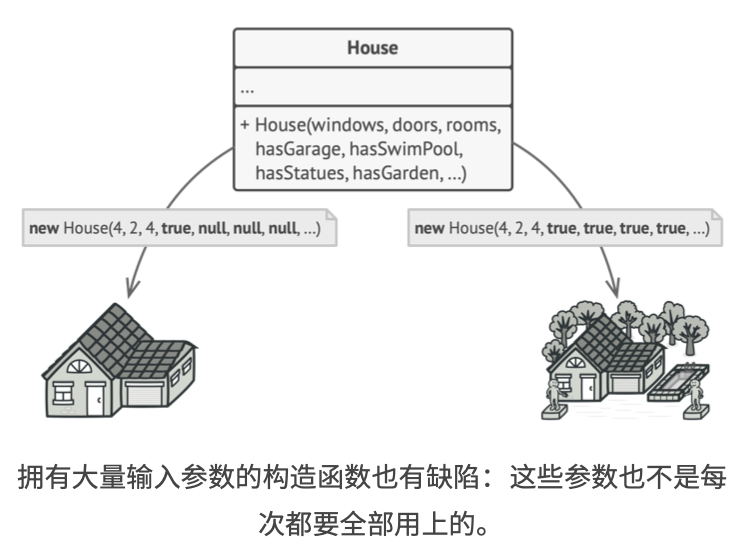
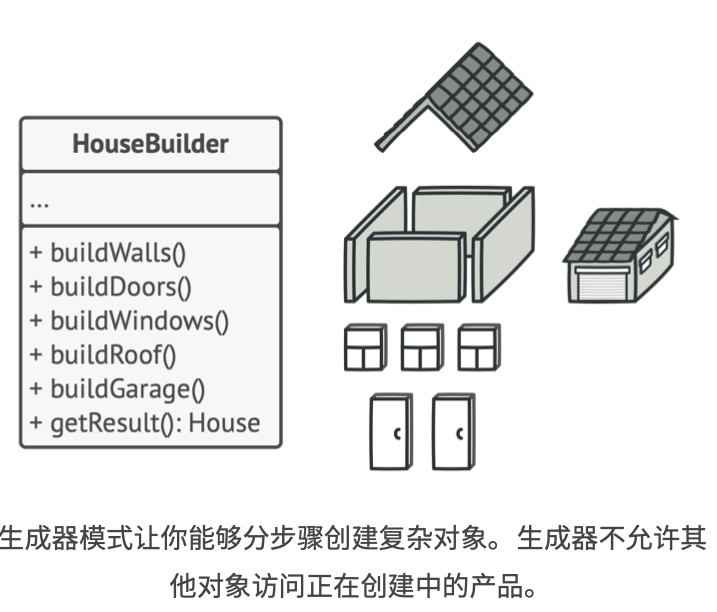
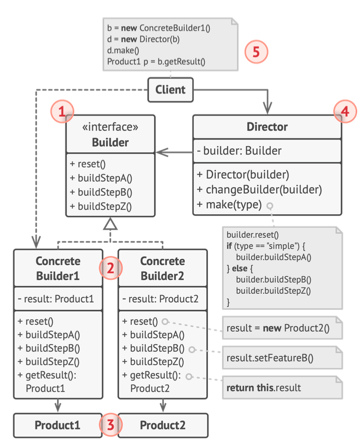
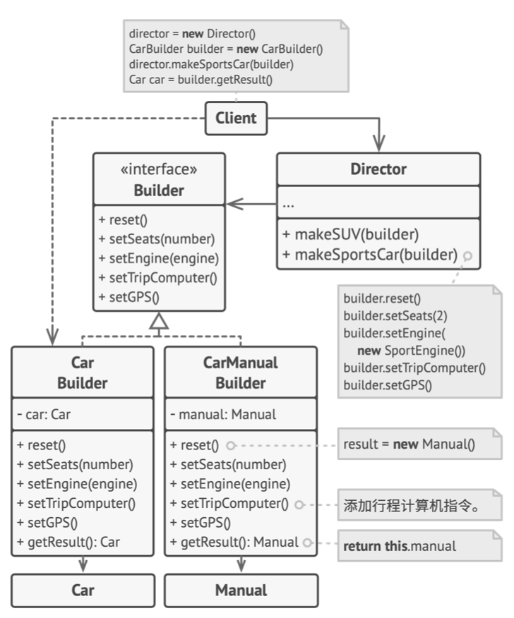

# 《深入设计模式》学习笔记（6）

## 第7章 创建型模式

### 7.3 生成器

生成器使你能够分步骤创建复杂对象。该模式允许你使用相同的创建代码来生成不同类型和形式的对象。

#### 问题

假如有一个复杂对象，在对其进行构造的时候，需要对诸多的成员变量和嵌套对象进行繁复的初始化工作。而这些初始化代码相当复杂，甚至有可能散落在客户端代码的多个位置。

在这种情况下，在学习生成器模式之前，通常有两种做法：

1. 扩展基类，然后创造一系列涵盖所有参数组合的子类，这样做看起来很合理，但最终会导致非常多的子类出现，任何新增的参数（例如新的产品类型）都会让这个层次结构更加复杂。
2. 另一种方法是无需生成子类。可以在基类中创建一个包括所有可能的超级构造函数，用它来控制对象的类型。这样可以避免生成子类，但是会导致另外一个问题，那就是参数过多，使得构造函数的调用十分不简洁。



#### 解决方案

生成器模式建议将对象构造代码从产品类中抽取出来，并将其放入一个名为生成器的独立对象中。



该模式会将对象的构造过程划分为一组步骤，比如`buildWalls`和`buildDoor`等等。每次创建对象时，需要通过生成器对象执行一系列步骤。**重点在于你无需调用所有步骤**，而只需要调用创建特定对象配置所需的那些步骤即可。

当需要创建不同形式的产品时，一些构造步骤可能需要不同的实现，在这种情况下，可以创建多个不同的生成器，用不同方式实现一组相同的创建步骤，然后在创建过程中使用这些生成器来生成不同类型的对象。

#### 主管

可以进一步将用于创建产品的一系列生成器步骤调用抽取称为单独的主管类。主管类可以定义创建步骤的执行顺序，而生成器则提供这些步骤的实现。

严格来说，程序中并不一定需要主管类，客户端代码可直接以特定顺序调用创建步骤。不过，主管类中非常适合放入各种例行构造流程，以便在程序中反复使用。

#### 结构



1. **生成器**：接口，声明在所有类型的生成器中通用的产品构造步骤。
2. **具体生成器**：提供构造过程的不同实现。具体生成器也可以构造不遵循通用接口的产品。
3. **产品**：最终生成的对象。由不同生成器构造的产品无需属于同一类层次结构或接口。
4. **主管**：类定义调用构造步骤的顺序，这样你就可以创建和复用特定的产品配置。
5. **客户端**：必须将某个生成器对象与主管类关联。一般情况下，你只需要通过主管类构造函数的参数进行一次性关联即可。此后主管类就能使用生成器对象完成后续所有的构造任务。

#### 伪代码

> [示例代码](https://refactoringguru.cn/design-patterns/builder/typescript/example#lang-features)

```typescript
/**
 * The Builder interface specifies methods for creating the different parts of
 * the Product objects.
 */
interface Builder {
    producePartA(): void;
    producePartB(): void;
    producePartC(): void;
}

/**
 * The Concrete Builder classes follow the Builder interface and provide
 * specific implementations of the building steps. Your program may have several
 * variations of Builders, implemented differently.
 */
class ConcreteBuilder1 implements Builder {
    private product: Product1;

    /**
     * A fresh builder instance should contain a blank product object, which is
     * used in further assembly.
     */
    constructor() {
        this.reset();
    }

    public reset(): void {
        this.product = new Product1();
    }

    /**
     * All production steps work with the same product instance.
     */
    public producePartA(): void {
        this.product.parts.push('PartA1');
    }

    public producePartB(): void {
        this.product.parts.push('PartB1');
    }

    public producePartC(): void {
        this.product.parts.push('PartC1');
    }

    /**
     * Concrete Builders are supposed to provide their own methods for
     * retrieving results. That's because various types of builders may create
     * entirely different products that don't follow the same interface.
     * Therefore, such methods cannot be declared in the base Builder interface
     * (at least in a statically typed programming language).
     *
     * Usually, after returning the end result to the client, a builder instance
     * is expected to be ready to start producing another product. That's why
     * it's a usual practice to call the reset method at the end of the
     * `getProduct` method body. However, this behavior is not mandatory, and
     * you can make your builders wait for an explicit reset call from the
     * client code before disposing of the previous result.
     */
    public getProduct(): Product1 {
        const result = this.product;
        this.reset();
        return result;
    }
}

/**
 * It makes sense to use the Builder pattern only when your products are quite
 * complex and require extensive configuration.
 *
 * Unlike in other creational patterns, different concrete builders can produce
 * unrelated products. In other words, results of various builders may not
 * always follow the same interface.
 */
class Product1 {
    public parts: string[] = [];

    public listParts(): void {
        console.log(`Product parts: ${this.parts.join(', ')}\n`);
    }
}

/**
 * The Director is only responsible for executing the building steps in a
 * particular sequence. It is helpful when producing products according to a
 * specific order or configuration. Strictly speaking, the Director class is
 * optional, since the client can control builders directly.
 */
class Director {
    private builder: Builder;

    /**
     * The Director works with any builder instance that the client code passes
     * to it. This way, the client code may alter the final type of the newly
     * assembled product.
     */
    public setBuilder(builder: Builder): void {
        this.builder = builder;
    }

    /**
     * The Director can construct several product variations using the same
     * building steps.
     */
    public buildMinimalViableProduct(): void {
        this.builder.producePartA();
    }

    public buildFullFeaturedProduct(): void {
        this.builder.producePartA();
        this.builder.producePartB();
        this.builder.producePartC();
    }
}

/**
 * The client code creates a builder object, passes it to the director and then
 * initiates the construction process. The end result is retrieved from the
 * builder object.
 */
function clientCode(director: Director) {
    const builder = new ConcreteBuilder1();
    director.setBuilder(builder);

    console.log('Standard basic product:');
    director.buildMinimalViableProduct();
    builder.getProduct().listParts();

    console.log('Standard full featured product:');
    director.buildFullFeaturedProduct();
    builder.getProduct().listParts();

    // Remember, the Builder pattern can be used without a Director class.
    console.log('Custom product:');
    builder.producePartA();
    builder.producePartC();
    builder.getProduct().listParts();
}

const director = new Director();
clientCode(director);
```



#### 适合应用场景

- 假如构造函数中有十个可选参数，那么调用该函数会非常不方便，使用生成器模式可避免“重叠构造函数”的出现，应用该模式后，让你可以分步骤声称对象，而且允许你仅使用必须的步骤，再也不需要将几十个参数塞进构造函数里了。

- 当你希望使用代码创建不同形式的产品时，可使用生成器模式

- 使用生成器构造组合树或其他复杂对象

  你甚至可以递归或延迟执行某些步骤，这在创建对象树时非常方便

#### 实现方法

1. 清晰地定义通用步骤，确保它可以制造所有形式的产品
2. 在基本生成器接口中声明这些步骤
3. 为每个形式的产品创建具体生成类，并实现其构造步骤
4. 考虑创建主管类。它可以使用统一生成器对象来封装多种构造产品的方式。
5. 客户端代码会同时创建生成器和主管对象。**构造开始前，客户端必须将声称其对象传递给主管对象**。
6. 只有在所有产品都遵循相同接口的情况下，构造结果可以直接通过主管类获取。否则，客户端应该通过生成器获取构造结果。

#### 优缺点

优点：

- 可以分布地创建对象，暂缓创建步骤或者递归运行创建步骤
- 生成不同形式的产品时，你可以复用相同的制造代码
- 单一职责原则，可以将复杂构造代码从产品的业务逻辑中分离出来

缺点：

- 由于该模式需要新增多个类，因此代码整体复杂程度会有所下降。

#### 与其他模式的关系

- 生成器模式比**工厂方法**更灵活但更加复杂
- **生成器**重点关注如何分步生成复杂对象。 **抽象工厂**专门用于生产一系列相关对象。抽象工厂会马上返回产品， 生成器则允许你在获取产品前执行一些额外构造步骤。
- 你可以在创建复杂**组合**树时使用**生成器**， 因为这可使其构造步骤以递归的方式运行。
- 你可以结合使用**生成器**和**桥接**模式: 主管类负责抽象工作，各种不同的生成器负责实现工作。
- **抽象工厂**、 **生成器**和**原型**都可以用**单例**来实现。


