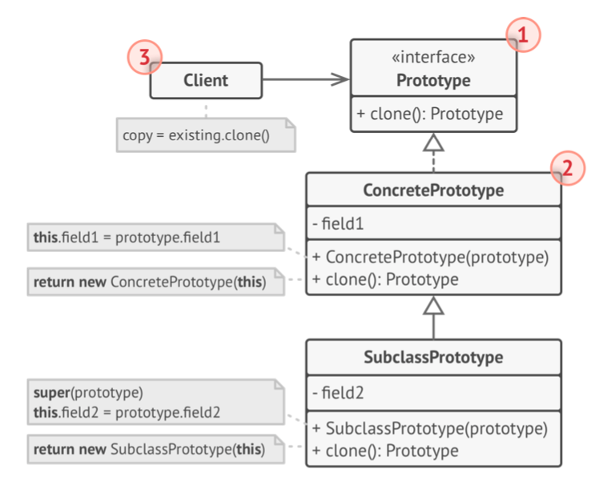
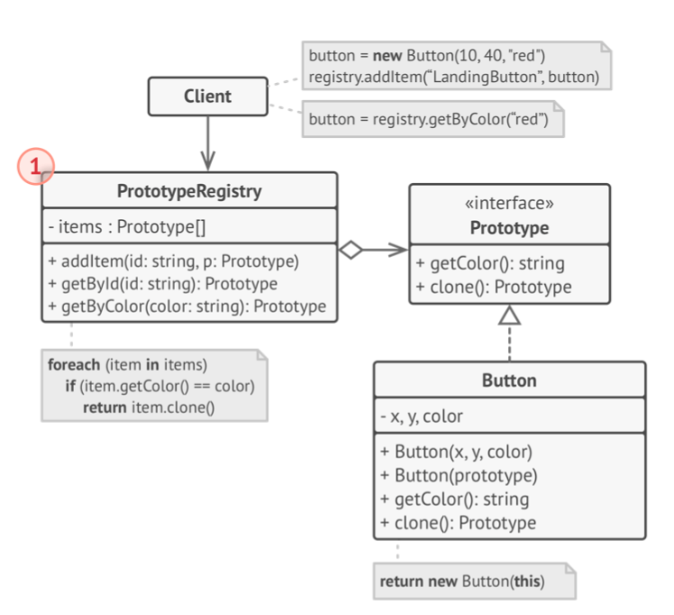
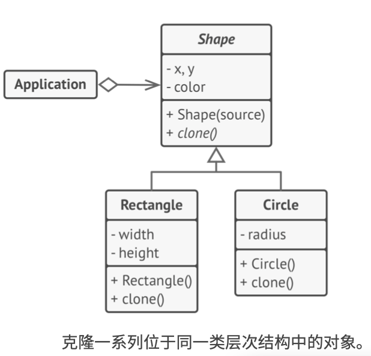

# 《深入设计模式》学习笔记（7）

## 第7章 创建型模式

### 7.4 原型

原型使你能够复制已有对象，而又无需使代码依赖它们所属的类。

#### 问题

如果此时有一个对象，希望生成与其完全相同的一个复制品，该如何实现呢？

表面来看，必须**遍历原始对象中的所有成员变量，并将成员变量复制到新对象中**。

但是并非所有对象都能通过这种方式进行复制，因为有些对象可能拥有私有成员变量，它们在对象本身以外是不可见的。此外，直接复制还有几个问题，因为必须知道对象所属的类才能创建复制品，所以代码必须依赖该类。即使可以接受这种额外的依赖，还有另外一个问题：有时候只知道对象所实现的接口，而不知道其所属的具体类。（比如某个方法的某个参数，可能是实现了某个接口的任何对象）

#### 解决方案

原型模式将克隆过程委派给克隆的实际对象。模式会为所有支持克隆的对象声明一个通用接口，该接口让你能够克隆对象，同时又无需将代码和对象所属类耦合。通常情况下，这样的接口中仅仅包含一个克隆方法。

所有的类对于该`克隆`方法的实现都非常相似。该方法会创建一个当前类的对象，然后将原始对象所有的成员变量值复制到新建的类中，由于在类的方法中，所以你甚至可以复制私有成员变量。

支持克隆的对象即为**原型**，当你的对象有几十个成员变量和几百种类型时，对其进行克隆甚至可以代替子类的构造。

#### 结构

##### 基本实现



1. **原型**：接口将对克隆方法进行声明，绝大多数情况下，其中只会有一个名为`克隆`的方法。
2. **具体原型**：将实现具体的克隆方法。除了将原始对象的数据复制到克隆体中以外，该方法有时还需要处理克隆过程中的极端情况，例如克隆关联对象和梳理递归依赖等等。
3. **客户端**：可以复制实现了原型接口的任何对象。

##### 原型注册表实现



1. **原型注册表**：提供一种访问常用类型的简单方法，其中存储了一系列可供随时复制的预生成对象。

#### 伪代码



原型模式能让你完全生成完全相同的几何对象副本，同时无需代码与对象所属类的耦合。

在复制自身的成员变量值道结果对象前，子类可调用其父类的克隆方法。

> [示例代码](https://refactoringguru.cn/design-patterns/prototype/typescript/example#lang-features)

```typescript
/**
 * The example class that has cloning ability. We'll see how the values of field
 * with different types will be cloned.
 */
class Prototype {
    public primitive: any;
    public component: object;
    public circularReference: ComponentWithBackReference;

    public clone(): this {
        const clone = Object.create(this);

        clone.component = Object.create(this.component);

        // Cloning an object that has a nested object with backreference
        // requires special treatment. After the cloning is completed, the
        // nested object should point to the cloned object, instead of the
        // original object. Spread operator can be handy for this case.
        clone.circularReference = {
            ...this.circularReference,
            prototype: { ...this },
        };

        return clone;
    }
}

class ComponentWithBackReference {
    public prototype;

    constructor(prototype: Prototype) {
        this.prototype = prototype;
    }
}

/**
 * The client code.
 */
function clientCode() {
    const p1 = new Prototype();
    p1.primitive = 245;
    p1.component = new Date();
    p1.circularReference = new ComponentWithBackReference(p1);

    const p2 = p1.clone();
    if (p1.primitive === p2.primitive) {
        console.log('Primitive field values have been carried over to a clone. Yay!');
    } else {
        console.log('Primitive field values have not been copied. Booo!');
    }
    if (p1.component === p2.component) {
        console.log('Simple component has not been cloned. Booo!');
    } else {
        console.log('Simple component has been cloned. Yay!');
    }

    if (p1.circularReference === p2.circularReference) {
        console.log('Component with back reference has not been cloned. Booo!');
    } else {
        console.log('Component with back reference has been cloned. Yay!');
    }

    if (p1.circularReference.prototype === p2.circularReference.prototype) {
        console.log('Component with back reference is linked to original object. Booo!');
    } else {
        console.log('Component with back reference is linked to the clone. Yay!');
    }
}

clientCode();
```

#### 适合应用场景

- 如果需要复制一些对象，同时又希望代码独立于这些对象所属的具体类，可以使用原型模式。
- 如果子类的区别仅在于其对象的初始化方式，那么你可以使用该模式来减少子类的数量

#### 实现方式

1. 创建原型接口，并在其中声明`克隆`方法。如果已有类层次结构，则只需要在所有类中添加该方法即可。
2. 原型类必须另行定义一个以该类对象为参数的构造函数。构造函数必须复制参数对象中的所有成员变量值道新建的实体中，如果需要修改子类，则必须调用父类构造函数，让父类复制其私有成员变量值。
3. 克隆方法通常只有一行代码：使用`new`运算符调用原型版本的构造函数，但注意，每个类都必须显式重写克隆方法并使用自身类名调用`new`运算符，否则克隆方法可能会生成父类对象。
4. 还可以创建一个中心化的原型注册表，用于存储常用原型

#### 优缺点

优点：

- 你可以克隆对象，而无需与它们所属的具体类相耦合
- 你可以克隆预生成原型，避免反复运行初始化代码
- 更方便地生成复杂对象
- 可以用继承以外的方式来处理复杂对象的不同配置

缺点：

- 克隆包含循环引用的复杂对象可能会非常麻烦

#### 与其他模式的关系

- 比**工厂方法**更灵活但更加复杂
- **抽象工厂**模式也可以使用**原型**模式来生成这些类的方法
- **原型**模式可以用于保存**命令**模式的历史记录
- 大量使用**组合**和**装饰**的设计通常可从对于**原型**的使用中获益。你可以通过该模式来复制复杂结构。
- **原型**并不基于继承，没有继承的缺点，但原型需要对被复制对象进行复杂的初始化，而**工厂方法**模式基于继承，但并不需要初始化步骤
- **原型**可以作为**备忘录**模式的一个简化版本，前提是需要在历史记录中存储的对象状态比较简单，不需要链接其他外部资源，或是这些链接可以方便地重建。
- **抽象工厂**、 **生成器**和**原型**都可以用**单例**来实现。

