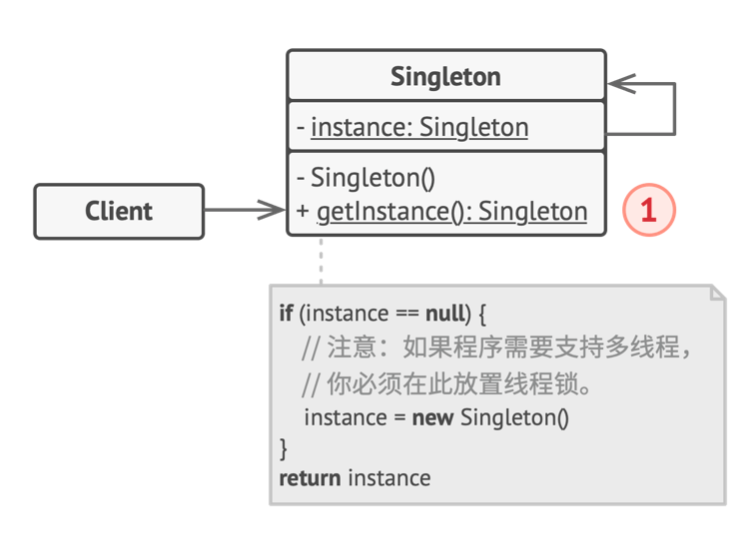

# 《深入设计模式》学习笔记（8）

## 第7章 创建型模式

### 7.8 单例

单例模式让你能够保证一个类只有一个实例，并提供一个访问该实例的全局节点。

#### 问题

（单例模式违反了单一职责原则，因为它同时解决了两个问题）

- 保证一个类只有一个实例。用于控制一个类所拥有的实例数量，从而控制某些共享资源的访问权限。而客户端甚至可能没有意识到它们一直都在使用同一个对象
- 为该实例提供一个全局访问节点。单例模式允许在程序的任何地方访问特定的对象，但是它可以保护该实例不被代码覆盖。

#### 解决方案

- 将默认构造函数设置为私有，防止其他对象使用单例类的`new`运算符
- 新建一个静态构建方法作为其构造函数，该函数会调用私有构造函数来创建对象，并将其保存在一个静态成员的变量中。此后，所有对于该函数的调用都将返回这一缓存对象。如果你的代码能够访问单例类，那它就能调用单例类的静态方法。无论何时调用该方法，它都会返回相同的对象。

#### 结构



1. **单例**：声明了一个名为`getInstance`的静态方法来返回其所属类的一个相同实例。而单例的构造函数必须对客户端代码隐藏。调用`获取实例`方法必须是获取单例对象的唯一方式。

#### 伪代码

> [示例代码](https://refactoringguru.cn/design-patterns/singleton/typescript/example#lang-features)

```typescript
/**
 * The Singleton class defines the `getInstance` method that lets clients access
 * the unique singleton instance.
 */
class Singleton {
    private static instance: Singleton;

    /**
     * The Singleton's constructor should always be private to prevent direct
     * construction calls with the `new` operator.
     */
    private constructor() { }

    /**
     * The static method that controls the access to the singleton instance.
     *
     * This implementation let you subclass the Singleton class while keeping
     * just one instance of each subclass around.
     */
    public static getInstance(): Singleton {
        if (!Singleton.instance) {
            Singleton.instance = new Singleton();
        }

        return Singleton.instance;
    }

    /**
     * Finally, any singleton should define some business logic, which can be
     * executed on its instance.
     */
    public someBusinessLogic() {
        // ...
    }
}

/**
 * The client code.
 */
function clientCode() {
    const s1 = Singleton.getInstance();
    const s2 = Singleton.getInstance();

    if (s1 === s2) {
        console.log('Singleton works, both variables contain the same instance.');
    } else {
        console.log('Singleton failed, variables contain different instances.');
    }
}

clientCode();
```

#### 适合应用场景

- 程序中的某个类对于所有的客户端来说只有一个可用的实例
- 需要更加严格地控制全局变量

#### 实现方式

1. 在类中添加一个私有静态成员变量用于保存单例的实例。
2. 声明一个公有静态构建方法用于获取单例实例。
3. 在静态方法中实现“延迟初始化”。该方法会在首次被调用时创建一个新对象，并将其存储在静态成员变量中。此后该方法每次被调用时都会返回该实例。
4. 将类的构造函数设置为私有，使得只有类的静态方法能够调用，而其他对象不能调用。
5. 检查客户端代码，将对单例的构造函数的调用替换为对其静态构建方法的调用

#### 优缺点

优点：

- 保证一个类只有一个实例
- 获得了一个指向该实例的全局访问节点
- 仅在首次请求单例对象时对其进行初始化

缺点：

- 违反了单一职责原则
- 会掩盖一些不良设计，比如程序各组件之间相互了解过多的问题
- 在多线程环境下需要进行特殊处理，避免多个线程多次创建单例对象
- 单例的客户端代码单元测试可能会比较困难，许多测试框架以基于继承的方式去创建对象。由于单例类的构造函数是私有的，且绝大部分语言无法重写静态方法，所以你需要想出模拟单例的方法。

#### 与其他模式的关系

- **外观**类通常可以转换为**单例**类，因为在大部分情况下一个外观对象就够了
- 如果能将对象的所有共享状态简化为一个享元对象，那么**享元**模式就和**单例**模式有些累死了，但这两个模式也有着根本的不同。单例模式只会有一个单例实体，而享元类可以有多个实体，其内在状态也可以不同。单例对象可以是可变的，但享元对象时不变的。
- 抽象工厂、生成器、原型都可以用单例来实现