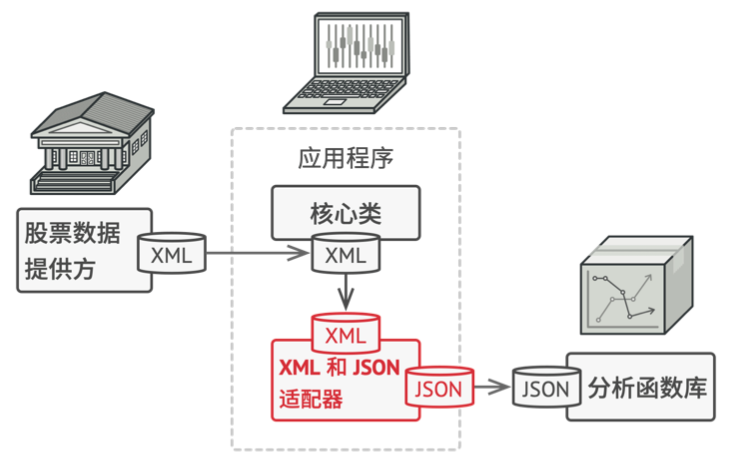
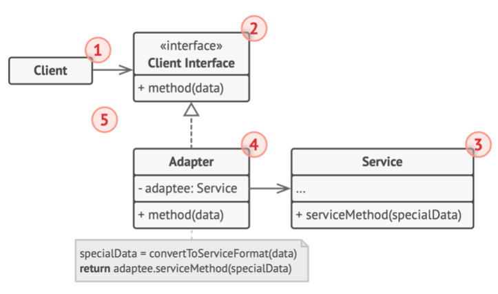
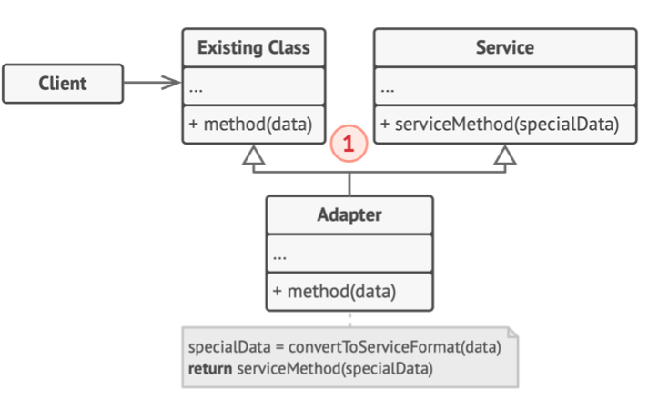
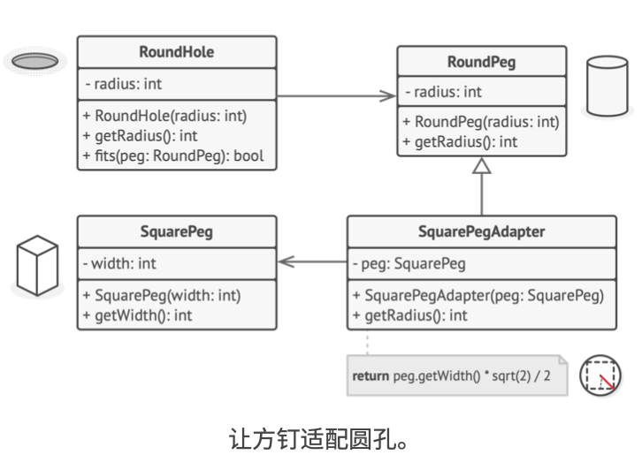

# 《深入设计模式》学习笔记（9）

## 第8章 结构型模式

结构型模式将介绍如何将对象和类组装成较大的结构，并同时保持结构的灵活和高效。

本章介绍以下模式：

- 适配器：让接口不兼容的对象能够相互合作
- 桥接：将一个大类或一系列紧密相关的类拆分为抽象和实现两个独立的层次结构，从而能在开发时分别使用
- 组合：你可以使用它将对象组合成树状结构，并且能够像使用独立对象一样使用它们
- 装饰：允许你通过，将对象放入包含行为的特殊封装对象中的途径，来为原对象绑定新的行为
- 外观：能为程序库、框架或其他复杂类提供一个简单的接口。
- 享元：摒弃了在每个对象中保存所有数据的方式，通过共享多个对象所共有的相同状态，让你能在有限的内存容量中载入更多对象。
- 代理：让你能够提供对象的替代品或者其占位符。代理控制着对于原对象的访问，并允许在将请求提交给对象前后进行一些处理。

### 8.1 适配器

适配器模式能使不兼容的对象能够相互合作。

#### 问题

在开发过程中，可能会遇到需要兼容不同格式的数据的情况（比如 JSON 数据和 XML 数据），如果要修改程序库使其支持 XML 的话，可能需要修改部分源代码。

#### 解决方案

这时可以创建一个适配器。这是一个特殊的对象，能够转换对象接口，使其能够与其他对象进行交互。被封装的对象不会察觉到适配器的存在，它的运作方式是：

1. 适配器实现与其中一个现有对象兼容的接口
2. 现有对象可以使用该接口安全地调用适配器方法
3. 适配器方法被调用后将以另一个对象兼容的格式和顺序将请求传递给该对象

需要的话，甚至可以创建一个双向适配器来实现双向转换调用。



#### 结构

##### 对象适配器

实现时使用了构成原则：适配器实现了其中一个对象的接口，并对另一个对象进行封装。



1. **客户端**：包含当前程序业务逻辑的类
2. **客户端接口**：描述了其他类与客户端代码合作时必须遵循的协议
3. **服务**：里面有一些功能类（通常来自第三方或者遗留系统），其接口有部分与客户端不兼容，无法直接调起功能
4. **适配器**：是一个可以同时与客户端和服务交互的类：它在实现客户端接口的同时封装了服务对象，接受客户端通过适配器接口发起的调用，并将其转换为适用于被封装服务对象的调用。
5. 综上，客户端代码只需要通过接口与适配器交互，而无需与具体的适配器类进行耦合，因此，你可以向程序中添加新类型的适配器而无需修改已有代码，这在服务类的接口被更改或替换时很有用。

##### 类适配器



1. 这种模式**仅能在支持多重继承的编程语言中实现**，类适配器不需要封装任何对象，因为它同时继承了客户端和服务的行为。适配功能在重写的方法中完成，最后生成的适配器可以替代已有的客户端类进行使用。

#### 伪代码

> [示例代码](https://refactoringguru.cn/design-patterns/adapter/typescript/example#lang-features)



让适配器假扮成一个圆钉，其半径等于方钉横截面对角线的一半（即能够容纳方钉的最小外接圆的半径）

```typescript
/**
 * The Target defines the domain-specific interface used by the client code.
 */
class Target {
    public request(): string {
        return 'Target: The default target\'s behavior.';
    }
}

/**
 * The Adaptee contains some useful behavior, but its interface is incompatible
 * with the existing client code. The Adaptee needs some adaptation before the
 * client code can use it.
 */
class Adaptee {
    public specificRequest(): string {
        return '.eetpadA eht fo roivaheb laicepS';
    }
}

/**
 * The Adapter makes the Adaptee's interface compatible with the Target's
 * interface.
 */
class Adapter extends Target {
    private adaptee: Adaptee;

    constructor(adaptee: Adaptee) {
        super();
        this.adaptee = adaptee;
    }

    public request(): string {
        const result = this.adaptee.specificRequest().split('').reverse().join('');
        return `Adapter: (TRANSLATED) ${result}`;
    }
}

/**
 * The client code supports all classes that follow the Target interface.
 */
function clientCode(target: Target) {
    console.log(target.request());
}

console.log('Client: I can work just fine with the Target objects:');
const target = new Target();
clientCode(target);

console.log('');

const adaptee = new Adaptee();
console.log('Client: The Adaptee class has a weird interface. See, I don\'t understand it:');
console.log(`Adaptee: ${adaptee.specificRequest()}`);

console.log('');

console.log('Client: But I can work with it via the Adapter:');
const adapter = new Adapter(adaptee);
clientCode(adapter);
```

#### 适合应用场景

- 当希望使用某个类，但是其接口与其他代码不兼容时，适配器模式允许创建一个中间层类，可作为代码与遗留类、第三方类或提供怪异接口的类之间的转换器。
- 如果需要复用一些处于同一个继承体系，并且他们又有了额外的一些共同的方法的类，但是这些共同的方法又不是所有子类的共性。这个时候将这些缺少功能的对象封装在适配器中，从而动态地获取所需功能会是个更好的选择。

#### 实现方式

1. 确保至少有两个类的接口不兼容：
   - 一个无法修改的功能性服务类（通常是第三方、遗留系统或是存在众多已有依赖的类）
   - 一个或多个将受益于使用服务类的客户端类
2. 声明客户端接口，描述客户端如何与服务交互
3. 创建遵循客户端接口的适配器类。所有方法暂时都为空
4. 在适配器类中添加一个成员变量用于保存对于服务对象的引用。通常情况下会通过构造函数对该成员变量进行初始化，但有时在调用其方法时将该变量传递给适配器会更方便。
5. 依次实现适配器类客户端接口的所有方法。适配器会将实际工作委派给服务对象，而自身只负责接口或数据格式的转换。
6. 客户端必须通过客户端接口来使用适配器。这样一来，就可以在不影响客户端代码的情况下修改或扩展适配器。

#### 优缺点

优点：

- 单一职责原则：可以将接口或数据转换代码从程序主要的业务逻辑中分离
- 开闭原则：只要客户端代码通过客户端接口与适配器进行交互，就能在不修改现有客户端代码的情况下在程序中添加新类型的适配器

缺点：

- 代码的整体复杂度增加，因为需要新增一系列的类和接口，有时直接更改服务器使其与其他代码兼容会更简单

#### 与其他模式的关系

- **桥接模式**通常会于开发前期进行设计，能够将程序的各个部分独立开来以便开发，而适配器则通常在已有程序中使用，让相互不兼容的类能很好地合作。
- **适配器**可以对已有对象的接口进行修改，**装饰模式**能在不改变对象接口的前提下强化对象功能。且装饰模式还支持递归组合，适配器模式则无法实现。
- **外观模式**为现有对象定义了一个新的接口，**适配器模式**则会试图运用已有的接口，适配器通常只封装一个对象，而外观模式通常作用于整个对象子系统上。
- **桥接**、**状态**和**策略**和适配器模式的接口非常相似。实际上，它们都基于**组合**模式——既，将工作委派给其他对象。（无论何时都要记住）模式并不只是以特定方式组织代码的配方，你还可以使用它们来和其他开发者讨论模式所解决的问题。