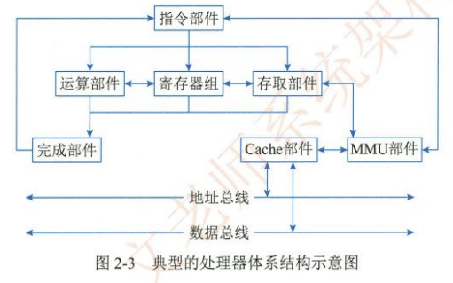
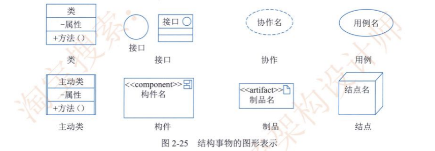

# 《系统架构设计师教程》学习笔记（1）

> 资料下载地址(pdf压缩文件):
>
> [资料链接](https://pan.baidu.com/s/1LZQai1Q1Vbgo0t6HGJ3JYQ?pwd=9jbs)
>
> **本资料仅用于学习交流，如有能力请到各大销售渠道支持正版 !**

## 第 1 章 绪论

系统架构（System Architecture）是系统的一种整体的高层次的结构表示，系统的骨架和根基，也决定了系统的健壮性和生命周期的长短。系统架构设计师是承担系统架构设计的核心角色，不仅是连接用户需求和系统进一步设计与实现的桥梁，也是系统开发早期阶段质量保证的关键角色。

**发展历程**

- 基础研究阶段（1968-1994）：在此之前“架构”一词在大多数情况下被用于表示计算机的物理结构，偶尔用于表示计算机指令集的特定体系。在这一时期，随着软件规模的增大，模块化开发方法已被逐步采用，为后续软件架构的发展奠定了基础。
- 概念体系和核心技术形成阶段（1999-2000）：2000 年，IEEE 1471-2000 标准的发布第一次定义了软件架构的形式化标准，这标志着这软件架构理论体系已经基本建立，并已具备普及应用的基础。
- 理论体系完善与发展阶段（1996-至今）：基于组件软件架构的建立，与之相关的一些研究方向逐渐成为重点，主要包括：
  - 软件架构描述与表示
  - 软件架构分析、设计与测试
  - 软件架构发现、演化与重用
  - 基于软件架构开发方法
  - 软件架构风格，动态软件架构等等
- 普及应用阶段（2000 年至今）：软件架构是软件生命周期中的重要产物，它影响软件开发的各个阶段（需求阶段，设计阶段，实现阶段，维护阶段）

#### 1.1.2 软件架构常用分类及建模方法

比较典型的架构模型包括分层架构、事件驱动家头，微核架构、微服务架构和云架构等五类。此外，像 C/S、B/S、管道 - 过滤器和 PAC 等架构也是被广泛使用的软件架构。

**1. 分层架构**

分层架构是事实上的标准架构，通过将软件分成若干个水平层，每一层都有清晰的角色和分工，不需要知道其它层的细节。层与层之间通过接口进行通信。其中，最常见的是四层结构，如图所示：

- 表现层：用户界面，负责视觉和用户互动
- 业务层：实现业务逻辑
- 持久层：提供数据，SQL 语句放在这一层
- 数据库：保存数据

有的项目会在持久层和业务层之间添加一个服务层，提供不同业务逻辑需要的一些通用接口。用户的请求将依次通过这四层的处理，不能跳过。

**2. 事件驱动架构**

事件（Event）是状态发生变化时软件发出的通知，而事件驱动架构是通过事件进行通信的软件架构，分为四个部分，如下图所示：

- 事件队列：接收事件的入口
- 分发器：将不同的事件分发到不同的业务逻辑单元
- 事件通道：分发器与处理器之间的联系通道
- 事件处理器：实现业务逻辑，处理完成后会发出事件，触发下一步操作。

对于简单的项目，事件队列、分发器和事件通道可以合为一体，整个软件就分成事件代理和事件处理器两个部分。

**3. 微核架构**

微核架构又称为**插件架构**，指的是软件的内核相对较小，主要功能和业务逻辑都能通过插件实现，如下图所示：

内核系统通常只包含系统运行的最小功能，插件则是相互独立的，插件之间的通信应该减少到最低，避免出现相互依赖的问题。

**4. 微服务架构**

微服务架构是服务导向架构的升级，每一个服务就是一个单独的部署单元，这些单元都是分布式的，互相解耦，通过远程通信协议（比如 REST、SOAP）联系，如下图所示：

微服务架构分成三种实现模式：

- RESTful API 模式：服务通过 API 提供，云服务就属于这一类。
- RESTful 应用模式：服务通过传统的网络协议或者应用协议提供，背后通常是一个多功能的应用程序，常见于企业内部
- 集中消息模式：采用消息代理可以实现，消息队列、负载均衡、同一日志和异常处理，缺点是会出现单点失败，消息代理可能要做成集群。

**5. 云架构**

云架构主要解决扩展性和并发的问题，是最容易扩展的架构。它的高扩展性体现在将数据都复制到内存中，变成可复制的内存数据单元，然后将业务处理能力封装成一个个处理单元。若访问量增加，就新建处理单元。

由于没有中央数据库，所以扩展的最大瓶颈消失了。但由于每个处理单元的数据都在内存里，所以需要进行数据持久化。

云架构主要分成两个部分：处理单元和虚拟中间件。

- 处理单元：实现业务逻辑。
- 虚拟中间件：负责通信、保持会话控制、数据复制、分布式处理和处理单元的部署。

其中虚拟中间件又包含四个组件：

- 消息中间件：管理用户请求和会话控制，当一个请求进来以后，它决定分配给哪一个处理单元
- 数据中间件：将数据复制到每一个处理单元，即数据同步
- 处理中间件：如果一个请求涉及不同类型的处理单元，该中间件负责协调处理单元
- 部署中间件：负责处理单元的启动和关闭，监控负载和响应时间

---

系统架构的常用建模方法：结构模型、框架模型、动态模型和过程模型。

#### 1.1.3 软件架构的应用场景

### 1.2 系统架构设计师概述

从组织上划分，架构师分为：

- 业务架构师
- 主题领域架构师
- 技术架构师
- 项目架构师
- 系统机构师

系统架构设计师分为4类：

- 企业架构师 EA
- 基础结构架构师 IA
- 特定技术架构师 TSA
- 解决方案架构师 SA

## 第2章 计算机系统基础知识

### 2.1 计算机系统概述

计算机系统可分为硬件和软件两部分。

### 2.2 计算机硬件

#### 2.2.1 计算机硬件组成

- 处理器（CPU）

  - 复杂指令集（CISC）：x86 CPU Intel / AMD
  - 精简指令集（RISC）：ARM / Power

  RISC 已经成为计算机指令集发展的趋势。

  典型的处理器系统架构：

  

  其他类型的专用于特殊目的的处理器也在不断涌现，如：

  - GPU 是一种特殊类型的处理器，经过优化可并行运行大量计算。

  - DSP 专用于实时的信号处理
  - FPGA：现场可编程的逻辑门阵列

- 存储器：按照与处理器的物理距离可以分为4个层次（访问速度依次减慢，容量依次增大）：

  - 片上缓存，最快，容量较小
  - 片外缓存，按照层级被称为 L2Cache 或 L3Cache
  - 主存（内存）
  - 外存：可以是磁带，磁盘，光盘等介质器件

- 总线：计算机不见间遵循某一特定协议实现的数据交换的形式，常见的的有并行总线（PCI、PCIe）和串行总线（USB、SATA、以太网），还有一些专业领域中也定义了多种类型的总线。

- 接口：同一计算机不同功能层之间的通信规则，如显示类（HDMI、DVI、DP），音频输入输出类（TRS、RCA、XLR），网络类接口（RJ45、FC），USB 接口，SATA 接口等等。

  对于总线而言，一种总线可能存在多种接口

- 外部设备：非必要设备，包括键盘、鼠标、显示器等等

### 2.3 计算机软件

计算机软件是指计算机系统中的程序及文档，是计算任务的处理对象和处理规则的描述。

#### 2.3.2 操作系统

一种大型、复杂的软件产品，通常由系统内核(Kernel)和其他许多附加的配套软件所组成。

操作系统内核指的是能够提供最基本部分功能，即进程管理（任务管理）、存储管理、文件管理和设备管理等功能的那些软件模块。用于为众多应用程序访问计算机硬件提供服务。操作系统内核会对硬件设备进行抽象，提供一套简洁、统一的接口。

内核通常都驻留在内存中，以 CPU 最高优先级运行，负责对系统资源进行管理和分配。

操作系统作用：

1. 管理计算机中运行的程序和分配各种软硬件资源
2. 为用户提供友善的人机界面
3. 为应用程序的开发和运行提供一个高效率的平台

操作系统特征：

1. 并发性
2. 共享性
3. 虚拟性
4. 不确定性

操作系统分类：

- 批处理操作系统
- 分时操作系统
- 实时操作系统
- 网络操作系统
- 分布式操作系统
- 微型计算机操作系统
- 嵌入式操作系统

#### 2.3.3 数据库

数据库是指长期存储在计算机内，有组织的、统一管理的相关数据的集合。它不仅描述事物的数据本身，而且还包括相关事物之间的联系。数据库可以直观地理解为存放数据的仓库，且数据按一定格式存放，具有较小的冗余度，较高的数据独立性和易扩展性，可为多个用户共享。

早期数据库类型有 3 种：层次式数据库、网格式数据库和关系型数据库。目前最常见的数据库种类是关系型数据库和非关系型数据库。

根据数据库存储体系分类，还可以分为关系型数据库，键值对数据库、列存储数据库、文档数据库和搜索引擎数据库等类型。

1. 关系型数据库：最传统的数据库类型，把复杂的数据结构归结为简单的二元关系，对数据的操作几乎全部建立在一个或多个关系表格上，且表之间有各种关系。实际使用就是通过对这些关联的表格进行分类、合并、连接或选取等运算来实现数据库的管理。
2. 键值数据库，一种非关系型数据库，使用简单的键值对方法来存储数据，将键作为唯一标识符。
3. 列存储数据库，列存储是相对传统关系型数据库的行式存储来说的，简单来说二者的区别就是对表中数据的存储形式的差异。
4. 文档数据库，此类数据库可存放并获取文档，可以是 XML、JSON、BSON 等格式，相当于键值数据库所存放的值。文档数据库可视为其值可查的键值数据库
5. 搜索引擎数据库，搜索引擎以特定格式对数据进行存储，以求在检索时保证性能最优。

#### 2.3.4 文件系统

文件系统是操作系统中实现文件统一管理的一组软件和相关数据的集合，是专门负责管理和存取文件信息的软件机构。

#### 2.3.5 网络协议

协议指的是网络中的计算机与计算机进行通信时，为了能够实现数据的正常发送与接收，必须要遵循一些事先约定好的规则，在这些规程中明确规定了通信时的数据格式、数据传送时序以及相应的控制信息和应答信号等内容。

常用的网络协议包括局域网协议、广域网协议、无线网协议和移动网协议。互联网使用 TCP/IP 协议簇。

#### 2.3.6 中间件

中间件处在操作系统、网络和数据库之上，应用软件的下层。

#### 2.3.7 软件构件

构件又称为组件，是一个程序集，或者说是一组程序的集合。集合整体向外提供统一的访问接口，组件外部只能通过接口来访问组件，而不能直接操作组件的内部。

组件两个最重要的特性是：自包容与可重用。

#### 2.3.8 应用软件

按照应用软件的开发方式和适用范围，应用软件可以再分成通用应用软件和定制应用软件两大类。

### 2.4 嵌入式系统及软件

嵌入式系统是为了特定的应用而专门构件的专用计算机系统。

嵌入式软件则是指可运行在嵌入式系统中的程序代码以及帮助这些软件开发所用的工具或环境软件的总称。

### 2.5 计算机网络

计算机网络技术主要涵盖通信技术，网络技术，组网技术和网络工程四个方面。

### 2.6 计算机语言

计算机语言是人与计算机之间传递信息的媒介，主要由一套指令组成，而这种指令一般包括表达式、流程控制和集合三大部分内容。

计算机语言主要分为机器语言，汇编语言，高级语言，建模语言和形式化语言等。

**建模语言**

UML 是一种定义良好，易于表达且普遍适用的建模语言。它的作用不限于支持面向对象的分析与设计，还支持从需求分析开始的软件开发全过程。

### 2.7 多媒体

多媒体就是指利用计算机技术，把文本、图形、头像、声音、动画和电视等多种媒体综合起来。多媒体有四个特征：多维化，集成性，交互性，实时性。

#### 2.7.2 多媒体系统的关键技术

1. 音视频技术
2. 通信技术
3. 数据压缩技术

### 2.8 系统工程

系统工程是一种组织管理技术，运用运筹学的理论和方法以及电子计算机技术，对构成系统的各组成部分进行分析、预测和评价，最后进行综合，从而使系统达到最优。

### 2.9 系统性能

系统性能是一个系统提供给用户的所有性能指标的集合，既包括硬件性能、软件性能，也包括部件性能指标和综合性能指标。

系统性能包括性能指标，性能计算和性能设计，性能评估 4 个方面。

