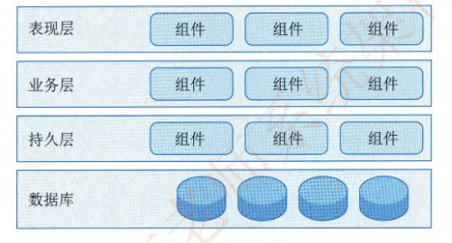

# 《系统架构设计师教程》学习笔记（1）

> 资料下载地址(pdf压缩文件):
>
> [资料链接]( https://pan.baidu.com/s/1143x1mJLfGpRgx-5s8vQXA?pwd=2ixa )
>
> 提取码: 2ixa 
>
> **本资料仅用于学习交流，如有能力请到各大销售渠道支持正版 !**

## 第 1 章 绪论

系统架构（System Architecture）是系统的一种整体的高层次的结构表示，系统的骨架和根基，也决定了系统的健壮性和生命周期的长短。系统架构设计师是承担系统架构设计的核心角色，不仅是连接用户需求和系统进一步设计与实现的桥梁，也是系统开发早期阶段质量保证的关键角色。

**发展历程**

- 基础研究阶段（1968-1994）：在此之前“架构”一词在大多数情况下被用于表示计算机的物理结构，偶尔用于表示计算机指令集的特定体系。在这一时期，随着软件规模的增大，模块化开发方法已被逐步采用，为后续软件架构的发展奠定了基础。
- 概念体系和核心技术形成阶段（1999-2000）：2000 年，IEEE 1471-2000 标准的发布第一次定义了软件架构的形式化标准，这标志着这软件架构理论体系已经基本建立，并已具备普及应用的基础。
- 理论体系完善与发展阶段（1996-至今）：基于组件软件架构的建立，与之相关的一些研究方向逐渐成为重点，主要包括：
  - 软件架构描述与表示
  - 软件架构分析、设计与测试
  - 软件架构发现、演化与重用
  - 基于软件架构开发方法
  - 软件架构风格，动态软件架构等等
- 普及应用阶段（2000 年至今）：软件架构是软件生命周期中的重要产物，它影响软件开发的各个阶段（需求阶段，设计阶段，实现阶段，维护阶段）

#### 1.1.2 软件架构常用分类及建模方法

比较典型的架构模型包括分层架构、事件驱动家头，微核架构、微服务架构和云架构等五类。此外，像 C/S、B/S、管道 - 过滤器和 PAC 等架构也是被广泛使用的软件架构。

**1. 分层架构**

分层架构是事实上的标准架构，通过将软件分成若干个水平层，每一层都有清晰的角色和分工，不需要知道其它层的细节。层与层之间通过接口进行通信。其中，最常见的是四层结构，如图所示：

- 表现层：用户界面，负责视觉和用户互动
- 业务层：实现业务逻辑
- 持久层：提供数据，SQL 语句放在这一层
- 数据库：保存数据

有的项目会在持久层和业务层之间添加一个服务层，提供不同业务逻辑需要的一些通用接口。用户的请求将依次通过这四层的处理，不能跳过。

**2. 事件驱动架构**

事件（Event）是状态发生变化时软件发出的通知，而事件驱动架构是通过事件进行通信的软件架构，分为四个部分，如下图所示：

- 事件队列：接收事件的入口
- 分发器：将不同的事件分发到不同的业务逻辑单元
- 事件通道：分发器与处理器之间的联系通道
- 事件处理器：实现业务逻辑，处理完成后会发出事件，触发下一步操作。

对于简单的项目，事件队列、分发器和事件通道可以合为一体，整个软件就分成事件代理和事件处理器两个部分。

**3. 微核架构**

微核架构又称为**插件架构**，指的是软件的内核相对较小，主要功能和业务逻辑都能通过插件实现，如下图所示：

内核系统通常只包含系统运行的最小功能，插件则是相互独立的，插件之间的通信应该减少到最低，避免出现相互依赖的问题。

**4. 微服务架构**

微服务架构是服务导向架构的升级，每一个服务就是一个单独的部署单元，这些单元都是分布式的，互相解耦，通过远程通信协议（比如 REST、SOAP）联系，如下图所示：

微服务架构分成三种实现模式：

- RESTful API 模式：服务通过 API 提供，云服务就属于这一类。
- RESTful 应用模式：服务通过传统的网络协议或者应用协议提供，背后通常是一个多功能的应用程序，常见于企业内部
- 集中消息模式：采用消息代理可以实现，消息队列、负载均衡、同一日志和异常处理，缺点是会出现单点失败，消息代理可能要做成集群。

**5. 云架构**

云架构主要解决扩展性和并发的问题，是最容易扩展的架构。它的高扩展性体现在将数据都复制到内存中，变成可复制的内存数据单元，然后将业务处理能力封装成一个个处理单元。若访问量增加，就新建处理单元。

由于没有中央数据库，所以扩展的最大瓶颈消失了。但由于每个处理单元的数据都在内存里，所以需要进行数据持久化。

云架构主要分成两个部分：处理单元和虚拟中间件。

- 处理单元：实现业务逻辑。
- 虚拟中间件：负责通信、保持会话控制、数据复制、分布式处理和处理单元的部署。

其中虚拟中间件又包含四个组件：

- 消息中间件：管理用户请求和会话控制，当一个请求进来以后，它决定分配给哪一个处理单元
- 数据中间件：将数据复制到每一个处理单元，即数据同步
- 处理中间件：如果一个请求涉及不同类型的处理单元，该中间件负责协调处理单元
- 部署中间件：负责处理单元的启动和关闭，监控负载和响应时间

---

系统架构的常用建模方法：结构模型、框架模型、动态模型和过程模型。

#### 1.1.3 软件架构的应用场景

### 1.2 系统架构设计师概述

从组织上划分，架构师分为：

- 业务架构师
- 主题领域架构师
- 技术架构师
- 项目架构师
- 系统机构师

系统架构设计师分为4类：

- 企业架构师 EA
- 基础结构架构师 IA
- 特定技术架构师 TSA
- 解决方案架构师 SA

## 第2章 计算机系统基础知识

### 2.1 计算机系统概述

计算机系统可分为硬件和软件两部分。

### 2.2 计算机硬件

#### 2.2.1 计算机硬件组成

- 处理器（CPU）

  - 复杂指令集（CISC）：x86 CPU Intel / AMD
  - 精简指令集（RISC）：ARM / Power

  RISC 已经成为计算机指令集发展的趋势。

  典型的处理器系统架构：

  

  其他类型的专用于特殊目的的处理器也在不断涌现，如：

  - GPU 是一种特殊类型的处理器，经过优化可并行运行大量计算。

  - DSP 专用于实时的信号处理
  - FPGA：现场可编程的逻辑门阵列

- 存储器：按照与处理器的物理距离可以分为4个层次（访问速度依次减慢，容量依次增大）：

  - 片上缓存，最快，容量较小
  - 片外缓存，按照层级被称为 L2Cache 或 L3Cache
  - 主存（内存）
  - 外存：可以是磁带，磁盘，光盘等介质器件

- 总线：计算机不见间遵循某一特定协议实现的数据交换的形式，常见的的有并行总线（PCI、PCIe）和串行总线（USB、SATA、以太网），还有一些专业领域中也定义了多种类型的总线。

- 接口：同一计算机不同功能层之间的通信规则，如显示类（HDMI、DVI、DP），音频输入输出类（TRS、RCA、XLR），网络类接口（RJ45、FC），USB 接口，SATA 接口等等。

  对于总线而言，一种总线可能存在多种接口

- 外部设备：非必要设备，包括键盘、鼠标、显示器等等

### 2.3 计算机软件

> 本次阅读至 P43/728，下次阅读应至 P54