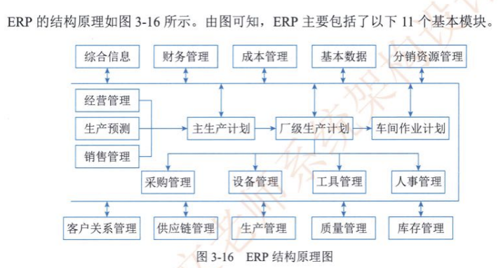

# 《系统架构设计师教程》学习笔记（2）

## 第3章 信息系统基础知识

信息系统一般泛指收集、存储、处理和传播各种信息的具有完整功能的集合体。

### 3.1 信息系统概述

信息系统的 5 个基本功能：

- 输入功能
- 存储功能
- 处理功能
- 输出功能
- 控制功能

传统的信息系统可分为：业务（数据）处理系统、管理信息系统、决策支持系统、专家系统和办公自动化系统等5类。这5类经历了一个从低级到高级、从局部到全局、从简单到复杂的过程。

### 3.2 业务处理系统（TPS）

业务处理系统是计算机在管理方面早期应用的最初级形式的信息系统。

业务处理系统是信息系统发展的最初级形式，它面对的是**结构化程度很高的管理问题**。许多企业可以直接购买现成的 TPS，只要再进行一些简单的二次开发，就能够投入使用，避免了低水平的重复开发工作。

### 3.3 管理信息系统（MIS）

MIS 是由业务处理系统发展而成的，在 TPS 的基础上引进了大量管理方法对企业整体信息进行处理。这是一个包含各种模型和方法，数据共享能力更大，能够提供分析、计划和辅助决策功能的系统，并具有改进企业组织的效能。

### 3.4 决策支持系统（DSS）

### 3.5 专家系统（ES）

专家系统是人工智能的一个重要分支，该程序使用知识与推理过程，求解那些需要资深专家的专门知识才能解决的高难度问题。

### 3.6 办公自动化系统（OAS）

办公自动化系统是一个集文字、数据、语言、图像为一体的综合性、跨学科的人机信息处理系统，利用资源以提高办公效率和办公质量。

### 3.7 企业资源规划（ERP）

ERP 是企业在生产制造过程中普遍使用的一种信息系统，主要用于改善企业业务流程以提高企业核心竞争力。

### 3.8 典型信息系统架构模型

- 政府信息化与电子政务
- 企业信息化与电子商务

## 第 4 章 信息安全技术基础知识

> 本次阅读至 P160/728，下次阅读应至 P171