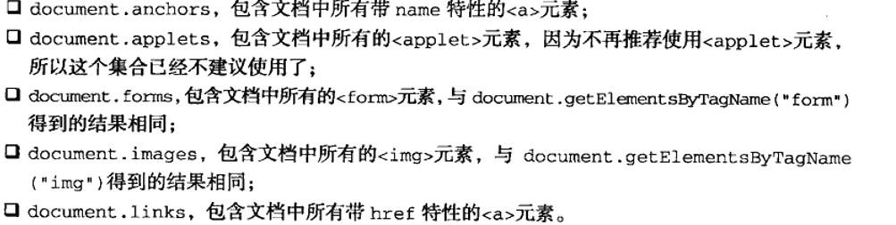

# 红宝书（javascirpt高级程序设计）学习笔记（七）

## 第9章 客户端检测

**本章介绍如何进行客户端检测，在跨浏览器兼容时会用到，但有些方法已经过时。本章建议快速阅读，扩展思路。**

- **能力检测**，即确定浏览器是否支持特定的能力，如下

  ```javascript
  function getElement (id) {
      if (document.getElementById) {
          // 使用document.getElementById
          return document.getElementById(id)
      } else if (document.all) {
          // 使用document.all
          return dockment.all[id]
      } else {
          throw new Error("No way to retrieve element!")
      }
  }
  ```

- 但其实检测某个属性是否存在并不能确定对象是否支持该能力，更好的方式使用*typeof* 来验证其是不是一个函数，例子如下。

  ```javascript
  function isSortable (object) {
      return typeof object.sort == "function"
  }
  ```

  如上所示，**在可能的情况下，要尽量使用 *typeof* 进行能力检测**。

- 能力检测并不是浏览器检测，不能通过检测是否支持某个功能而推断其是哪个浏览器。

- 用户代理检查和浏览器检查这一部分**群魔乱舞，神坑劝退**。（能写的话还是写通用代码吧...）

## 第10章  DOM

**本章介绍DOM的使用，DOM在Web开发中有重要的意思，建议仔细阅读，做好笔记**。

### 10.1 节点层次

DOM可以将任何HTML或XML文档描绘成一个由多层节点构成的结构。

#### 10.1.1 Node类型

DOM1级定义了一个Node接口，该接口将由DOM中的所有节点类型实现。这个Node接口在JavaScript中是作为Node类型实现的。**JavaScript中的所有节点类型都继承自Node类型，因此所有节点类型都共享着相同的基本属性和方法**。

每个节点都有一个nodeType属性，用于表明节点的类型。节点类型由在Node类型中定义的下列12个数值常量（数值1至12）来表示，任何节点必居其一：

- ELEMENT_NODE
- ATTRIBUTE_NODE
- TEXT_NODE
- CDATA_SECTION_NODE
- ENTITY_REFERENCE_NODE
- ENTITY_NODE
- PROCESSING_INSTRUCTION_NODE
- COMMENT_NODE
- DOCUMENT_NODE
- DOCUMENT_TYPE_NODE
- DOCUMENT_FRAGMENT_NODE
- NOTATION_NODE

通过上面这些常量，可以很容易的确定节点的类型，比如：

```javascript
if (someNode.nodeType == Node.ELEMENT_NODE) {
    alert("Node is an element.")
}
```

当然，并不是所有节点类型都受到Web浏览器的支持。**开发人员最常用的就是元素和文本结点**。

1. nodeName和nodeValue属性

   这两个节点用于保存节点的基本信息。**对于元素结点**，nodeName中保存的始终都是元素的标签名，而nodeValue的值则始终为null。

2. 结点关系

   **每个节点都有一个childNodes属性，其中保存着一个NodeList对象**。NodeList是一种类数组对象，用于保存一组有序的节点。但是，**NodeList并不是Array对象，虽然有length属性，却没有slice、map等方法**。

   ```javascript
   // 将NodeList转换为真正的数组
   // ECMAScript5 方法
   var nodelist = document.querySelectorAll('div')
   var nodelistToArray = Array.apply(null, nodelist)
   // or
   var nodelistToArray = Array.prototype.slice.call(nodelist, 0)
   // ECMAScript6 方法
   const nodelistToArray = [...nodelist] // 返回一个真正的数组
   ```

3. 操作节点

   因为关系指针都是只读的，所以DOM提供了一些操作节点的方法。

   - 最常用的方法是 *appendChild()*，用于向childNOdes列表末尾添加一个结点。
   - 如果需要把节点放在childNodes列表中某个特定的位置上而不是放在末尾，那么可以使用 *insertBefore()* 方法。
   - 替换结点，可使用 *replaceChild()* 方法。
   - 移除结点，可使用 *removeChild()* 方法。

4. 有两个方法是所有类型的节点都有的。

   - *cloneNode()* 用于创建调用这个方法的节点的一个完全相同的副本。（接收一个布尔值，为false的情况下只复制本身，而在true的情况下深复制所有的子节点）
   - *normalize()* 处理一些不包含文本的文本结点，或者接连出现两个文本结点的情况。

#### 10.1.2 Document 类型

在浏览器中，document对象是HTMLDocument（继承自Document类型）的一个实例，表示整个HTML页面。而且，document对象是window对象的一个属性，因此也可以全局访问。

Document节点具有下列特征：

- nodeType的值为9
- nodeName的值为"#document"
- nodeValue的值为null
- parentNode的值为null
- ownerDocument的值为null
- 其子节点可能是一个DocumentType（最多一个）、Element（最多一个）、ProcessingInstruction或Coment

1. 文档的子节点

   - *document.documentElement* 属性始终指向页面中的 `<html>` 元素。
   - *document.body* 属性直接指向`<body>`元素。
   - *document.doctype* 可以取得对 `<!DOCTYPE>` 的引用。

   不同浏览器之间对 *document.doctype* 的支持差别比较大，因此这个属性的用处比较有限。

2. 文档信息

   作为HTMLDocument的实例，document对象还有一些自己的属性。

   - *document.tiltle* 属性包含着 `<title>` 元素中的文本——显示在浏览器窗口的标题栏或者标签页上。
   - *document.URL* 属性中包含页面完整的URL
   - *document.domain* 属性中只包含页面的域名
   - *document.referrer* 属性中包含着链接到当前页面的那个页面的URL，当没有来源页面的情况下，referrer属性中也可能会包含空字符串。

3. 查找元素

   Document类型为查找元素提供了两个方法。

   - *getElementById()*，接收一个参数：要取得元素的ID。注意，这里的ID必须与页面中元素的id（attribute）特性严格匹配，包括大小写。

   - *getElementByTagName()* ,这个方法接收一个参数：要取得元素的标签名，返回包含零或多个元素的NodeList。**在HTML文档中，这个方法会返回一个HTMLCollection对象，该对象与NodeList非常类似。**

     HTMLCollection有一个 *namedItem()* 方法，使用这个方法可以通过元素的name特性取得集合中的项。同时它也支持对命名的项用方括号语法来访问。

     ```javascript
     var images = document.getElementsByTagName("img")
     images[0] // 第一个图像
     images.namedItem("myImage") // 名为myImage的图像
     images["myImage"] // 同上
     ```

     要取得所有元素，可以向 *getElementByTagName()* 传入 "` * `"。

   - 第三个是HTMLDocument类型才有的方法： *getElementsByName()*，返回基于传入name特性的所有元素。

4. 特殊集合

   

5. DOM一致性检测

   使用 *hasFeature()* 方法可以检测功能和版本号。

6. 文档写入

   4个方法：

   - write() 原样写入
   - writeln() 写入后再字符串末尾添加一个换行符(\n)
   - open() 打开网页的输出流
   - close() 关闭网页的输出流

   #### 10.1.3 Element类型

   Element类型用于表现XML或HTML元素，具有以下特征：

   - nodeType 的值为1
   - nodeName的值为元素的标签名
   - nodeValue的值为null
   - parentNode可能是Document或Element
   - 其子几点可能是Element、Text、Comment、ProcessingInstruction、CDATASection或EntityReference

   1. HTML元素

      每个HTML元素中都存在下列标准特性

      - id
      - title
      - lang
      - dir 预言的方向，值为ltr(left-to-right 从左至右)或rtl
      - className

   2. 取得特性

      操作特性的主要方法有三个

      - getAttribute()
      - setAttribute()
      - removeAttribute()

      注意特性是不区分大小写的，即ID和id是一样的特性。

      getAttribute一般用于取得自定义特性值，在取通用值的时候，可以采用类似 div.id 这样的方式来取得值。

   3. 设置特性

      使用 setAttribute() 可以用于设置特性，同样的，对于通用的属性，可以通过 div.id=1 这样的方式来设置。

      使用removeAttribute()可以用于删除特性。

   4. attributes属性

      Element类型是使用attribute属性的唯一一个DOM节点类型。attributes属性中包含一个NameNodeMap，与NodeList类似。可以使用方括号的形式来访问element的对应属性。

      ```javascript
      var id = element.attributes["id"].nodeValue // 根据名称取得元素id的值
      var id = element.attributes[0].nodeValue // 根据index取得元素id的值
      element.attributes["id"].nodeValue = 1 // 设置元素id的值
      element.attributes.removeNamedItem("id") // 删除元素的对应属性
      ```

   5. 创建元素

      使用 document.createElement() 方法可以创建新元素。

   6. 元素的子节点

      元素可以有任意数目的子节点和后代节点。

      元素同时也支持getElementTagName()方法，除了搜索起点不一样以外，其余用法都是一样的。

   #### 10.1.4 Text类型

   文本节点由Text类型表示，包含的是纯文本内容。Text节点具有以下特征：

   - nodeType 的值为3
   - nodeName的值为"#text"
   - nodeValue的值为节点所包含的文本
   - parentNode是一个Element
   - 不支持（没有）子节点

   可以通过nodeValue属性或data属性访问Text节点中包含的文本，这两个属性中包含的值相同。对nodeValue的修改也会通过data反映出来，反之亦然。

   使用下列方法可以操作节点中的文本：

   - appendData(text)：将text添加到节点末尾
   - deleteData(offset, count)：从offset指定的位置开始删除count个字符
   - insertData(offset, text)：在offset指定的位置插入text
   - replaceData(offset, count, text)：用text替换从offset指定的位置开始到offset+count为止处的文本
   - splitText(offset)：从offset指定的位置将当前文本节点分成两个文本节点
   - substringData(offset, count)：提取从offset指定的位置开始到offset+count为止处的字符串

   在默认情况下，每个可以包含内容的元素最多只能有一个文本节点，而且必须确实有内容存在（即便是一个空格也是内容）。

   ```html
   <!-- 没有内容，也就没有文本节点 -->
   <div></div>
   <!-- 有内容，所以有一个文本节点 -->
   <div>hi</div>
   ```

   1. 创建文本节点

      document.createTextNode() 可以用于创建新的文本节点。

   2. 规范化文本节点

      当重复创建了或者在一个元素中出现了多个文本节点时，使用 *normalize()* 可以规范化文本节点

   3. 分割文本节点

      splitText()会将一个文本节点分成两个，即可以按照指定的位置分割nodeValue值。

   #### 10.1.5 Comment类型

   Comment类型用于表示DOM中的注释，具有以下特征：

   - nodeType的值为8
   - nodeName的值为"#comment"
   - nodeValue的值是注释的内容
   - parentNode可能是Document或Element
   - 不支持（没有）子节点

   使用document.createComment()可以创建一个注释节点，注释节点的属性与Text类型相似。

   #### 10.1.6 CDATASection类型

   该类型值针对于XML文档。

   #### 10.1.7 DocumentType 类型

   DocumentType包含着与文档的doctype有关的所有信息，具有以下特征：

   - nodeType值为10
   - nodeName的值为doctype的名称
   - nodeValue值为null
   - parentNode是Document
   - 不支持（没有）子节点

   #### 10.1.8 DocumentFragment类型

   特征：

   - nodeType的值为11
   - nodeName的值为"#document-fragment"
   - nodeValue的值为null
   - parentNode的值为null
   - 子节点可以是Element、ProcessingInstruction、Comment、Text、CDATASection或EntityReference

   文档片段继承了Node的所有方法，但文档片段本身永远不会成为文档树的一部分。通常Fragment类型回用于保存创建的DOM片段，然后一次性渲染将它们添加到文档中，从而避免重复渲染。

   ```javascript
   var fragment = document.createDocumentFragment()
   var ul = document.getElementById("myList")
   var li = null
   for (var i=0; i < 3; i++) {
       li = document.createElement("li")
       li.appendChild(document.createTextNode("item" + (i+1)))
       fragment.appendChild(li) // 在fragment中添加并不会导致浏览器再渲染一遍
   }
   ul.appendChild(fragment) // 渲染一步到位
   ```

   #### 10.1.9 Attr类型

   特性：

   - nodeType的值为11
   - nodeName的值是特性的名称
   - nodeValue的值是特性的值
   - parentNode的值为null
   - 在HTML中不支持子节点
   - 在XML中子节点可以是Text或EntityReference

   使用 document.createAttribute() 并传入特性的名称就可以创建新的特性。

   ### 10.2 DOM操作技术

   - 加载样式与执行JavaScript代码的过程没有固定的次序，也就是说整个过程是异步的。在13章将会详细讨论利用事件来检测这个过程是否完成的技术。

   - NodeList、NamedNodeMap、HTMLCollection这三个集合都是“动态的”，每当文档结构发生变化，它们都会得到更新，所以在迭代查询这三个变量时，应该要注意保存初始快照，如下

     ```javascript
     // 下列代码会导致死循环
     var divs = document.getElementsByTagName("div"),
         i,
         div
     for (i=0;i < divs.length;i++) {
         div = document.createElement("div")
         document.body.appendChild(div)
     }
     // 下面的代码不会死循环
     var divs = document.getElementsByTagName("div"),
         i,
         len,
         div
     for (i=0, len=divs.length;i < len;i++) { // 定义了一个len来保存了长度属性的快照
         div = document.createElement("div")
         document.body.appendChild(div)
     }
     ```

   - 一般来说，应该尽量减少访问NodeList的次数，因为每次访问NodeList，都会运行一次基于文档的查询。所以，可以考虑将从NodeList中去得的值缓存起来。

